# OpenAI Production Operations - The Ops View

## System Overview

This diagram shows OpenAI's comprehensive production operations setup managing 25,000+ GPUs, 100+ million weekly users, and $180M monthly infrastructure while maintaining 99.9% availability through advanced deployment, monitoring, and on-call practices.

```mermaid
graph TB
    subgraph DeploymentPipeline[Deployment Pipeline - Green #10B981]
        style DeploymentPipeline fill:#10B981,stroke:#059669,color:#fff

        GitOps[GitOps Workflow<br/>━━━━━<br/>GitHub + ArgoCD<br/>Infrastructure as Code<br/>Terraform + Kubernetes<br/>Pull request reviews<br/>Automated testing]

        ModelRegistry[Model Registry<br/>━━━━━<br/>MLflow + DVC<br/>Version control<br/>Checksum validation<br/>A/B test configs<br/>Rollback capabilities]

        StagingDeploy[Staging Deployment<br/>━━━━━<br/>Mirror production<br/>1% traffic allocation<br/>Safety validation<br/>Performance testing<br/>Quality gates]

        ProductionDeploy[Production Deployment<br/>━━━━━<br/>Blue-green strategy<br/>Canary rollouts: 1%→10%→50%<br/>Automatic rollback<br/>Zero downtime<br/>15 regions simultaneously]
    end

    subgraph MonitoringObservability[Monitoring & Observability - Red #8B5CF6]
        style MonitoringObservability fill:#8B5CF6,stroke:#7C3AED,color:#fff

        MetricsCollection[Metrics Collection<br/>━━━━━<br/>Prometheus + DataDog<br/>1M+ metrics/minute<br/>GPU utilization<br/>Token throughput<br/>Custom business metrics]

        DistributedTracing[Distributed Tracing<br/>━━━━━<br/>Jaeger + Zipkin<br/>Request-level tracing<br/>Token generation timing<br/>Cross-service correlation<br/>Performance bottlenecks]

        LogAggregation[Log Aggregation<br/>━━━━━<br/>ELK Stack<br/>500TB/day logs<br/>Real-time analysis<br/>Security monitoring<br/>Compliance auditing]

        RealTimeDashboards[Real-time Dashboards<br/>━━━━━<br/>Grafana + Custom UI<br/>Business metrics<br/>SLO tracking<br/>Incident correlation<br/>Executive reporting]
    end

    subgraph AlertingIncident[Alerting & Incident Response - Red #8B5CF6]
        style AlertingIncident fill:#8B5CF6,stroke:#7C3AED,color:#fff

        AlertManager[Alert Manager<br/>━━━━━<br/>PagerDuty integration<br/>Smart routing<br/>Escalation policies<br/>Alert correlation<br/>Noise reduction]

        OnCallRotation[On-Call Rotation<br/>━━━━━<br/>24/7 coverage<br/>Follow-the-sun model<br/>L1: Ops engineers<br/>L2: SRE team<br/>L3: Dev teams]

        IncidentCommander[Incident Commander<br/>━━━━━<br/>Incident management<br/>Coordination bridge<br/>Communication lead<br/>Post-mortem owner<br/>Executive updates]

        WarRoom[War Room<br/>━━━━━<br/>Slack + Zoom<br/>Real-time collaboration<br/>Decision tracking<br/>Status updates<br/>Customer communication]
    end

    subgraph AutomationChaos[Automation & Chaos Engineering - Green #10B981]
        style AutomationChaos fill:#10B981,stroke:#059669,color:#fff

        AutoHealing[Auto-Healing<br/>━━━━━<br/>Pod restart automation<br/>Node replacement<br/>GPU health checks<br/>Memory leak detection<br/>Predictive failures]

        ChaosEngineering[Chaos Engineering<br/>━━━━━<br/>Weekly experiments<br/>GPU failure injection<br/>Network partitions<br/>Latency injection<br/>Recovery validation]

        RunbookAutomation[Runbook Automation<br/>━━━━━<br/>Incident playbooks<br/>Automated remediation<br/>Decision trees<br/>Human handoff points<br/>Knowledge capture]

        CapacityManagement[Capacity Management<br/>━━━━━<br/>Predictive scaling<br/>Resource optimization<br/>Cost monitoring<br/>Hardware procurement<br/>6-month planning]
    end

    subgraph QualityAssurance[Quality Assurance & Testing - Blue #3B82F6]
        style QualityAssurance fill:#3B82F6,stroke:#2563EB,color:#fff

        ModelTesting[Model Quality Testing<br/>━━━━━<br/>Automated evaluations<br/>Regression detection<br/>Bias monitoring<br/>Safety validation<br/>Performance benchmarks]

        LoadTesting[Load Testing<br/>━━━━━<br/>Chaos Monkey<br/>Traffic simulation<br/>Stress testing<br/>Capacity validation<br/>Breaking point analysis]

        SecurityTesting[Security Testing<br/>━━━━━<br/>Penetration testing<br/>Vulnerability scanning<br/>Compliance audits<br/>Red team exercises<br/>Data protection]

        PerformanceTesting[Performance Testing<br/>━━━━━<br/>Latency benchmarks<br/>Throughput analysis<br/>Resource utilization<br/>SLO validation<br/>Regression prevention]
    end

    subgraph ComplianceGovernance[Compliance & Governance - Orange #F59E0B]
        style ComplianceGovernance fill:#F59E0B,stroke:#D97706,color:#fff

        ChangeManagement[Change Management<br/>━━━━━<br/>RFC process<br/>Approval workflows<br/>Risk assessment<br/>Rollback planning<br/>Stakeholder review]

        AuditLogging[Audit Logging<br/>━━━━━<br/>Immutable logs<br/>Access tracking<br/>Data lineage<br/>Compliance reporting<br/>SOC 2 Type II]

        DataGovernance[Data Governance<br/>━━━━━<br/>Privacy controls<br/>GDPR compliance<br/>Data retention<br/>Access controls<br/>Encryption standards]

        RiskManagement[Risk Management<br/>━━━━━<br/>Business continuity<br/>Disaster recovery<br/>Financial controls<br/>Operational risk<br/>Strategic planning]
    end

    %% Deployment flow
    GitOps -->|"Code commits"| ModelRegistry
    ModelRegistry -->|"Version validation"| StagingDeploy
    StagingDeploy -->|"Quality gates pass"| ProductionDeploy

    %% Monitoring integration
    ProductionDeploy -->|"Deployment metrics"| MetricsCollection
    MetricsCollection -->|"Performance data"| DistributedTracing
    DistributedTracing -->|"Trace correlation"| LogAggregation
    LogAggregation -->|"Real-time data"| RealTimeDashboards

    %% Alerting workflow
    RealTimeDashboards -->|"Threshold violations"| AlertManager
    AlertManager -->|"Critical alerts"| OnCallRotation
    OnCallRotation -->|"Incident escalation"| IncidentCommander
    IncidentCommander -->|"Major incidents"| WarRoom

    %% Automation feedback loops
    IncidentCommander -->|"Common patterns"| RunbookAutomation
    RunbookAutomation -->|"Automated fixes"| AutoHealing
    AutoHealing -->|"Reliability data"| ChaosEngineering
    ChaosEngineering -->|"Failure scenarios"| ModelTesting

    %% Quality assurance integration
    ModelTesting -->|"Quality metrics"| LoadTesting
    LoadTesting -->|"Capacity data"| CapacityManagement
    SecurityTesting -->|"Vulnerability reports"| AuditLogging
    PerformanceTesting -->|"SLO validation"| MetricsCollection

    %% Governance oversight
    ChangeManagement -->|"Approved changes"| GitOps
    AuditLogging -->|"Compliance data"| DataGovernance
    DataGovernance -->|"Risk assessment"| RiskManagement
    RiskManagement -->|"Strategic planning"| CapacityManagement

    classDef deployStyle fill:#10B981,stroke:#059669,color:#fff,font-weight:bold
    classDef monitorStyle fill:#8B5CF6,stroke:#7C3AED,color:#fff,font-weight:bold
    classDef alertStyle fill:#8B5CF6,stroke:#7C3AED,color:#fff,font-weight:bold
    classDef autoStyle fill:#10B981,stroke:#059669,color:#fff,font-weight:bold
    classDef qualityStyle fill:#3B82F6,stroke:#2563EB,color:#fff,font-weight:bold
    classDef governanceStyle fill:#F59E0B,stroke:#D97706,color:#fff,font-weight:bold

    class GitOps,ModelRegistry,StagingDeploy,ProductionDeploy,AutoHealing,ChaosEngineering,RunbookAutomation,CapacityManagement deployStyle
    class MetricsCollection,DistributedTracing,LogAggregation,RealTimeDashboards,AlertManager,OnCallRotation,IncidentCommander,WarRoom monitorStyle
    class ModelTesting,LoadTesting,SecurityTesting,PerformanceTesting qualityStyle
    class ChangeManagement,AuditLogging,DataGovernance,RiskManagement governanceStyle
```



## Production Operations Deep Dive

### Deployment Pipeline Excellence

#### GitOps Workflow
**Infrastructure as Code**: 100% of infrastructure managed through code
- **Tools**: Terraform for infrastructure, Helm charts for Kubernetes
- **Process**: All changes via pull requests with peer review
- **Validation**: Automated testing includes:
  - Terraform plan validation
  - Kubernetes manifest linting
  - Security policy checks
  - Cost impact analysis

**Example Terraform for GPU cluster**:
```hcl
resource "aws_eks_node_group" "gpu_nodes" {
  cluster_name    = var.cluster_name
  node_group_name = "gpu-workers"
  node_role_arn   = aws_iam_role.node_group.arn
  subnet_ids      = var.private_subnet_ids

  instance_types = ["p6id.24xlarge"]  # 8x A100 80GB
  ami_type       = "AL2_x86_64_GPU"
  capacity_type  = "ON_DEMAND"

  scaling_config {
    desired_size = 1000
    max_size     = 2000
    min_size     = 500
  }

  # GPU-optimized settings
  launch_template {
    name    = aws_launch_template.gpu_template.name
    version = "$Latest"
  }

  tags = {
    Environment = "production"
    Purpose     = "gpt4-inference"
    CostCenter  = "ai-infrastructure"
  }
}
```

#### Model Registry & Versioning
**MLflow Integration**: Complete model lifecycle management
- **Version Control**: Git-based with model checksum validation
- **Metadata**: Training metrics, validation scores, resource requirements
- **A/B Testing**: Configuration for traffic splitting and comparison
- **Rollback**: Instant rollback to previous version capability

**Model validation pipeline**:
```python
def validate_model_deployment(model_version):
    checks = [
        validate_model_checksum(model_version),
        validate_model_size(model_version),
        validate_inference_latency(model_version),
        validate_safety_scores(model_version),
        validate_resource_requirements(model_version)
    ]

    if all(checks):
        approve_for_production(model_version)
        return True
    else:
        block_deployment(model_version, failed_checks=checks)
        return False
```

#### Blue-Green Deployment Strategy
**Zero-Downtime Deployments**: Seamless model updates across 15 regions
- **Traffic Shifting**: Gradual rollout (1% → 10% → 50% → 100%)
- **Health Checks**: Automated validation at each stage
- **Rollback Triggers**: Automatic rollback on quality degradation
- **Coordination**: Global deployment orchestration across regions

### Monitoring & Observability Stack

#### Metrics Collection at Scale
**1M+ Metrics per Minute**: Comprehensive system visibility
- **Infrastructure**: CPU, GPU, memory, network, storage
- **Application**: Request rates, latency, error rates, queue depths
- **Business**: Token consumption, user engagement, revenue impact
- **Model Quality**: Response quality, safety violations, bias detection

**Key Metrics Dashboard**:
```yaml
dashboards:
  gpu_utilization:
    - metric: nvidia_gpu_utilization_percent
    - target: 80%
    - alert_threshold: 95%

  inference_latency:
    - metric: model_inference_duration_p99
    - target: 2000ms (GPT-4), 800ms (GPT-3.5)
    - alert_threshold: +20% of target

  business_metrics:
    - metric: tokens_per_second
    - target: 100K tokens/sec
    - correlation: revenue_impact
```

#### Distributed Tracing
**Request-Level Visibility**: End-to-end tracing for every API call
- **Tools**: Jaeger for collection, custom UI for visualization
- **Coverage**: 100% of production requests traced
- **Retention**: 30-day retention for incident investigation
- **Performance**: <1ms overhead per request

#### Log Aggregation & Analysis
**500TB Daily Logs**: Real-time log processing and analysis
- **Pipeline**: Fluentd → Kafka → Elasticsearch → Kibana
- **Analysis**: Real-time anomaly detection and security monitoring
- **Retention**: 90 days hot, 1 year warm, 7 years cold storage
- **Search**: Sub-second search across petabytes of logs

### Alerting & Incident Response

#### Alert Management
**Smart Alerting**: Noise reduction and intelligent routing
- **Correlation**: Related alerts grouped into single incidents
- **Escalation**: Automatic escalation after defined timeouts
- **Routing**: Context-aware routing to appropriate teams
- **Suppression**: Maintenance windows and dependency-aware suppression

**Alert Configuration Example**:
```yaml
alerts:
  gpt4_latency_high:
    metric: model_inference_p99_ms{model="gpt-4"}
    threshold: 2500  # 25% above SLO
    duration: 2m     # Must persist for 2 minutes
    severity: critical
    escalation:
      - immediate: sre-oncall
      - after_5min: engineering-manager
      - after_15min: cto
    runbook: "https://runbooks.openai.com/gpt4-latency"
```

#### On-Call Practices
**24/7 Global Coverage**: Follow-the-sun on-call model
- **Primary**: SRE team with 8-hour shifts
- **Secondary**: Domain experts for escalation
- **Rotation**: Weekly rotations with backup coverage
- **Training**: Mandatory incident response training
- **Tools**: PagerDuty for alerting, Slack for coordination

#### Incident Response Process
**Structured Response**: Coordinated incident management
1. **Detection**: Automated alerting or customer reports
2. **Triage**: Severity assessment and team assignment
3. **Response**: Incident commander coordination
4. **Resolution**: Root cause fix and validation
5. **Post-mortem**: Blameless analysis and improvement plans

**Incident Timeline Example** (GPT-4 Latency Spike - August 2024):
```
14:32 UTC - Alert: GPT-4 p99 latency >2500ms
14:33 UTC - SRE on-call acknowledged, begins investigation
14:35 UTC - Incident commander assigned (Severity: High)
14:40 UTC - Root cause identified: GPU memory fragmentation
14:45 UTC - Mitigation: Rolling restart of affected pods
14:52 UTC - Latency returns to normal (<2000ms)
15:30 UTC - Post-mortem scheduled for next day
```

### Automation & Self-Healing

#### Auto-Healing Systems
**Predictive Failure Detection**: Proactive system maintenance
- **GPU Health**: Temperature, error rates, memory health monitoring
- **Node Health**: CPU, memory, disk space, network connectivity
- **Pod Health**: Application health checks, resource utilization
- **Automated Actions**: Restart, replace, scale, redirect traffic

**Auto-healing Logic**:
```python
def gpu_health_monitor():
    for gpu in get_all_gpus():
        health_score = calculate_gpu_health(gpu)

        if health_score < 0.7:  # Degraded performance
            schedule_maintenance(gpu, priority="low")
        elif health_score < 0.5:  # Failing
            drain_workload(gpu)
            replace_gpu(gpu)
            alert_ops_team(f"GPU {gpu.id} replaced")
        elif gpu.temperature > 85:  # Overheating
            reduce_workload(gpu)
            increase_cooling(gpu.rack)

    schedule_next_check(interval=60)  # Check every minute
```

#### Chaos Engineering
**Controlled Failure Injection**: Building resilience through testing
- **Frequency**: Weekly experiments during low-traffic periods
- **Scope**: Isolated blast radius with controlled rollback
- **Scenarios**: GPU failures, network partitions, pod crashes
- **Validation**: Automated validation of recovery procedures
- **Learning**: Continuous improvement of recovery time

### Quality Assurance & Testing

#### Model Quality Testing
**Automated Evaluation**: Continuous model quality monitoring
- **Benchmarks**: Standard datasets for regression detection
- **Safety**: Automated red-teaming and adversarial testing
- **Bias**: Fairness metrics across demographic groups
- **Performance**: Latency and throughput validation
- **Human Evaluation**: Random sampling for human quality assessment

#### Load Testing & Capacity Validation
**Production-Like Testing**: Realistic load simulation
- **Traffic Patterns**: Historical and projected traffic simulation
- **Stress Testing**: 2x peak capacity validation
- **Breaking Point**: Determining system limits
- **Resource Planning**: Capacity requirements for growth
- **Performance**: SLO validation under load

### Security & Compliance Operations

#### Security Monitoring
**24/7 Security Operations**: Continuous threat detection
- **SIEM**: Security Information and Event Management
- **EDR**: Endpoint Detection and Response on all systems
- **Network**: Intrusion detection and prevention
- **Application**: Runtime application protection
- **Compliance**: SOC 2, ISO 27001, GDPR compliance monitoring

#### Audit & Compliance
**Comprehensive Audit Trail**: Complete operational transparency
- **Access Logs**: All system and data access logged
- **Change Tracking**: Complete change history with approvals
- **Data Lineage**: End-to-end data flow tracking
- **Compliance Reports**: Automated compliance validation
- **External Audits**: Annual third-party security assessments

## Operational Metrics & SLOs

### Service Level Objectives (SLOs)
```yaml
slos:
  availability:
    target: 99.9%
    measurement_window: 30_days
    error_budget: 43.2_minutes_per_month

  latency_gpt4:
    target: p99 < 2000ms
    measurement_window: 24_hours
    alert_threshold: p99 > 2500ms

  latency_gpt35:
    target: p99 < 800ms
    measurement_window: 24_hours
    alert_threshold: p99 > 1000ms

  error_rate:
    target: <0.1%
    measurement_window: 1_hour
    alert_threshold: >0.5%
```

### Operational KPIs
- **Mean Time to Detection (MTTD)**: 2.3 minutes
- **Mean Time to Resolution (MTTR)**: 8.7 minutes
- **Deployment Frequency**: 15 deployments/day
- **Change Failure Rate**: 0.8%
- **Lead Time for Changes**: 4.2 hours

### Cost Management
- **Infrastructure Cost per Request**: $0.012
- **Operations Cost per User**: $0.08/month
- **Efficiency Gains**: 40% cost reduction year-over-year
- **Resource Utilization**: 85% average GPU utilization

## Team Structure & Responsibilities

### Site Reliability Engineering (24 engineers)
- **On-Call**: 24/7 incident response and system monitoring
- **Automation**: Building self-healing and operational automation
- **Capacity**: Capacity planning and performance optimization
- **Reliability**: SLO management and error budget tracking

### Platform Engineering (36 engineers)
- **Infrastructure**: Kubernetes, networking, storage management
- **CI/CD**: Deployment pipelines and developer tooling
- **Security**: Security automation and compliance
- **Cost**: FinOps and cost optimization

### ML Infrastructure (18 engineers)
- **Model Ops**: Model deployment and lifecycle management
- **Training**: Large-scale training infrastructure
- **Inference**: Serving optimization and GPU management
- **Research**: Supporting AI research infrastructure needs

## Future Operations Roadmap

### 2024-2025 Initiatives
1. **AI Ops**: ML-driven operations and anomaly detection
2. **Edge Operations**: Distributed inference management
3. **Custom Silicon**: Operations for specialized AI hardware
4. **Multi-Cloud**: Cross-cloud operations and disaster recovery
5. **Sustainability**: Carbon footprint reduction and green operations

### Emerging Technologies
- **Kubernetes 1.30+**: Advanced GPU scheduling and management
- **eBPF**: Next-generation observability and security
- **Serverless GPU**: Function-as-a-Service for AI workloads
- **Quantum-Safe Crypto**: Post-quantum cryptography implementation
- **AI Safety Ops**: Automated AI safety validation and monitoring

## Sources & References

- [Site Reliability Engineering (Google)](https://sre.google/) - SRE best practices
- [CNCF Landscape](https://landscape.cncf.io/) - Cloud native technology ecosystem
- [DataDog State of DevOps](https://www.datadoghq.com/state-of-devops/) - Industry benchmarks
- [AWS Well-Architected Framework](https://aws.amazon.com/architecture/well-architected/) - Operational excellence
- [Kubernetes Documentation](https://kubernetes.io/docs/) - Container orchestration
- Internal OpenAI engineering blog posts and incident reports

---

*Last Updated: September 2024*
*Data Source Confidence: B+ (Industry practices + public SRE resources)*
*Diagram ID: CS-OAI-OPS-001*