# OpenAI Storage Architecture - The Data Journey

## System Overview

This diagram shows OpenAI's comprehensive storage architecture handling 50PB+ of model weights, 100+ million conversation histories, and training datasets while ensuring data consistency, security, and global availability.

```mermaid
graph TB
    subgraph ModelStorage[Model Storage Layer - Orange #F59E0B]
        style ModelStorage fill:#F59E0B,stroke:#D97706,color:#fff

        S3Models[S3 Model Weights<br/>━━━━━<br/>50PB total storage<br/>GPT-4: 800GB<br/>GPT-3.5: 40GB<br/>Multi-region sync<br/>$500K/month]

        EFS[EFS Model Cache<br/>━━━━━<br/>Hot model loading<br/>10TB NVMe cache<br/>Sub-second access<br/>Multi-AZ mounting]

        ModelRegistry[Model Registry<br/>━━━━━<br/>Version control<br/>Metadata store<br/>A/B test configs<br/>PostgreSQL backend]

        Checkpoints[Training Checkpoints<br/>━━━━━<br/>S3 Glacier Deep<br/>500TB archived<br/>Research & rollback<br/>$5K/month]
    end

    subgraph ConversationLayer[Conversation Storage - Orange #F59E0B]
        style ConversationLayer fill:#F59E0B,stroke:#D97706,color:#fff

        RedisCluster[Redis Conversation Cache<br/>━━━━━<br/>50TB RAM total<br/>Active conversations<br/>1M ops/sec<br/>3-node clusters × 100<br/>r6gd.16xlarge]

        PostgresConv[PostgreSQL Conversations<br/>━━━━━<br/>Long-term storage<br/>100TB encrypted<br/>7-day retention<br/>db.r6g.16xlarge RDS<br/>Multi-AZ + Read Replicas]

        ArchiveStore[S3 Archive Storage<br/>━━━━━<br/>Historical conversations<br/>1PB compressed<br/>Intelligent Tiering<br/>Compliance retention<br/>$20K/month]
    end

    subgraph UserDataLayer[User Data Layer - Orange #F59E0B]
        style UserDataLayer fill:#F59E0B,stroke:#D97706,color:#fff

        UserDB[User Database<br/>━━━━━<br/>PostgreSQL<br/>100M+ user profiles<br/>Subscription data<br/>Usage analytics<br/>Encrypted at rest]

        BillingDB[Billing Database<br/>━━━━━<br/>Token usage tracking<br/>Real-time quotas<br/>Payment processing<br/>SOX compliance<br/>Separate cluster]

        PreferencesCache[User Preferences<br/>━━━━━<br/>Redis cluster<br/>Custom instructions<br/>UI preferences<br/>p99: 1ms access<br/>r6g.2xlarge × 50]
    end

    subgraph TrainingDataLayer[Training Data Layer - Orange #F59E0B]
        style TrainingDataLayer fill:#F59E0B,stroke:#D97706,color:#fff

        DataLake[Training Data Lake<br/>━━━━━<br/>S3 + Snowflake<br/>10PB raw text<br/>Common Crawl<br/>Books, papers, code<br/>$100K/month]

        ProcessedData[Processed Datasets<br/>━━━━━<br/>Tokenized & cleaned<br/>5PB ready for training<br/>Parquet format<br/>Compressed storage]

        HumanFeedback[RLHF Data Store<br/>━━━━━<br/>Human feedback<br/>Preference rankings<br/>Quality ratings<br/>Research datasets<br/>PostgreSQL + S3]
    end

    subgraph EmbeddingStorage[Vector & Embedding Storage - Orange #F59E0B]
        style EmbeddingStorage fill:#F59E0B,stroke:#D97706,color:#fff

        VectorDB[Pinecone Vector DB<br/>━━━━━<br/>100B+ vectors<br/>1536 dimensions<br/>p99: 10ms retrieval<br/>Custom infrastructure<br/>$50K/month]

        EmbedCache[Embedding Cache<br/>━━━━━<br/>Redis clusters<br/>Frequent embeddings<br/>95% hit rate<br/>50GB per cluster<br/>r6g.xlarge × 20]

        KnowledgeGraph[Knowledge Graphs<br/>━━━━━<br/>Neo4j clusters<br/>Entity relationships<br/>Fact checking<br/>Real-time updates<br/>m6i.8xlarge × 10]
    end

    subgraph BackupRecovery[Backup & Recovery - Red #8B5CF6]
        style BackupRecovery fill:#8B5CF6,stroke:#7C3AED,color:#fff

        CrossRegionBackup[Cross-Region Backup<br/>━━━━━<br/>3 region replication<br/>RTO: 4 hours<br/>RPO: 15 minutes<br/>Automated failover<br/>$200K/month]

        PointInTimeRecovery[Point-in-Time Recovery<br/>━━━━━<br/>WAL-E + pgBackRest<br/>30-day retention<br/>Minute-level recovery<br/>Transaction log backup]

        DisasterRecovery[Disaster Recovery<br/>━━━━━<br/>Hot standby regions<br/>Real-time replication<br/>99.99% durability<br/>Automated testing]
    end

    subgraph SecurityCompliance[Security & Compliance - Red #8B5CF6]
        style SecurityCompliance fill:#8B5CF6,stroke:#7C3AED,color:#fff

        Encryption[Encryption at Rest<br/>━━━━━<br/>AES-256 encryption<br/>AWS KMS integration<br/>Customer managed keys<br/>FIPS 140-2 Level 3]

        AccessControl[Access Control<br/>━━━━━<br/>IAM + RBAC<br/>Zero-trust model<br/>MFA required<br/>Audit logging<br/>SOC 2 Type II]

        DataClassification[Data Classification<br/>━━━━━<br/>PII detection<br/>Retention policies<br/>GDPR compliance<br/>Automated tagging<br/>DLP scanning]
    end

    %% Storage flow connections
    ModelRegistry -->|"Version metadata"| S3Models
    S3Models -->|"Hot loading<br/>p99: 500ms"| EFS
    S3Models -->|"Archive old versions"| Checkpoints

    %% Conversation data flow
    RedisCluster -->|"Persist after 30min<br/>Async write"| PostgresConv
    PostgresConv -->|"Archive after 7 days<br/>Nightly job"| ArchiveStore
    UserDB -->|"User preferences<br/>p99: 5ms"| PreferencesCache

    %% Training data pipeline
    DataLake -->|"ETL processing<br/>Daily batch"| ProcessedData
    HumanFeedback -->|"Quality signals"| ProcessedData

    %% Vector storage flow
    VectorDB -->|"Cache frequent<br/>p99: 1ms"| EmbedCache
    KnowledgeGraph -->|"Entity vectors"| VectorDB

    %% Backup flows
    PostgresConv -.->|"Continuous backup"| CrossRegionBackup
    UserDB -.->|"WAL streaming"| PointInTimeRecovery
    S3Models -.->|"Multi-region copy"| DisasterRecovery

    %% Security flows
    S3Models -.->|"Encryption"| Encryption
    UserDB -.->|"Access logs"| AccessControl
    PostgresConv -.->|"PII scanning"| DataClassification

    %% Apply standard colors
    classDef stateStyle fill:#F59E0B,stroke:#D97706,color:#fff,font-weight:bold
    classDef controlStyle fill:#8B5CF6,stroke:#7C3AED,color:#fff,font-weight:bold

    class S3Models,EFS,ModelRegistry,Checkpoints,RedisCluster,PostgresConv,ArchiveStore,UserDB,BillingDB,PreferencesCache,DataLake,ProcessedData,HumanFeedback,VectorDB,EmbedCache,KnowledgeGraph stateStyle
    class CrossRegionBackup,PointInTimeRecovery,DisasterRecovery,Encryption,AccessControl,DataClassification controlStyle
```



## Storage Layer Deep Dive

### Model Storage (50PB Total)
**Purpose**: Store and serve transformer model weights for inference

#### S3 Model Weights
- **GPT-4 (175B params)**: 800GB per model checkpoint
- **GPT-3.5 Turbo (20B params)**: 40GB per model
- **GPT-4o Multimodal**: 1.2TB (text + vision weights)
- **Storage Classes**: S3 Standard for active, S3-IA for older versions
- **Replication**: 3-region sync for disaster recovery

#### EFS Model Cache
- **Capacity**: 10TB NVMe per region
- **Purpose**: Hot-load models to GPU memory
- **Performance**: 10GB/s throughput for model loading
- **Mount Targets**: Multi-AZ for high availability

### Conversation Storage (150TB Active)
**Purpose**: Maintain conversation context and history

#### Redis Conversation Cache
- **Architecture**: 100 × 3-node Redis clusters
- **Capacity**: 500GB per cluster, 50TB total
- **Persistence**: RDB snapshots + AOF logs
- **Partitioning**: User ID hash-based sharding
- **TTL**: 24-hour sliding window for active chats

#### PostgreSQL Long-term Storage
- **Schema**: Optimized for conversation retrieval
- **Partitioning**: Date-based table partitioning
- **Indexing**: B-tree on user_id, conversation_id
- **Retention**: 7 days for regular users, 30 days for paid
- **Compression**: pg_compress for older conversations

### User Data Storage (20TB Active)
**Purpose**: User profiles, preferences, and billing data

#### User Database Schema
```sql
-- Core user profile
users (id, email, subscription_tier, created_at, preferences_json)

-- Usage tracking
token_usage (user_id, date, model, tokens_consumed, cost)

-- Conversation metadata
conversations (id, user_id, title, created_at, model_used, token_count)
```

#### Billing Database
- **Isolation**: Separate cluster for financial data
- **Compliance**: SOX, PCI DSS requirements
- **Real-time Quotas**: Redis-backed usage tracking
- **Audit Trail**: Immutable transaction logs

### Training Data Storage (15PB Total)
**Purpose**: Store datasets for model training and research

#### Data Lake Architecture
- **Sources**: Common Crawl, Books3, GitHub, arXiv papers
- **Format**: Raw text → Tokenized → Training-ready
- **Processing**: Apache Spark on EMR clusters
- **Quality Control**: Deduplication, content filtering

#### RLHF Data Store
- **Human Preferences**: 1M+ comparison rankings
- **Quality Ratings**: GPT outputs rated 1-10 scale
- **Constitutional AI**: Policy violation examples
- **Research Data**: Academic collaboration datasets

### Vector & Embedding Storage (1TB Vectors)
**Purpose**: Semantic search and retrieval capabilities

#### Vector Database (Pinecone)
- **Dimensions**: 1536 per text-embedding-ada-002
- **Index Type**: HNSW for approximate nearest neighbor
- **Sharding**: 1000 pods across regions
- **Query Performance**: p99 < 10ms for similarity search

#### Knowledge Graph Storage
- **Entities**: 100M+ entities from Wikipedia, Wikidata
- **Relationships**: 1B+ fact triples
- **Real-time Updates**: Streaming updates from news feeds
- **Graph Queries**: Cypher for complex reasoning paths

## Data Consistency & Replication

### Consistency Models by Data Type

#### Strong Consistency (ACID)
- **User billing data**: PostgreSQL with synchronous replication
- **Model versions**: S3 with read-after-write consistency
- **Authentication tokens**: Redis with AOF persistence

#### Eventual Consistency
- **Conversation history**: Async replication with 15-minute lag
- **Usage analytics**: Daily batch reconciliation
- **Training data**: Multi-day propagation acceptable

### Multi-Region Replication Strategy

#### Critical Data (RTO: 4 hours, RPO: 15 minutes)
- **Primary**: us-east-1 (N. Virginia)
- **Secondary**: us-west-2 (Oregon), eu-west-1 (Ireland)
- **Backup**: ap-southeast-1 (Singapore)

#### Replication Methods
- **PostgreSQL**: Streaming replication with pg_basebackup
- **Redis**: Redis Cluster with cross-region replication
- **S3**: Cross-Region Replication (CRR) automated

## Performance Metrics & SLOs

### Read Performance Targets
- **Model Loading**: p99 < 500ms (S3 to GPU memory)
- **Conversation Retrieval**: p99 < 5ms (Redis cache)
- **User Profile Lookup**: p99 < 10ms (PostgreSQL)
- **Vector Search**: p99 < 10ms (Pinecone)

### Write Performance Targets
- **Conversation Save**: p99 < 50ms (Redis + async PostgreSQL)
- **Usage Tracking**: p99 < 20ms (Redis counters)
- **Model Upload**: p99 < 30 seconds (S3 multipart)

### Storage Costs (Monthly)

#### By Storage Type
- **Model Weights (S3)**: $500K/month
- **Conversation Storage**: $150K/month
- **Training Data**: $100K/month
- **Vector Database**: $50K/month
- **Backup & DR**: $200K/month
- **Total Storage Costs**: $1M/month

#### Cost Optimization Strategies
- **Intelligent Tiering**: Automatic S3 class transitions
- **Compression**: 70% size reduction for text data
- **Data Lifecycle**: Automated deletion of expired conversations
- **Reserved Capacity**: 50% cost savings on predictable workloads

## Data Security & Compliance

### Encryption Implementation
- **At Rest**: AES-256 with AWS KMS
- **In Transit**: TLS 1.3 for all connections
- **Application Layer**: Additional encryption for PII fields
- **Key Management**: Hardware Security Modules (HSMs)

### Compliance Requirements
- **GDPR**: Right to erasure, data portability
- **CCPA**: California Consumer Privacy Act compliance
- **SOC 2 Type II**: Annual security audits
- **HIPAA**: Healthcare data handling (enterprise customers)

### Data Retention Policies
- **Conversations**: 7-30 days based on subscription
- **Usage Logs**: 90 days for billing reconciliation
- **Training Data**: Indefinite with consent
- **Model Versions**: 2-year retention for research

## Disaster Recovery Procedures

### Automated Failover Scenarios
1. **Region Failure**: DNS failover within 5 minutes
2. **Database Failure**: Read replica promotion within 2 minutes
3. **Storage Corruption**: Point-in-time recovery within 1 hour
4. **Complete Disaster**: Cross-region restore within 4 hours

### Recovery Testing
- **Monthly**: Automated DR drills
- **Quarterly**: Full region failover tests
- **Annually**: Complete disaster simulation
- **Validation**: Data integrity checks post-recovery

## Sources & References

- [OpenAI Privacy Policy](https://openai.com/privacy/) - Data handling practices
- [AWS Architecture Center](https://aws.amazon.com/architecture/) - Storage best practices
- [PostgreSQL Documentation](https://www.postgresql.org/docs/) - Database configuration
- [Redis Documentation](https://redis.io/documentation) - Cache architecture
- SOC 2 Type II Report (2024) - Security controls audit
- GDPR Compliance Report (2024) - Data protection assessment

---

*Last Updated: September 2024*
*Data Source Confidence: B (Public documentation + industry standards)*
*Diagram ID: CS-OAI-STOR-001*