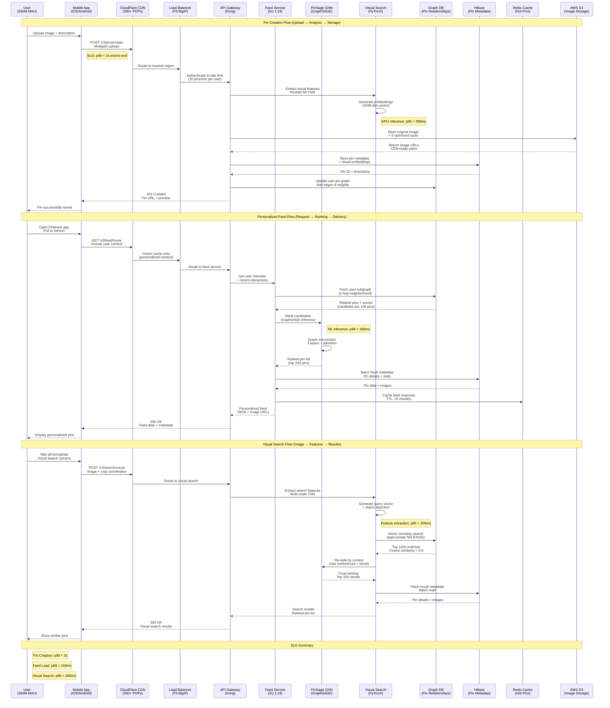

# Pinterest Request Flow

## The Golden Path: Pin Creation to Discovery

Pinterest's request flow handles three critical user journeys: pin creation with visual analysis, personalized feed generation using graph neural networks, and visual search powered by computer vision.

## Performance Budgets & SLOs

### Pin Creation Flow
- **Image Upload**: p95 < 1.5s (including S3 upload)
- **Visual Analysis**: p95 < 300ms (CNN inference)
- **Metadata Storage**: p99 < 50ms (HBase write)
- **Graph Update**: p99 < 100ms (relationship edges)
- **End-to-End**: p99 < 2s (user perception)

### Feed Generation Flow
- **User Context**: p95 < 20ms (Redis lookup)
- **Candidate Retrieval**: p99 < 80ms (Graph query)
- **PinSage Ranking**: p99 < 150ms (GNN inference)
- **Metadata Fetch**: p95 < 30ms (HBase batch read)
- **Cache Storage**: p99 < 10ms (Redis write)
- **End-to-End**: p99 < 150ms (feed refresh)

### Visual Search Flow
- **Feature Extraction**: p95 < 200ms (GPU inference)
- **Similarity Search**: p99 < 50ms (FAISS query)
- **Result Re-ranking**: p95 < 100ms (PinSage)
- **Metadata Fetch**: p95 < 40ms (HBase batch)
- **End-to-End**: p95 < 300ms (search results)

## Traffic Patterns & Load

### Peak Traffic Characteristics
- **Feed Requests**: 500k RPS during evening hours (US)
- **Pin Uploads**: 50k RPS peak (holiday seasons)
- **Visual Search**: 100k RPS (shopping events)
- **Geographic Distribution**: 40% US, 25% Europe, 35% APAC

### Seasonal Variations
- **Holiday Shopping**: 3x normal traffic (Nov-Dec)
- **Wedding Season**: 2x pin saves (Mar-Jun)
- **Back to School**: 2.5x recipe/DIY pins (Aug-Sep)
- **Summer Travel**: 2x travel pin searches (Jun-Aug)

## Error Handling & Fallbacks

### Feed Generation Failures
- **PinSage Timeout**: Fall back to collaborative filtering
- **Graph DB Unavailable**: Use cached user preferences
- **Redis Cache Miss**: Generate feed without caching
- **Partial Results**: Fill with trending/popular pins

### Visual Search Degradation
- **GPU Overload**: Queue requests, return cached results
- **Model Inference Error**: Fall back to text-based search
- **FAISS Index Corruption**: Rebuild from S3 backup
- **Feature Extraction Timeout**: Return text search results

### Pin Upload Resilience
- **S3 Upload Failure**: Retry with exponential backoff
- **Vision API Timeout**: Store pin without visual features
- **HBase Write Error**: Queue for async retry
- **Graph Update Failure**: Add to reconciliation queue

*Sources: Pinterest Engineering blog posts on PinSage, visual search infrastructure talks, mobile performance optimization case studies*