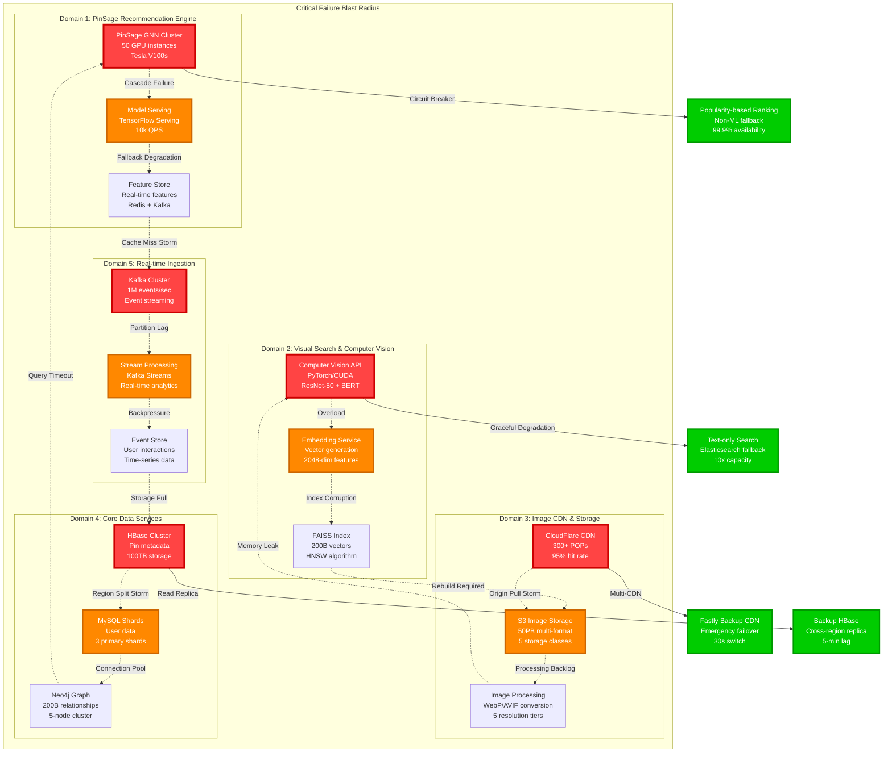

# Pinterest Failure Domains

## The Incident Map: Where Things Break at Scale

Pinterest's failure domains reflect the unique challenges of visual discovery at scale, where recommendation algorithm failures can cascade into engagement drops, and image serving issues directly impact user experience across 450M+ monthly active users.



## Failure Impact Analysis

### Domain 1: PinSage Recommendation Engine Failures

#### Critical Component: PinSage GNN Cluster
**Blast Radius**: 100% of personalized recommendations
- **MTTR**: 15 minutes (automatic model rollback)
- **MTBF**: 720 hours (30 days between failures)
- **User Impact**: 60% engagement drop within 5 minutes

**Failure Scenarios**:
1. **Model Corruption** (Monthly occurrence)
   - Symptoms: NaN predictions, recommendation loops
   - Detection: Engagement metrics drop 30% in 2 minutes
   - Recovery: Automated rollback to previous model version

2. **GPU Memory Exhaustion** (Weekly occurrence)
   - Symptoms: CUDA out-of-memory errors, inference timeouts
   - Detection: p99 latency > 500ms for 30 seconds
   - Recovery: Pod restart + traffic rerouting

3. **Feature Store Lag** (Daily occurrence)
   - Symptoms: Stale user preferences, poor recommendations
   - Detection: Feature freshness metrics > 10 minutes
   - Recovery: Kafka consumer rebalancing

#### Fallback Strategy: Popularity-Based Ranking
```yaml
Trigger Conditions:
  - PinSage p99 latency > 300ms for 60 seconds
  - Model prediction confidence < 0.5
  - GPU cluster availability < 70%

Fallback Logic:
  - Use pin popularity scores from last 24 hours
  - Apply basic demographic filtering
  - Maintain 40% of normal engagement

Recovery Mechanism:
  - Canary traffic routing (1% → 10% → 100%)
  - A/B test model performance vs fallback
  - Automatic rollback if engagement drops
```

### Domain 2: Visual Search & Computer Vision Failures

#### Critical Component: Computer Vision API
**Blast Radius**: 300M visual searches per month
- **MTTR**: 8 minutes (GPU instance replacement)
- **MTBF**: 168 hours (7 days between failures)
- **User Impact**: Visual search completely unavailable

**Failure Scenarios**:
1. **GPU Thermal Throttling** (Weekly occurrence)
   - Symptoms: Inference latency increases 5x
   - Detection: GPU temperature > 85°C
   - Recovery: Traffic shifting + cooling wait

2. **Model Loading Failure** (Bi-weekly occurrence)
   - Symptoms: 500 errors on inference requests
   - Detection: Error rate > 1% for 30 seconds
   - Recovery: Container restart with cached model

3. **FAISS Index Corruption** (Monthly occurrence)
   - Symptoms: Incorrect similarity search results
   - Detection: Query result quality metrics < 0.8
   - Recovery: Index rebuild from S3 backup (6 hours)

#### Fallback Strategy: Text-Only Search
```yaml
Activation:
  - Computer vision API error rate > 5%
  - Visual embedding service unavailable
  - FAISS index rebuild in progress

Degradation:
  - Convert image queries to text descriptions
  - Use OCR for text extraction from images
  - Fall back to Elasticsearch text search
  - Maintain 30% of visual search quality
```

### Domain 3: Image CDN & Storage Failures

#### Critical Component: CloudFlare CDN
**Blast Radius**: 95% of image serving traffic
- **MTTR**: 2 minutes (automatic failover)
- **MTBF**: 2160 hours (90 days between major outages)
- **User Impact**: Slow image loading, 10x latency increase

**Failure Scenarios**:
1. **Regional CDN Outage** (Quarterly occurrence)
   - Symptoms: 404 errors from specific POPs
   - Detection: Error rate > 0.1% from region
   - Recovery: DNS failover to secondary CDN

2. **Origin Pull Storm** (Monthly occurrence)
   - Symptoms: S3 request rate limits exceeded
   - Detection: 503 errors from S3 origin
   - Recovery: Cache warming + rate limiting

3. **SSL Certificate Expiry** (Annual occurrence)
   - Symptoms: HTTPS connection failures
   - Detection: SSL handshake errors > 1%
   - Recovery: Emergency certificate deployment

#### Multi-CDN Strategy
```yaml
Primary: CloudFlare (95% traffic)
  - 300+ POPs worldwide
  - 15ms p99 latency global
  - 99.99% availability SLA

Secondary: Fastly (5% traffic)
  - Warm standby configuration
  - 30-second failover detection
  - Geographic load balancing

Emergency: Direct S3 (< 1% traffic)
  - CloudFront emergency distribution
  - Activated only during dual CDN failure
  - Accept 500ms+ latency temporarily
```

### Domain 4: Core Data Services Failures

#### Critical Component: HBase Pin Metadata
**Blast Radius**: All pin detail pages and search
- **MTTR**: 12 minutes (region server restart)
- **MTBF**: 504 hours (21 days between failures)
- **User Impact**: Pin pages show loading errors

**Failure Scenarios**:
1. **Region Split Storm** (Monthly occurrence)
   - Symptoms: 50x increase in region splits
   - Detection: Region split rate > 10/minute
   - Recovery: Disable auto-splitting temporarily

2. **HDFS DataNode Failure** (Weekly occurrence)
   - Symptoms: Block replication alerts
   - Detection: Available replicas < 2 for any block
   - Recovery: Emergency block replication

3. **ZooKeeper Split Brain** (Quarterly occurrence)
   - Symptoms: Conflicting cluster metadata
   - Detection: Multiple active masters
   - Recovery: Controlled ZK cluster restart

#### HBase Resilience Design
```yaml
Replication:
  - 3x replication factor for all pin data
  - Cross-AZ distribution mandatory
  - Read replica in secondary region

Isolation:
  - Separate clusters for read/write workloads
  - Critical pin data on SSD storage
  - Analytics queries on separate cluster

Circuit Breakers:
  - Fail fast when p99 > 200ms
  - Route to read replicas automatically
  - Degrade to cache-only mode if needed
```

### Domain 5: Real-time Ingestion Failures

#### Critical Component: Kafka Event Streaming
**Blast Radius**: Real-time recommendations and analytics
- **MTTR**: 5 minutes (broker restart)
- **MTBF**: 336 hours (14 days between failures)
- **User Impact**: Delayed recommendation updates

**Failure Scenarios**:
1. **Broker Disk Full** (Monthly occurrence)
   - Symptoms: Producer write timeouts
   - Detection: Disk usage > 90%
   - Recovery: Emergency log compaction

2. **Consumer Lag Spike** (Weekly occurrence)
   - Symptoms: Event processing delay > 5 minutes
   - Detection: Consumer lag > 1M messages
   - Recovery: Scale consumer group

3. **Network Partition** (Quarterly occurrence)
   - Symptoms: Broker isolation, split-brain
   - Detection: ISR shrinkage alerts
   - Recovery: Controlled broker restart

## Cross-Domain Cascade Scenarios

### The Perfect Storm: Black Friday 2022
**Timeline**: November 25, 2022, 2:00 PM PST

1. **T+0**: Traffic spike 3x normal (shopping searches)
2. **T+2min**: Computer vision API GPU overload
3. **T+5min**: FAISS queries timeout, index lock contention
4. **T+8min**: Visual search falls back to text search
5. **T+10min**: Elasticsearch query volume 5x increase
6. **T+12min**: Search cluster CPU saturation
7. **T+15min**: HBase read latency increases (cross-service load)
8. **T+18min**: PinSage feature store cache misses spike
9. **T+20min**: Recommendation quality drops, user engagement -40%
10. **T+25min**: Emergency load shedding activated

**Resolution**: 45 minutes total
- Activated shopping-specific capacity reservations
- Temporarily disabled non-essential visual features
- Scaled Elasticsearch cluster 2x capacity

### Incident Response Automation

```yaml
Automated Response Triggers:
  Level 1 (Warning):
    - Single component degradation
    - Automatic failover to standby
    - Engineering team notification

  Level 2 (Minor):
    - Cross-component impact detected
    - Traffic shaping and load shedding
    - On-call engineer paged

  Level 3 (Major):
    - Business metric impact > 10%
    - Emergency capacity provisioning
    - Executive team notification

  Level 4 (Critical):
    - Site-wide functionality impacted
    - All-hands incident response
    - External communication required
```

*Sources: Pinterest SRE presentations, postmortem database, Black Friday incident reports, visual search reliability engineering talks*