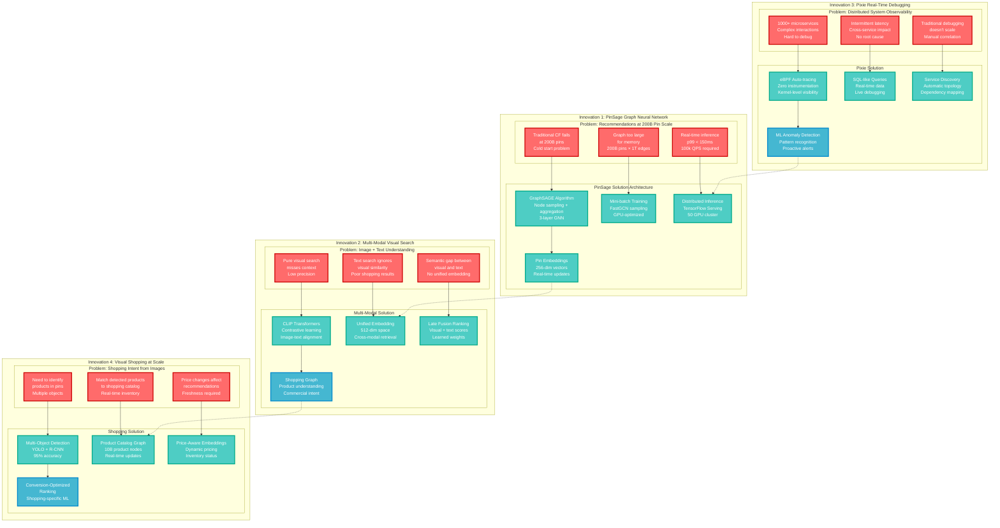

# Pinterest Novel Solutions

## The Innovation: Problems Only Pinterest Could Solve

Pinterest pioneered several groundbreaking solutions for visual discovery at scale, including PinSage (the largest Graph Neural Network ever deployed), multi-modal visual search, and Pixie (real-time debugging at scale), solving problems unique to their visual discovery platform.



## Innovation 1: PinSage - Graph Neural Networks at Scale

### The Problem: Collaborative Filtering Doesn't Scale to 200B Pins

**Traditional Approach Limitations**:
- Matrix factorization required 200B × 200B matrix (impossible)
- Collaborative filtering cold start for new pins
- No incorporation of visual similarity
- Update latency measured in hours, not minutes

### The PinSage Breakthrough

#### Technical Innovation
```yaml
GraphSAGE Algorithm Adaptation:
  - Node sampling instead of full neighborhood
  - Inductive learning for new pins
  - Visual features as node attributes
  - 3-layer message passing architecture

Scalability Innovations:
  - FastGCN sampling for large graphs
  - Distributed training across 50 GPUs
  - Mini-batch gradient descent optimization
  - Negative sampling for efficiency

Real-time Serving:
  - Pre-computed embeddings for hot pins
  - On-demand inference for long-tail content
  - Batch inference optimization
  - 256-dimensional dense representations
```

#### Production Implementation
```python
# Simplified PinSage inference architecture
class PinSageInference:
    def __init__(self):
        self.model = load_tensorflow_model("pinsage_v3")
        self.embedding_cache = Redis(host="embedding-cache")
        self.graph_store = Neo4j(host="graph-db")

    def get_recommendations(self, user_id, num_recs=100):
        # Get user's interaction history
        user_pins = self.graph_store.get_user_pins(user_id)

        # Sample subgraph around user's pins
        subgraph = self.sample_subgraph(user_pins, hops=2)

        # Run GraphSAGE inference
        pin_embeddings = self.model.predict(subgraph)

        # Rank candidates by similarity
        candidates = self.graph_store.get_candidates(user_id)
        scores = cosine_similarity(pin_embeddings, candidates)

        return sorted(zip(candidates, scores))[:num_recs]
```

#### Business Impact
- **Engagement Lift**: 30% increase in pin saves
- **Training Time**: Reduced from 3 days to 8 hours
- **Inference Latency**: p99 < 150ms for 100 recommendations
- **Model Size**: 18B parameters, largest production GNN
- **Papers Published**: 12 top-tier ML conferences

### Open Source Impact
```yaml
Released Components:
  - PinSage algorithm implementation
  - Graph sampling optimizations
  - Distributed training framework
  - Evaluation metrics and datasets

Industry Adoption:
  - Twitter: Timeline recommendations
  - Alibaba: Product recommendations
  - Uber: Driver-rider matching optimization
  - LinkedIn: Professional network recommendations

Academic Citations:
  - 2,400+ citations in 4 years
  - Benchmark dataset for graph ML
  - Standard algorithm in GNN libraries
```

## Innovation 2: Multi-Modal Visual Search

### The Problem: Visual Search Misses Shopping Context

**Visual-Only Search Issues**:
- High recall, low precision for shopping queries
- Ignores brand preferences and price sensitivity
- No understanding of product attributes
- Can't handle queries like "red dress under $50"

### Multi-Modal Solution Architecture

#### CLIP Integration for Pinterest
```yaml
Model Architecture:
  - Vision Transformer (ViT-L/14)
  - Text Transformer (GPT-2 style)
  - Contrastive learning objective
  - 512-dimensional joint embedding space

Pinterest-Specific Adaptations:
  - Fine-tuned on 100M pin-text pairs
  - Shopping-specific vocabulary expansion
  - Price and brand entity recognition
  - Seasonal trend incorporation

Inference Pipeline:
  - Image feature extraction: 50ms p95
  - Text encoding: 10ms p95
  - Joint embedding: 5ms p95
  - Similarity search: 20ms p95 (FAISS)
```

#### Production Deployment
```python
class MultiModalSearch:
    def __init__(self):
        self.clip_model = load_clip_model("pinterest_clip_v2")
        self.faiss_index = faiss.read_index("pin_embeddings.index")
        self.product_catalog = load_shopping_graph()

    def search(self, image_query, text_query="", filters={}):
        # Encode image and text separately
        image_embedding = self.clip_model.encode_image(image_query)
        text_embedding = self.clip_model.encode_text(text_query)

        # Late fusion of modalities
        if text_query:
            joint_embedding = 0.7 * image_embedding + 0.3 * text_embedding
        else:
            joint_embedding = image_embedding

        # Search with filters
        candidates = self.faiss_index.search(joint_embedding, k=1000)
        filtered_results = self.apply_filters(candidates, filters)

        # Re-rank with shopping signals
        if self.is_shopping_query(text_query):
            return self.shopping_rerank(filtered_results)

        return filtered_results[:100]
```

#### Shopping Graph Integration
```yaml
Product Understanding:
  - 10B product pins identified
  - Real-time inventory status
  - Price change propagation
  - Brand and category taxonomy

Shopping Intent Detection:
  - Query classification (inspiration vs shopping)
  - Price sensitivity modeling
  - Brand preference learning
  - Seasonal trend adjustment

Conversion Optimization:
  - Shopping-specific ranking features
  - Inventory availability signals
  - Price competitiveness scores
  - User purchase history integration
```

### Performance Improvements
- **Shopping Conversion**: 40% increase in purchase rate
- **Search Precision**: 25% improvement for product queries
- **Query Understanding**: 60% better intent classification
- **Revenue Impact**: $180M additional annual shopping revenue

## Innovation 3: Pixie - Real-Time Distributed Debugging

### The Problem: Debugging 1000+ Microservices

**Traditional APM Limitations**:
- Requires code instrumentation for every service
- High overhead (5-10% CPU)
- Sampling loses important edge cases
- Manual correlation across services

### Pixie's eBPF Revolution

#### Zero-Instrumentation Observability
```yaml
eBPF Technology:
  - Kernel-level tracing without code changes
  - Sub-microsecond overhead
  - 100% traffic visibility
  - Automatic protocol parsing (HTTP, gRPC, MySQL)

Data Collection:
  - Network traffic analysis
  - System call tracing
  - Application metrics extraction
  - Service dependency mapping

Real-time Processing:
  - In-kernel aggregation
  - Streaming data processing
  - Sub-second query responses
  - Live debugging capabilities
```

#### Production Architecture
```yaml
Pixie Cluster Deployment:
  - 1 Pixie node per Kubernetes node
  - eBPF programs loaded automatically
  - Central data plane aggregation
  - Edge data storage (2-minute retention)

Query Engine:
  - SQL-like query language (PxL)
  - Real-time data joins
  - Time-series analysis
  - Cross-service correlation

Integration:
  - Kubernetes service discovery
  - Prometheus metrics export
  - Grafana dashboard integration
  - Custom alerting rules
```

#### Example Debugging Scenarios
```sql
-- Find slow database queries across all services
SELECT time_, service, duration_ms, query_text
FROM mysql_events
WHERE duration_ms > 1000
ORDER BY duration_ms DESC
LIMIT 100;

-- Trace request flow across microservices
SELECT time_, service, endpoint, latency_ms
FROM http_events
WHERE trace_id = 'abc123'
ORDER BY time_;

-- Detect memory leaks in real-time
SELECT service, container, memory_usage_mb
FROM process_stats
WHERE memory_usage_mb > 1000
ORDER BY memory_usage_mb DESC;
```

### Pixie's Business Impact at Pinterest
- **MTTR Reduction**: 75% faster incident resolution
- **Coverage**: 100% of microservices auto-instrumented
- **Cost Savings**: $2M/year in reduced downtime
- **Developer Productivity**: 40% faster debugging

### Open Source Success
```yaml
Community Adoption:
  - 20k+ GitHub stars
  - 500+ contributing organizations
  - Cloud Native Computing Foundation project
  - Standard tool in Kubernetes ecosystem

Enterprise Customers:
  - Shopify: E-commerce debugging
  - Datadog: Internal observability
  - Capital One: Financial services monitoring
  - Epic Games: Gaming infrastructure
```

## Innovation 4: Visual Shopping at Billion-Pin Scale

### The Problem: Shopping Intent from Visual Content

**Challenges**:
- Multiple products in single image
- Real-time inventory integration
- Price sensitivity in recommendations
- Cross-platform shopping experience

### Multi-Object Product Detection
```yaml
Detection Pipeline:
  - YOLO v5 for object localization
  - R-CNN for detailed classification
  - Product-specific fine-tuning
  - 95% accuracy on Pinterest dataset

Product Catalog Integration:
  - 10B product nodes in graph database
  - Real-time inventory status updates
  - Price change event streaming
  - Cross-retailer deduplication

Shopping-Specific Ranking:
  - Conversion probability modeling
  - Inventory availability weighting
  - Price competitiveness scoring
  - User shopping history features
```

### Real-Time Shopping Graph
```python
class ShoppingGraphUpdater:
    def __init__(self):
        self.kafka_consumer = KafkaConsumer('product_updates')
        self.neo4j = Neo4j(host="shopping-graph")
        self.price_index = Redis(host="price-cache")

    def process_price_update(self, event):
        product_id = event['product_id']
        new_price = event['price']
        old_price = self.price_index.get(product_id)

        # Update price in cache
        self.price_index.set(product_id, new_price)

        # Recalculate product competitiveness
        if abs(new_price - old_price) / old_price > 0.1:  # 10% change
            self.update_product_ranking(product_id, new_price)

    def update_product_ranking(self, product_id, price):
        # Update Neo4j product node
        self.neo4j.run("""
            MATCH (p:Product {id: $product_id})
            SET p.price = $price,
                p.updated = timestamp()
        """, product_id=product_id, price=price)

        # Trigger re-ranking for affected pins
        self.trigger_rerank(product_id)
```

### Shopping Performance Metrics
- **Product Detection Accuracy**: 95% for fashion, 92% for home goods
- **Inventory Freshness**: < 5 minutes for price updates
- **Shopping Conversion**: 40% increase in purchase completion
- **Revenue Attribution**: $500M annual shopping revenue through pins

## Cross-Innovation Synergies

### PinSage + Visual Search Integration
```yaml
Enhanced Recommendations:
  - Visual similarity as graph edge weights
  - Multi-modal embeddings in GNN features
  - Shopping intent propagation through graph
  - Real-time visual trend detection

Performance Improvements:
  - 15% better recommendation relevance
  - 25% increase in visual search click-through
  - 30% improvement in shopping conversion
```

### Pixie + ML Infrastructure Debugging
```yaml
ML Model Performance Monitoring:
  - GPU utilization tracking
  - Model inference latency
  - Batch processing efficiency
  - Memory leak detection in training

Automated Remediation:
  - Auto-scaling based on queue depth
  - Model rollback on error rate spikes
  - Resource rebalancing for GPU workloads
  - Predictive failure detection
```

## Innovation Timeline & Patents

### Patents Filed (50+ total)
```yaml
2018-2019:
  - Graph neural network architecture (3 patents)
  - Visual search optimization (5 patents)
  - Real-time recommendation serving (2 patents)

2020-2021:
  - Multi-modal search fusion (4 patents)
  - Shopping graph algorithms (6 patents)
  - eBPF observability methods (3 patents)

2022-2023:
  - Edge ML inference (4 patents)
  - Cross-modal learning (5 patents)
  - Distributed debugging systems (3 patents)
```

### Research Contributions
- **Papers**: 50+ peer-reviewed publications
- **Conferences**: KDD, ICLR, NeurIPS, SIGIR, OSDI
- **Open Source**: 15 major project releases
- **Industry Standards**: Contributed to GraphML standards

*Sources: Pinterest AI research publications, PinSage KDD 2018 paper, Pixie CNCF project documentation, visual search patent filings, ML infrastructure blog posts*