# Pinterest Production Operations

## The Ops View: Running Visual Discovery at Global Scale

Pinterest's production operations orchestrate one of the world's largest visual discovery platforms, managing 450M+ users, 200B+ pins, and 50PB+ of image content through automated deployment pipelines, global content moderation, and sophisticated chaos engineering practices.

```mermaid
graph TB
    subgraph "Deployment Pipeline - 1000+ Deploys/Day"
        subgraph "Development & Testing"
            GIT[Git Repository<br/>500+ commits/day<br/>Feature branches]
            CI[Jenkins CI<br/>Unit + Integration tests<br/>15-minute builds]
            STAGING[Staging Environment<br/>Production replica<br/>10% traffic clone]
        end

        subgraph "Automated Deployment"
            SPINNAKER[Spinnaker CD<br/>Blue-green deployment<br/>Canary analysis]
            KUBERNETES[Kubernetes<br/>5000+ pods<br/>Auto-scaling]
            HELM[Helm Charts<br/>Configuration mgmt<br/>Environment templating]
        end

        subgraph "Release Gates"
            HEALTH_CHECK[Health Checks<br/>Readiness probes<br/>Circuit breakers]
            METRICS_GATE[Metrics Gate<br/>Error rate < 0.1%<br/>p99 latency < 200ms]
            CANARY_ANALYSIS[Canary Analysis<br/>5% → 25% → 100%<br/>Automated rollback]
        end
    end

    subgraph "Content Moderation - 24/7 Global Operations"
        subgraph "Automated Detection"
            VISION_MOD[Computer Vision<br/>NSFW detection<br/>Violence/hate ID]
            TEXT_MOD[Text Analysis<br/>NLP spam detection<br/>Harmful content]
            BEHAVIOR_MOD[Behavior Analysis<br/>Bot detection<br/>Abuse patterns]
        end

        subgraph "Human Review"
            GLOBAL_MODS[Global Moderators<br/>24/7 coverage<br/>15 languages]
            ESCALATION[Escalation Queue<br/>Complex cases<br/>Cultural context]
            APPEALS[Appeals Process<br/>User disputes<br/>Review workflow]
        end

        subgraph "Policy Enforcement"
            AUTO_ACTIONS[Automated Actions<br/>Pin removal<br/>Account suspension]
            SHADOWBAN[Shadow Banning<br/>Reduced visibility<br/>Spam mitigation]
            CONTENT_LABELS[Content Labeling<br/>Age-appropriate<br/>Sensitive topics]
        end
    end

    subgraph "Global CDN Operations - 300+ POPs"
        subgraph "Traffic Management"
            DNS_LB[GeoDNS<br/>Latency-based routing<br/>Failover automation]
            EDGE_ROUTING[Edge Routing<br/>Anycast networking<br/>BGP optimization]
            CACHE_STRATEGY[Cache Strategy<br/>95% hit rate<br/>Regional warming]
        end

        subgraph "Performance Optimization"
            IMAGE_OPT[Image Optimization<br/>WebP/AVIF serving<br/>Responsive sizing]
            COMPRESSION[Compression<br/>Brotli/Gzip<br/>25% size reduction]
            PREFETCH[Predictive Prefetch<br/>ML-based preloading<br/>User behavior patterns]
        end

        subgraph "Reliability"
            MULTI_CDN[Multi-CDN Strategy<br/>CloudFlare + Fastly<br/>30s failover]
            ORIGIN_SHIELD[Origin Shield<br/>S3 protection<br/>Request batching]
            EDGE_COMPUTE[Edge Computing<br/>Regional ML inference<br/>Personalization]
        end
    end

    subgraph "Monitoring & Alerting - Real-time Observability"
        subgraph "Metrics Collection"
            DATADOG[DataDog<br/>100k metrics/sec<br/>Custom dashboards]
            PROMETHEUS[Prometheus<br/>Infrastructure metrics<br/>Service discovery]
            CUSTOM_METRICS[Custom Metrics<br/>Business KPIs<br/>ML model performance]
        end

        subgraph "Alerting & Response"
            PAGERDUTY[PagerDuty<br/>Escalation policies<br/>On-call rotation]
            SLACK_OPS[Slack Ops<br/>ChatOps integration<br/>Incident coordination]
            RUNBOOKS[Automated Runbooks<br/>Self-healing<br/>Standard procedures]
        end

        subgraph "Incident Management"
            INCIDENT_CMD[Incident Commander<br/>Response coordination<br/>Communication lead]
            WAR_ROOM[Virtual War Room<br/>Zoom/Slack bridge<br/>Real-time collaboration]
            POSTMORTEM[Postmortem Process<br/>Blameless culture<br/>Action items tracking]
        end
    end

    subgraph "Chaos Engineering - Resilience Testing"
        subgraph "Chaos Experiments"
            CHAOS_MONKEY[Chaos Monkey<br/>Random failures<br/>Service resilience]
            LATENCY_MONKEY[Latency Monkey<br/>Network delays<br/>Timeout testing]
            RESOURCE_MONKEY[Resource Monkey<br/>CPU/Memory limits<br/>Resource starvation]
        end

        subgraph "Game Days"
            REGIONAL_FAILOVER[Regional Failover<br/>Multi-AZ testing<br/>RTO validation]
            DB_FAILOVER[Database Failover<br/>MySQL/HBase<br/>Data consistency]
            CDN_OUTAGE[CDN Outage Sim<br/>Origin fallback<br/>Performance impact]
        end

        subgraph "Resilience Validation"
            SLO_TESTING[SLO Testing<br/>Error budget burn<br/>Graceful degradation]
            CAPACITY_TESTING[Capacity Testing<br/>Load limits<br/>Auto-scaling]
            DISASTER_RECOVERY[DR Testing<br/>Cross-region<br/>Business continuity]
        end
    end

    %% Pipeline flow
    GIT --> CI
    CI --> STAGING
    STAGING --> SPINNAKER
    SPINNAKER --> KUBERNETES
    KUBERNETES --> HELM

    %% Deployment gates
    HELM --> HEALTH_CHECK
    HEALTH_CHECK --> METRICS_GATE
    METRICS_GATE --> CANARY_ANALYSIS

    %% Moderation flow
    VISION_MOD --> AUTO_ACTIONS
    TEXT_MOD --> GLOBAL_MODS
    BEHAVIOR_MOD --> ESCALATION
    GLOBAL_MODS --> APPEALS
    ESCALATION --> CONTENT_LABELS

    %% CDN operations
    DNS_LB --> EDGE_ROUTING
    EDGE_ROUTING --> CACHE_STRATEGY
    IMAGE_OPT --> COMPRESSION
    COMPRESSION --> PREFETCH
    MULTI_CDN --> ORIGIN_SHIELD
    ORIGIN_SHIELD --> EDGE_COMPUTE

    %% Monitoring flow
    DATADOG --> PAGERDUTY
    PROMETHEUS --> SLACK_OPS
    CUSTOM_METRICS --> RUNBOOKS
    PAGERDUTY --> INCIDENT_CMD
    INCIDENT_CMD --> WAR_ROOM
    WAR_ROOM --> POSTMORTEM

    %% Chaos engineering
    CHAOS_MONKEY --> SLO_TESTING
    LATENCY_MONKEY --> CAPACITY_TESTING
    RESOURCE_MONKEY --> DISASTER_RECOVERY
    REGIONAL_FAILOVER --> SLO_TESTING
    DB_FAILOVER --> CAPACITY_TESTING
    CDN_OUTAGE --> DISASTER_RECOVERY

    %% Apply operational colors
    classDef deployStyle fill:#00AA00,stroke:#007700,color:#fff,stroke-width:3px
    classDef moderationStyle fill:#FF8800,stroke:#CC6600,color:#fff,stroke-width:3px
    classDef cdnStyle fill:#0066CC,stroke:#004499,color:#fff,stroke-width:3px
    classDef monitorStyle fill:#CC0000,stroke:#990000,color:#fff,stroke-width:3px
    classDef chaosStyle fill:#8800CC,stroke:#660099,color:#fff,stroke-width:3px

    class GIT,CI,STAGING,SPINNAKER,KUBERNETES,HELM,HEALTH_CHECK,METRICS_GATE,CANARY_ANALYSIS deployStyle
    class VISION_MOD,TEXT_MOD,BEHAVIOR_MOD,GLOBAL_MODS,ESCALATION,APPEALS,AUTO_ACTIONS,SHADOWBAN,CONTENT_LABELS moderationStyle
    class DNS_LB,EDGE_ROUTING,CACHE_STRATEGY,IMAGE_OPT,COMPRESSION,PREFETCH,MULTI_CDN,ORIGIN_SHIELD,EDGE_COMPUTE cdnStyle
    class DATADOG,PROMETHEUS,CUSTOM_METRICS,PAGERDUTY,SLACK_OPS,RUNBOOKS,INCIDENT_CMD,WAR_ROOM,POSTMORTEM monitorStyle
    class CHAOS_MONKEY,LATENCY_MONKEY,RESOURCE_MONKEY,REGIONAL_FAILOVER,DB_FAILOVER,CDN_OUTAGE,SLO_TESTING,CAPACITY_TESTING,DISASTER_RECOVERY chaosStyle
```



## Deployment Pipeline - The Daily Reality

### CI/CD at Scale: 1000+ Deployments Per Day

#### Development Workflow
```yaml
Code Commit Process:
  - Feature branch from main
  - Automated linting and formatting
  - Unit tests (95% coverage requirement)
  - Integration tests against staging data
  - Peer review + security scan

CI Pipeline (Jenkins):
  - Parallel test execution (15 minutes)
  - Docker image building
  - Vulnerability scanning
  - Performance regression testing
  - Automated staging deployment

Staging Environment:
  - 10% production data clone
  - Full production service topology
  - Real user traffic replay
  - Feature flag integration
  - Load testing automation
```

#### Spinnaker Deployment Strategy
```yaml
Blue-Green Deployment:
  - Parallel environment preparation
  - Zero-downtime database migrations
  - Health check validation
  - Traffic switching in 30 seconds
  - Automatic rollback on failure

Canary Deployment Process:
  Stage 1: 5% traffic for 10 minutes
    - Error rate monitoring
    - Latency percentile tracking
    - Business metric validation

  Stage 2: 25% traffic for 30 minutes
    - Extended monitoring period
    - A/B test result analysis
    - Resource utilization check

  Stage 3: 100% traffic rollout
    - Final health validation
    - Performance baseline update
    - Deployment success notification

Rollback Triggers:
  - Error rate > 0.1% for 2 minutes
  - p99 latency > 200ms increase
  - Business metric drop > 5%
  - Manual engineer intervention
```

#### Kubernetes Operations
```yaml
Cluster Configuration:
  - 3 production clusters (US, EU, APAC)
  - 5000+ pods across all clusters
  - Auto-scaling: 2x-10x capacity
  - GPU node pools for ML workloads

Resource Management:
  - CPU requests: 80% utilization target
  - Memory limits: OOM prevention
  - Storage: Dynamic PV provisioning
  - Network policies: Service isolation

Pod Lifecycle:
  - Readiness probes: 3-attempt validation
  - Liveness probes: 30-second intervals
  - Graceful shutdown: 60-second timeout
  - Rolling updates: 25% unavailable max
```

### Real Production Metrics
- **Deployment Frequency**: 1200+ per day
- **Lead Time**: Commit to production in 45 minutes
- **MTTR**: 8 minutes average incident resolution
- **Change Failure Rate**: 0.3% (deployments causing incidents)

## Content Moderation - Global Operations

### 24/7 Content Safety at Scale

#### Automated Detection Systems
```yaml
Computer Vision Moderation:
  Model: Custom ResNet-50 + transformer
  Accuracy: 97% NSFW detection
  Processing: 500k new images/day
  Latency: p95 < 200ms per image

  Detection Categories:
    - Adult content (explicit)
    - Violence and gore
    - Hate symbols
    - Self-harm content
    - Spam and fake products

Text Analysis Pipeline:
  NLP Model: BERT-based multilingual
  Languages: 15 major languages
  Processing: 2M new pins/day
  Accuracy: 94% harmful content detection

  Analysis Types:
    - Spam and scam detection
    - Harassment identification
    - Misinformation flagging
    - Copyright violation
    - Commercial policy violations

Behavioral Analysis:
  ML Model: Graph neural network
  Features: User interaction patterns
  Detection: Bot networks, coordinated attacks
  Precision: 92% fake account identification
```

#### Human Review Operations
```yaml
Global Moderation Team:
  Size: 2000+ content moderators
  Coverage: 24/7 across 15 time zones
  Languages: 15 major languages
  Specialization: Cultural context experts

Review Queue Management:
  Daily Volume: 100k items for human review
  SLA: High-priority items < 2 hours
  Quality Assurance: 10% double-review
  Escalation: Senior moderators for complex cases

Policy Enforcement:
  Automated Actions: 85% of violations
  Human Actions: 15% requiring judgment
  Appeals Process: 48-hour response SLA
  Transparency: Policy explanation to users
```

#### Content Moderation Metrics
```yaml
Detection Performance:
  - False Positive Rate: 3% (acceptable range)
  - False Negative Rate: 5% (continuous improvement)
  - User Appeal Success: 12% (policy clarification)
  - Time to Detection: p95 < 30 minutes

Policy Violations by Category:
  - Spam: 60% of all violations
  - Adult content: 20%
  - Harassment: 10%
  - Copyright: 7%
  - Other: 3%

Regional Variations:
  - US: 40% of moderated content
  - EU: 25% (GDPR compliance)
  - APAC: 30% (cultural sensitivity)
  - Other: 5%
```

## Global CDN Operations

### 300+ POPs Worldwide

#### Traffic Management Strategy
```yaml
GeoDNS Configuration:
  Primary: Route 53 with latency-based routing
  Backup: Cloudflare DNS with health checks
  Failover: 30-second detection and switching
  Load Balancing: Weighted round-robin by region

Regional Distribution:
  North America: 120 POPs (40% traffic)
  Europe: 80 POPs (25% traffic)
  Asia Pacific: 70 POPs (30% traffic)
  Other Regions: 30 POPs (5% traffic)

Cache Strategy:
  Image TTL: 1 year (immutable content)
  API Responses: 5 minutes (dynamic content)
  Static Assets: 30 days (CSS, JS, fonts)
  Purge Strategy: Tag-based invalidation
```

#### Performance Optimization
```yaml
Image Delivery Optimization:
  Format Selection: WebP (70%), AVIF (15%), JPEG (15%)
  Responsive Images: 5 breakpoints (236px to 1200px)
  Compression: 80% quality JPEG, lossless WebP
  Progressive Loading: Base64 placeholder + lazy load

Compression Strategy:
  Text Compression: Brotli (primary), Gzip (fallback)
  Size Reduction: 25% average reduction
  CPU Impact: 2% origin server load
  Browser Support: 95% Brotli compatibility

Predictive Prefetching:
  ML Model: User behavior prediction
  Accuracy: 78% next-page prediction
  Cache Warming: Trending content preloading
  Network Consideration: Adaptive to connection speed
```

#### CDN Reliability Metrics
```yaml
Performance:
  - Global p95 Latency: 50ms
  - Cache Hit Rate: 95% average
  - Origin Offload: 98% traffic served from cache
  - Bandwidth Usage: 2.5 Petabytes/month

Availability:
  - CDN Uptime: 99.99% (4 minutes/month downtime)
  - Regional Failover: 30-second detection
  - Multi-CDN Strategy: CloudFlare + Fastly backup
  - Origin Protection: 99.5% cache hit prevents overload
```

## Monitoring & Incident Response

### Real-Time Observability at Scale

#### Monitoring Infrastructure
```yaml
DataDog Configuration:
  Hosts Monitored: 5000+ instances
  Metrics/Second: 100k custom metrics
  Log Ingestion: 500GB/day
  Retention: 30 days (metrics), 7 days (logs)

  Key Dashboards:
    - Service-level SLI/SLO tracking
    - Infrastructure resource utilization
    - Business metrics (engagement, revenue)
    - ML model performance monitoring

Prometheus Setup:
  Scrape Interval: 15 seconds
  Retention: 90 days local, 1 year remote
  Cardinality: 50M active time series
  Federation: Multi-cluster aggregation

  Custom Metrics:
    - Application-specific KPIs
    - User experience indicators
    - Cost and efficiency metrics

Alert Configuration:
  Total Alerts: 500+ production alerts
  Severity Levels: P1 (page), P2 (ticket), P3 (info)
  Escalation: 5-minute P1, 30-minute P2
  Noise Reduction: 95% alert accuracy target
```

#### Incident Response Process
```yaml
Incident Classification:
  Severity 1: Site down, data loss, security breach
    - Response: Immediate page all on-call
    - SLA: 15-minute acknowledgment
    - Communication: Executive notification

  Severity 2: Degraded performance, partial outage
    - Response: Primary on-call engineer
    - SLA: 30-minute acknowledgment
    - Communication: Engineering leadership

  Severity 3: Minor issues, monitoring alerts
    - Response: Next business day
    - SLA: 4-hour acknowledgment
    - Communication: Team notification

War Room Operations:
  Platform: Zoom + Slack bridge
  Roles: Incident Commander, SMEs, Communicator
  Documentation: Real-time incident timeline
  Decision Making: IC has authority for emergency changes

Postmortem Process:
  Timeline: Within 48 hours of resolution
  Attendance: All incident participants
  Focus: Timeline, root cause, action items
  Sharing: Company-wide learning
  Follow-up: Action item tracking and completion
```

#### On-Call Operations
```yaml
Rotation Schedule:
  Primary: 7-day rotation
  Secondary: Backup engineer (different team)
  Coverage: 24/7 with geographic handoffs
  Escalation: Manager → Director → VP

On-Call Workload:
  Average Incidents: 12 per week
  Severity 1: 0.5 per week (1 every 2 weeks)
  Severity 2: 3 per week
  False Alarms: 15% of all pages

Response Time Metrics:
  - Acknowledgment: p95 < 5 minutes
  - Time to Mitigation: p95 < 30 minutes
  - Time to Resolution: p95 < 2 hours
  - Escalation Rate: 20% of incidents
```

## Chaos Engineering - Resilience Validation

### Proactive Failure Testing

#### Chaos Experiments
```yaml
Weekly Chaos Schedule:
  Monday: Chaos Monkey (random service failures)
  Tuesday: Latency Monkey (network delays)
  Wednesday: Resource Monkey (CPU/memory limits)
  Thursday: Database failover testing
  Friday: Regional outage simulation

Chaos Monkey Configuration:
  Target Services: Non-critical services initially
  Failure Rate: 0.1% of instances per hour
  Business Hours: Avoid peak traffic times
  Blast Radius: Single AZ maximum
  Auto-Recovery: 30-minute self-healing

Game Day Exercises:
  Frequency: Monthly large-scale exercises
  Scenarios: Regional outage, database failure, CDN outage
  Participants: 50+ engineers across teams
  Duration: 4-hour exercises with realistic scenarios
  Learning: Document gaps and improvement opportunities
```

#### Resilience Validation Results
```yaml
Service Resilience:
  - Circuit Breaker Effectiveness: 99.2% failure isolation
  - Auto-Scaling Response: p95 < 3 minutes
  - Graceful Degradation: 85% feature availability during failures
  - Cross-Region Failover: 45-second RTO achieved

Infrastructure Resilience:
  - Database Failover: 30-second MySQL, 2-minute HBase
  - CDN Failover: 30-second multi-CDN switching
  - Kubernetes Self-Healing: 95% pod recovery success
  - Network Partition Recovery: 5-minute service restoration

Business Impact Validation:
  - Revenue Protection: 98% revenue maintained during outages
  - User Experience: 90% of users unaffected by failures
  - SLO Compliance: 99.9% uptime maintained
  - Error Budget: 20% monthly error budget usage
```

## Operational Excellence Metrics

### Key Performance Indicators
```yaml
Reliability Metrics:
  - Service Availability: 99.95% (21.6 minutes/month)
  - Error Rate: 0.05% (well within error budget)
  - p99 Latency: 150ms (feed generation)
  - MTTR: 8 minutes (automated recovery)

Development Velocity:
  - Deployment Frequency: 1200+ per day
  - Lead Time: 45 minutes (commit to production)
  - Change Success Rate: 99.7%
  - Rollback Rate: 0.3%

Cost Efficiency:
  - Infrastructure Cost: $45M/month
  - Cost per MAU: $8.33/month
  - Operational Efficiency: 95% automation
  - Resource Utilization: 80% average

Team Productivity:
  - Incident Response: 95% resolved by primary on-call
  - Toil Reduction: 90% of operations automated
  - Developer Satisfaction: 4.2/5 (internal survey)
  - Knowledge Sharing: 100% incidents have postmortems
```

*Sources: Pinterest SRE blog posts, DevOps case studies, content moderation best practices, CDN performance optimization talks, chaos engineering presentations*