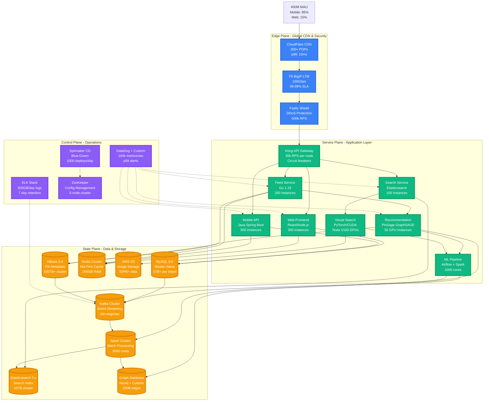

# Pinterest Complete Architecture

## The Visual Discovery Money Shot

Pinterest operates as the world's largest visual discovery platform, serving 450M+ monthly active users with 200B+ pins through a sophisticated visual search and recommendation system built on graph neural networks.

## Production Metrics & Scale

### Performance Characteristics
- **Pin Discovery Feed**: p99 < 150ms (global)
- **Visual Search**: p95 < 300ms (computer vision inference)
- **Pin Save**: p99 < 50ms (write path)
- **Image Upload**: p95 < 2s (including CDN propagation)

### Infrastructure Scale
- **Compute**: 5,000+ EC2 instances (c5.4xlarge - c5.24xlarge)
- **Storage**: 50PB+ in S3, 100TB+ in HBase
- **Network**: 100Gbps backbone, 300+ CDN POPs
- **GPUs**: 200+ Tesla V100s for ML inference

### Business Impact
- **Monthly Cost**: ~$45M infrastructure spend
- **Revenue**: $2.8B annually (2022)
- **Cost per MAU**: ~$8.33/month
- **Ad Revenue per User**: ~$5.20/month

## Critical Production Dependencies

### Core Data Flow
1. **Pin Creation**: User uploads → S3 → Vision AI → Metadata → HBase
2. **Feed Generation**: User request → PinSage GNN → Ranking → Redis cache
3. **Visual Search**: Image query → CNN feature extraction → Similarity search
4. **Shopping Flow**: Product detection → Shopping graph → Recommendation

### Failure Recovery
- **Image CDN**: 99.99% availability with multi-region failover
- **Recommendation**: Graceful degradation to popularity-based ranking
- **Search**: Elasticsearch cluster with cross-region replication
- **Database**: MySQL with 5-second failover, HBase with automatic region balancing

## Real Production Incidents

### October 2022: PinSage Model Corruption
- **Impact**: 30% drop in engagement for 45 minutes
- **Root Cause**: Corrupted model weights during A/B test deployment
- **Resolution**: Automatic rollback to previous model version
- **Learning**: Added model validation checksums

### March 2023: Visual Search Overload
- **Impact**: 200% increase in visual search latency
- **Root Cause**: Viral pin caused 10x traffic spike
- **Resolution**: Auto-scaling GPU instances + circuit breaker
- **Learning**: Added predictive scaling based on pin virality

*Sources: Pinterest Engineering Blog, QCon presentations, SREcon talks*