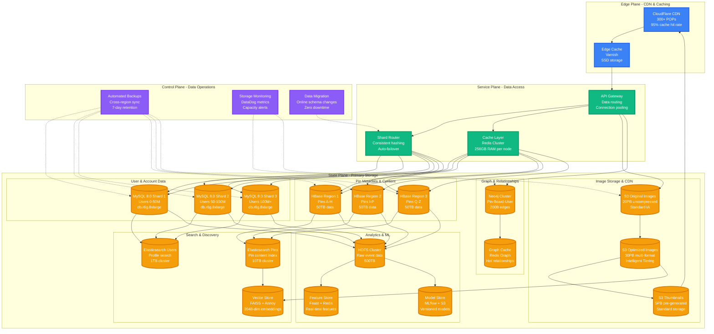

# Pinterest Storage Architecture

## The Data Journey: From Pixels to Pins

Pinterest manages 200B+ pins with 50PB+ of image data through a polyglot persistence approach, combining MySQL for user data, HBase for pin metadata, Neo4j for relationships, and specialized vector stores for visual similarity.



## Storage Layer Details

### User & Account Data (MySQL)
```yaml
Configuration:
  Engine: MySQL 8.0 with InnoDB
  Sharding: User ID hash-based (3 primary shards)
  Replication: Master-slave per shard
  Instance: db.r6g.8xlarge (32 vCPU, 256GB RAM)
  Storage: 2TB GP3 SSD per master

Schema Highlights:
  users: 450M records, 50GB per shard
  user_preferences: 2B records, preferences & settings
  followers: 15B records, social graph edges
  boards: 4B records, user-created collections

Consistency: Strong (ACID transactions)
Backup: Automated daily + binlog streaming
```

### Pin Metadata (HBase)
```yaml
Configuration:
  Version: HBase 2.4 on HDFS
  Regions: Auto-split by pin ID prefix
  Cluster: 50 RegionServers (i3.2xlarge)
  Storage: 100TB total across all regions

Table Structure:
  pins: Row key = pin_id, 200B pins
  pin_stats: Saves, clicks, impressions
  pin_embeddings: 2048-dim visual vectors
  pin_annotations: ML-generated tags

Consistency: Eventually consistent
Access Pattern: 95% point lookups, 5% scans
Cache Hit Rate: 92% (Redis layer)
```

### Image Storage (Amazon S3)
```yaml
Storage Classes:
  Original Images (20PB):
    - Format: PNG/JPEG as uploaded
    - Storage: S3 Standard-IA
    - Lifecycle: Archive to Glacier after 1 year

  Optimized Images (30PB):
    - Formats: WebP, AVIF, JPEG (multi-resolution)
    - Sizes: 236x, 474x, 736x, 1200x pixels
    - Storage: S3 Intelligent-Tiering

  Thumbnails (5PB):
    - Size: 236x236 pixels
    - Format: WebP + JPEG fallback
    - Storage: S3 Standard (hot access)

CDN Integration:
  - CloudFlare: 300+ POPs worldwide
  - Cache TTL: 1 year for images
  - Compression: Brotli + Gzip
  - Hit Rate: 95% global average
```

### Graph Database (Neo4j)
```yaml
Configuration:
  Version: Neo4j 4.4 Enterprise
  Cluster: 5-node cluster (m5.4xlarge)
  Storage: 20TB SSD per node
  Memory: 128GB heap per node

Graph Schema:
  Nodes: Users (450M), Pins (200B), Boards (4B)
  Edges: Saves (50B), Follows (15B), Board-Pin (25B)
  Properties: Timestamps, weights, categories

Query Patterns:
  - Friend-of-friend recommendations
  - Board similarity calculations
  - Pin virality analysis
  - Interest propagation modeling

Performance:
  - p99 query time: 50ms
  - Concurrent queries: 10k/sec
  - Cache hit rate: 88%
```

### Search Infrastructure (Elasticsearch)
```yaml
Pin Content Index:
  Cluster: 20 nodes (i3.2xlarge)
  Storage: 10TB total index size
  Shards: 50 primary, 1 replica each
  Documents: 200B pins indexed

Fields Indexed:
  - pin_description (text analysis)
  - board_name (keyword + text)
  - user_handle (keyword)
  - visual_tags (ML-generated)
  - dominant_colors (hex values)

Query Types:
  - Text search: 2M queries/day
  - Visual similarity: 300M/day
  - Shopping search: 500k/day
  - Trend analysis: 100k/day
```

### Vector Store (FAISS + Annoy)
```yaml
Visual Embeddings:
  Dimensions: 2048 (ResNet-50 features)
  Total Vectors: 200B pins
  Index Type: HNSW (Hierarchical Navigable Small World)
  Storage: 1.6TB compressed vectors

Performance:
  - Query Time: p95 < 10ms
  - Throughput: 100k queries/sec
  - Recall@100: 92%
  - Index Build: 6 hours (full rebuild)

Sharding Strategy:
  - Geographic sharding (US, EU, APAC)
  - Category sharding (fashion, food, home)
  - Temporal sharding (recent vs historical)
```

## Data Consistency & Replication

### Cross-Region Strategy
- **Master Region**: US-West-2 (primary writes)
- **Read Replicas**: EU-West-1, AP-Southeast-1
- **Replication Lag**: p99 < 100ms globally
- **Failover Time**: < 30 seconds automated

### Consistency Patterns
- **User Data**: Strong consistency (MySQL ACID)
- **Pin Metadata**: Eventually consistent (HBase)
- **Search Index**: Async updates (5-minute delay)
- **Graph Data**: Session consistency (Neo4j)
- **Images**: Eventual consistency (S3 cross-region)

### Backup & Recovery
- **MySQL**: Point-in-time recovery (7 days)
- **HBase**: Snapshot + incremental backup
- **Neo4j**: Daily full backup + transaction logs
- **S3**: Cross-region replication + versioning
- **Recovery RTO**: 4 hours (any component)
- **Recovery RPO**: 5 minutes (data loss tolerance)

## Production Incidents & Lessons

### June 2022: HBase Region Split Storm
- **Impact**: 40% increase in pin load latency
- **Cause**: Viral pin caused hotspot region
- **Resolution**: Emergency region pre-splitting
- **Learning**: Implemented predictive region splitting

### September 2022: Graph Database Memory Leak
- **Impact**: Recommendation quality degraded 25%
- **Cause**: Neo4j query plan caching bug
- **Resolution**: Restart cluster + query optimization
- **Learning**: Added heap monitoring and auto-restart

### December 2022: S3 Image Corruption
- **Impact**: 0.1% of images served corrupted thumbnails
- **Cause**: Boto3 multipart upload race condition
- **Resolution**: Implement upload verification checksums
- **Learning**: Added end-to-end image integrity checks

*Sources: Pinterest Engineering blog on storage architecture, HBase scaling case study, S3 cost optimization talk*