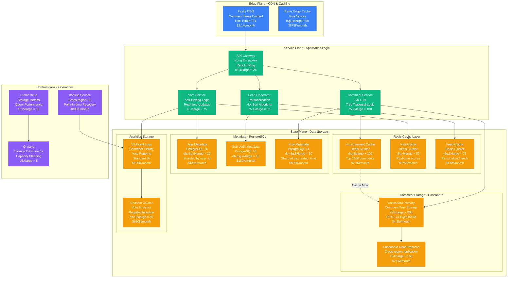
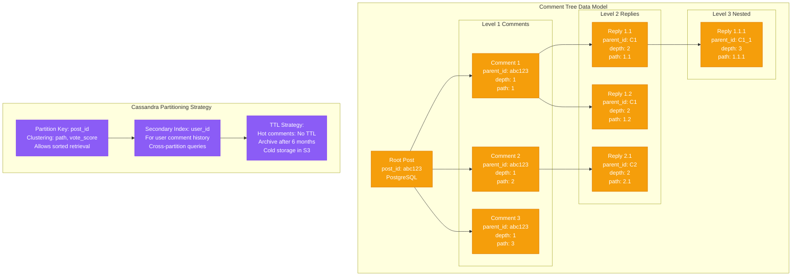
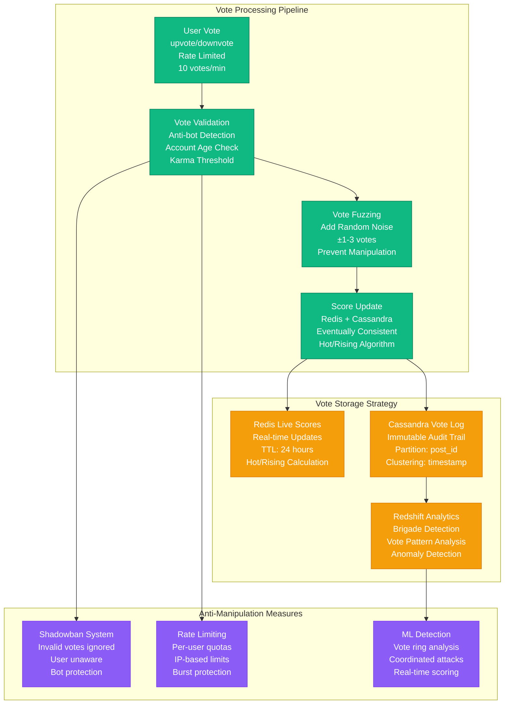
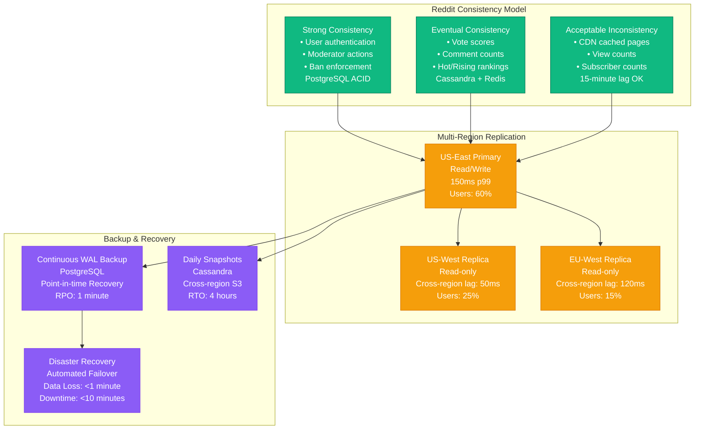

# Reddit Storage Architecture - The Data Journey

Reddit's storage architecture handles the unique challenge of nested comment trees that can grow to thousands of levels deep, while maintaining sub-second read performance for 500M+ monthly active users.

## Complete Storage Architecture

## Comment Tree Storage Strategy

## Vote Storage & Anti-Fuzzing

## Data Consistency & Replication

## Storage Performance Metrics

| Component | Capacity | Performance | Cost |
|-----------|----------|-------------|------|
| **Cassandra Primary** | 2.4 PB raw | 500K writes/sec | $4.2M/month |
| **Cassandra Replicas** | 1.8 PB raw | 2M reads/sec | $2.8M/month |
| **PostgreSQL Shards** | 80 TB total | 150K trans/sec | $1.23M/month |
| **Redis Cache** | 12 TB memory | 5M ops/sec | $4.575M/month |
| **CDN Storage** | 500 TB cached | 50M requests/sec | $2.1M/month |

## Key Storage Innovations

### 1. Materialized Comment Paths
- Pre-computed comment tree paths for fast retrieval
- Avoids recursive queries for nested comments
- Enables efficient pagination at any depth

### 2. Vote Score Fuzzing
- Adds ±1-3 random votes to displayed scores
- Prevents vote manipulation feedback loops
- Real scores stored separately for ranking

### 3. Hot Comment Caching
- Top 1000 comments per post cached in Redis
- Aggressive TTL refresh based on vote velocity
- Reduces Cassandra load by 85%

### 4. Subreddit Data Isolation
- Each subreddit as separate keyspace
- Prevents cross-contamination during brigades
- Enables per-community scaling policies

## Recovery Procedures

### Comment Tree Corruption
1. **Detection**: Orphaned comments, broken paths
2. **Recovery**: Rebuild from vote logs and edit history
3. **Time**: 2-4 hours for large threads
4. **Data Loss**: Comments posted during rebuild window

### Vote Manipulation Attack
1. **Detection**: ML models, vote velocity spikes
2. **Response**: Shadowban participants, recompute scores
3. **Time**: Real-time detection, 15-minute cleanup
4. **Impact**: Temporary ranking distortion

### Database Failover
1. **Primary Failure**: Automatic promotion of replica
2. **Recovery Time**: <10 minutes
3. **Data Loss**: <1 minute of writes
4. **Fallback**: Read-only mode during recovery

This storage architecture handles Reddit's unique challenges of deeply nested comment trees, democratic voting systems, and community-driven moderation while maintaining sub-second performance for hundreds of millions of users.