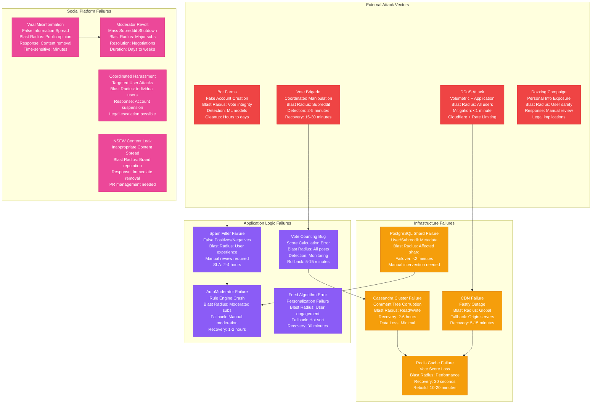
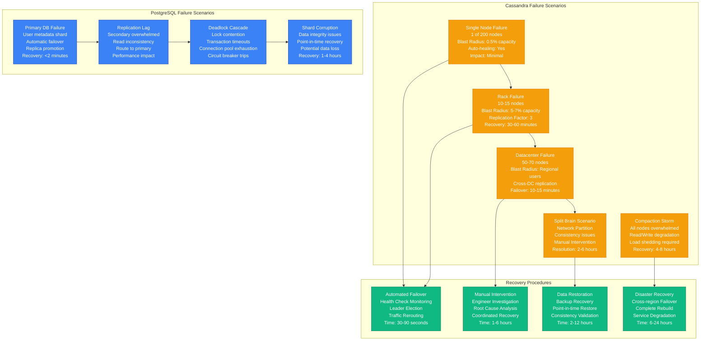
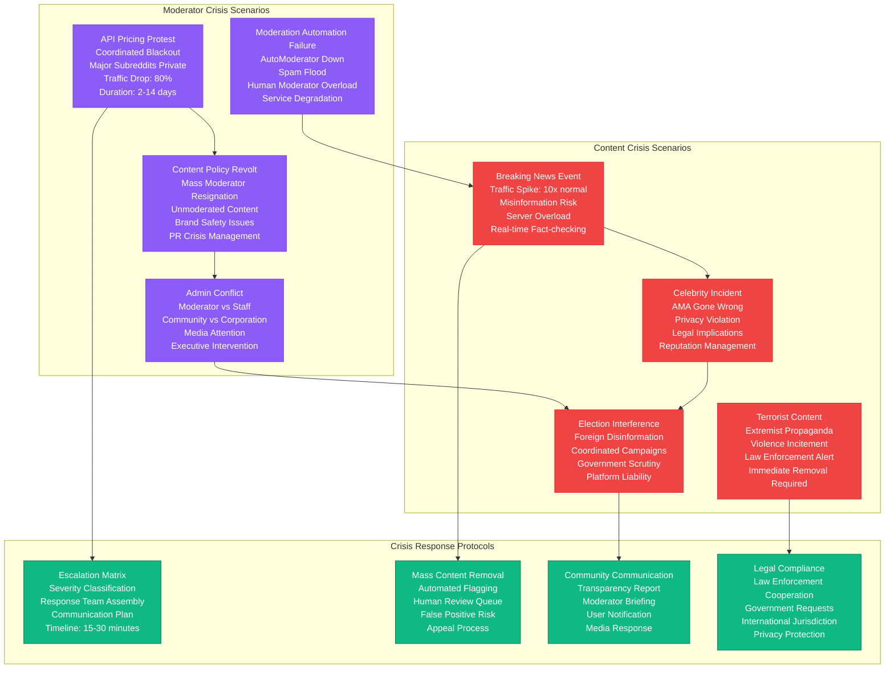

# Reddit Failure Domains - The Incident Map

Reddit's failure domains reflect the unique challenges of community-driven platforms: coordinated attacks, vote manipulation, and the viral spread of misinformation at internet scale.

## Complete Failure Domain Map

## Vote Brigade Attack Scenarios

```mermaid
graph TB
    subgraph BrigadeLifecycle[Vote Brigade Attack Lifecycle]
        COORDINATION[Coordination Phase<br/>Discord/4chan Planning<br/>Target Selection<br/>Account Preparation<br/>Timeline: Hours to days]

        INITIAL_ATTACK[Initial Attack<br/>First Wave Voting<br/>50-200 accounts<br/>Pattern: Rapid votes<br/>Detection: 2-5 minutes]

        AMPLIFICATION[Amplification Phase<br/>Secondary Accounts<br/>500-2000 participants<br/>Cross-subreddit spread<br/>Duration: 30-120 minutes]

        DETECTION[Detection & Response<br/>ML Model Triggers<br/>Vote Pattern Analysis<br/>Shadowban Deployment<br/>Response Time: 5-15 minutes]

        CLEANUP[Cleanup Phase<br/>Vote Recomputation<br/>Account Penalties<br/>Score Restoration<br/>Duration: 15-60 minutes]
    end

    subgraph BrigadeDetection[Brigade Detection System]
        VELOCITY_SPIKE[Vote Velocity Spike<br/>Normal: 10 votes/min<br/>Brigade: 100+ votes/min<br/>Confidence: 95%<br/>Trigger: 3σ deviation]

        ACCOUNT_CLUSTERING[Account Clustering<br/>Similar Creation Times<br/>IP Address Patterns<br/>Behavioral Similarity<br/>ML Confidence: 85%]

        CROSS_PLATFORM[Cross-Platform Signals<br/>Discord Link Sharing<br/>Twitter Coordination<br/>External Traffic Spikes<br/>Correlation Analysis]

        VOTE_PATTERNS[Abnormal Vote Patterns<br/>Uniform Timing<br/>No Comment Engagement<br/>Sequential Voting<br/>Anomaly Score: >0.8]
    end

    subgraph ResponseMeasures[Automated Response Measures]
        SHADOWBAN_WAVE[Mass Shadowban<br/>Participating Accounts<br/>Votes Invalidated<br/>Users Unaware<br/>Duration: 24-72 hours]

        RATE_LIMITING[Enhanced Rate Limiting<br/>Target Subreddit<br/>Reduced Vote Velocity<br/>Temporary Measure<br/>Duration: 2-6 hours]

        SCORE_FREEZE[Score Freeze<br/>Halt Vote Processing<br/>Manual Investigation<br/>Moderator Notification<br/>Duration: 30-120 minutes]

        CONTENT_LOCK[Content Lock<br/>Disable New Comments<br/>Prevent Further Spread<br/>Moderator Override<br/>Manual Unlock Required]
    end

    COORDINATION --> INITIAL_ATTACK
    INITIAL_ATTACK --> AMPLIFICATION
    AMPLIFICATION --> DETECTION
    DETECTION --> CLEANUP

    VELOCITY_SPIKE --> SHADOWBAN_WAVE
    ACCOUNT_CLUSTERING --> RATE_LIMITING
    CROSS_PLATFORM --> SCORE_FREEZE
    VOTE_PATTERNS --> CONTENT_LOCK

    %% Styling
    classDef attackStyle fill:#EF4444,stroke:#DC2626,color:#fff
    classDef detectionStyle fill:#10B981,stroke:#047857,color:#fff
    classDef responseStyle fill:#8B5CF6,stroke:#7C3AED,color:#fff

    class COORDINATION,INITIAL_ATTACK,AMPLIFICATION attackStyle
    class DETECTION,CLEANUP,VELOCITY_SPIKE,ACCOUNT_CLUSTERING,CROSS_PLATFORM,VOTE_PATTERNS detectionStyle
    class SHADOWBAN_WAVE,RATE_LIMITING,SCORE_FREEZE,CONTENT_LOCK responseStyle
```

## Database Failure Scenarios

## Social Platform Crisis Scenarios

## Historical Failure Analysis

## Major Incidents & Lessons Learned

### 2023 API Pricing Protest
- **Trigger**: API pricing changes affecting third-party apps
- **Impact**: 8,000+ subreddits went private, 90% traffic drop
- **Duration**: 14 days of coordinated blackout
- **Resolution**: Policy modifications, improved communication
- **Lessons**: Community governance essential, API strategy alignment

### 2021 WallStreetBets GME Incident
- **Trigger**: GameStop stock manipulation coordination
- **Impact**: 10x traffic surge, media attention, regulatory scrutiny
- **Technical**: Cassandra overload, vote manipulation detection failure
- **Resolution**: Enhanced monitoring, content policies
- **Lessons**: Financial content requires special handling

### 2020 Election Misinformation
- **Trigger**: Coordinated disinformation campaigns
- **Impact**: Democratic process integrity concerns
- **Response**: Real-time fact-checking, account suspensions
- **Result**: Improved ML detection, human review capacity
- **Lessons**: Political content needs proactive monitoring

### 2019 Christchurch Shooting
- **Trigger**: Live-streamed terrorist attack content sharing
- **Impact**: Global platform responsibility questions
- **Response**: Immediate content removal, law enforcement cooperation
- **Timeline**: <30 minutes detection and removal
- **Lessons**: Crisis response protocols essential

## Failure Domain Metrics

| Failure Type | MTTR | MTBF | Blast Radius | Cost Impact |
|--------------|------|------|--------------|-------------|
| **Vote Brigade** | 15 min | 2-3/week | Single post/subreddit | $50K reputation |
| **Cassandra Node** | 30 min | 1/month | 0.5% capacity | $25K/hour |
| **PostgreSQL Shard** | 2 min | 1/quarter | Affected users | $100K/hour |
| **CDN Failure** | 10 min | 1/year | Global | $500K/hour |
| **Moderator Crisis** | 2-14 days | 1/year | Major subreddits | $10M+ brand |
| **Content Crisis** | 30 min | 1/month | Public perception | $1M+ legal/PR |

## Prevention & Mitigation

### Technical Defenses
- **Rate Limiting**: Per-user, per-IP, per-subreddit quotas
- **ML Detection**: Real-time anomaly detection for voting patterns
- **Circuit Breakers**: Automatic service protection during overload
- **Chaos Engineering**: Regular failure injection testing

### Social Defenses
- **Community Guidelines**: Clear content policies with examples
- **Moderator Training**: Crisis response procedures and escalation
- **Transparency Reports**: Regular communication about enforcement
- **Appeal Processes**: Fair review system for moderation decisions

### Operational Defenses
- **24/7 Monitoring**: Real-time alerting for all failure domains
- **Incident Response**: Practiced runbooks for common scenarios
- **Crisis Communication**: Pre-approved templates for fast response
- **Legal Preparedness**: Relationships with law enforcement agencies

Reddit's failure domains uniquely combine technical infrastructure challenges with social platform responsibilities, requiring both robust engineering and nuanced community management at global scale.