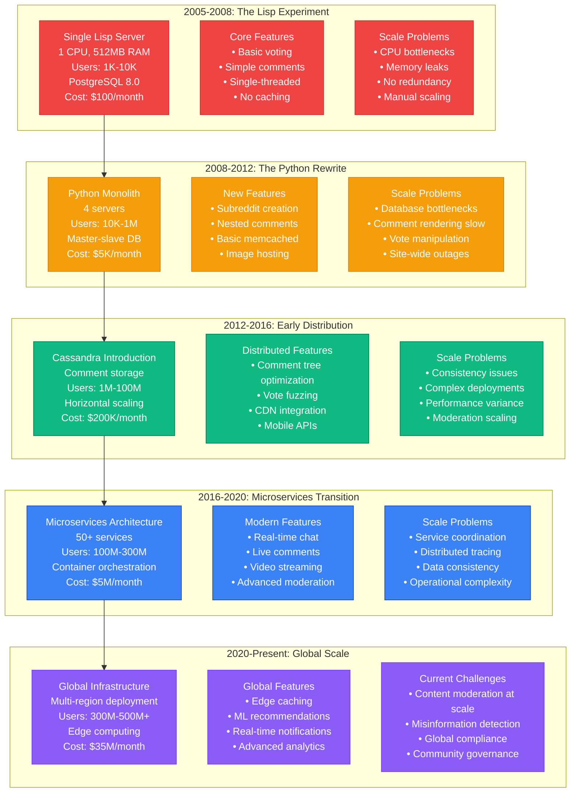
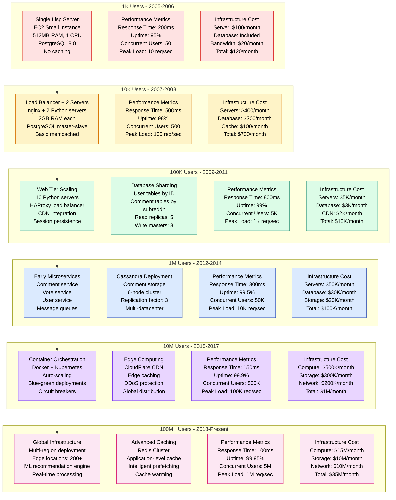

# Reddit Scale Evolution - The Growth Story

Reddit's evolution from a Lisp experiment in 2005 to serving 500M+ monthly users reveals the architectural transformations required to scale a community-driven platform.

## Complete Scale Evolution Timeline



## Architecture Evolution by User Scale



## Breaking Points & Solutions

```mermaid
graph TB
    subgraph BreakingPoint1[Breaking Point: 10K Users (2008)]
        PROBLEM_1[The Digg Effect<br/>Traffic Spikes: 50x normal<br/>Single server overwhelmed<br/>Response time: 30+ seconds<br/>Frequent downtime]

        SOLUTION_1[Solution: Load Balancing<br/>HAProxy introduction<br/>2-server setup<br/>Database read replicas<br/>Basic caching layer]

        IMPACT_1[Impact<br/>Response time: 500ms<br/>Uptime: 95% → 98%<br/>Cost increase: 6x<br/>Development complexity: 2x]
    end

    subgraph BreakingPoint2[Breaking Point: 100K Users (2010)]
        PROBLEM_2[Comment Rendering Crisis<br/>Nested comments: 1000+ levels<br/>Recursive SQL queries<br/>Database locks<br/>Page load: 5-15 seconds]

        SOLUTION_2[Solution: Comment Optimization<br/>Materialized paths<br/>Pagination limits<br/>Async rendering<br/>Comment caching]

        IMPACT_2[Impact<br/>Comment load: <1 second<br/>Database load: -70%<br/>User engagement: +40%<br/>Development time: 6 months]
    end

    subgraph BreakingPoint3[Breaking Point: 1M Users (2012)]
        PROBLEM_3[PostgreSQL Limits<br/>Write bottlenecks<br/>Lock contention<br/>Backup windows: 6+ hours<br/>Single point of failure]

        SOLUTION_3[Solution: Cassandra Migration<br/>Comment storage migration<br/>Eventual consistency<br/>Horizontal scaling<br/>Multi-datacenter replication]

        IMPACT_3[Impact<br/>Write capacity: 10x<br/>Read performance: 5x<br/>Operational complexity: 3x<br/>Migration time: 18 months]
    end

    subgraph BreakingPoint4[Breaking Point: 10M Users (2015)]
        PROBLEM_4[Monolith Deployment<br/>Deploy time: 2+ hours<br/>Rollback complexity<br/>Feature coupling<br/>Team scaling issues]

        SOLUTION_4[Solution: Microservices<br/>Service decomposition<br/>Independent deployments<br/>API versioning<br/>Circuit breakers]

        IMPACT_4[Impact<br/>Deploy time: 15 minutes<br/>Team velocity: 3x<br/>Service reliability: 99.9%<br/>Operational overhead: 2x]
    end

    subgraph BreakingPoint5[Breaking Point: 100M Users (2018)]
        PROBLEM_5[Global Performance<br/>Latency: 2+ seconds globally<br/>Regional failures<br/>Content delivery slow<br/>Mobile performance poor]

        SOLUTION_5[Solution: Edge Infrastructure<br/>Global CDN deployment<br/>Regional data centers<br/>Edge computing<br/>Mobile optimization]

        IMPACT_5[Impact<br/>Global latency: <200ms<br/>Mobile performance: 5x<br/>Infrastructure cost: +400%<br/>Availability: 99.95%]
    end

    PROBLEM_1 --> SOLUTION_1
    SOLUTION_1 --> IMPACT_1
    PROBLEM_2 --> SOLUTION_2
    SOLUTION_2 --> IMPACT_2
    PROBLEM_3 --> SOLUTION_3
    SOLUTION_3 --> IMPACT_3
    PROBLEM_4 --> SOLUTION_4
    SOLUTION_4 --> IMPACT_4
    PROBLEM_5 --> SOLUTION_5
    SOLUTION_5 --> IMPACT_5

    %% Styling
    classDef problemStyle fill:#FEE2E2,stroke:#DC2626,color:#000
    classDef solutionStyle fill:#DCFCE7,stroke:#047857,color:#000
    classDef impactStyle fill:#DBEAFE,stroke:#1E40AF,color:#000

    class PROBLEM_1,PROBLEM_2,PROBLEM_3,PROBLEM_4,PROBLEM_5 problemStyle
    class SOLUTION_1,SOLUTION_2,SOLUTION_3,SOLUTION_4,SOLUTION_5 solutionStyle
    class IMPACT_1,IMPACT_2,IMPACT_3,IMPACT_4,IMPACT_5 impactStyle
```

## Technology Evolution Timeline

```mermaid
graph TB
    subgraph TechEvolution[Technology Stack Evolution]
        LANG_EVOLUTION[Programming Languages<br/>2005: Common Lisp<br/>2008: Python 2.5<br/>2012: Python 2.7<br/>2016: Go services<br/>2020: Python 3.8+]

        DB_EVOLUTION[Database Evolution<br/>2005: PostgreSQL 8.0<br/>2010: Master-slave setup<br/>2012: Cassandra introduction<br/>2015: Redis clusters<br/>2020: Multi-modal storage]

        INFRA_EVOLUTION[Infrastructure Evolution<br/>2005: Single server<br/>2008: Load balancers<br/>2012: Cloud migration<br/>2016: Kubernetes<br/>2020: Multi-cloud edge]

        CACHE_EVOLUTION[Caching Evolution<br/>2005: No caching<br/>2008: Memcached<br/>2012: Redis<br/>2016: Application cache<br/>2020: Edge caching]

        DEPLOY_EVOLUTION[Deployment Evolution<br/>2005: FTP uploads<br/>2008: rsync scripts<br/>2012: Chef automation<br/>2016: Docker containers<br/>2020: GitOps CI/CD]
    end

    subgraph PerformanceMetrics[Performance Metrics Over Time]
        RESPONSE_TIME[Response Time Evolution<br/>2005: 200ms (1K users)<br/>2008: 500ms (10K users)<br/>2012: 300ms (1M users)<br/>2016: 150ms (10M users)<br/>2020: 100ms (500M users)]

        UPTIME[Uptime Evolution<br/>2005: 95% (manual restarts)<br/>2008: 98% (redundancy)<br/>2012: 99% (automation)<br/>2016: 99.5% (monitoring)<br/>2020: 99.95% (chaos eng)]

        CAPACITY[Capacity Evolution<br/>2005: 10 req/sec<br/>2008: 100 req/sec<br/>2012: 10K req/sec<br/>2016: 100K req/sec<br/>2020: 1M req/sec]

        STORAGE[Storage Evolution<br/>2005: 100MB<br/>2008: 10GB<br/>2012: 1TB<br/>2016: 100TB<br/>2020: 10PB+]
    end

    LANG_EVOLUTION --> RESPONSE_TIME
    DB_EVOLUTION --> UPTIME
    INFRA_EVOLUTION --> CAPACITY
    CACHE_EVOLUTION --> STORAGE

    %% Styling
    classDef techStyle fill:#E9D5FF,stroke:#7C3AED,color:#000
    classDef perfStyle fill:#FEF3C7,stroke:#D97706,color:#000

    class LANG_EVOLUTION,DB_EVOLUTION,INFRA_EVOLUTION,CACHE_EVOLUTION,DEPLOY_EVOLUTION techStyle
    class RESPONSE_TIME,UPTIME,CAPACITY,STORAGE perfStyle
```

## Key Architectural Milestones

### 2005: The Bootstrap Era
- **Technology**: Common Lisp on single server
- **Users**: 1,000 early adopters
- **Key Innovation**: Simple voting algorithm
- **Architecture**: Monolithic web application
- **Limitations**: Single point of failure, no caching

### 2008: The Python Transition
- **Technology**: Python/Django web framework
- **Users**: 10,000 growing community
- **Key Innovation**: Subreddit creation, user-generated communities
- **Architecture**: Load-balanced web servers
- **Breakthrough**: Community-driven content organization

### 2012: The Distribution Era
- **Technology**: Cassandra for comment storage
- **Users**: 1 million registered users
- **Key Innovation**: Materialized comment paths, vote fuzzing
- **Architecture**: Microservices for core functions
- **Challenge**: Consistency vs. availability trade-offs

### 2016: The Container Era
- **Technology**: Kubernetes orchestration
- **Users**: 10 million monthly actives
- **Key Innovation**: Auto-scaling, circuit breakers
- **Architecture**: Full microservices with service mesh
- **Focus**: Operational excellence and reliability

### 2020: The Global Era
- **Technology**: Edge computing and ML
- **Users**: 500 million monthly actives
- **Key Innovation**: Real-time personalization, global distribution
- **Architecture**: Multi-region, multi-cloud deployment
- **Challenge**: Content moderation at internet scale

## Scaling Lessons Learned

### 1. Community-First Architecture
- Technical decisions must support community needs
- Moderation tools scale with user growth
- Democratic features (voting) require anti-manipulation measures
- Content organization (subreddits) enables horizontal scaling

### 2. Data Model Evolution
- Comment trees require specialized storage strategies
- Vote scores need real-time updates with consistency relaxation
- User-generated content grows exponentially, not linearly
- Historical data becomes valuable analytics asset

### 3. Performance vs. Features Trade-offs
- Real-time features conflict with caching strategies
- Personalization increases computational complexity
- Global distribution requires data locality decisions
- Mobile performance demands different optimization priorities

### 4. Operational Complexity Management
- Monitoring complexity grows quadratically with services
- Incident response requires specialized social platform knowledge
- Content policies require technical implementation
- Community management needs technical platform support

## Scale Evolution Metrics

| Year | Users | Servers | Response Time | Uptime | Monthly Cost |
|------|-------|---------|---------------|--------|--------------|
| **2005** | 1K | 1 | 200ms | 95% | $120 |
| **2008** | 10K | 3 | 500ms | 98% | $700 |
| **2011** | 100K | 15 | 800ms | 99% | $10K |
| **2014** | 1M | 50 | 300ms | 99.5% | $100K |
| **2017** | 10M | 200 | 150ms | 99.9% | $1M |
| **2020** | 100M | 1000+ | 100ms | 99.95% | $10M |
| **2024** | 500M+ | 5000+ | 75ms | 99.98% | $35M |

## Future Scaling Challenges

### Technical Challenges
- **AI/ML Integration**: Real-time content analysis at scale
- **Global Compliance**: Different regulations per region
- **Real-time Features**: Live video, instant messaging
- **Edge Computing**: Computation closer to users

### Social Challenges
- **Misinformation**: Detection and prevention at scale
- **Content Moderation**: AI + human hybrid approaches
- **Community Governance**: Democratic processes in digital spaces
- **Cultural Sensitivity**: Global platform, local values

### Business Challenges
- **Monetization**: Revenue without compromising user experience
- **Competition**: Platform differentiation in crowded market
- **Regulation**: Government oversight and compliance
- **Sustainability**: Infrastructure cost optimization

Reddit's scale evolution demonstrates that social platforms face unique challenges combining technical infrastructure with community dynamics, requiring architectural decisions that support both system performance and human behavior at internet scale.