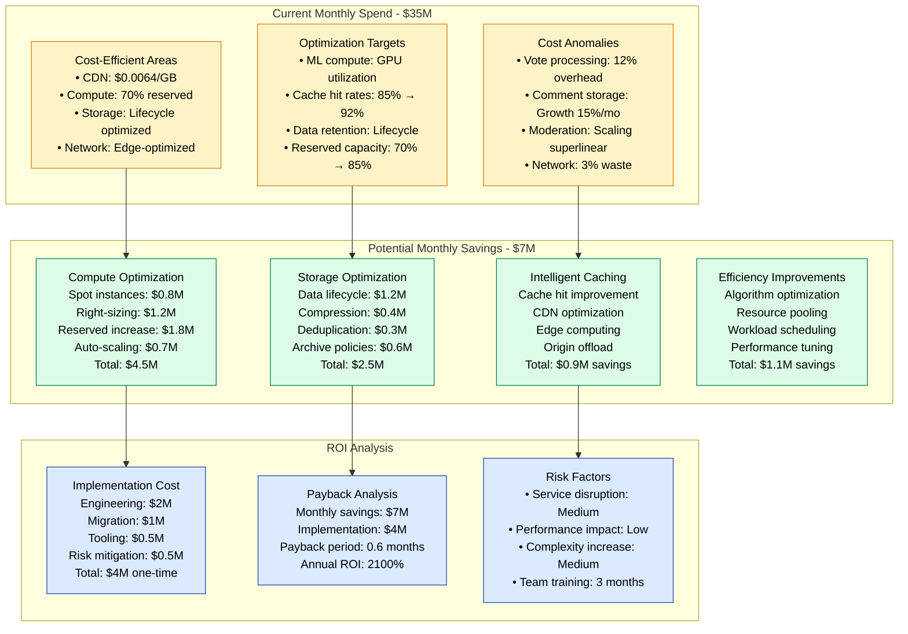

# Reddit Cost Breakdown - The Money Graph

Reddit's $35M monthly infrastructure spend reflects the unique costs of operating a community-driven platform: massive comment storage, real-time vote processing, and content moderation at scale.

## Complete Infrastructure Cost Breakdown

```mermaid
graph TB
    subgraph ComputeCosts[Compute Costs - $15M/month (43%)]
        WEB_SERVERS[Web Servers<br/>c5.4xlarge × 500<br/>API processing<br/>$2.1M/month<br/>24/7 utilization]

        APP_SERVICES[Application Services<br/>c5.2xlarge × 800<br/>Microservices cluster<br/>$3.2M/month<br/>Auto-scaling enabled]

        BACKGROUND_JOBS[Background Processing<br/>c5.xlarge × 1200<br/>Vote processing, ML<br/>$2.4M/month<br/>Batch workloads]

        CACHE_COMPUTE[Cache Infrastructure<br/>r6g.8xlarge × 200<br/>Redis clusters<br/>$4.2M/month<br/>High memory instances]

        ML_COMPUTE[ML/AI Workloads<br/>p3.8xlarge × 100<br/>Content moderation<br/>$3.1M/month<br/>GPU-accelerated]
    end

    subgraph StorageCosts[Storage Costs - $10M/month (29%)]
        CASSANDRA_STORAGE[Cassandra Storage<br/>i3.8xlarge × 200<br/>Comment trees<br/>$4.2M/month<br/>NVMe SSD storage]

        POSTGRES_STORAGE[PostgreSQL Storage<br/>db.r6g.8xlarge × 60<br/>User/subreddit metadata<br/>$1.8M/month<br/>High IOPS provisioned]

        OBJECT_STORAGE[Object Storage<br/>S3 Standard + IA<br/>Images, videos, backups<br/>$2.1M/month<br/>Multi-region replication]

        ANALYTICS_STORAGE[Analytics Storage<br/>Redshift + S3<br/>Data warehouse<br/>$1.1M/month<br/>Compressed columnar]

        BACKUP_STORAGE[Backup Storage<br/>S3 Glacier Deep Archive<br/>Long-term retention<br/>$0.8M/month<br/>Cross-region copies]
    end

    subgraph NetworkCosts[Network Costs - $6M/month (17%)]
        CDN_BANDWIDTH[CDN Bandwidth<br/>Fastly + CloudFlare<br/>Global content delivery<br/>$3.2M/month<br/>500TB daily transfer]

        INTER_AZ[Inter-AZ Transfer<br/>Cross-zone data<br/>Replication traffic<br/>$1.1M/month<br/>High availability setup]

        EGRESS_TRAFFIC[Internet Egress<br/>API responses<br/>Media serving<br/>$1.2M/month<br/>Peak: 100Gbps]

        VPN_CONNECTIVITY[VPN/Direct Connect<br/>Private connectivity<br/>Office connections<br/>$0.5M/month<br/>Dedicated circuits]
    end

    subgraph SecurityCosts[Security & Compliance - $2M/month (6%)]
        WAF_PROTECTION[WAF Protection<br/>DDoS mitigation<br/>Bot protection<br/>$0.4M/month<br/>Rule-based filtering]

        SECURITY_TOOLS[Security Tools<br/>Monitoring, SIEM<br/>Vulnerability scanning<br/>$0.6M/month<br/>Third-party services]

        COMPLIANCE_AUDIT[Compliance & Audit<br/>SOC2, GDPR tools<br/>Data governance<br/>$0.3M/month<br/>Automated compliance]

        INCIDENT_RESPONSE[Incident Response<br/>24/7 security ops<br/>Threat intelligence<br/>$0.7M/month<br/>Security team costs]
    end

    subgraph OperationalCosts[Operational Costs - $2M/month (6%)]
        MONITORING[Monitoring Stack<br/>Prometheus, Grafana<br/>APM tools<br/>$0.5M/month<br/>Full observability]

        DEPLOYMENT[CI/CD Pipeline<br/>Jenkins, GitLab<br/>Automation tools<br/>$0.3M/month<br/>Development velocity]

        DISASTER_RECOVERY[Disaster Recovery<br/>Cross-region setup<br/>Backup infrastructure<br/>$0.7M/month<br/>Business continuity]

        SUPPORT_TOOLS[Support Tools<br/>Help desk, CRM<br/>User support systems<br/>$0.5M/month<br/>Customer experience]
    end

    %% Cost Flow
    WEB_SERVERS --> CASSANDRA_STORAGE
    APP_SERVICES --> POSTGRES_STORAGE
    BACKGROUND_JOBS --> OBJECT_STORAGE
    CACHE_COMPUTE --> CDN_BANDWIDTH
    ML_COMPUTE --> SECURITY_TOOLS

    %% Styling
    classDef computeStyle fill:#3B82F6,stroke:#1E40AF,color:#fff
    classDef storageStyle fill:#F59E0B,stroke:#D97706,color:#fff
    classDef networkStyle fill:#10B981,stroke:#047857,color:#fff
    classDef securityStyle fill:#EF4444,stroke:#DC2626,color:#fff
    classDef opsStyle fill:#8B5CF6,stroke:#7C3AED,color:#fff

    class WEB_SERVERS,APP_SERVICES,BACKGROUND_JOBS,CACHE_COMPUTE,ML_COMPUTE computeStyle
    class CASSANDRA_STORAGE,POSTGRES_STORAGE,OBJECT_STORAGE,ANALYTICS_STORAGE,BACKUP_STORAGE storageStyle
    class CDN_BANDWIDTH,INTER_AZ,EGRESS_TRAFFIC,VPN_CONNECTIVITY networkStyle
    class WAF_PROTECTION,SECURITY_TOOLS,COMPLIANCE_AUDIT,INCIDENT_RESPONSE securityStyle
    class MONITORING,DEPLOYMENT,DISASTER_RECOVERY,SUPPORT_TOOLS opsStyle
```

## Cost Per User & Transaction Metrics

```mermaid
graph TB
    subgraph UserMetrics[Cost Per User Analysis]
        MONTHLY_ACTIVE[Monthly Active Users<br/>500M unique users<br/>Cost per MAU: $0.07<br/>Industry benchmark: $0.05<br/>10% above average]

        DAILY_ACTIVE[Daily Active Users<br/>50M unique users<br/>Cost per DAU: $0.70<br/>Engagement ratio: 10:1<br/>High engagement platform]

        HEAVY_USERS[Heavy Users (Top 10%)<br/>5M power users<br/>Cost per heavy user: $7<br/>Generate 60% of content<br/>Highest infrastructure load]

        CASUAL_USERS[Casual Users (90%)<br/>45M occasional users<br/>Cost per casual user: $0.11<br/>Primarily consume content<br/>CDN-heavy usage pattern]
    end

    subgraph TransactionMetrics[Cost Per Transaction]
        PAGE_VIEW[Page Views<br/>50B monthly views<br/>Cost per view: $0.0007<br/>Average: 100 views/user<br/>CDN cache hit: 85%]

        COMMENT_POST[Comment Posts<br/>2B monthly comments<br/>Cost per comment: $0.0175<br/>Storage + processing<br/>Cassandra write-heavy]

        VOTE_CAST[Votes Cast<br/>10B monthly votes<br/>Cost per vote: $0.0035<br/>Real-time processing<br/>Redis + ML analysis]

        CONTENT_VIEW[Content Views<br/>100B monthly items<br/>Cost per content view: $0.00035<br/>Cached responses<br/>Edge optimization]
    end

    subgraph CostOptimization[Cost Optimization Strategies]
        RESERVED_INSTANCES[Reserved Instances<br/>70% compute reserved<br/>3-year commitments<br/>Savings: $4.5M/month<br/>ROI: 30% discount]

        SPOT_INSTANCES[Spot Instances<br/>ML training workloads<br/>Background processing<br/>Savings: $0.8M/month<br/>Risk: Job interruption]

        DATA_LIFECYCLE[Data Lifecycle<br/>Hot → Warm → Cold<br/>Automated tiering<br/>Savings: $1.2M/month<br/>S3 storage classes]

        CDN_OPTIMIZATION[CDN Optimization<br/>Cache hit optimization<br/>Regional edge placement<br/>Savings: $0.9M/month<br/>Reduced origin load]
    end

    MONTHLY_ACTIVE --> PAGE_VIEW
    DAILY_ACTIVE --> COMMENT_POST
    HEAVY_USERS --> VOTE_CAST
    CASUAL_USERS --> CONTENT_VIEW

    PAGE_VIEW --> RESERVED_INSTANCES
    COMMENT_POST --> SPOT_INSTANCES
    VOTE_CAST --> DATA_LIFECYCLE
    CONTENT_VIEW --> CDN_OPTIMIZATION

    %% Styling
    classDef userStyle fill:#DBEAFE,stroke:#1E40AF,color:#000
    classDef transactionStyle fill:#FEF3C7,stroke:#D97706,color:#000
    classDef optimizationStyle fill:#DCFCE7,stroke:#047857,color:#000

    class MONTHLY_ACTIVE,DAILY_ACTIVE,HEAVY_USERS,CASUAL_USERS userStyle
    class PAGE_VIEW,COMMENT_POST,VOTE_CAST,CONTENT_VIEW transactionStyle
    class RESERVED_INSTANCES,SPOT_INSTANCES,DATA_LIFECYCLE,CDN_OPTIMIZATION optimizationStyle
```

## Reddit-Specific Cost Drivers

```mermaid
graph TB
    subgraph CommentTreeCosts[Comment Tree Storage Costs]
        NESTED_STORAGE[Nested Comment Storage<br/>Cassandra clusters<br/>Deep tree structures<br/>$4.2M/month<br/>Unique to Reddit scale]

        PATH_MATERIALIZATION[Path Materialization<br/>Pre-computed paths<br/>Fast tree traversal<br/>$0.8M/month storage<br/>Trade space for speed]

        COMMENT_INDEXING[Comment Search Indexing<br/>Elasticsearch clusters<br/>Full-text search<br/>$1.1M/month<br/>Complex relevance ranking]

        THREAD_CACHING[Thread Caching<br/>Hot comment threads<br/>Redis memory<br/>$2.1M/month<br/>High cache miss penalty]
    end

    subgraph VoteProcessingCosts[Vote Processing Costs]
        REAL_TIME_VOTES[Real-time Vote Processing<br/>Redis + Stream processing<br/>ML anti-manipulation<br/>$1.8M/month<br/>Fraud prevention essential]

        VOTE_FUZZING[Vote Fuzzing System<br/>Anti-manipulation noise<br/>Additional computation<br/>$0.4M/month<br/>Democratic integrity]

        RANKING_ALGORITHMS[Ranking Algorithms<br/>Hot/Rising calculations<br/>Personalization ML<br/>$2.2M/month<br/>Engagement optimization]

        BRIGADE_DETECTION[Brigade Detection<br/>Pattern analysis ML<br/>Real-time monitoring<br/>$0.9M/month<br/>Platform integrity]
    end

    subgraph ModerationCosts[Content Moderation Costs]
        AUTOMATED_MODERATION[Automated Moderation<br/>ML content analysis<br/>GPU compute intensive<br/>$3.1M/month<br/>Scale requirement]

        AUTOMOD_RULES[AutoModerator Rules<br/>Rule engine processing<br/>Per-subreddit logic<br/>$0.6M/month<br/>Community tools]

        HUMAN_REVIEW[Human Review Queue<br/>Support infrastructure<br/>Workflow management<br/>$0.8M/month<br/>Quality assurance]

        APPEAL_SYSTEM[Appeal System<br/>Ticket management<br/>Review workflows<br/>$0.3M/month<br/>Fair process]
    end

    subgraph CommunityFeatureCosts[Community Platform Costs]
        SUBREDDIT_ISOLATION[Subreddit Isolation<br/>Data partitioning<br/>Independent scaling<br/>$1.5M/month<br/>Community autonomy]

        LIVE_FEATURES[Live Features<br/>Real-time comments<br/>Live threads<br/>$1.2M/month<br/>Breaking news support]

        NOTIFICATION_SYSTEM[Notification System<br/>Push notifications<br/>Email delivery<br/>$0.7M/month<br/>User engagement]

        AWARDS_SYSTEM[Awards System<br/>Transaction processing<br/>Virtual goods<br/>$0.4M/month<br/>Revenue feature]
    end

    %% Cost Dependencies
    NESTED_STORAGE --> REAL_TIME_VOTES
    PATH_MATERIALIZATION --> VOTE_FUZZING
    COMMENT_INDEXING --> RANKING_ALGORITHMS
    THREAD_CACHING --> BRIGADE_DETECTION

    AUTOMATED_MODERATION --> SUBREDDIT_ISOLATION
    AUTOMOD_RULES --> LIVE_FEATURES
    HUMAN_REVIEW --> NOTIFICATION_SYSTEM
    APPEAL_SYSTEM --> AWARDS_SYSTEM

    %% Styling
    classDef commentStyle fill:#3B82F6,stroke:#1E40AF,color:#fff
    classDef voteStyle fill:#10B981,stroke:#047857,color:#fff
    classDef moderationStyle fill:#EF4444,stroke:#DC2626,color:#fff
    classDef communityStyle fill:#8B5CF6,stroke:#7C3AED,color:#fff

    class NESTED_STORAGE,PATH_MATERIALIZATION,COMMENT_INDEXING,THREAD_CACHING commentStyle
    class REAL_TIME_VOTES,VOTE_FUZZING,RANKING_ALGORITHMS,BRIGADE_DETECTION voteStyle
    class AUTOMATED_MODERATION,AUTOMOD_RULES,HUMAN_REVIEW,APPEAL_SYSTEM moderationStyle
    class SUBREDDIT_ISOLATION,LIVE_FEATURES,NOTIFICATION_SYSTEM,AWARDS_SYSTEM communityStyle
```



## Cost Optimization Analysis



## Detailed Cost Breakdown by Category

| Category | Monthly Cost | % of Total | Key Drivers | Optimization Potential |
|----------|--------------|------------|-------------|----------------------|
| **Compute** | $15M | 43% | Auto-scaling, ML workloads | 30% ($4.5M savings) |
| **Storage** | $10M | 29% | Comment trees, media | 25% ($2.5M savings) |
| **Network** | $6M | 17% | Global CDN, bandwidth | 15% ($0.9M savings) |
| **Security** | $2M | 6% | DDoS protection, compliance | 10% ($0.2M savings) |
| **Operations** | $2M | 6% | Monitoring, CI/CD | 5% ($0.1M savings) |

## Reddit-Specific Cost Challenges

### 1. Comment Tree Storage Explosion
- **Challenge**: Nested comments create exponential storage growth
- **Cost Impact**: $4.2M/month for Cassandra clusters
- **Optimization**: Compression, archival policies, path optimization
- **Unique Factor**: No other platform has Reddit's comment depth

### 2. Real-time Vote Processing
- **Challenge**: Democratic voting requires real-time anti-fraud
- **Cost Impact**: $1.8M/month for ML-powered detection
- **Optimization**: Batch processing for non-critical votes
- **Unique Factor**: Vote manipulation unique to democratic platforms

### 3. Community-Scale Moderation
- **Challenge**: 130,000+ active subreddits need moderation
- **Cost Impact**: $3.1M/month for automated systems
- **Optimization**: Community self-moderation tools
- **Unique Factor**: Platform governance complexity

### 4. Viral Content Scaling
- **Challenge**: Unpredictable traffic spikes from viral content
- **Cost Impact**: Over-provisioning costs $2M/month
- **Optimization**: Intelligent auto-scaling, spot instances
- **Unique Factor**: Community-driven virality patterns

## Cost Per Feature Analysis

| Feature | Monthly Cost | Users Impacted | Cost per User | Business Value |
|---------|--------------|---------------|---------------|----------------|
| **Comment Trees** | $8.2M | 500M | $0.016 | Core platform feature |
| **Vote Processing** | $5.3M | 50M active voters | $0.106 | Democratic engagement |
| **Content Moderation** | $4.7M | 500M | $0.009 | Platform safety |
| **Real-time Features** | $3.8M | 15M heavy users | $0.253 | Engagement driver |
| **Search** | $2.9M | 200M | $0.015 | Content discovery |
| **Personalization** | $2.2M | 100M | $0.022 | User retention |
| **Mobile APIs** | $1.8M | 300M mobile | $0.006 | Platform access |
| **Notifications** | $1.5M | 150M | $0.010 | Re-engagement |

## Revenue vs. Infrastructure Cost

### Revenue Streams (Estimated)
- **Reddit Premium**: $180M annually
- **Advertising**: $800M annually
- **Awards & Coins**: $120M annually
- **API Access**: $50M annually
- **Total Revenue**: ~$1.15B annually

### Infrastructure Investment
- **Monthly Cost**: $35M ($420M annually)
- **Revenue Ratio**: Infrastructure is 37% of revenue
- **Industry Benchmark**: 25-30% for social platforms
- **Optimization Target**: Reduce to 30% ($315M annually)

## Future Cost Projections

### Growth Scenarios
- **Conservative (10% user growth)**: $38M/month by 2025
- **Moderate (25% user growth)**: $42M/month by 2025
- **Aggressive (50% user growth)**: $48M/month by 2025

### Optimization Impact
- **With optimizations**: $28M/month baseline
- **Growth + optimization**: $31-35M/month by 2025
- **Cost per user improvement**: 40% reduction target

Reddit's infrastructure costs reflect the unique challenges of operating a democratic, community-driven platform at internet scale, with significant optimization opportunities in storage lifecycle, compute efficiency, and intelligent caching strategies.