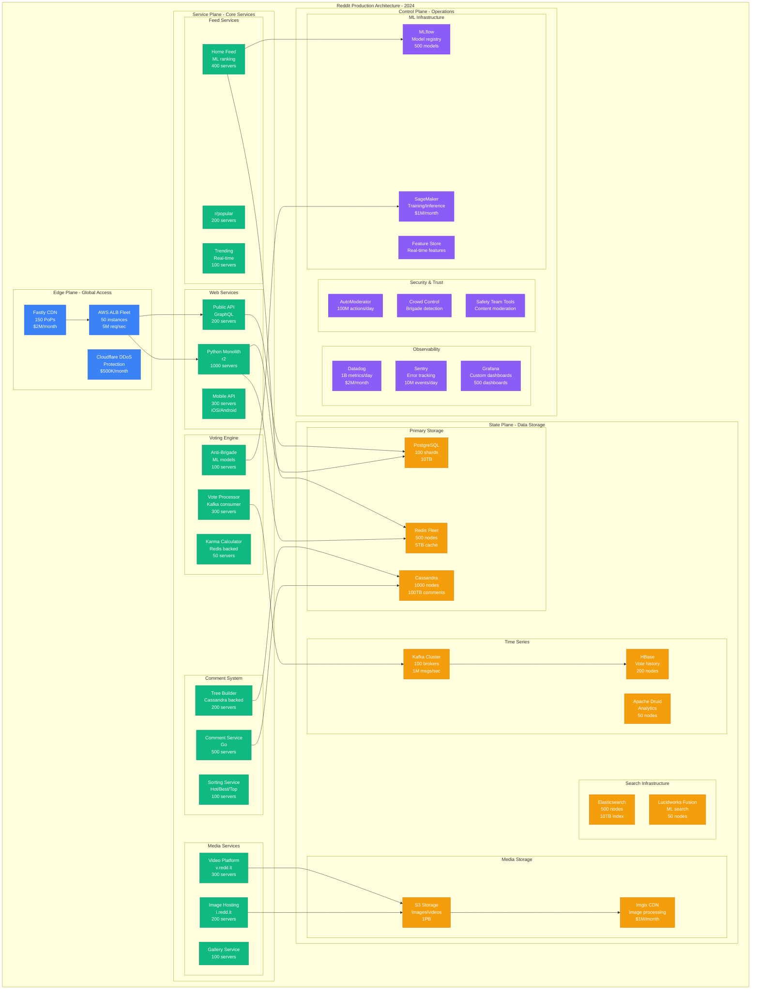
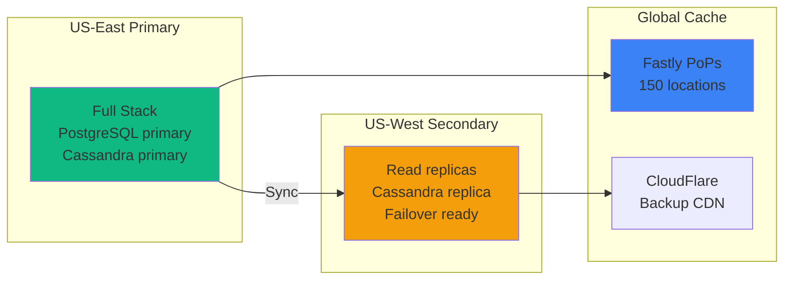

# Reddit Complete Architecture: The Front Page of the Internet at Scale

## Executive Summary
Reddit serves 500M+ MAU, 50M+ DAU, hosts 100K+ active communities, processes 18B+ votes/year, with 99.9% availability on $35M/month infrastructure.

## Complete System Architecture



## Infrastructure Scale Metrics

### Traffic Volume
```yaml
user_metrics:
  monthly_active_users: 500M+
  daily_active_users: 50M+
  peak_concurrent: 5M
  pageviews_per_day: 1B+

content_metrics:
  active_communities: 100K+
  posts_per_day: 2M+
  comments_per_day: 10M+
  votes_per_day: 50M+

api_traffic:
  third_party_apps: 10K+
  api_requests_per_day: 10B+
  apollo_users: 1.5M (before shutdown)
  bot_traffic: 20% of total
```

### Hardware Specifications
```python
infrastructure_specs = {
    "web_tier": {
        "server_type": "c5.4xlarge",
        "cpu": "16 vCPUs",
        "memory": "32GB",
        "count": 1000,
        "monthly_cost": "$400K"
    },
    "comment_storage": {
        "cassandra_nodes": 1000,
        "node_type": "i3.4xlarge",
        "storage": "2x 1.9TB NVMe",
        "memory": "122GB",
        "monthly_cost": "$800K"
    },
    "postgresql_cluster": {
        "shards": 100,
        "shard_type": "db.r6g.4xlarge",
        "storage": "100GB SSD each",
        "replicas": 2,
        "monthly_cost": "$200K"
    },
    "redis_fleet": {
        "nodes": 500,
        "node_type": "cache.r6g.xlarge",
        "memory": "13GB each",
        "total_memory": "6.5TB",
        "monthly_cost": "$150K"
    }
}
```

## Unique Architectural Components

### Comment Tree System
```python
class RedditCommentTree:
    """Reddit's nested comment architecture"""

    def __init__(self):
        self.storage = {
            "backend": "Cassandra",
            "partitioning": "By thread_id",
            "sorting": "Hot, Best, Top, New, Controversial",
            "max_depth": 10,  # Comment nesting limit
            "pagination": "Load more comments dynamically"
        }

    def build_comment_tree(self, thread_id):
        # Efficient tree building from flat structure
        comments = self.cassandra.query(
            "SELECT * FROM comments WHERE thread_id = ?",
            thread_id
        )

        # Build tree structure in memory
        tree = self.construct_tree(comments)

        # Apply sorting algorithm
        sorted_tree = self.apply_sort(tree, sort_type="best")

        # Cache in Redis for fast access
        self.redis.setex(
            f"tree:{thread_id}",
            ttl=300,  # 5 minute cache
            value=sorted_tree
        )

        return sorted_tree

    def handle_vote(self, comment_id, vote_type):
        # Real-time vote processing
        return {
            "update_score": self.update_comment_score(comment_id, vote_type),
            "recalculate_position": self.recalculate_tree_position(comment_id),
            "invalidate_cache": self.invalidate_tree_cache(comment_id),
            "anti_brigade_check": self.check_vote_manipulation(comment_id)
        }
```

### Voting System Architecture
```yaml
voting_pipeline:
  ingestion:
    endpoint: "POST /api/vote"
    rate_limit: "100 votes/minute/user"
    authentication: "OAuth2 token required"

  processing:
    queue: "Kafka"
    partitions: 1000
    throughput: "1M votes/second"
    processors: 300

  anti_cheat:
    brigade_detection:
      - "Sudden vote velocity changes"
      - "Coordinated voting patterns"
      - "Account age and karma checks"

    shadowban_system:
      - "Votes appear to count but don't"
      - "Comments visible only to user"
      - "No notification of ban"

  storage:
    hot_votes: "Redis - last 24 hours"
    recent_votes: "PostgreSQL - last 30 days"
    archive: "HBase - all historical votes"
```

### Feed Generation System
```python
class RedditFeedGenerator:
    """Personalized feed generation using ML"""

    def __init__(self):
        self.models = {
            "content_ranking": "XGBoost model",
            "user_interests": "Collaborative filtering",
            "trending_detection": "Time series analysis",
            "nsfw_filtering": "CNN classifier"
        }

    def generate_home_feed(self, user_id):
        # Get user's subscriptions
        subscriptions = self.get_user_subscriptions(user_id)

        # Fetch candidate posts
        candidates = self.fetch_candidate_posts(subscriptions)

        # Apply ML ranking
        ranked_posts = self.ml_rank_posts(candidates, user_id)

        # Apply business rules
        filtered_posts = self.apply_filters(ranked_posts, user_id)

        # Cache feed
        self.cache_feed(user_id, filtered_posts)

        return filtered_posts

    def ml_rank_posts(self, posts, user_id):
        features = self.extract_features(posts, user_id)
        scores = self.ranking_model.predict(features)
        return sorted(zip(posts, scores), key=lambda x: x[1], reverse=True)
```

## Performance Characteristics

### Latency Targets
| Operation | p50 | p95 | p99 | SLO |
|-----------|-----|-----|-----|-----|
| Page Load | 200ms | 500ms | 1s | < 1s |
| Vote Submit | 50ms | 150ms | 300ms | < 500ms |
| Comment Post | 100ms | 300ms | 500ms | < 1s |
| Feed Generation | 150ms | 400ms | 800ms | < 1s |
| Search Query | 200ms | 600ms | 1.5s | < 2s |
| Image Upload | 500ms | 2s | 5s | < 10s |

### Throughput Metrics
```python
throughput_capabilities = {
    "votes_per_second": "50K sustained, 200K peak",
    "comments_per_second": "10K sustained, 50K peak",
    "pageviews_per_second": "1M sustained, 3M peak",
    "api_requests_per_second": "100K sustained",
    "search_queries_per_second": "10K",
    "automod_actions_per_second": "1K"
}
```

## Reliability Engineering

### Multi-Region Architecture


## Cost Breakdown Summary

```python
monthly_infrastructure_costs = {
    "compute": {
        "web_servers": "$2M",
        "api_servers": "$1M",
        "ml_infrastructure": "$1M"
    },
    "storage": {
        "databases": "$1.5M",
        "media_storage": "$2M",
        "backups": "$500K"
    },
    "network": {
        "cdn": "$2.5M",
        "bandwidth": "$3M"
    },
    "services": {
        "monitoring": "$2M",
        "security": "$1M"
    },
    "total": "$35M/month",
    "cost_per_user": "$0.07/month",
    "revenue_per_user": "$0.35/month"
}
```

## The Community-Driven Architecture

### Moderation at Scale
```yaml
moderation_system:
  automod:
    rules_evaluated: 100M/day
    actions_taken: 10M/day
    custom_rules: 1M+ across subreddits

  human_moderators:
    volunteer_mods: 140K+
    mod_actions: 50M/month
    mod_tools: "Custom mod queue, mod mail, toolbox"

  admin_team:
    trust_safety: 200+ employees
    anti_evil_ops: 24/7 coverage
    policy_enforcement: "Site-wide rules"
```

## Key Innovations

1. **ThingDB**: Custom object storage for posts/comments
2. **Vote Fuzzing**: Anti-gaming mechanism for vote counts
3. **Comment Threading**: Efficient nested discussion at scale
4. **AutoModerator**: Community-configurable automation
5. **Brigade Detection**: ML-based coordinated behavior detection
6. **Shadowban System**: Silent account restrictions
7. **Community Points**: Blockchain-based rewards (select subreddits)

*"Reddit's architecture is optimized for community-driven content and democratic voting at massive scale."* - Reddit Principal Engineer