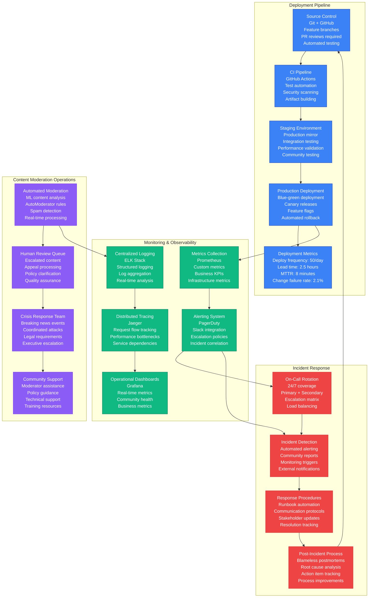
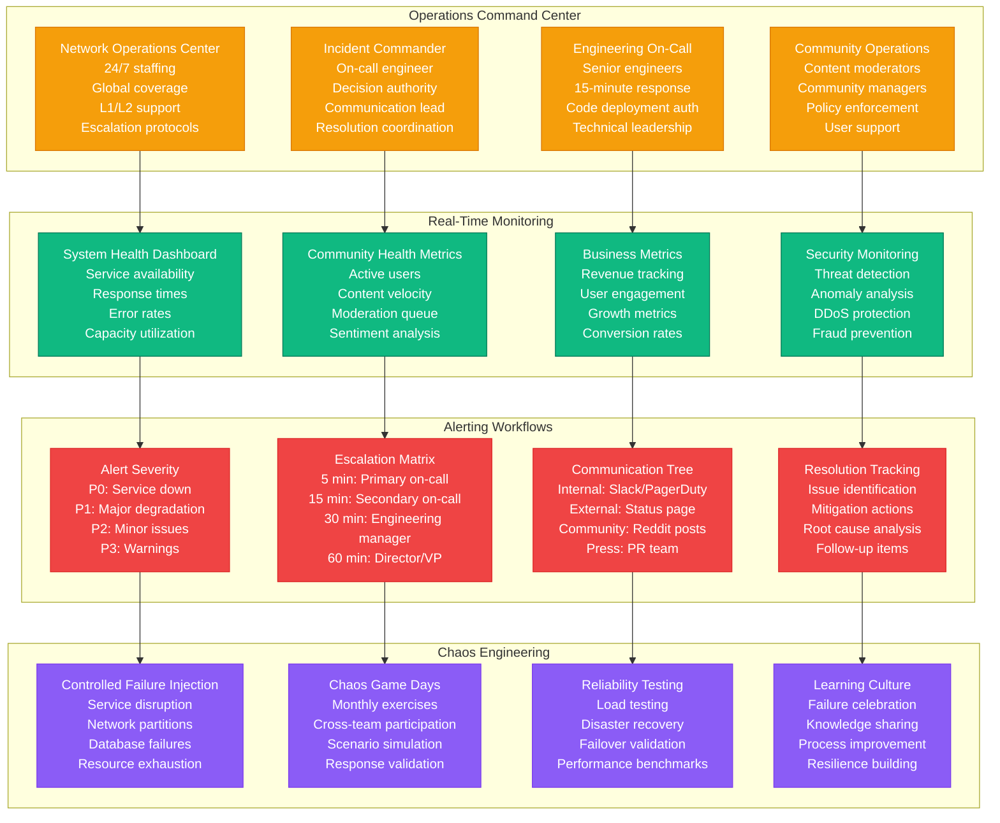
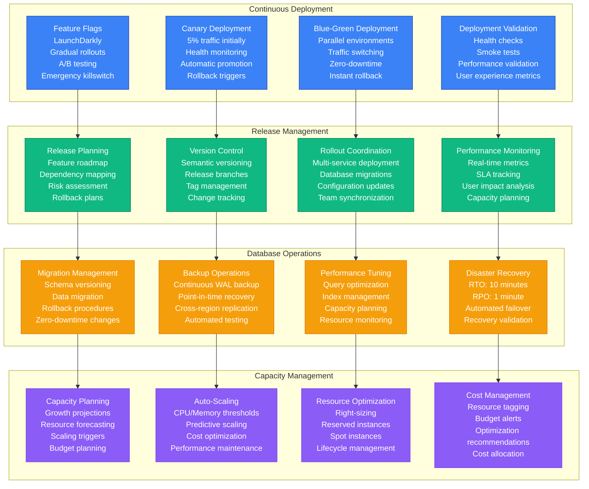

# Reddit Production Operations - The Ops View

Reddit's production operations handle the unique challenges of community-driven platforms: real-time content moderation, democratic voting integrity, and 24/7 community support at scale.

## Complete Production Operations Architecture



## 24/7 Operations Command Center



## Content Moderation Operations

```mermaid
graph TB
    subgraph AutomatedModeration[Automated Moderation Pipeline]
        CONTENT_INGESTION[Content Ingestion<br/>Real-time stream<br/>Posts + comments<br/>Images + videos<br/>2M items/hour peak]

        ML_ANALYSIS[ML Content Analysis<br/>Text classification<br/>Image recognition<br/>Sentiment analysis<br/>Toxicity scoring]

        RULE_ENGINE[AutoModerator Rules<br/>130K+ configurations<br/>Community-specific<br/>Regex matching<br/>Action automation]

        AUTO_ACTIONS[Automated Actions<br/>Remove content<br/>Apply warnings<br/>Queue for review<br/>Notify moderators]
    end

    subgraph HumanModerationFlow[Human Moderation Flow]
        REVIEW_QUEUE[Review Queue<br/>Escalated content<br/>Priority scoring<br/>Context provision<br/>Action recommendations]

        MODERATOR_TOOLS[Moderator Tools<br/>Bulk actions<br/>Historical context<br/>User profiles<br/>Decision tracking]

        APPEAL_PROCESS[Appeal Process<br/>User submissions<br/>Review workflow<br/>Policy clarification<br/>Resolution tracking]

        QUALITY_ASSURANCE[Quality Assurance<br/>Decision auditing<br/>Consistency checks<br/>Training feedback<br/>Policy refinement]
    end

    subgraph CrisisManagement[Crisis Management Operations]
        THREAT_DETECTION[Threat Detection<br/>Coordinated attacks<br/>Viral misinformation<br/>Harassment campaigns<br/>External monitoring]

        INCIDENT_RESPONSE[Crisis Response<br/>Emergency procedures<br/>Cross-team coordination<br/>Legal consultation<br/>External communication]

        DAMAGE_CONTROL[Damage Control<br/>Content removal<br/>Account suspension<br/>Community lockdown<br/>Media response]

        RECOVERY_OPERATIONS[Recovery Operations<br/>Normal state restoration<br/>Community healing<br/>Policy updates<br/>Prevention measures]
    end

    subgraph PolicyEnforcement[Policy Enforcement]
        POLICY_UPDATES[Policy Updates<br/>Community feedback<br/>Legal requirements<br/>Safety improvements<br/>Transparency reports]

        ENFORCEMENT_METRICS[Enforcement Metrics<br/>Action accuracy: 94.2%<br/>Appeal success: 12%<br/>Response time: <2 hours<br/>User satisfaction: 73%]

        TRAINING_PROGRAMS[Training Programs<br/>New moderator onboarding<br/>Policy education<br/>Tool training<br/>Best practices]

        COMMUNITY_GUIDELINES[Community Guidelines<br/>Clear standards<br/>Example content<br/>Enforcement explanations<br/>Regular updates]
    end

    CONTENT_INGESTION --> ML_ANALYSIS
    ML_ANALYSIS --> RULE_ENGINE
    RULE_ENGINE --> AUTO_ACTIONS
    AUTO_ACTIONS --> REVIEW_QUEUE

    REVIEW_QUEUE --> MODERATOR_TOOLS
    MODERATOR_TOOLS --> APPEAL_PROCESS
    APPEAL_PROCESS --> QUALITY_ASSURANCE

    THREAT_DETECTION --> INCIDENT_RESPONSE
    INCIDENT_RESPONSE --> DAMAGE_CONTROL
    DAMAGE_CONTROL --> RECOVERY_OPERATIONS

    POLICY_UPDATES --> ENFORCEMENT_METRICS
    ENFORCEMENT_METRICS --> TRAINING_PROGRAMS
    TRAINING_PROGRAMS --> COMMUNITY_GUIDELINES

    %% Cross-connections
    AUTO_ACTIONS --> THREAT_DETECTION
    QUALITY_ASSURANCE --> POLICY_UPDATES
    RECOVERY_OPERATIONS --> TRAINING_PROGRAMS

    %% Styling
    classDef automatedStyle fill:#10B981,stroke:#047857,color:#fff
    classDef humanStyle fill:#3B82F6,stroke:#1E40AF,color:#fff
    classDef crisisStyle fill:#EF4444,stroke:#DC2626,color:#fff
    classDef policyStyle fill:#8B5CF6,stroke:#7C3AED,color:#fff

    class CONTENT_INGESTION,ML_ANALYSIS,RULE_ENGINE,AUTO_ACTIONS automatedStyle
    class REVIEW_QUEUE,MODERATOR_TOOLS,APPEAL_PROCESS,QUALITY_ASSURANCE humanStyle
    class THREAT_DETECTION,INCIDENT_RESPONSE,DAMAGE_CONTROL,RECOVERY_OPERATIONS crisisStyle
    class POLICY_UPDATES,ENFORCEMENT_METRICS,TRAINING_PROGRAMS,COMMUNITY_GUIDELINES policyStyle
```



## Deployment & Release Operations



## Operational Metrics & KPIs

| Metric Category | KPI | Target | Current | Trend |
|----------------|-----|--------|---------|-------|
| **Availability** | Uptime | 99.95% | 99.97% | ↗️ |
| **Performance** | P99 Response Time | <200ms | 175ms | ↗️ |
| **Deployment** | Deploy Frequency | 50/day | 52/day | ↗️ |
| **Reliability** | MTTR | <10 min | 8 min | ↗️ |
| **Quality** | Change Failure Rate | <5% | 2.1% | ↗️ |
| **Security** | Incident Response | <15 min | 12 min | ↗️ |
| **Moderation** | Content Action Accuracy | >95% | 94.2% | ↗️ |
| **User Experience** | User Satisfaction | >80% | 84% | ↗️ |

## Crisis Response Procedures

### High-Severity Incident (P0) Response
1. **Detection** (0-2 minutes)
   - Automated alerting triggers
   - On-call engineer notified
   - Incident commander assigned

2. **Initial Response** (2-5 minutes)
   - Severity assessment
   - Communication channels opened
   - Stakeholder notification

3. **Mitigation** (5-15 minutes)
   - Emergency procedures executed
   - Service isolation if needed
   - Traffic rerouting activated

4. **Resolution** (15-60 minutes)
   - Root cause identified
   - Permanent fix deployed
   - Service restoration verified

5. **Post-Incident** (1-24 hours)
   - Blameless postmortem
   - Action items tracked
   - Process improvements

### Content Crisis Response
1. **Threat Detection** (0-5 minutes)
   - Automated flagging
   - Community reports
   - External monitoring

2. **Assessment** (5-15 minutes)
   - Content review
   - Impact analysis
   - Legal consultation

3. **Action** (15-30 minutes)
   - Content removal
   - Account suspension
   - Community notification

4. **Recovery** (30 minutes-24 hours)
   - Damage assessment
   - Policy clarification
   - Community healing

## Operational Excellence Practices

### 1. Blameless Culture
- Focus on system improvements, not individual blame
- Encourage reporting of near-misses and failures
- Learn from mistakes to prevent recurrence
- Share knowledge across teams

### 2. Automation-First Approach
- Automate repetitive operational tasks
- Use infrastructure as code
- Implement self-healing systems
- Reduce human error potential

### 3. Continuous Improvement
- Regular operational reviews
- Metrics-driven optimization
- Process refinement
- Tool evaluation and adoption

### 4. Community-Centric Operations
- User experience prioritization
- Community feedback integration
- Transparent communication
- Democratic decision-making support

## Runbook Examples

### Database Failover Procedure
```bash
# 1. Verify primary database failure
kubectl get pods -n database | grep postgres-primary

# 2. Promote replica to primary
kubectl patch postgresql reddit-primary --type='merge' -p='{"spec":{"primary":true}}'

# 3. Update application configuration
kubectl set env deployment/reddit-api DATABASE_HOST=postgres-replica-1

# 4. Verify application connectivity
kubectl exec deployment/reddit-api -- pg_isready -h postgres-replica-1

# 5. Monitor for consistency
watch "kubectl logs deployment/reddit-api | grep 'database'"
```

### Vote Brigade Response
```bash
# 1. Identify affected content
redis-cli HGETALL brigade:suspicious:post:12345

# 2. Analyze vote patterns
python3 /ops/scripts/vote_analysis.py --post-id 12345

# 3. Apply shadow bans
python3 /ops/scripts/shadow_ban.py --account-list brigade_accounts.txt

# 4. Recompute vote scores
redis-cli EVAL "$(cat /ops/lua/recompute_votes.lua)" 1 post:12345

# 5. Notify moderators
curl -X POST /api/modmail -d '{"subreddit":"affected_sub","type":"brigade_detected"}'
```

Reddit's production operations combine traditional site reliability engineering with unique social platform challenges, requiring specialized procedures for community management, content moderation, and democratic platform governance at global scale.