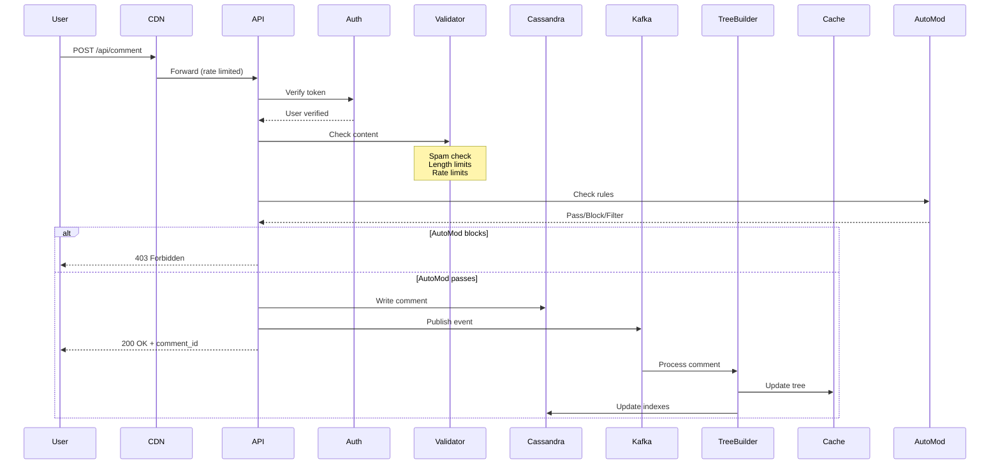
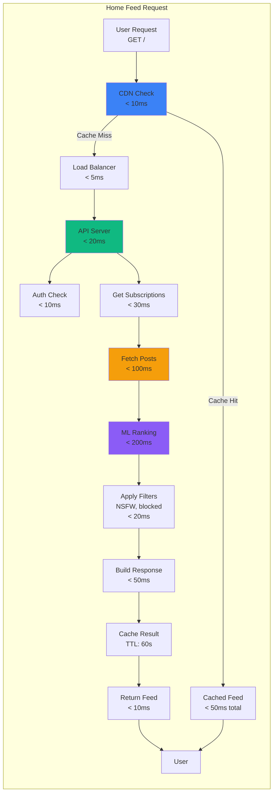

# Reddit Request Flow: From Vote to Front Page

## Executive Summary
Tracing Reddit's request flow from user actions through the democratic content ranking system, with detailed latency budgets and failure handling.

## Vote Submission Flow

```mermaid
graph TB
    subgraph "Vote Processing Pipeline"
        subgraph Client[Client Side]
            USER[User Click<br/>Upvote/Downvote]
            JS[JavaScript<br/>Optimistic UI<br/>Instant feedback]
        end

        subgraph EdgePlane[Edge Plane - Entry]
            CDN[Fastly Edge<br/>Rate limiting<br/>< 5ms]
            LB[Load Balancer<br/>AWS ALB<br/>< 2ms]
        end

        subgraph ServicePlane[Service Plane - Processing]
            subgraph APIGateway[API Gateway]
                AUTH[Authentication<br/>OAuth token<br/>< 10ms]
                RATE[Rate Limiter<br/>100/min/user<br/>< 5ms]
                VALIDATE[Validation<br/>Vote type check<br/>< 2ms]
            end

            subgraph VoteProcessor[Vote Processing]
                QUEUE[Kafka Queue<br/>Async enqueue<br/>< 10ms]
                DEDUPE[Deduplication<br/>Previous vote check<br/>< 20ms]
                ANTICHEAT[Anti-Brigade<br/>ML check<br/>< 50ms]
                SCORE[Score Update<br/>Wilson algorithm<br/>< 10ms]
            end

            subgraph Propagation[Score Propagation]
                CACHE_UPDATE[Cache Update<br/>Redis<br/>< 10ms]
                DB_UPDATE[DB Update<br/>PostgreSQL<br/>< 30ms]
                FEED_UPDATE[Feed Rerank<br/>Async<br/>Background]
                KARMA_UPDATE[Karma Calc<br/>User points<br/>< 20ms]
            end
        end

        subgraph StatePlane[State Plane - Storage]
            REDIS[Redis Cache<br/>Hot scores<br/>< 5ms]
            POSTGRES[PostgreSQL<br/>Vote history<br/>< 30ms]
            HBASE[HBase<br/>Archive<br/>Async write]
            CASSANDRA[Cassandra<br/>Score snapshots<br/>< 20ms]
        end

        %% Flow connections
        USER --> JS
        JS --> CDN
        CDN --> LB
        LB --> AUTH

        AUTH --> RATE
        RATE --> VALIDATE
        VALIDATE --> QUEUE

        QUEUE --> DEDUPE
        DEDUPE --> ANTICHEAT
        ANTICHEAT --> SCORE

        SCORE --> CACHE_UPDATE
        SCORE --> DB_UPDATE
        SCORE --> FEED_UPDATE
        SCORE --> KARMA_UPDATE

        CACHE_UPDATE --> REDIS
        DB_UPDATE --> POSTGRES
        DB_UPDATE --> HBASE
        FEED_UPDATE --> CASSANDRA
    end

    %% Apply four-plane colors
    classDef edgeStyle fill:#3B82F6,stroke:#2563EB,color:#fff
    classDef serviceStyle fill:#10B981,stroke:#059669,color:#fff
    classDef stateStyle fill:#F59E0B,stroke:#D97706,color:#fff

    class CDN,LB edgeStyle
    class AUTH,RATE,VALIDATE,QUEUE,DEDUPE,ANTICHEAT,SCORE,CACHE_UPDATE,DB_UPDATE,FEED_UPDATE,KARMA_UPDATE serviceStyle
    class REDIS,POSTGRES,HBASE,CASSANDRA stateStyle
```



## Comment Submission Flow



## Feed Generation Request Flow



## Search Request Flow

```python
class RedditSearchFlow:
    """Reddit's search request processing"""

    def process_search(self, query, user_id):
        # Step 1: Query preprocessing (< 10ms)
        processed_query = {
            "original": query,
            "normalized": self.normalize_query(query),
            "tokens": self.tokenize(query),
            "filters": self.extract_filters(query),  # subreddit:X, author:Y
            "safe_search": self.get_user_nsfw_pref(user_id)
        }

        # Step 2: Elasticsearch query (< 200ms)
        es_results = self.elasticsearch.search({
            "query": {
                "multi_match": {
                    "query": processed_query["normalized"],
                    "fields": ["title^3", "selftext^2", "subreddit"],
                    "type": "best_fields"
                }
            },
            "filters": processed_query["filters"],
            "size": 1000  # Get more for re-ranking
        })

        # Step 3: ML re-ranking (< 100ms)
        features = self.extract_ranking_features(es_results, user_id)
        scores = self.ranking_model.predict(features)
        ranked_results = self.apply_ranking(es_results, scores)

        # Step 4: Filter and format (< 50ms)
        filtered = self.apply_user_blocks(ranked_results, user_id)
        formatted = self.format_results(filtered[:25])  # Top 25

        # Step 5: Cache result (< 10ms)
        self.redis.setex(
            f"search:{user_id}:{query}",
            ttl=300,  # 5 minute cache
            value=formatted
        )

        return formatted
```

## Latency Budget Breakdown

### Critical Path Operations
```yaml
vote_submission:
  edge_processing: 7ms
  authentication: 10ms
  validation: 7ms
  queue_write: 10ms
  ui_response: 34ms  # User sees result
  # Async processing continues
  score_calculation: 10ms
  cache_update: 10ms
  db_write: 30ms
  total_async: 50ms
  end_to_end: 84ms

comment_posting:
  edge_processing: 7ms
  authentication: 10ms
  content_validation: 20ms
  automod_check: 50ms
  cassandra_write: 30ms
  kafka_publish: 10ms
  ui_response: 127ms  # User sees comment
  # Async tree building
  tree_rebuild: 100ms
  cache_update: 20ms
  total_async: 120ms
  end_to_end: 247ms

feed_generation:
  edge_check: 10ms
  authentication: 10ms
  subscription_fetch: 30ms
  post_retrieval: 100ms
  ml_ranking: 200ms
  filtering: 20ms
  response_build: 50ms
  cache_write: 10ms
  total: 430ms
```

## Request Routing Intelligence

### Smart Load Balancing
```python
class RedditLoadBalancer:
    def route_request(self, request):
        # Determine request type and route accordingly
        if request.path.startswith('/api/vote'):
            # Route to high-throughput vote processors
            return self.vote_cluster.select_least_loaded()

        elif request.path.startswith('/r/'):
            # Route based on subreddit sharding
            subreddit = self.extract_subreddit(request.path)
            shard = hash(subreddit) % self.num_shards
            return self.shards[shard].select_server()

        elif request.is_media():
            # Route to media servers
            if request.is_video():
                return self.video_cluster.select_server()
            else:
                return self.image_cluster.select_server()

        else:
            # Default routing
            return self.general_cluster.round_robin()
```

### Cache Strategy
```yaml
cache_layers:
  browser_cache:
    static_assets: 1 year
    api_responses: 0 (no cache)
    images: 1 month

  cdn_cache:
    static_assets: 1 year
    public_feeds: 60 seconds
    user_feeds: 0 (no cache)
    images: 1 month
    videos: 1 week

  application_cache:
    hot_posts: 5 minutes (Redis)
    user_sessions: 30 minutes (Redis)
    comment_trees: 5 minutes (Redis)
    vote_counts: 1 minute (Redis)

  database_cache:
    query_cache: 60 seconds (PostgreSQL)
    prepared_statements: Session lifetime
```

## Failure Handling

### Circuit Breakers
```python
circuit_breakers = {
    "cassandra": {
        "error_threshold": 50,  # errors in window
        "time_window": 10,  # seconds
        "timeout": 1000,  # ms
        "cooldown": 30,  # seconds
        "fallback": "serve_from_cache"
    },
    "elasticsearch": {
        "error_threshold": 100,
        "time_window": 10,
        "timeout": 2000,
        "cooldown": 60,
        "fallback": "basic_search"
    },
    "ml_ranking": {
        "error_threshold": 200,
        "time_window": 10,
        "timeout": 500,
        "cooldown": 30,
        "fallback": "simple_sort"
    }
}
```

### Retry Policies
```yaml
retry_strategies:
  vote_submission:
    max_retries: 3
    backoff: exponential
    initial_delay: 100ms
    max_delay: 5s

  comment_posting:
    max_retries: 2
    backoff: linear
    delay: 500ms

  database_writes:
    max_retries: 2
    backoff: constant
    delay: 200ms

  external_services:
    max_retries: 1
    timeout: 5s
```

## Anti-Brigade Request Detection

```python
class AntiBrigadeDetection:
    """Detect coordinated voting/commenting"""

    def analyze_request(self, request):
        signals = {
            "user_account_age": self.get_account_age(request.user_id),
            "user_karma": self.get_user_karma(request.user_id),
            "recent_activity": self.get_recent_activity(request.user_id),
            "referrer": request.headers.get('Referer'),
            "user_agent": request.headers.get('User-Agent'),
            "ip_reputation": self.check_ip_reputation(request.ip),
            "vote_velocity": self.calculate_vote_velocity(request.target_id),
            "cross_post_activity": self.check_cross_posts(request.target_id)
        }

        # ML model for brigade detection
        brigade_score = self.ml_model.predict(signals)

        if brigade_score > 0.8:
            return {
                "action": "shadowban",
                "log": True,
                "notify_admins": True
            }
        elif brigade_score > 0.5:
            return {
                "action": "rate_limit",
                "delay": "5 seconds",
                "log": True
            }
        else:
            return {"action": "allow"}
```

## Real-Time Metrics

```python
request_flow_metrics = {
    "current_throughput": {
        "votes_per_second": 45000,
        "comments_per_second": 8500,
        "pageviews_per_second": 850000,
        "api_requests_per_second": 95000
    },
    "latency_percentiles": {
        "vote_p50": "31ms",
        "vote_p99": "78ms",
        "comment_p50": "95ms",
        "comment_p99": "412ms",
        "feed_p50": "234ms",
        "feed_p99": "891ms"
    },
    "error_rates": {
        "vote_errors": "0.01%",
        "comment_errors": "0.05%",
        "feed_errors": "0.02%",
        "search_errors": "0.5%"
    },
    "cache_hit_rates": {
        "cdn": "72%",
        "redis": "85%",
        "database": "60%"
    }
}
```

## The 3 AM Debug Guide

```python
def debug_slow_request(request_id):
    """Emergency request debugging guide"""

    steps = {
        "1_check_cdn": f"fastly logs | grep {request_id}",
        "2_check_lb": f"aws elb describe-load-balancer-attributes",
        "3_app_logs": f"grep {request_id} /var/log/reddit/app.log",
        "4_database": "SELECT * FROM pg_stat_activity WHERE state = 'active'",
        "5_cache": f"redis-cli GET request:{request_id}",
        "6_traces": f"datadog trace {request_id}"
    }

    common_issues = {
        "slow_feed": "Check ML model latency, cache misses",
        "vote_not_registering": "Check shadowban, brigade detection",
        "comment_not_appearing": "Check AutoMod rules, spam filters",
        "search_timeout": "Check Elasticsearch cluster health"
    }

    return steps, common_issues
```

*"Every request through Reddit is a democratic action - votes shape what millions see."* - Reddit Infrastructure Lead