# Robinhood Complete Architecture

## Production System Overview

Robinhood's commission-free trading platform serving 23M+ funded accounts with $130B+ assets under custody, processing 500M+ trades per quarter with sub-millisecond order execution.

```mermaid
graph TB
    subgraph EdgePlane[Edge Plane - CDN & Load Balancing]
        WAF[AWS WAF<br/>DDoS Protection<br/>5M+ requests/day]
        ALB[Application Load Balancer<br/>AWS ALB<br/>p99: 2ms]
        CDN[CloudFront CDN<br/>Global Edge Locations<br/>Static Assets]
    end

    subgraph ServicePlane[Service Plane - Trading Services]
        API[API Gateway<br/>Kong Enterprise<br/>Rate Limiting: 100 req/sec/user]
        AUTH[Auth Service<br/>OAuth 2.0 + MFA<br/>Redis Sessions: 15 min TTL]
        ORDER[Order Management<br/>Java/Spring Boot<br/>c5.9xlarge: 36 vCPU]
        EXEC[Execution Engine<br/>C++ High Frequency<br/>Sub-millisecond latency]
        MARKET[Market Data Service<br/>Real-time Feeds<br/>10,000+ symbols]
        PORT[Portfolio Service<br/>Real-time P&L<br/>Node.js + Redis]
        MARGIN[Margin Calculator<br/>Risk Management<br/>Python/NumPy]
        OPTIONS[Options Trading<br/>Greeks Calculation<br/>GPU Acceleration]
        CRYPTO[Crypto Trading<br/>24/7 Operations<br/>Separate Settlement]
    end

    subgraph StatePlane[State Plane - Data Storage]
        ORDERS[(Order Database<br/>PostgreSQL 14<br/>db.r6g.8xlarge<br/>32 vCPU, 256GB RAM)]
        USERS[(User Database<br/>PostgreSQL 14<br/>Multi-AZ RDS<br/>10M+ user records)]
        MARKET_DB[(Market Data Store<br/>TimescaleDB<br/>1TB+ daily ingestion)]
        POSITIONS[(Position Database<br/>PostgreSQL 14<br/>Real-time updates)]
        COMPLIANCE[(Compliance Store<br/>Aurora PostgreSQL<br/>7-year retention)]
        REDIS[(Redis Cluster<br/>Elasticache<br/>cache.r6g.2xlarge)]
        KAFKA[(Kafka Cluster<br/>MSK 3.2<br/>100GB+ daily volume)]
        S3[(S3 Storage<br/>Trade Confirmations<br/>Document Archive)]
    end

    subgraph ControlPlane[Control Plane - Operations]
        MONITOR[DataDog Monitoring<br/>Custom Dashboards<br/>Trading Metrics]
        ALERT[PagerDuty Alerts<br/>24/5 On-call<br/>< 2 min response]
        LOG[Centralized Logging<br/>ELK Stack<br/>100GB+ daily logs]
        DEPLOY[CI/CD Pipeline<br/>Jenkins + Spinnaker<br/>Blue-Green Deploy]
        RISK[Risk Management<br/>Real-time Monitoring<br/>Circuit Breakers]
        FINRA[FINRA Reporting<br/>Regulatory Compliance<br/>Daily/Monthly Reports]
    end

    subgraph ExternalSystems[External Systems]
        EXCHANGE[Stock Exchanges<br/>NYSE, NASDAQ, BATS<br/>Direct Market Access]
        CLEARANCE[NSCC Clearing<br/>T+2 Settlement<br/>Automated Processing]
        BANK[Bank Partners<br/>Clearing Accounts<br/>Customer Cash]
        PFOF[Market Makers<br/>Citadel Securities<br/>Payment for Order Flow]
        REGULATOR[Regulators<br/>SEC, FINRA<br/>Compliance Reporting]
    end

    %% User flow
    USER[Mobile App Users<br/>23M+ Funded Accounts<br/>iOS/Android] --> WAF
    WAF --> ALB
    ALB --> API
    CDN --> USER

    %% Service connections
    API --> AUTH
    API --> ORDER
    API --> PORT
    API --> MARKET
    API --> MARGIN
    API --> OPTIONS
    API --> CRYPTO

    ORDER --> EXEC
    EXEC --> EXCHANGE
    ORDER --> PFOF

    %% Data flows
    ORDER --> ORDERS
    AUTH --> USERS
    PORT --> POSITIONS
    MARKET --> MARKET_DB
    ORDER --> KAFKA

    %% Caching layer
    AUTH --> REDIS
    MARKET --> REDIS
    PORT --> REDIS

    %% External integrations
    EXEC --> CLEARANCE
    ORDER --> BANK
    COMPLIANCE --> REGULATOR
    ORDER --> FINRA

    %% Monitoring
    MONITOR --> ORDER
    MONITOR --> EXEC
    ALERT --> MONITOR
    LOG --> ORDER
    RISK --> ORDER

    %% Apply four-plane colors
    classDef edgeStyle fill:#3B82F6,stroke:#2563EB,color:#fff
    classDef serviceStyle fill:#10B981,stroke:#059669,color:#fff
    classDef stateStyle fill:#F59E0B,stroke:#D97706,color:#fff
    classDef controlStyle fill:#8B5CF6,stroke:#7C3AED,color:#fff
    classDef externalStyle fill:#9999CC,stroke:#666699,color:#fff

    class WAF,ALB,CDN edgeStyle
    class API,AUTH,ORDER,EXEC,MARKET,PORT,MARGIN,OPTIONS,CRYPTO serviceStyle
    class ORDERS,USERS,MARKET_DB,POSITIONS,COMPLIANCE,REDIS,KAFKA,S3 stateStyle
    class MONITOR,ALERT,LOG,DEPLOY,RISK,FINRA controlStyle
    class EXCHANGE,CLEARANCE,BANK,PFOF,REGULATOR externalStyle
```

## Key Production Metrics

### Scale Metrics
- **23M+ funded accounts** with active trading
- **$130B+ assets under custody** (Q2 2023)
- **500M+ trades per quarter** during peak periods
- **$81B notional value** traded quarterly
- **Sub-millisecond order execution** for equity trades

### Infrastructure Specifications
- **Order Management**: Java/Spring Boot on c5.9xlarge (36 vCPU, 72GB RAM)
- **Execution Engine**: C++ on bare metal for ultra-low latency
- **Database**: PostgreSQL 14 on db.r6g.8xlarge (32 vCPU, 256GB RAM)
- **Cache Layer**: Redis Cluster on cache.r6g.2xlarge nodes
- **Message Queue**: Kafka MSK 3.2 processing 100GB+ daily

### SLA Requirements
- **Order Response**: p99 < 50ms from mobile app to order placement
- **Market Data**: < 100ms from exchange to mobile display
- **Account Updates**: < 200ms for position and P&L updates
- **System Availability**: 99.95% during market hours (9:30 AM - 4:00 PM EST)

## Cost Structure (Monthly)

### Infrastructure Costs
- **Compute (EC2)**: ~$2.8M/month for trading services
- **Database (RDS)**: ~$1.2M/month for PostgreSQL clusters
- **Storage (S3)**: ~$180K/month for trade records and documents
- **Network**: ~$320K/month for data transfer and CDN
- **Monitoring**: ~$95K/month for DataDog and observability

### Regulatory Costs
- **FINRA Fees**: ~$4.2M/month in trading activity fees
- **SEC Fees**: ~$2.1M/month in transaction fees
- **Clearing Fees**: ~$1.8M/month to NSCC and DTC
- **Compliance Tools**: ~$450K/month for reporting and surveillance

### Revenue Sources
- **Payment for Order Flow**: $380M annually from market makers
- **Interest on Cash**: $64M annually on customer cash balances
- **Robinhood Gold**: $249M annually from premium subscriptions
- **Options Revenue**: $218M annually from options trading

## Critical Dependencies

### Market Data Providers
- **Primary**: Direct feeds from NYSE, NASDAQ, BATS
- **Backup**: Thomson Reuters, Bloomberg Terminal feeds
- **Latency SLA**: < 50ms from exchange to customer

### Clearing and Settlement
- **Primary Clearinghouse**: National Securities Clearing Corporation (NSCC)
- **Settlement**: T+2 automated settlement cycle
- **Margin Requirements**: Real-time calculation with Fed Reg T compliance

### Banking Partners
- **Primary Bank**: JPMorgan Chase for clearing accounts
- **FDIC Insurance**: Customer cash protected up to $250K
- **Wire Processing**: Same-day ACH for deposits/withdrawals

## Production Incidents

### GameStop Crisis (January 2021)
- **Issue**: Unprecedented volume caused collateral requirements to spike
- **Impact**: Had to restrict buying on meme stocks for 4 days
- **Resolution**: Raised $3.4B in emergency funding
- **Lessons**: Implemented dynamic collateral management

### System Outages (March 2020)
- **Issue**: Market volatility caused trading halts
- **Impact**: Users unable to trade during market open for 17 hours
- **Resolution**: Infrastructure scaling and circuit breaker improvements
- **Prevention**: Added auto-scaling for extreme volume events

*"We're building a system that democratizes finance for everyone, but operating in one of the most regulated and demanding environments in technology."* - Robinhood Engineering Team
