# Robinhood Request Flow

## Order Placement to Execution Journey

Critical path analysis for stock order processing from mobile app to market execution, including all latency budgets and fallback mechanisms.

## Latency Budget Breakdown

### Critical Path Performance (SLA: p99 < 50ms)

| Component | Service | p50 Latency | p99 Latency | Timeout |
|-----------|---------|-------------|-------------|---------|
| **CDN Lookup** | CloudFront | 3ms | 8ms | 10s |
| **Load Balancing** | AWS ALB | 1ms | 3ms | 30s |
| **API Gateway** | Kong Enterprise | 2ms | 5ms | 10s |
| **Authentication** | Redis Sessions | 1ms | 4ms | 5s |
| **Order Validation** | Spring Boot | 3ms | 8ms | 15s |
| **Risk Checks** | Risk Engine | 2ms | 6ms | 10s |
| **Database Write** | PostgreSQL | 1ms | 3ms | 5s |
| **Execution Routing** | C++ Engine | 0.5ms | 1.5ms | 2s |
| **Market Fill** | Market Maker | 0.3ms | 0.8ms | 1s |
| **Response Path** | Full Stack | 2ms | 7ms | - |
| **TOTAL** | **End-to-End** | **16ms** | **46ms** | **N/A** |

## Risk Management Checks

### Pre-Trade Validation (Required < 10ms)

## Execution Routing Logic

### Smart Order Router Decision Tree

## Error Handling and Fallbacks

### Circuit Breaker Patterns

| Service | Failure Threshold | Recovery Time | Fallback Action |
|---------|------------------|---------------|-----------------|
| **Market Maker** | 3 failures/10s | 30s | Route to exchange |
| **Risk Engine** | 5 failures/30s | 60s | Use cached risk profile |
| **Order Database** | 2 failures/5s | 10s | Queue in memory |
| **Auth Service** | 10 failures/60s | 120s | Use backup auth |
| **Portfolio Service** | 5 failures/30s | 45s | Stale position data |

### Market Hours Handling

```mermaid
gantt
    title Trading Hours and System Behavior
    dateFormat HH:mm
    axisFormat %H:%M

    section Pre-Market
    Queue Orders    :04:00, 09:30

    section Regular Hours
    Active Trading  :09:30, 16:00

    section After Hours
    Extended Trading :16:00, 20:00

    section Maintenance
    System Updates   :20:00, 04:00
```

## Performance Monitoring

### Key SLIs (Service Level Indicators)

- **Order Latency**: p99 < 50ms end-to-end
- **Fill Rate**: > 99.5% of market orders filled
- **Reject Rate**: < 0.1% false risk rejections
- **System Availability**: 99.95% during market hours
- **Data Freshness**: Market data < 100ms delayed

### Alerting Thresholds

- **CRITICAL**: Order latency p99 > 100ms
- **WARNING**: Fill rate < 99.0%
- **CRITICAL**: System availability < 99.9%
- **WARNING**: Risk check latency > 15ms

*"Every millisecond matters when your users are trading their life savings. Our request flow is optimized for the 23 million people who trust us with their financial future."* - Robinhood Execution Team