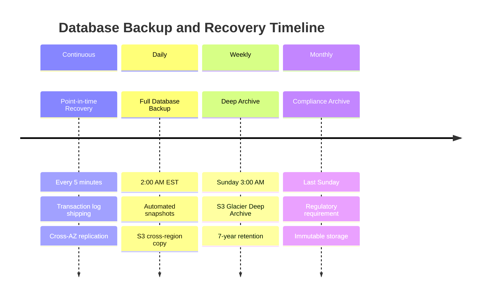
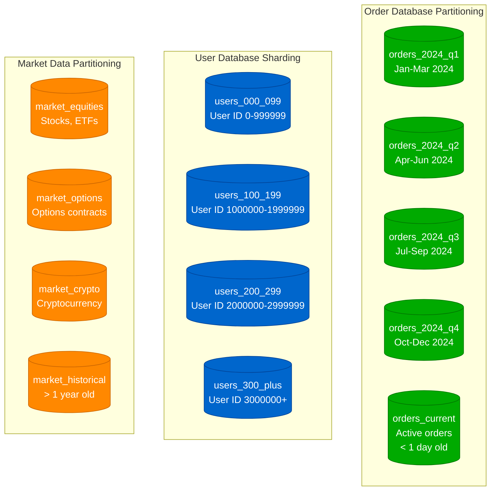
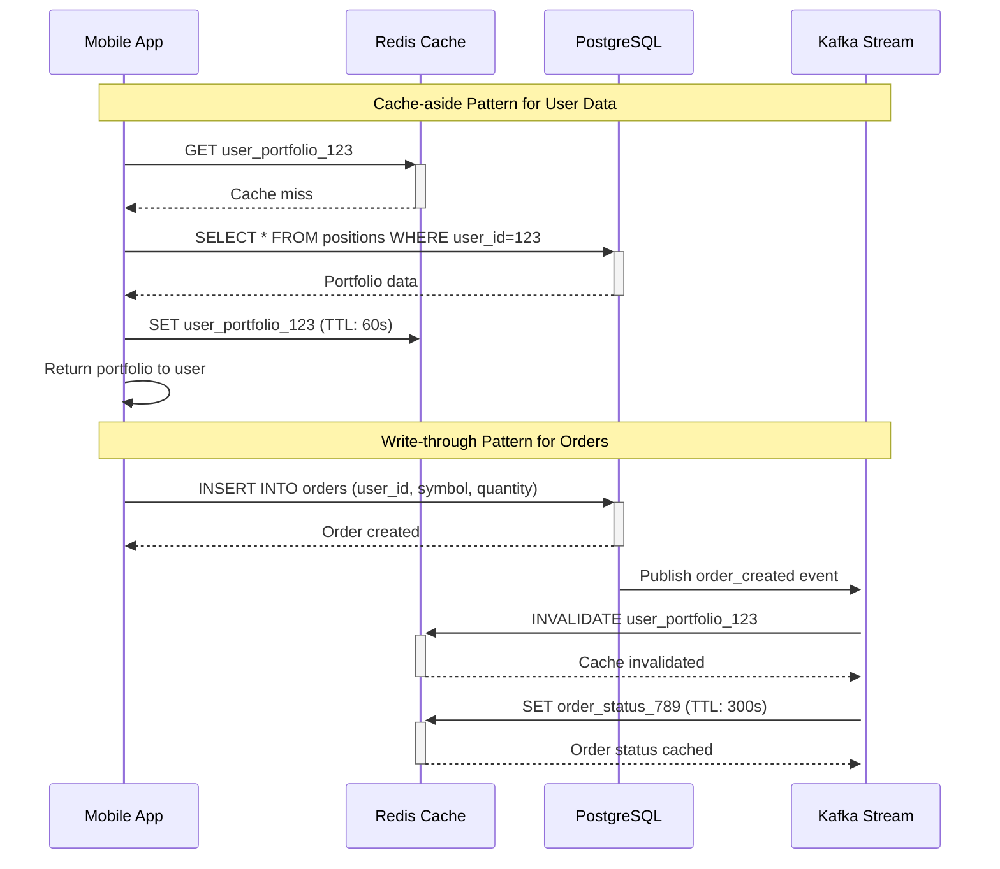
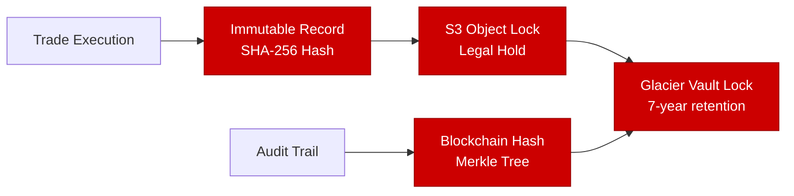

# Robinhood Storage Architecture

## Financial Data and Portfolio Management

Comprehensive storage strategy for managing $130B+ in assets, 23M+ user accounts, and 500M+ quarterly trades with strict regulatory compliance and real-time performance requirements.

```mermaid
graph TB
    subgraph UserTier[User Data Tier]
        USERS[(User Database<br/>PostgreSQL 14<br/>db.r6g.8xlarge<br/>Multi-AZ RDS)]
        PROFILES[(User Profiles<br/>PostgreSQL 14<br/>Personal Info + KYC<br/>Encrypted PII)]
        AUTH[(Authentication<br/>PostgreSQL 14<br/>OAuth tokens + MFA<br/>30-day retention)]
        PREFERENCES[(User Preferences<br/>PostgreSQL 14<br/>App settings + alerts<br/>Fast reads)]
    end

    subgraph TradingTier[Trading Data Tier]
        ORDERS[(Order Database<br/>PostgreSQL 14<br/>db.r6g.16xlarge<br/>64 vCPU, 512GB RAM)]
        EXECUTIONS[(Execution Records<br/>PostgreSQL 14<br/>Trade confirmations<br/>Partitioned by date)]
        POSITIONS[(Position Database<br/>PostgreSQL 14<br/>Real-time holdings<br/>Sub-second updates)]
        PORTFOLIO[(Portfolio Service<br/>PostgreSQL 14<br/>P&L calculations<br/>Cost basis tracking)]
    end

    subgraph MarketDataTier[Market Data Tier]
        REALTIME[(Real-time Quotes<br/>TimescaleDB<br/>Hypertables<br/>10K+ symbols)]
        HISTORICAL[(Historical Data<br/>TimescaleDB<br/>5-year retention<br/>1TB+ daily ingestion)]
        FUNDAMENTALS[(Company Data<br/>PostgreSQL 14<br/>Earnings, ratios<br/>Daily updates)]
        NEWS[(News & Analysis<br/>Elasticsearch<br/>Full-text search<br/>Real-time feeds)]
    end

    subgraph ComplianceTier[Compliance & Regulatory]
        FINRA[(FINRA Reports<br/>Aurora PostgreSQL<br/>99.99% uptime<br/>7-year retention)]
        AUDIT[(Audit Logs<br/>PostgreSQL 14<br/>Immutable records<br/>10-year retention)]
        TAX[(Tax Documents<br/>Aurora PostgreSQL<br/>1099 generation<br/>Encrypted storage)]
        KYC[(KYC/AML Data<br/>PostgreSQL 14<br/>Identity verification<br/>Compliance checks)]
    end

    subgraph CachingLayer[High-Performance Caching]
        REDIS_USER[User Session Cache<br/>Redis Cluster<br/>cache.r6g.2xlarge<br/>15-min TTL]
        REDIS_MARKET[Market Data Cache<br/>Redis Cluster<br/>cache.r6g.4xlarge<br/>1-second TTL]
        REDIS_PORTFOLIO[Portfolio Cache<br/>Redis Cluster<br/>cache.r6g.2xlarge<br/>Real-time updates]
        REDIS_ORDERS[Order Cache<br/>Redis Cluster<br/>cache.r6g.xlarge<br/>Active orders only]
    end

    subgraph StreamingData[Real-time Streaming]
        KAFKA[(Kafka Cluster<br/>MSK 3.2<br/>kafka.m5.2xlarge<br/>100GB+ daily)]
        KINESIS[(Kinesis Streams<br/>Real-time analytics<br/>Position updates<br/>1M+ events/sec)]
        SQS[(SQS Queues<br/>Order processing<br/>Settlement events<br/>Dead letter queues)]
    end

    subgraph ArchivalStorage[Long-term Storage]
        S3_DOCS[(S3 - Documents<br/>Trade confirmations<br/>Statements, 1099s<br/>100TB+ archived)]
        S3_BACKUPS[(S3 - Database Backups<br/>Daily automated<br/>Point-in-time recovery<br/>Cross-region replication)]
        GLACIER[(S3 Glacier<br/>Historical archives<br/>7+ year retention<br/>Compliance storage)]
        SNOWBALL[(AWS Snowball<br/>Data migration<br/>Disaster recovery<br/>Offline transport)]
    end

    %% Data flow connections
    USERS --> REDIS_USER
    PROFILES --> REDIS_USER
    AUTH --> REDIS_USER

    ORDERS --> REDIS_ORDERS
    EXECUTIONS --> KAFKA
    POSITIONS --> REDIS_PORTFOLIO
    PORTFOLIO --> REDIS_PORTFOLIO

    REALTIME --> REDIS_MARKET
    HISTORICAL --> REDIS_MARKET
    FUNDAMENTALS --> REDIS_MARKET

    %% Streaming data flows
    KAFKA --> POSITIONS
    KAFKA --> PORTFOLIO
    KAFKA --> KINESIS
    KINESIS --> FINRA
    KINESIS --> TAX

    %% Backup flows
    USERS --> S3_BACKUPS
    ORDERS --> S3_BACKUPS
    POSITIONS --> S3_BACKUPS
    FINRA --> S3_BACKUPS

    %% Archival flows
    EXECUTIONS --> S3_DOCS
    TAX --> S3_DOCS
    AUDIT --> GLACIER
    S3_BACKUPS --> GLACIER

    %% Apply styling
    classDef userStyle fill:#0066CC,stroke:#004499,color:#fff
    classDef tradingStyle fill:#00AA00,stroke:#007700,color:#fff
    classDef marketStyle fill:#FF8800,stroke:#CC6600,color:#fff
    classDef complianceStyle fill:#CC0000,stroke:#990000,color:#fff
    classDef cacheStyle fill:#9966CC,stroke:#663399,color:#fff
    classDef streamStyle fill:#66CC99,stroke:#339966,color:#fff
    classDef archiveStyle fill:#999999,stroke:#666666,color:#fff

    class USERS,PROFILES,AUTH,PREFERENCES userStyle
    class ORDERS,EXECUTIONS,POSITIONS,PORTFOLIO tradingStyle
    class REALTIME,HISTORICAL,FUNDAMENTALS,NEWS marketStyle
    class FINRA,AUDIT,TAX,KYC complianceStyle
    class REDIS_USER,REDIS_MARKET,REDIS_PORTFOLIO,REDIS_ORDERS cacheStyle
    class KAFKA,KINESIS,SQS streamStyle
    class S3_DOCS,S3_BACKUPS,GLACIER,SNOWBALL archiveStyle
```

## Database Specifications

### Primary Trading Databases

| Database | Instance Type | Storage | IOPS | Connection Pool | Use Case |
|----------|---------------|---------|------|----------------|----------|
| **User Database** | db.r6g.8xlarge | 2TB GP3 | 16,000 | 500 connections | User accounts, profiles |
| **Order Database** | db.r6g.16xlarge | 8TB GP3 | 64,000 | 1,000 connections | Active orders, executions |
| **Position Database** | db.r6g.8xlarge | 4TB GP3 | 32,000 | 800 connections | Real-time holdings |
| **Market Data** | TimescaleDB | 12TB GP3 | 40,000 | 300 connections | Quotes, historical data |

### Backup and Recovery Strategy

## Data Consistency Models

### Strong Consistency (ACID Required)
- **User Account Balances**: Money in/out requires ACID transactions
- **Order Placement**: Order must be atomic (all-or-nothing)
- **Position Updates**: Stock ownership must be immediately consistent
- **Settlement Records**: T+2 clearing requires exact reconciliation

### Eventual Consistency (Performance Optimized)
- **Market Data Display**: 100ms staleness acceptable for quotes
- **Portfolio P&L**: Real-time updates with 1-second lag acceptable
- **News Feeds**: Content freshness less critical than availability
- **Historical Charts**: Historical data can be eventually consistent

### Data Partitioning Strategy

## Caching Strategy

### Redis Cluster Configuration

| Cache Cluster | Instance Type | Memory | TTL | Hit Rate | Use Case |
|---------------|---------------|--------|-----|----------|----------|
| **User Sessions** | cache.r6g.2xlarge | 52GB | 15 min | 98.5% | Authentication tokens |
| **Market Data** | cache.r6g.4xlarge | 104GB | 1 sec | 95.2% | Real-time quotes |
| **Portfolios** | cache.r6g.2xlarge | 52GB | Real-time | 99.1% | Position calculations |
| **Order Book** | cache.r6g.xlarge | 26GB | 100ms | 94.8% | Active order status |

### Cache Invalidation Patterns

## Regulatory Compliance

### Data Retention Requirements

| Data Type | Retention Period | Storage Tier | Compliance |
|-----------|------------------|--------------|------------|
| **Trade Records** | 7 years | S3 → Glacier | SEC Rule 17a-4 |
| **Customer Communications** | 3 years | S3 Standard | FINRA Rule 4511 |
| **Order Records** | 3 years | PostgreSQL → S3 | SEC Rule 606 |
| **Risk Management** | 5 years | Aurora → Glacier | Fed Reg T |
| **KYC/AML Records** | 5 years | PostgreSQL | BSA/AML |

### WORM (Write Once, Read Many) Storage

## Performance Metrics

### Database Performance (Production SLA)

- **Read Latency**: p99 < 5ms for cached data, p99 < 15ms for database
- **Write Latency**: p99 < 10ms for order insertion
- **Throughput**: 50,000 orders/second peak capacity
- **Availability**: 99.95% uptime during market hours

### Storage Costs (Monthly)

- **RDS PostgreSQL**: $1.2M/month for all trading databases
- **TimescaleDB**: $180K/month for market data storage
- **Redis Clusters**: $95K/month for caching layer
- **S3 Storage**: $180K/month for documents and backups
- **Glacier Archive**: $45K/month for long-term compliance

### Data Growth Rates

- **Daily Order Volume**: 2M orders → 8GB data growth
- **Market Data Ingestion**: 1TB+ per trading day
- **User Growth**: 100K+ new accounts monthly
- **Document Archive**: 50GB+ monthly growth (statements, 1099s)

## Disaster Recovery

### RTO/RPO Requirements

- **RTO (Recovery Time Objective)**: 15 minutes for trading systems
- **RPO (Recovery Point Objective)**: 30 seconds for financial data
- **Cross-Region Failover**: Automated within 5 minutes
- **Data Replication**: Synchronous within region, async cross-region

*"Our storage architecture handles $130 billion in customer assets with the reliability of a bank and the performance of a gaming platform. Every bit of data represents someone's financial future."* - Robinhood Data Engineering Team