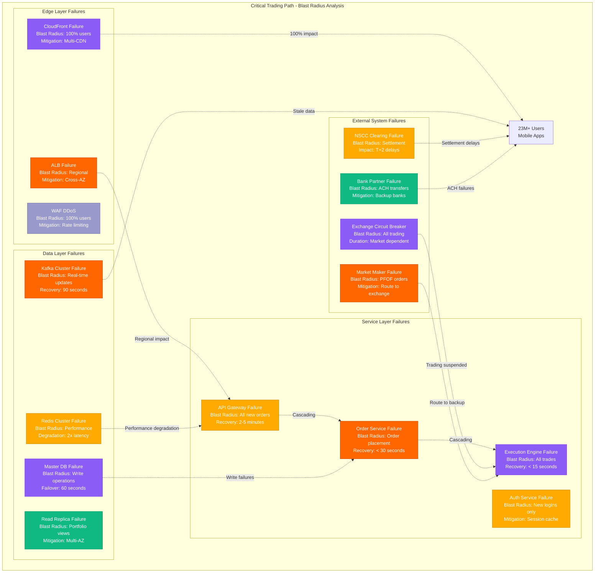
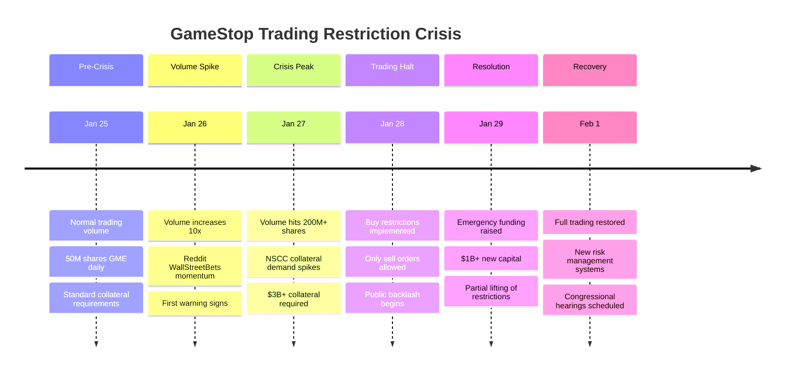
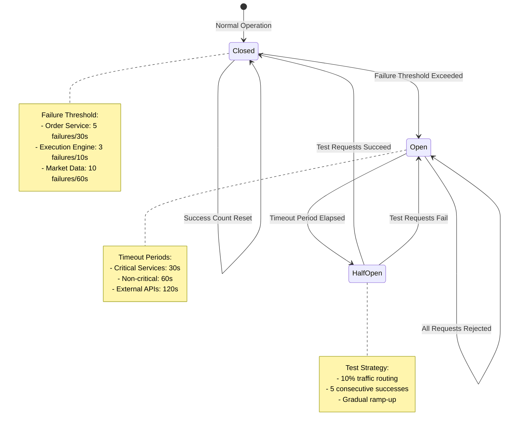
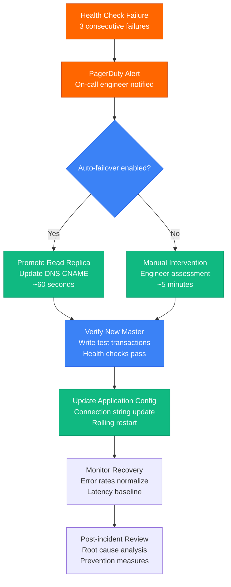
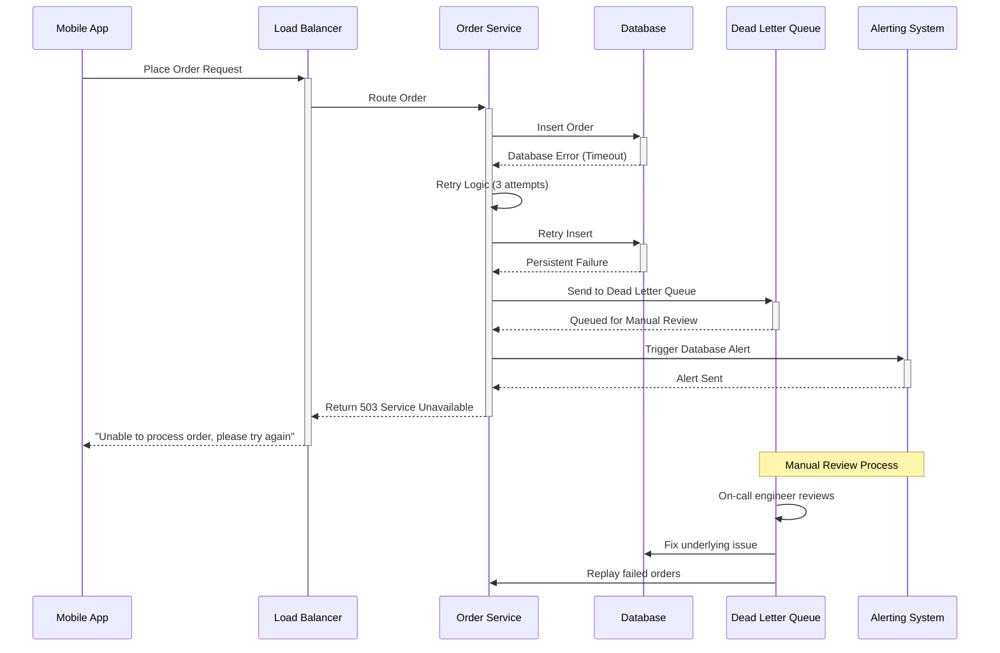
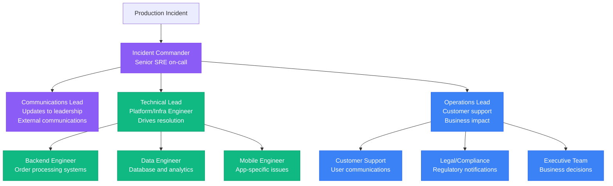
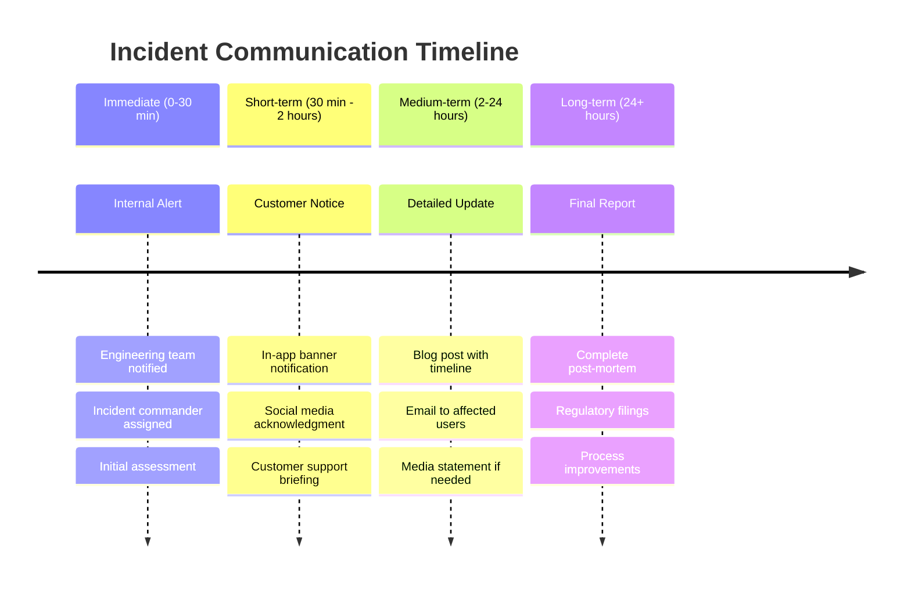

# Robinhood Failure Domains

## Trading Halts and Critical Failure Analysis

Comprehensive failure domain mapping for a financial trading platform handling $130B+ in assets, including blast radius analysis and incident response procedures based on real production outages.



## Historical Incident Analysis

### GameStop Crisis (January 28, 2021)



**Failure Analysis:**
- **Root Cause**: Unprecedented trading volume caused collateral requirements to exceed available capital
- **Blast Radius**: Affected trading in 13 "meme stocks" for 4 days
- **Recovery Time**: 72 hours to restore full functionality
- **Lessons Learned**: Implemented dynamic collateral management and increased funding reserves

### System Outage (March 2, 2020)

```mermaid
timeline
    title March 2020 System Outage

    section Normal Operations
        6:00 AM : Pre-market trading active
                : Systems functioning normally
                : 15M+ active users

    section First Signs
        9:20 AM : Increased API latency
                : Database connection spikes
                : Load balancer warnings

    section Complete Failure
        9:30 AM : Market open - total outage
                : Unable to place orders
                : Authentication failures

    section Partial Recovery
        1:00 PM : Read-only mode restored
                : Users can view portfolios
                : No trading functionality

    section Full Recovery
        3:00 PM : Trading functionality restored
                : All systems operational
                : Post-mortem initiated
```

**Failure Analysis:**
- **Root Cause**: Database connection pool exhaustion during market volatility
- **Blast Radius**: 100% of users unable to trade for 5.5 hours
- **Financial Impact**: Estimated $20M+ in lost revenue
- **Remediation**: Increased connection pools, auto-scaling improvements

## Circuit Breaker Implementation

### Service-Level Circuit Breakers



### Market-Level Circuit Breakers

| Trigger Condition | Action | Duration | Recovery |
|-------------------|--------|----------|----------|
| **S&P 500 down 7%** | Halt all trading | 15 minutes | Automatic resume |
| **S&P 500 down 13%** | Halt all trading | 15 minutes | Automatic resume |
| **S&P 500 down 20%** | Halt until close | Rest of day | Next day open |
| **Individual stock ±10%** | 5-minute halt | 5 minutes | Automatic resume |
| **Volatility spike** | Slow mode | Variable | Market dependent |

## Failure Recovery Procedures

### Database Failover Process



### Order Processing Failure Handling



## Monitoring and Alerting

### Critical System Health Metrics

| Metric | Warning Threshold | Critical Threshold | Response Time |
|--------|------------------|-------------------|---------------|
| **Order Latency** | p99 > 100ms | p99 > 500ms | 2 minutes |
| **Database Connections** | > 80% pool | > 95% pool | 1 minute |
| **API Error Rate** | > 1% | > 5% | 30 seconds |
| **Trading Volume** | 5x normal | 10x normal | Immediate |
| **Cash Balance Discrepancy** | > $1M | > $10M | Immediate |

### Incident Response Team Structure



## Regulatory Compliance During Incidents

### Required Notifications

| Incident Type | Regulator | Notification Window | Report Format |
|---------------|-----------|-------------------|---------------|
| **Trading System Outage** | SEC, FINRA | 24 hours | Form SCI |
| **Data Breach** | SEC, State AGs | 72 hours | Written report |
| **Settlement Failure** | NSCC, FINRA | Same day | Phone + email |
| **Market Making Issues** | SEC | 24 hours | Written notice |
| **Customer Fund Issues** | SIPC, State | Immediate | Phone call |

### Customer Communication Requirements



## Business Continuity

### Market Hours Coverage

- **Pre-Market**: 4:00 AM - 9:30 AM EST (Skeleton crew, automated systems)
- **Regular Hours**: 9:30 AM - 4:00 PM EST (Full staffing, all systems)
- **After Hours**: 4:00 PM - 8:00 PM EST (Reduced staffing, limited trading)
- **Overnight**: 8:00 PM - 4:00 AM EST (Maintenance window, system updates)

### Disaster Recovery Sites

- **Primary**: US-East-1 (N. Virginia) - Production workloads
- **Secondary**: US-West-2 (Oregon) - Hot standby, 5-minute failover
- **Tertiary**: EU-West-1 (Ireland) - Cold backup, regulatory compliance

*"In financial services, every second of downtime costs money and trust. Our failure domain design ensures that when something breaks at 3 AM, we can fix it before the market opens."* - Robinhood Site Reliability Team