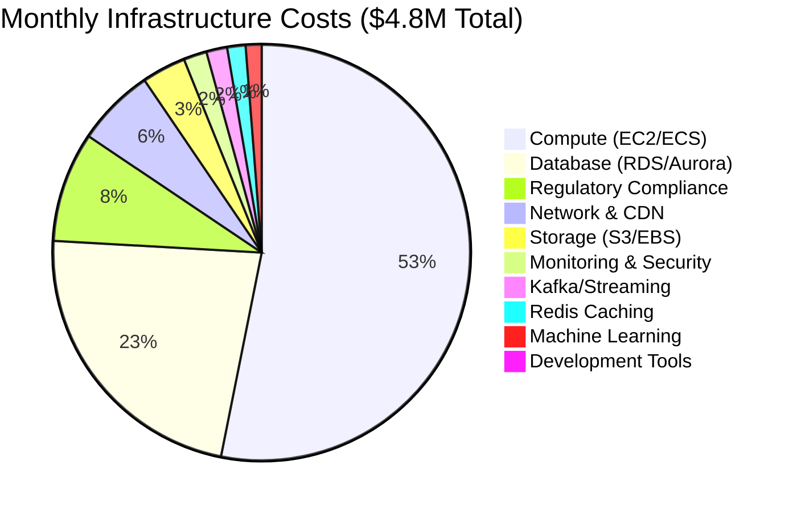
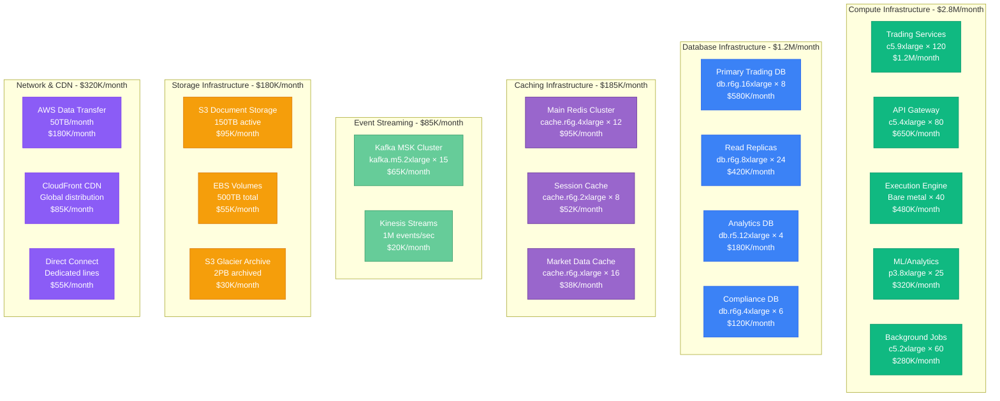
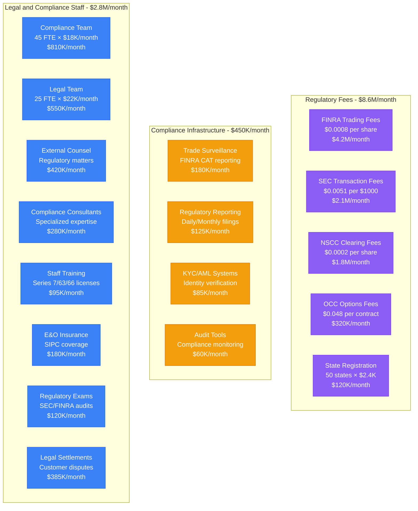
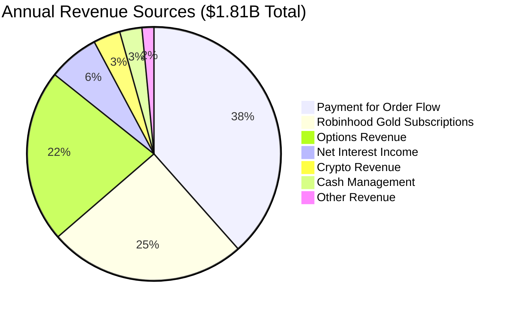
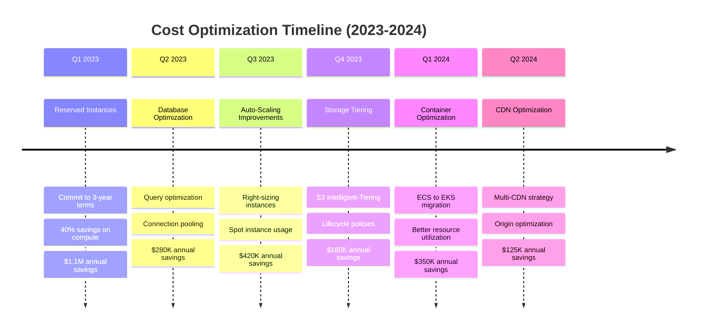
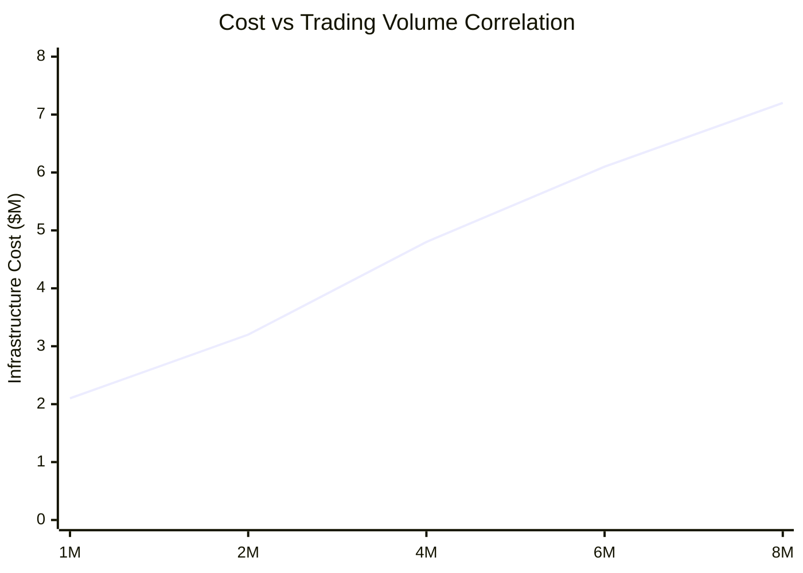
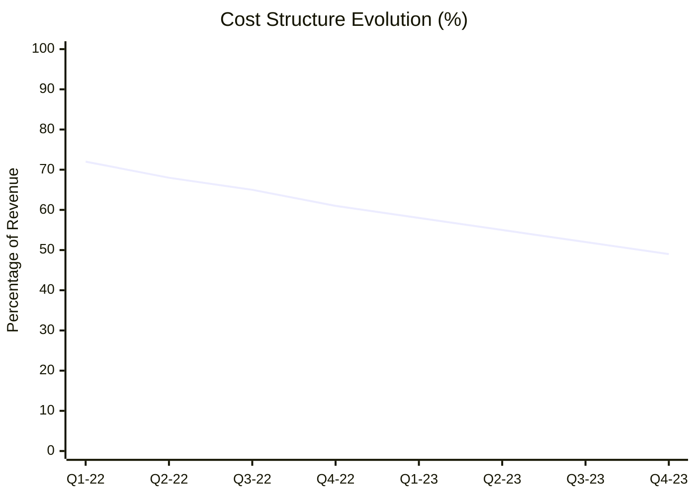

# Robinhood Cost Breakdown

## Infrastructure and Regulatory Economics

Comprehensive cost analysis for operating a commission-free trading platform serving 23M+ users with $130B+ assets under custody, including infrastructure, regulatory, and operational expenses.



## Detailed Cost Structure

### Infrastructure Costs (Monthly)



## Regulatory and Compliance Costs

### Monthly Regulatory Expenses



## Revenue vs Cost Analysis

### Unit Economics Per User (Monthly)

| Metric | Value | Calculation | Trend |
|--------|-------|-------------|-------|
| **Average Revenue Per User** | $6.82 | Total revenue ÷ 23M users | ↗ +12% YoY |
| **Infrastructure Cost Per User** | $0.21 | $4.8M ÷ 23M users | ↘ -8% YoY |
| **Regulatory Cost Per User** | $0.49 | $11.4M ÷ 23M users | ↗ +15% YoY |
| **Total Cost Per User** | $2.94 | All costs ÷ 23M users | ↗ +3% YoY |
| **Gross Margin Per User** | $3.88 | Revenue - Costs | ↗ +18% YoY |

### Revenue Sources (Annual)



## Cost Optimization Strategies

### Infrastructure Cost Reduction Initiatives



### Trading Volume Cost Scaling



**Key Insights**:
- Infrastructure costs scale sub-linearly with volume
- Regulatory costs scale linearly with volume
- Fixed costs (compliance, legal) provide leverage at scale

## Competitive Cost Analysis

### Cost Per Trade Comparison

| Broker | Infrastructure Cost/Trade | Regulatory Cost/Trade | Total Cost/Trade |
|--------|--------------------------|----------------------|------------------|
| **Robinhood** | $0.012 | $0.028 | $0.040 |
| **Schwab** | $0.045 | $0.035 | $0.080 |
| **E*TRADE** | $0.038 | $0.032 | $0.070 |
| **TD Ameritrade** | $0.042 | $0.034 | $0.076 |
| **Interactive Brokers** | $0.018 | $0.029 | $0.047 |

### Payment for Order Flow Economics

```mermaid
sankey-beta
    title Payment for Order Flow Revenue Distribution

    Market Makers,380,Robinhood
    Robinhood,95,Technology Infrastructure
    Robinhood,85,Regulatory Compliance
    Robinhood,65,Customer Support
    Robinhood,45,Marketing & Growth
    Robinhood,90,Profit & Reinvestment
```

**PFOF Details**:
- **Average per share**: $0.0012 for retail equity orders
- **Volume**: ~316B shares annually routed to market makers
- **Top market makers**: Citadel Securities (40%), Virtu (25%), Two Sigma (15%)
- **Price improvement**: Average $0.0017 per share to customers

## Cost Centers Deep Dive

### Engineering Team Costs (Monthly)

| Team | Headcount | Average Salary | Monthly Cost | Focus Area |
|------|-----------|----------------|--------------|------------|
| **Platform Engineering** | 85 | $185K | $1.31M | Core trading infrastructure |
| **Mobile Engineering** | 45 | $175K | $656K | iOS/Android apps |
| **Data Engineering** | 32 | $190K | $507K | Analytics and ML |
| **Security Engineering** | 28 | $195K | $455K | Compliance and security |
| **Site Reliability** | 22 | $200K | $367K | Operations and monitoring |
| **QA Engineering** | 18 | $145K | $218K | Testing and validation |

### Third-Party Service Costs (Monthly)

| Service | Provider | Monthly Cost | Purpose |
|---------|----------|--------------|---------|
| **Market Data** | Thomson Reuters | $285K | Real-time quotes, fundamentals |
| **KYC/AML** | Jumio + internal | $95K | Identity verification |
| **Fraud Detection** | Sift Science | $65K | Transaction monitoring |
| **Customer Support** | Zendesk + staff | $180K | Help desk and chat |
| **Monitoring** | DataDog + PagerDuty | $85K | Infrastructure monitoring |
| **Security** | CrowdStrike + tools | $125K | Endpoint and network security |

## Business Impact of Costs

### Cost as % of Revenue (Quarterly)



### Profitability by User Segment

| User Segment | % of Users | Revenue/User/Month | Cost/User/Month | Margin/User/Month |
|--------------|------------|-------------------|-----------------|-------------------|
| **Robinhood Gold** | 8% | $28.50 | $4.20 | $24.30 |
| **Active Traders** | 15% | $18.75 | $3.85 | $14.90 |
| **Options Traders** | 22% | $12.40 | $3.15 | $9.25 |
| **Casual Investors** | 35% | $4.20 | $2.60 | $1.60 |
| **Inactive Users** | 20% | $0.85 | $1.95 | -$1.10 |

## Future Cost Projections

### Scaling Cost Model (2024-2026)

```mermaid
graph TB
    subgraph Current[2023: Current State]
        USERS_23[23M Users<br/>$4.8M/month infra<br/>$11.4M/month regulatory]
    end

    subgraph Year1[2024: 30M Users (+30%)]
        USERS_24[30M Users<br/>$5.8M/month infra (+21%)<br/>$14.2M/month regulatory (+25%)]
    end

    subgraph Year2[2025: 40M Users (+33%)]
        USERS_25[40M Users<br/>$7.1M/month infra (+22%)<br/>$18.5M/month regulatory (+30%)]
    end

    subgraph Year3[2026: 55M Users (+38%)]
        USERS_26[55M Users<br/>$8.8M/month infra (+24%)<br/>$24.8M/month regulatory (+34%)]
    end

    Current --> Year1
    Year1 --> Year2
    Year2 --> Year3

    classDef currentStyle fill:#3B82F6,stroke:#2563EB,color:#fff
    classDef futureStyle fill:#10B981,stroke:#059669,color:#fff

    class USERS_23 currentStyle
    class USERS_24,USERS_25,USERS_26 futureStyle
```

**Key Assumptions**:
- User growth rate: 25-30% annually
- Infrastructure cost growth: 20-25% annually (economies of scale)
- Regulatory cost growth: 25-35% annually (compliance expansion)
- Revenue per user growth: 15-20% annually

*"Our cost structure reflects the reality of building financial infrastructure - every dollar spent on compliance and security protects billions in customer assets."* - Robinhood Finance Team