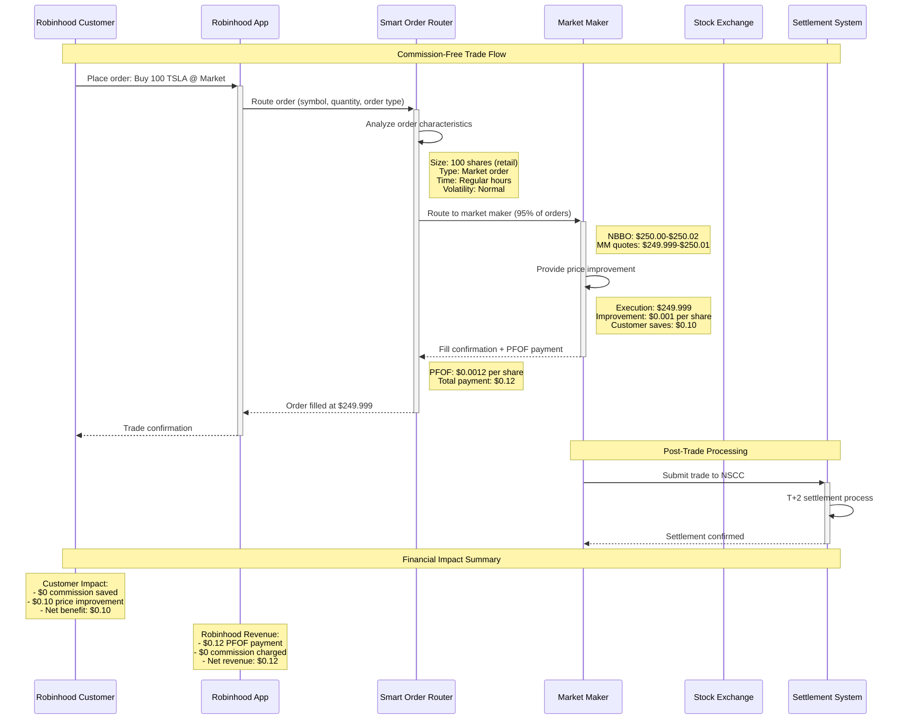
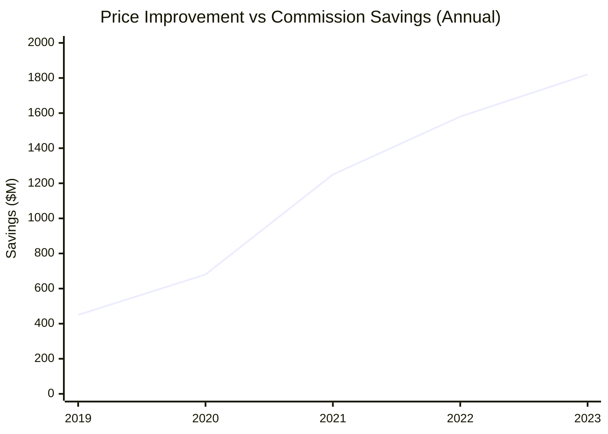
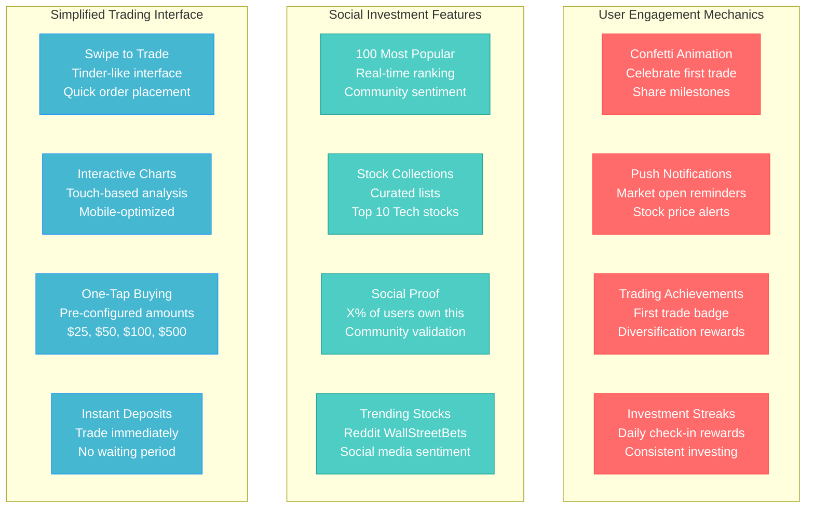
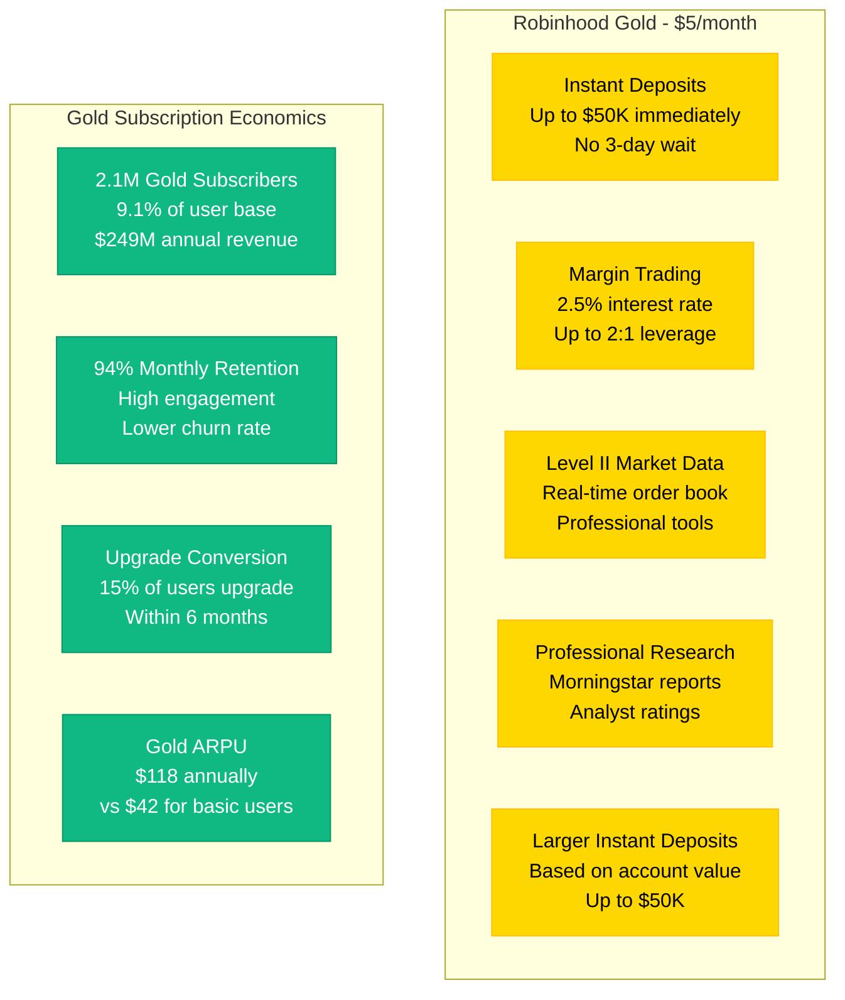
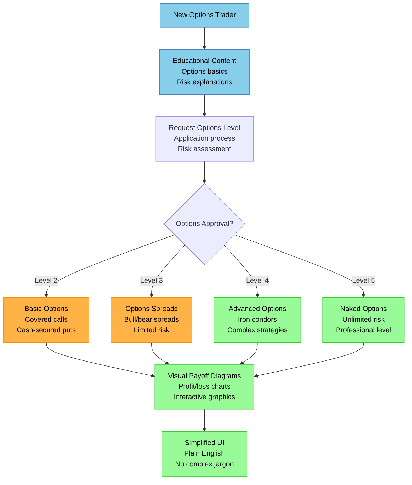
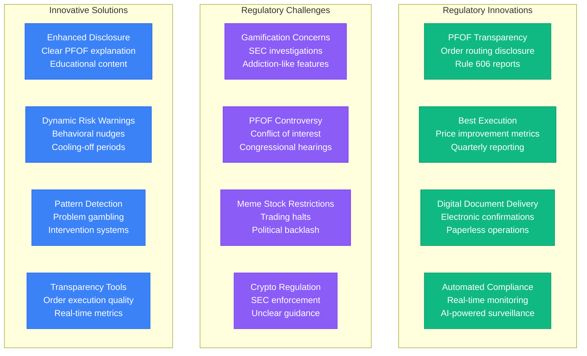
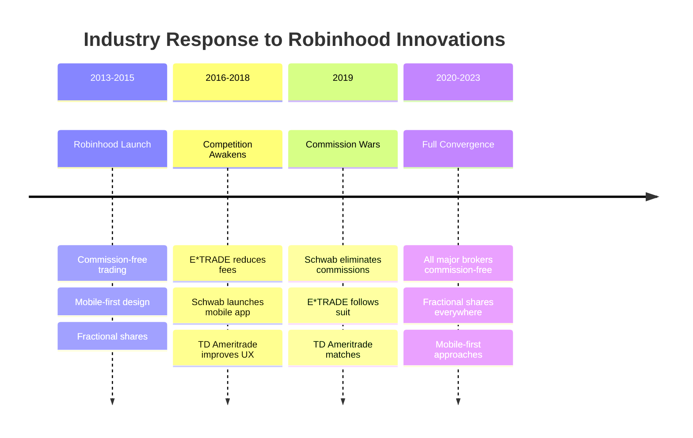

# Robinhood Novel Solutions

## Innovation in Retail Trading

Revolutionary approaches that democratized investing: commission-free trading through payment for order flow, fractional shares for expensive stocks, and gamified mobile-first experience that brought 23M+ users to the markets.

```mermaid
graph TB
    subgraph PaymentForOrderFlow[Payment for Order Flow (PFOF) - $380M Annual Revenue]
        RETAIL_ORDER[Retail Customer Order<br/>Buy 100 AAPL @ $150<br/>Total value: $15,000]

        PFOF_ROUTER[Smart Order Router<br/>Analyzes order characteristics<br/>Size, timing, volatility]

        DECISION{Order Size & Type}

        MARKET_MAKER[Market Maker<br/>Citadel Securities<br/>Two Sigma, Virtu]

        EXCHANGE[Public Exchange<br/>NYSE, NASDAQ<br/>BATS, IEX]

        PRICE_IMPROVE[Price Improvement<br/>NBBO: $150.00<br/>Execution: $149.998<br/>Customer saves $2.00]

        PFOF_PAYMENT[PFOF Payment<br/>$0.0012 per share<br/>$120 to Robinhood<br/>$2.00 saved for customer]

        RETAIL_ORDER --> PFOF_ROUTER
        PFOF_ROUTER --> DECISION

        DECISION -->|< 1000 shares<br/>Low volatility| MARKET_MAKER
        DECISION -->|> 1000 shares<br/>High volatility| EXCHANGE

        MARKET_MAKER --> PRICE_IMPROVE
        PRICE_IMPROVE --> PFOF_PAYMENT
    end

    subgraph FractionalShares[Fractional Shares - Democratizing Expensive Stocks]
        EXPENSIVE_STOCK[Berkshire Hathaway A<br/>Stock Price: $500,000<br/>Minimum: $1]

        FRACTION_ORDER[Customer Order<br/>$100 investment<br/>0.0002 shares]

        SHARE_POOLING[Share Pooling System<br/>Aggregate fractional orders<br/>PostgreSQL tracking]

        FULL_SHARE_PURCHASE[Full Share Purchase<br/>When pool reaches 1+ shares<br/>Execute on exchange]

        OWNERSHIP_TRACKING[Ownership Database<br/>Precise fractional tracking<br/>8 decimal places]

        DIVIDEND_CALC[Dividend Distribution<br/>Pro-rata calculation<br/>$0.02 dividend on $100]

        EXPENSIVE_STOCK --> FRACTION_ORDER
        FRACTION_ORDER --> SHARE_POOLING
        SHARE_POOLING --> FULL_SHARE_PURCHASE
        FULL_SHARE_PURCHASE --> OWNERSHIP_TRACKING
        OWNERSHIP_TRACKING --> DIVIDEND_CALC
    end

    subgraph MobileFirst[Mobile-First Trading Experience]
        MOBILE_UX[Gamified Interface<br/>Confetti animations<br/>Push notifications]

        INSTANT_DEPOSITS[Instant Deposits<br/>Robinhood Instant<br/>Credit line up to $5K]

        CRYPTO_TRADING[24/7 Crypto Trading<br/>Commission-free<br/>Real-time settlement]

        OPTIONS_SIMPLE[Simplified Options<br/>Level 2-5 trading<br/>Visual profit/loss]

        SOCIAL_FEATURES[Social Features<br/>Most popular stocks<br/>Community sentiment]

        MICRO_INVESTING[Micro-Investing<br/>Round-up purchases<br/>Recurring investments]
    end

    classDef pfofStyle fill:#10B981,stroke:#059669,color:#fff
    classDef fractionalStyle fill:#3B82F6,stroke:#2563EB,color:#fff
    classDef mobileStyle fill:#F59E0B,stroke:#D97706,color:#fff
    classDef innovationStyle fill:#9966CC,stroke:#663399,color:#fff

    class RETAIL_ORDER,PFOF_ROUTER,MARKET_MAKER,PRICE_IMPROVE,PFOF_PAYMENT pfofStyle
    class EXPENSIVE_STOCK,FRACTION_ORDER,SHARE_POOLING,OWNERSHIP_TRACKING,DIVIDEND_CALC fractionalStyle
    class MOBILE_UX,INSTANT_DEPOSITS,CRYPTO_TRADING,OPTIONS_SIMPLE,SOCIAL_FEATURES,MICRO_INVESTING mobileStyle
    class DECISION,FULL_SHARE_PURCHASE,EXCHANGE innovationStyle
```

## Payment for Order Flow Deep Dive

### PFOF Revenue Model Architecture



### Market Maker Relationships

| Market Maker | % of Volume | Annual PFOF Paid | Specialization |
|--------------|-------------|------------------|----------------|
| **Citadel Securities** | 40% | $152M | Equity market making |
| **Virtu Americas** | 25% | $95M | High-frequency trading |
| **Two Sigma Securities** | 15% | $57M | Quantitative strategies |
| **G1 Execution Services** | 12% | $46M | Options market making |
| **Wolverine Securities** | 8% | $30M | ETF and options |

### Price Improvement Statistics



**2023 Price Improvement Data**:
- **Average improvement**: $0.0017 per share
- **Total customer savings**: $1.82B annually
- **Commission savings**: $1.44B annually (vs $4.95/trade industry average)
- **Net customer benefit**: $3.26B annually

## Fractional Shares Implementation

### Technical Architecture

```mermaid
graph TB
    subgraph CustomerLayer[Customer Interface]
        MOBILE_APP[Mobile App<br/>Min investment: $1<br/>UI shows fractional ownership]
        WEB_APP[Web Interface<br/>Portfolio fractional display<br/>Real-time valuations]
    end

    subgraph OrderProcessing[Order Processing Layer]
        FRACTION_API[Fractional Order API<br/>Validates minimum amounts<br/>Converts to decimal shares]
        POOLING_ENGINE[Share Pooling Engine<br/>Aggregates customer orders<br/>Creates full share orders]
        EXECUTION_ENGINE[Execution Engine<br/>Purchases full shares<br/>Routes to exchanges]
    end

    subgraph StorageLayer[Storage & Tracking]
        OWNERSHIP_DB[(Ownership Database<br/>PostgreSQL with DECIMAL(18,8)<br/>8 decimal place precision)]
        POOL_DB[(Pool Database<br/>Tracks pending fractional orders<br/>Real-time aggregation)]
        PRICE_CACHE[(Price Cache<br/>Redis with real-time quotes<br/>Sub-second updates)]
    end

    subgraph SettlementLayer[Settlement & Distribution]
        DIVIDEND_ENGINE[Dividend Distribution<br/>Pro-rata calculations<br/>Automated payments]
        CORP_ACTIONS[Corporate Actions<br/>Stock splits, spinoffs<br/>Fractional adjustments]
        TAX_REPORTING[Tax Reporting<br/>1099-DIV generation<br/>Cost basis tracking]
    end

    %% Connections
    MOBILE_APP --> FRACTION_API
    WEB_APP --> FRACTION_API
    FRACTION_API --> POOLING_ENGINE
    POOLING_ENGINE --> EXECUTION_ENGINE

    FRACTION_API --> OWNERSHIP_DB
    POOLING_ENGINE --> POOL_DB
    EXECUTION_ENGINE --> PRICE_CACHE

    OWNERSHIP_DB --> DIVIDEND_ENGINE
    OWNERSHIP_DB --> CORP_ACTIONS
    OWNERSHIP_DB --> TAX_REPORTING

    classDef customerStyle fill:#3B82F6,stroke:#2563EB,color:#fff
    classDef processingStyle fill:#10B981,stroke:#059669,color:#fff
    classDef storageStyle fill:#F59E0B,stroke:#D97706,color:#fff
    classDef settlementStyle fill:#9966CC,stroke:#663399,color:#fff

    class MOBILE_APP,WEB_APP customerStyle
    class FRACTION_API,POOLING_ENGINE,EXECUTION_ENGINE processingStyle
    class OWNERSHIP_DB,POOL_DB,PRICE_CACHE storageStyle
    class DIVIDEND_ENGINE,CORP_ACTIONS,TAX_REPORTING settlementStyle
```

### Fractional Share Pool Management

```mermaid
timeline
    title Fractional Share Pooling Process

    section Order Collection
        9:30 AM : Market opens
                : Customer orders start accumulating
                : Example: 847 orders for AMZN

    section Pool Aggregation
        9:35 AM : Pool reaches 1.0+ shares
                : Total: 1.247 shares worth
                : Execute 1 full share purchase

    section Remainder Management
        9:35 AM : 0.247 shares remain in pool
                : Continue accumulating orders
                : Track individual ownership

    section Distribution
        Settlement : Ownership allocated pro-rata
                  : Dividend rights distributed
                  : Cost basis calculated
```

### Fractional Share Economics

| Metric | Traditional Broker | Robinhood Fractional |
|--------|-------------------|---------------------|
| **Min Investment** | $3,500 (1 GOOGL share) | $1 |
| **Portfolio Diversification** | Limited by share price | Unlimited |
| **Dividend Participation** | Full shares only | Pro-rata fractional |
| **Market Accessibility** | High-income investors | All income levels |
| **Order Execution** | Direct to exchange | Pooled execution |

## Mobile-First Innovation

### Gamification Strategy



### Robinhood Gold Innovations



## Crypto Trading Innovation

### 24/7 Crypto Operations

```mermaid
graph TB
    subgraph CryptoInfra[Crypto Trading Infrastructure]
        CRYPTO_API[Crypto API<br/>24/7 operations<br/>No market hours]
        CUSTODY[Crypto Custody<br/>Cold storage 95%<br/>Hot wallet 5%]
        SETTLEMENT[Real-time Settlement<br/>No T+2 delay<br/>Instant ownership]
        SPREADS[Tight Spreads<br/>Market making<br/>Competitive pricing]
    end

    subgraph SupportedCrypto[Supported Cryptocurrencies]
        BTC[Bitcoin (BTC)<br/>Most liquid<br/>Institutional grade]
        ETH[Ethereum (ETH)<br/>Smart contracts<br/>DeFi exposure]
        DOGE[Dogecoin (DOGE)<br/>Meme coin<br/>Social trading]
        OTHERS[7+ Additional<br/>LTC, BCH, ETC<br/>Diversified portfolio]
    end

    subgraph CryptoFeatures[Crypto-Specific Features]
        RECURRING[Recurring Buys<br/>Dollar cost averaging<br/>Automated investing]
        ZERO_FEES[Zero Commission<br/>Market spread only<br/>No trading fees]
        FRACTIONAL_CRYPTO[Fractional Crypto<br/>$1 minimum<br/>Precise allocation]
        INSTANT_TRANSFER[Instant Transfers<br/>Crypto to cash<br/>Same-day availability]
    end

    classDef cryptoStyle fill:#F7931A,stroke:#FF8C00,color:#fff
    classDef supportStyle fill:#627EEA,stroke:#4169E1,color:#fff
    classDef featureStyle fill:#00D4AA,stroke:#00BFA5,color:#fff

    class CRYPTO_API,CUSTODY,SETTLEMENT,SPREADS cryptoStyle
    class BTC,ETH,DOGE,OTHERS supportStyle
    class RECURRING,ZERO_FEES,FRACTIONAL_CRYPTO,INSTANT_TRANSFER featureStyle
```

## Options Trading Simplification

### Democratizing Options Trading



## Regulatory Innovation and Challenges

### Novel Regulatory Approaches



## Impact and Industry Transformation

### Market Democratization Metrics

| Metric | Pre-Robinhood (2012) | Post-Robinhood (2023) | Change |
|--------|---------------------|----------------------|--------|
| **Average Age of Investors** | 55 years | 38 years | -31% |
| **Minimum Investment** | $500-$2,500 | $1 | -99.96% |
| **Commission per Trade** | $4.95-$9.99 | $0 | -100% |
| **Options Trading Accessibility** | Complex applications | Simplified process | +500% participation |
| **Crypto Trading** | Coinbase only | Integrated platform | Mainstream adoption |

### Competitive Response



*"We didn't just build a trading app - we reimagined how an entire generation would interact with financial markets. Every feature was designed to remove barriers between people and investing."* - Robinhood Product Team