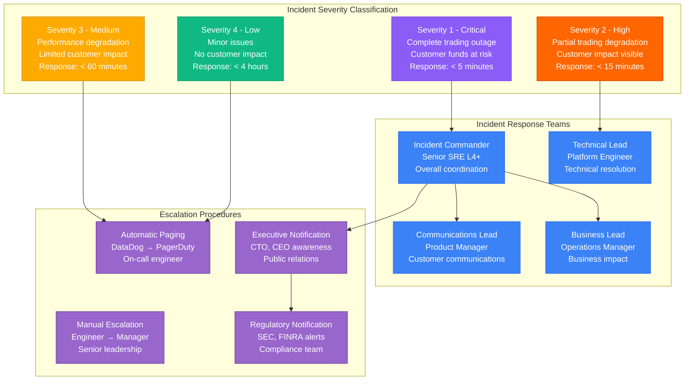
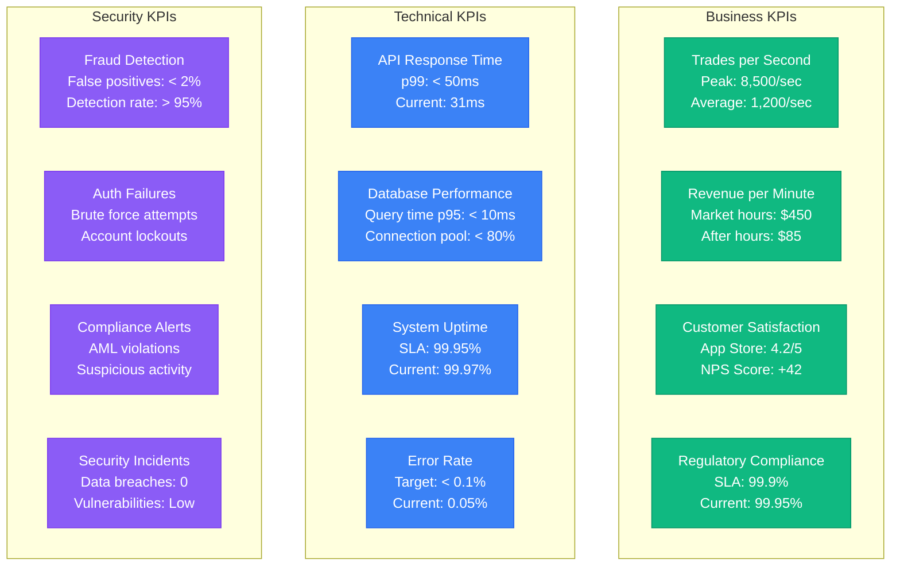
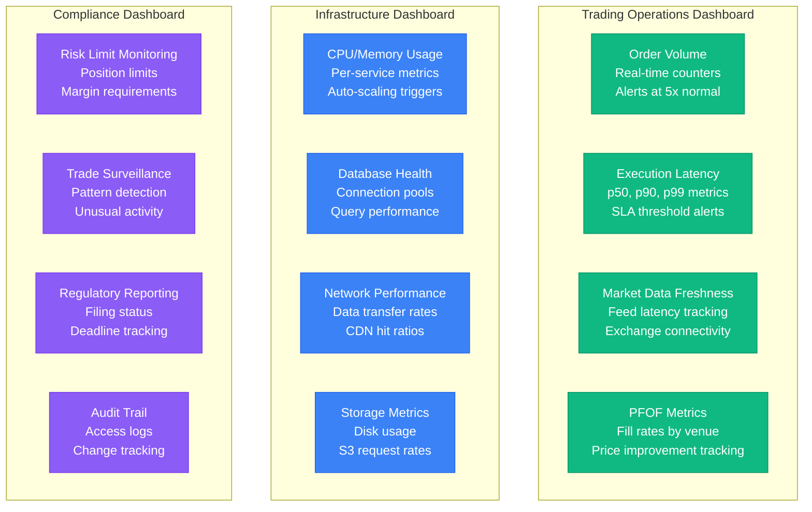
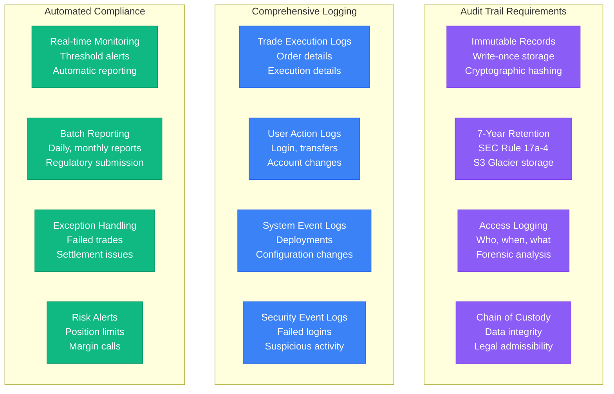
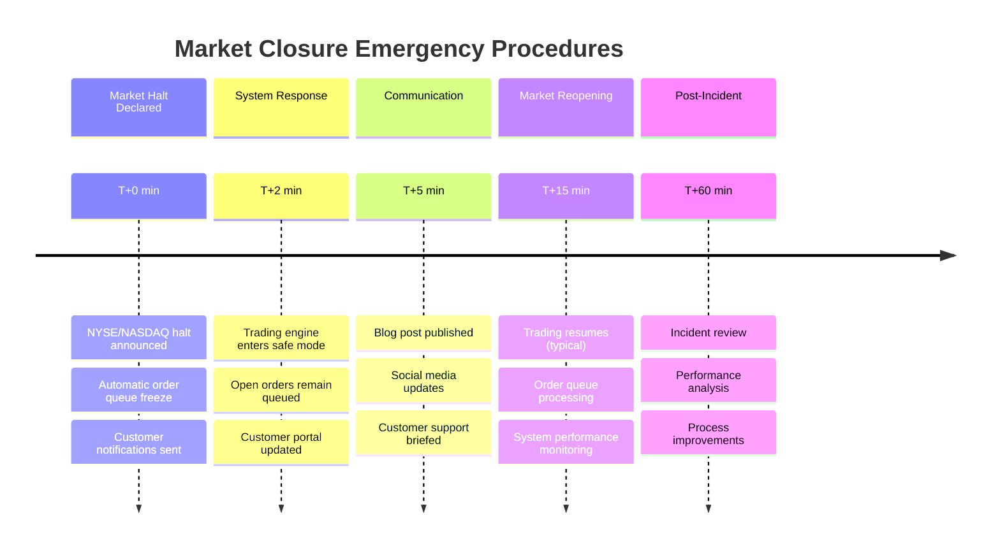

# Robinhood Production Operations

## 24/5 Trading Operations at Scale

Comprehensive production operations for a financial platform serving 23M+ users with $130B+ assets under custody, requiring 99.95% uptime during market hours and 24/5 operational excellence.

```mermaid
graph TB
    subgraph MarketHours[Market Hours Operations - 24/5 Coverage]

        subgraph PreMarket[Pre-Market: 4:00-9:30 AM EST]
            PM_ONCALL[On-Call Engineer<br/>L3 Site Reliability<br/>Remote monitoring]
            PM_MONITORING[System Health Checks<br/>Database performance<br/>Market data feeds]
            PM_DEPLOYMENT[Deployment Window<br/>Non-critical updates<br/>Infrastructure scaling]
        end

        subgraph RegularHours[Regular Market: 9:30 AM-4:00 PM EST]
            RH_INCIDENT[Incident Commander<br/>L4 Senior SRE<br/>In-office required]
            RH_TRADE_OPS[Trading Operations<br/>5 engineers<br/>War room setup]
            RH_CUSTOMER[Customer Support<br/>50+ agents<br/>Live chat/phone]
            RH_COMPLIANCE[Compliance Team<br/>Real-time monitoring<br/>Regulatory alerts]
        end

        subgraph AfterHours[After-Hours: 4:00-8:00 PM EST]
            AH_ONCALL[Reduced On-Call<br/>L2/L3 Engineers<br/>Extended hours trading]
            AH_MAINTENANCE[System Maintenance<br/>Database optimization<br/>Cache warming]
            AH_REPORTS[End-of-Day Reports<br/>Settlement processing<br/>Regulatory filing]
        end

        subgraph Overnight[Overnight: 8:00 PM-4:00 AM EST]
            ON_SKELETON[Skeleton Crew<br/>1 SRE on-call<br/>Critical alerts only]
            ON_BATCH[Batch Processing<br/>Settlement jobs<br/>Backup operations]
            ON_CRYPTO[Crypto Operations<br/>24/7 trading<br/>Weekend coverage]
        end
    end

    subgraph AlertingSystem[Alerting and Escalation]
        DATADOG[DataDog Monitoring<br/>Custom dashboards<br/>1000+ metrics]
        PAGERDUTY[PagerDuty Alerts<br/>Intelligent routing<br/>Escalation policies]
        SLACK[Slack Integration<br/>Real-time notifications<br/>War room channels]
        SMS[SMS/Voice Alerts<br/>Critical incidents<br/>Executive notifications]
    end

    subgraph DeploymentPipeline[Deployment Operations]
        JENKINS[Jenkins CI/CD<br/>Automated testing<br/>Code quality gates]
        SPINNAKER[Spinnaker Deploy<br/>Blue-green deployments<br/>Automatic rollback]
        KUBERNETES[Kubernetes Orchestration<br/>Container management<br/>Auto-scaling]
        CANARY[Canary Releases<br/>Gradual rollout<br/>A/B testing]
    end

    subgraph ComplianceOps[Compliance Operations]
        FINRA_REPORTS[FINRA Reporting<br/>Daily CAT submissions<br/>Trade surveillance]
        SEC_FILING[SEC Filings<br/>Rule 606 reports<br/>Best execution]
        AUDIT_TRAIL[Audit Trail<br/>Immutable logs<br/>Forensic analysis]
        RISK_MONITORING[Risk Monitoring<br/>Real-time limits<br/>Pattern detection]
    end

    %% Connections
    PM_MONITORING --> DATADOG
    RH_TRADE_OPS --> PAGERDUTY
    AH_MAINTENANCE --> JENKINS
    ON_BATCH --> FINRA_REPORTS

    DATADOG --> PAGERDUTY
    PAGERDUTY --> SLACK
    SLACK --> SMS

    JENKINS --> SPINNAKER
    SPINNAKER --> KUBERNETES
    KUBERNETES --> CANARY

    FINRA_REPORTS --> AUDIT_TRAIL
    SEC_FILING --> AUDIT_TRAIL
    RISK_MONITORING --> PAGERDUTY

    classDef marketStyle fill:#10B981,stroke:#059669,color:#fff
    classDef alertStyle fill:#FF6600,stroke:#CC4400,color:#fff
    classDef deployStyle fill:#3B82F6,stroke:#2563EB,color:#fff
    classDef complianceStyle fill:#8B5CF6,stroke:#7C3AED,color:#fff

    class PM_ONCALL,PM_MONITORING,RH_INCIDENT,RH_TRADE_OPS,AH_ONCALL,ON_SKELETON marketStyle
    class DATADOG,PAGERDUTY,SLACK,SMS alertStyle
    class JENKINS,SPINNAKER,KUBERNETES,CANARY deployStyle
    class FINRA_REPORTS,SEC_FILING,AUDIT_TRAIL,RISK_MONITORING complianceStyle
```



## Operational Schedule and Staffing

### 24/5 Coverage Model

```mermaid
gantt
    title Weekly Operations Schedule
    dateFormat X
    axisFormat %H:%M

    section Monday
    Pre-Market (4 AM)    :0, 330
    Regular Hours (9:30 AM) :330, 960
    After Hours (4 PM)   :960, 1200
    Overnight (8 PM)     :1200, 1440

    section Tuesday-Thursday
    Pre-Market           :0, 330
    Regular Hours        :330, 960
    After Hours          :960, 1200
    Overnight            :1200, 1440

    section Friday
    Pre-Market           :0, 330
    Regular Hours        :330, 960
    Market Close         :960, 1020
    Weekly Maintenance   :1020, 1440

    section Weekend
    Crypto Only          :0, 1440
    System Maintenance   :0, 1440
    On-Call Reduced      :0, 1440
```

### Staffing Levels by Time Period

| Time Period | SRE Engineers | Support Agents | Compliance | Total Staff |
|-------------|---------------|----------------|------------|-------------|
| **Pre-Market (4:00-9:30 AM)** | 2 | 5 | 1 | 8 |
| **Regular Hours (9:30 AM-4:00 PM)** | 8 | 50 | 6 | 64 |
| **After Hours (4:00-8:00 PM)** | 3 | 15 | 2 | 20 |
| **Overnight (8:00 PM-4:00 AM)** | 1 | 3 | 1 | 5 |
| **Weekend (Crypto only)** | 1 | 5 | 1 | 7 |

## Incident Response Procedures

### Incident Severity Levels



### Historical Incident Response

#### GameStop Crisis Response (January 28, 2021)

```mermaid
timeline
    title GameStop Crisis - Incident Response Timeline

    section Early Morning (6:00 AM)
        Alert Triggered : NSCC collateral demand spike
                        : Automatic escalation to Sev 1
                        : Incident Commander assigned

    section Market Open (9:30 AM)
        Crisis Peak : Trading volume 1000x normal
                    : System performance degrading
                    : Customer complaints flooding

    section Emergency Response (10:00 AM)
        Decision Made : Restrict buying on meme stocks
                     : Executive team briefed
                     : Legal and compliance approval

    section Public Communication (11:00 AM)
        Blog Post : Explain collateral requirements
                  : Communicate trading restrictions
                  : Social media management

    section Resolution Planning (2:00 PM)
        Funding Secured : Emergency capital raise initiated
                        : $1B+ funding commitment
                        : Risk management updates

    section Gradual Recovery (Feb 1-5)
        Restrictions Lifted : Phased approach
                           : Monitor system performance
                           : Customer communication
```

## Deployment Operations

### Continuous Deployment Pipeline

```mermaid
flowchart LR
    subgraph Development[Development Phase]
        COMMIT[Code Commit<br/>GitHub Enterprise<br/>Peer review required]
        UNIT_TEST[Unit Tests<br/>Jest, PyTest<br/>85% coverage minimum]
        LINT[Code Quality<br/>ESLint, Black<br/>SonarQube analysis]
    end

    subgraph BuildPhase[Build and Package]
        BUILD[Docker Build<br/>Multi-stage builds<br/>Vulnerability scanning]
        REGISTRY[Container Registry<br/>ECR with signing<br/>Image scanning]
        SECURITY[Security Scan<br/>Snyk, Twistlock<br/>CVE detection]
    end

    subgraph TestingPhase[Testing Environment]
        INT_TEST[Integration Tests<br/>API testing<br/>Database migrations]
        PERF_TEST[Performance Tests<br/>Load testing<br/>Latency validation]
        SEC_TEST[Security Tests<br/>OWASP scanning<br/>Pen testing]
    end

    subgraph ProductionDeploy[Production Deployment]
        CANARY[Canary Deployment<br/>5% traffic<br/>Monitoring metrics]
        BLUE_GREEN[Blue-Green Deploy<br/>Zero downtime<br/>Instant rollback]
        FULL_DEPLOY[Full Deployment<br/>100% traffic<br/>Post-deploy validation]
    end

    COMMIT --> UNIT_TEST
    UNIT_TEST --> LINT
    LINT --> BUILD
    BUILD --> REGISTRY
    REGISTRY --> SECURITY
    SECURITY --> INT_TEST
    INT_TEST --> PERF_TEST
    PERF_TEST --> SEC_TEST
    SEC_TEST --> CANARY
    CANARY --> BLUE_GREEN
    BLUE_GREEN --> FULL_DEPLOY

    classDef devStyle fill:#10B981,stroke:#059669,color:#fff
    classDef buildStyle fill:#3B82F6,stroke:#2563EB,color:#fff
    classDef testStyle fill:#F59E0B,stroke:#D97706,color:#fff
    classDef prodStyle fill:#8B5CF6,stroke:#7C3AED,color:#fff

    class COMMIT,UNIT_TEST,LINT devStyle
    class BUILD,REGISTRY,SECURITY buildStyle
    class INT_TEST,PERF_TEST,SEC_TEST testStyle
    class CANARY,BLUE_GREEN,FULL_DEPLOY prodStyle
```



### Deployment Windows and Restrictions

| Time Period | Deployment Type | Risk Level | Approval Required |
|-------------|----------------|------------|-------------------|
| **Pre-Market (4:00-9:20 AM)** | Non-critical only | Low | Auto-approved |
| **Market Hours (9:30 AM-4:00 PM)** | Emergency only | Critical | CTO approval |
| **After Hours (4:00-8:00 PM)** | Standard releases | Medium | Engineering lead |
| **Overnight (8:00 PM-4:00 AM)** | All deployments | Low | Auto-approved |
| **Weekends** | All deployments | Low | Auto-approved |

## Monitoring and Observability

### Key Performance Indicators (KPIs)



### Custom Dashboard Configuration



## Compliance and Regulatory Operations

### Daily Regulatory Tasks

| Time | Task | Owner | System | SLA |
|------|------|-------|--------|-----|
| **2:00 AM** | NSCC Settlement File | Compliance | Automated | 3:00 AM |
| **6:00 AM** | FINRA CAT Reporting | Compliance | Automated | 7:00 AM |
| **8:00 AM** | Options Risk Report | Risk Team | Automated | 9:00 AM |
| **4:30 PM** | End-of-Day Trade Report | Operations | Automated | 5:30 PM |
| **6:00 PM** | Regulatory Filing Check | Compliance | Manual | 7:00 PM |

### Audit Trail Requirements



## Business Continuity and Disaster Recovery

### Disaster Recovery Sites

| Site | Purpose | RTO | RPO | Capacity |
|------|---------|-----|-----|----------|
| **Primary (us-east-1)** | Production | N/A | N/A | 100% |
| **Hot Standby (us-west-2)** | Active-passive | 5 min | 30 sec | 100% |
| **Cold Backup (eu-west-1)** | Disaster recovery | 4 hours | 15 min | 50% |

### Market Closure Procedures



*"Operating a financial platform means never sleeping - when the markets are closed, we're preparing for the next trading day, and when they're open, every second counts for our 23 million customers."* - Robinhood Operations Team