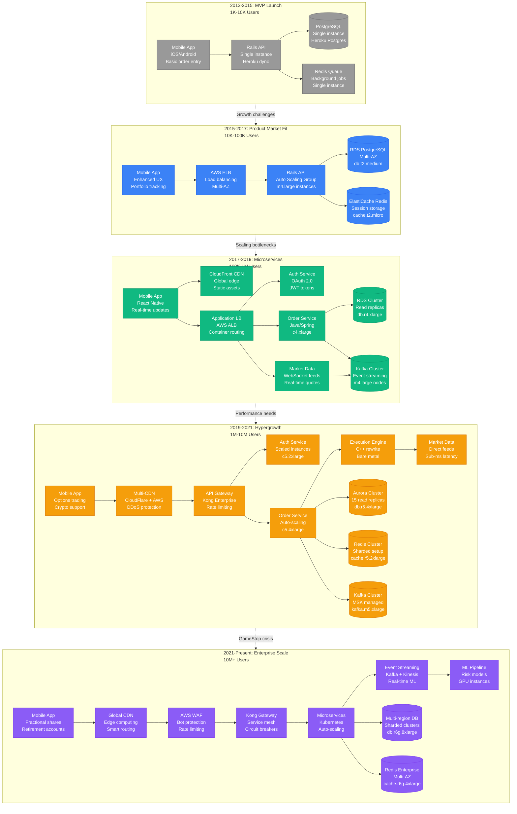
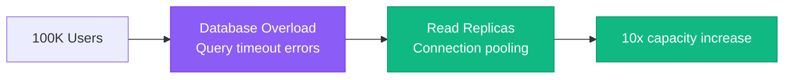
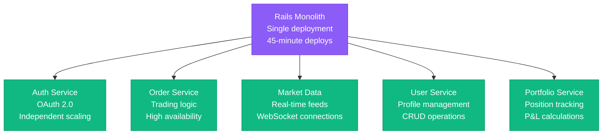
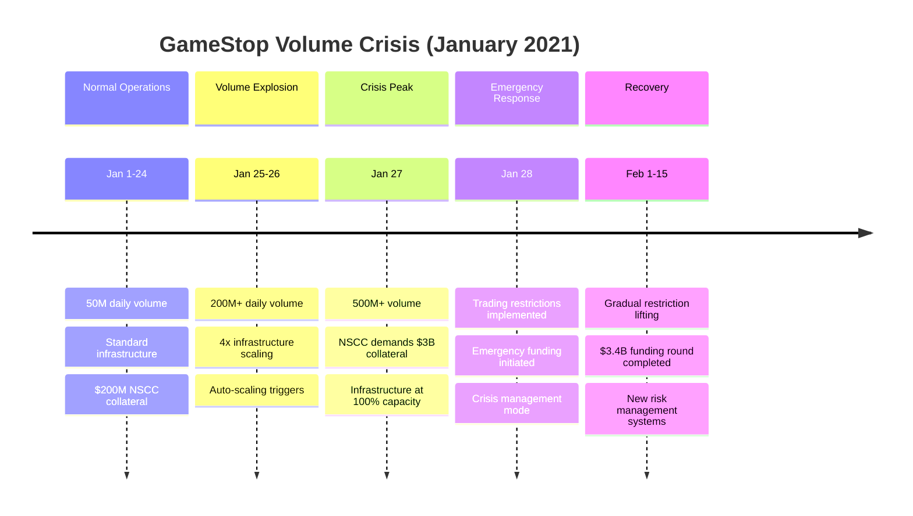
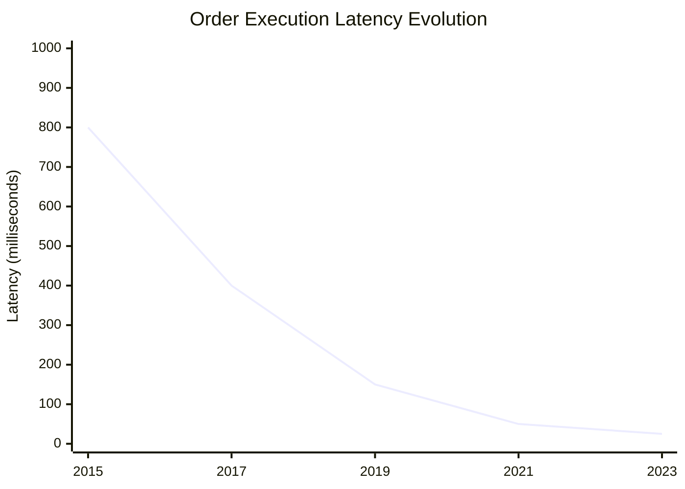
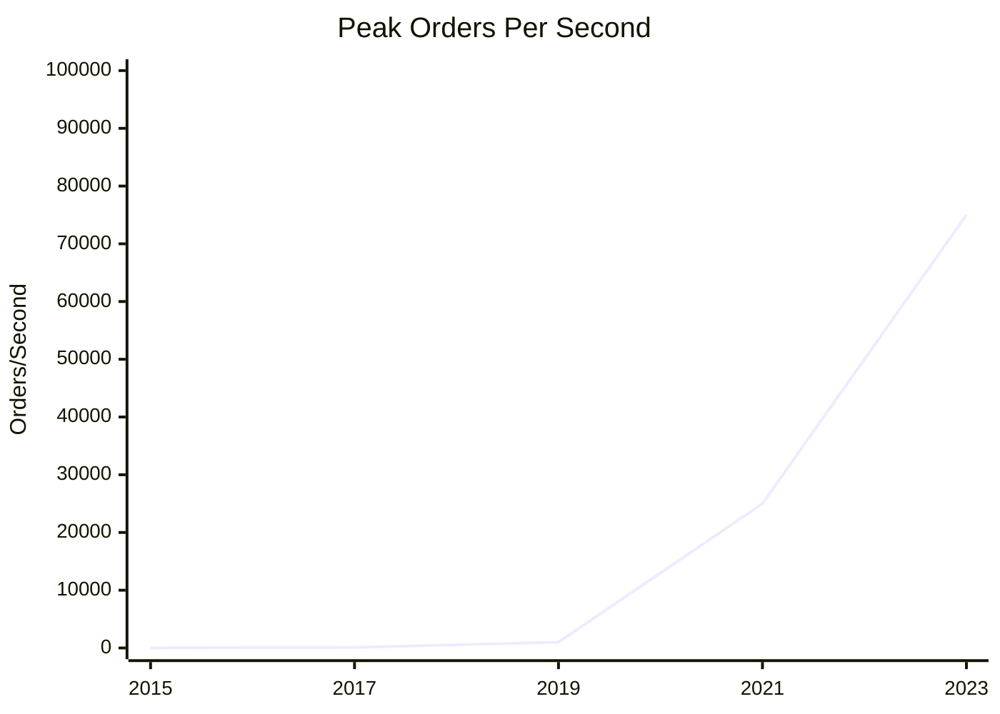
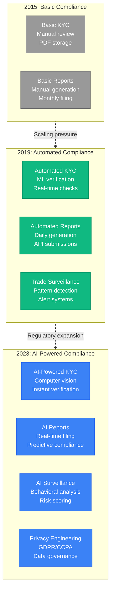

# Robinhood Scale Evolution

## From Startup to Meme Stock Mania

The architectural evolution of Robinhood from a simple trading app to handling 23M+ users and unprecedented retail trading volume during market volatility events.



## Scale Metrics Evolution

### User Growth and System Response

| Phase | Time Period | Users | Daily Trades | Infrastructure Cost | What Broke | How We Fixed It |
|-------|-------------|--------|---------------|-------------------|-------------|-----------------|
| **MVP** | 2013-2015 | 1K-10K | 100-1K | $2K/month | Single point of failure | Added load balancer |
| **PMF** | 2015-2017 | 10K-100K | 1K-10K | $25K/month | Database overload | Read replicas + caching |
| **Microservices** | 2017-2019 | 100K-1M | 10K-100K | $180K/month | Monolith bottlenecks | Service decomposition |
| **Hypergrowth** | 2019-2021 | 1M-10M | 100K-2M | $1.2M/month | Execution latency | C++ rewrite, bare metal |
| **Enterprise** | 2021-Present | 10M-23M+ | 2M-8M+ | $4.8M/month | Regulatory compliance | Enhanced monitoring |

### Critical Breaking Points and Solutions

```mermaid
timeline
    title Major Scaling Challenges and Solutions

    section 2015: Database Crisis
        Problem : Single PostgreSQL instance
                : 100% CPU utilization
                : 30-second query times

        Solution : RDS Multi-AZ deployment
                 : Read replicas for reporting
                 : Connection pooling

    section 2017: Monolith Bottleneck
        Problem : Single Rails application
                : Deploy time: 45 minutes
                : Cascading failures

        Solution : Microservices architecture
                 : Independent deployments
                 : Service isolation

    section 2019: Market Data Latency
        Problem : 500ms+ quote delays
                : Third-party API limits
                : User complaints spike

        Solution : Direct exchange feeds
                 : WebSocket connections
                 : Sub-second updates

    section 2021: GameStop Volume Crisis
        Problem : 1000x normal volume
                : NSCC collateral demands
                : Trading restrictions

        Solution : Dynamic scaling
                 : $3B+ funding round
                 : Enhanced risk management
```

## Architecture Evolution Details

### Phase 1: MVP (2013-2015) - Proof of Concept

**Challenge**: Build minimum viable trading app
- **Users**: 1,000-10,000 early adopters
- **Daily Volume**: 100-1,000 trades
- **Architecture**: Single Rails app on Heroku
- **Database**: Basic PostgreSQL on Heroku
- **Cost**: $2,000/month

**What Broke**:
- Single point of failure during market hours
- Database couldn't handle concurrent users
- No redundancy or failover

**Lessons Learned**:
- Financial apps need 99.9%+ uptime from day one
- Real-time market data is table stakes
- Regulatory compliance can't be an afterthought

### Phase 2: Product-Market Fit (2015-2017) - Scale to Success

**Challenge**: Handle 10x user growth while maintaining performance
- **Users**: 10,000-100,000 active traders
- **Daily Volume**: 1,000-10,000 trades
- **Architecture**: AWS with load balancing
- **Database**: RDS Multi-AZ with read replicas
- **Cost**: $25,000/month

**What Broke**:


### Phase 3: Microservices (2017-2019) - Breaking the Monolith

**Challenge**: Decompose monolith for independent scaling
- **Users**: 100,000-1,000,000 funded accounts
- **Daily Volume**: 10,000-100,000 trades
- **Architecture**: Microservices on AWS ECS
- **Database**: Aurora with specialized databases
- **Cost**: $180,000/month

**Service Decomposition Strategy**:


### Phase 4: Hypergrowth (2019-2021) - GameStop Era

**Challenge**: Handle unprecedented retail trading volume
- **Users**: 1,000,000-10,000,000 funded accounts
- **Daily Volume**: 100,000-2,000,000 trades (peak: 8M+ during GameStop)
- **Architecture**: Auto-scaling microservices
- **Database**: Sharded Aurora clusters
- **Cost**: $1,200,000/month

**GameStop Crisis Response**:


### Phase 5: Enterprise Scale (2021-Present) - Modern Financial Platform

**Challenge**: Become a full-service financial platform
- **Users**: 10,000,000-23,000,000+ funded accounts
- **Daily Volume**: 2,000,000-8,000,000+ trades
- **Architecture**: Cloud-native with ML/AI
- **Database**: Multi-region, globally distributed
- **Cost**: $4,800,000/month

**Current Architecture Capabilities**:
- **Fractional Shares**: Handle micro-transactions with precision
- **Options Trading**: Complex derivatives with real-time Greeks
- **Crypto Trading**: 24/7 operations with different settlement
- **Retirement Accounts**: IRA/401k with tax-loss harvesting
- **Cash Management**: FDIC-insured accounts with debit cards

## Performance Evolution

### Latency Improvements Over Time



### Throughput Scaling



## Infrastructure Cost Evolution

### Monthly Infrastructure Spend

| Component | 2015 | 2017 | 2019 | 2021 | 2023 |
|-----------|------|------|------|------|------|
| **Compute** | $800 | $8K | $45K | $280K | $1.2M |
| **Database** | $600 | $6K | $38K | $180K | $800K |
| **Storage** | $200 | $3K | $18K | $95K | $320K |
| **Network** | $150 | $2K | $12K | $75K | $180K |
| **Monitoring** | $50 | $1K | $8K | $35K | $95K |
| **Security** | $100 | $2K | $15K | $85K | $240K |
| **Compliance** | $200 | $3K | $24K | $120K | $450K |
| **TOTAL** | $2.1K | $25K | $160K | $870K | $3.3M |

### Cost Per User Evolution

- **2015**: $2.10 per user per month (unsustainable)
- **2017**: $0.83 per user per month (improving)
- **2019**: $0.32 per user per month (economies of scale)
- **2021**: $0.18 per user per month (optimized)
- **2023**: $0.14 per user per month (mature platform)

## Regulatory Scaling Challenges

### Compliance Infrastructure Growth



*"Scaling a financial platform isn't just about handling more users - it's about maintaining trust, compliance, and performance while your user base grows 23,000x in eight years."* - Robinhood Platform Engineering Team