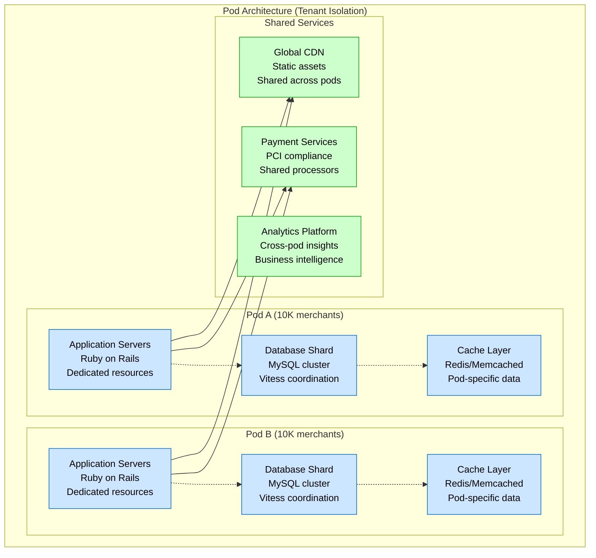
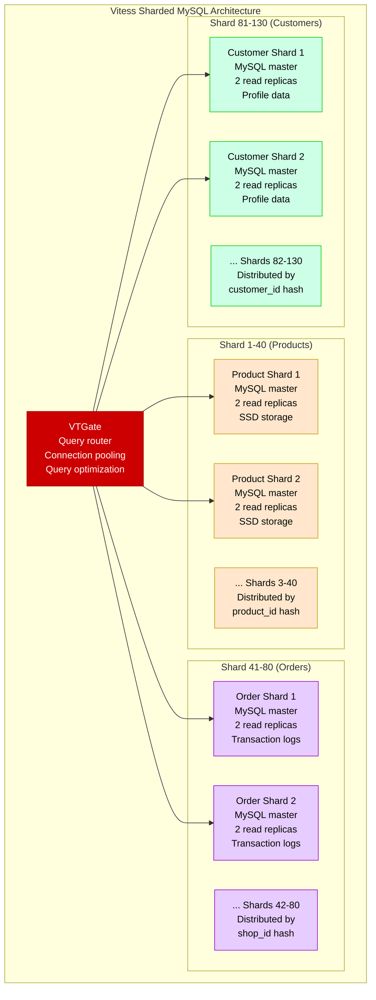

# Shopify Complete Architecture - "The E-commerce Platform Empire"

## System Overview

Shopify powers 1.75+ million merchants globally, processing $235+ billion in gross merchandise volume (GMV) annually. The platform handles massive scale with 10,500+ requests per second baseline, scaling to 100,000+ RPS during peak events like Black Friday. Their architecture supports multi-tenancy with strong isolation while maintaining sub-200ms response times globally.

## Complete Architecture Diagram

```mermaid
graph TB
    subgraph EdgePlane["Edge Plane - Blue #0066CC"]
        style EdgePlane fill:#0066CC,stroke:#004499,color:#fff
        subgraph "Global Edge Network"
            CDN[Shopify CDN<br/>CloudFlare + Custom<br/>Static assets<br/>300+ locations]
            EDGE_LB[Edge Load Balancers<br/>Geographic routing<br/>SSL termination<br/>DDoS protection]
            WAF[Web Application Firewall<br/>Bot protection<br/>Rate limiting<br/>Attack mitigation]
        end

        subgraph "Geographic Distribution"
            NA_EDGE[North America<br/>Primary region<br/>60% of traffic]
            EU_EDGE[Europe/EMEA<br/>Secondary region<br/>25% of traffic]
            APAC_EDGE[Asia Pacific<br/>Growing region<br/>15% of traffic]
        end
    end

    subgraph ServicePlane["Service Plane - Green #00AA00"]
        style ServicePlane fill:#00AA00,stroke:#007700,color:#fff
        subgraph "Core Application Stack"
            STOREFRONT[Storefront Renderer<br/>Liquid templating<br/>Theme engine<br/>Mobile-first design]
            CHECKOUT[Checkout Engine<br/>6-step process<br/>Payment optimization<br/>Conversion focus]
            ADMIN[Admin Dashboard<br/>Merchant tools<br/>Analytics<br/>Inventory management]
        end

        subgraph "Platform Services"
            API_GATEWAY[API Gateway<br/>REST + GraphQL<br/>Rate limiting<br/>Authentication]
            PAYMENTS[Payments Platform<br/>Shop Pay<br/>Multiple processors<br/>Global currencies]
            FULFILLMENT[Fulfillment Network<br/>Inventory tracking<br/>Shipping calculations<br/>Order management]
        end

        subgraph "Developer Platform"
            APP_PLATFORM[App Platform<br/>10K+ apps<br/>Marketplace<br/>Revenue sharing]
            WEBHOOKS[Webhook System<br/>Event-driven<br/>Reliable delivery<br/>Retry mechanisms]
            PLUS_APIS[Shopify Plus APIs<br/>Enterprise features<br/>Launchpad<br/>Flow automation]
        end
    end

    subgraph StatePlane["State Plane - Orange #FF8800"]
        style StatePlane fill:#FF8800,stroke:#CC6600,color:#fff
        subgraph "Primary Databases (Vitess Sharded)"
            VITESS[Vitess MySQL Cluster<br/>130+ shards<br/>Horizontal scaling<br/>Online schema changes]
            PRODUCTS_DB[Product Catalog<br/>50M+ products<br/>Variant management<br/>Search indexing]
            ORDERS_DB[Order Database<br/>1B+ orders<br/>Transaction logs<br/>Financial records]
            CUSTOMERS_DB[Customer Database<br/>100M+ customers<br/>Profile management<br/>Privacy compliance]
        end

        subgraph "Caching & Session Storage"
            REDIS[Redis Clusters<br/>Session storage<br/>Cart persistence<br/>Real-time data]
            MEMCACHED[Memcached<br/>Fragment caching<br/>Query results<br/>Computed data]
            ELASTICSEARCH[Elasticsearch<br/>Product search<br/>Analytics<br/>Log aggregation]
        end

        subgraph "Event Streaming & Analytics"
            KAFKA[Apache Kafka<br/>Event streaming<br/>Real-time data<br/>Microservice communication]
            ANALYTICS_DB[Analytics Warehouse<br/>BigQuery/Redshift<br/>Business intelligence<br/>Merchant insights]
            AUDIT_LOGS[Audit Logs<br/>Compliance tracking<br/>Change history<br/>Security monitoring]
        end
    end

    subgraph ControlPlane["Control Plane - Red #CC0000"]
        style ControlPlane fill:#CC0000,stroke:#990000,color:#fff
        subgraph "Deployment & Configuration"
            SHIPIT[Shipit Deploy System<br/>Continuous deployment<br/>Feature flags<br/>Gradual rollouts]
            CONFIG_MGMT[Configuration Management<br/>Environment-specific<br/>Secret management<br/>Feature toggles]
            MONITORING[Monitoring Stack<br/>Metrics collection<br/>Alerting<br/>Observability]
        end

        subgraph "Security & Compliance"
            SECURITY_CENTER[Security Operations<br/>Threat detection<br/>Incident response<br/>Vulnerability management]
            COMPLIANCE[Compliance Engine<br/>PCI DSS<br/>GDPR/CCPA<br/>SOX controls]
            FRAUD_DETECTION[Fraud Detection<br/>ML-based scoring<br/>Risk assessment<br/>Transaction monitoring]
        end
    end

    %% Traffic Flow with real metrics
    USER[1.75M Merchants<br/>Millions of customers] -->|"10.5K req/sec baseline<br/>100K peak RPS"| CDN
    CDN -->|"Static assets<br/>p99: 10ms"| EDGE_LB
    EDGE_LB -->|"SSL termination<br/>p99: 15ms"| WAF
    WAF -->|"Security filtering<br/>p99: 5ms"| STOREFRONT

    %% Service Interactions with metrics
    STOREFRONT -->|"Template rendering<br/>p95: 150ms"| API_GATEWAY
    CHECKOUT -->|"Payment processing<br/>p99: 200ms"| PAYMENTS
    ADMIN -->|"Order management<br/>p99: 100ms"| FULFILLMENT

    API_GATEWAY -->|"App requests<br/>Rate limited"| APP_PLATFORM
    PAYMENTS -->|"Payment events<br/>Async delivery"| WEBHOOKS
    FULFILLMENT -->|"Enterprise APIs<br/>SLA: 99.95%"| PLUS_APIS

    %% Data Connections with metrics
    STOREFRONT -->|"Product lookup<br/>130+ shards<br/>p99: 50ms"| VITESS
    CHECKOUT -->|"Inventory check<br/>50M+ products<br/>p99: 30ms"| PRODUCTS_DB
    ADMIN -->|"Order query<br/>1B+ orders<br/>p99: 80ms"| ORDERS_DB
    API_GATEWAY -->|"Customer data<br/>100M+ profiles<br/>p99: 20ms"| CUSTOMERS_DB

    VITESS -->|"Session cache<br/>95% hit rate<br/>p99: 1ms"| REDIS
    PRODUCTS_DB -->|"Fragment cache<br/>p99: 0.5ms"| MEMCACHED
    ORDERS_DB -->|"Search index<br/>Real-time"| ELASTICSEARCH

    REDIS -->|"Event streaming<br/>Order events"| KAFKA
    MEMCACHED -->|"Analytics ETL<br/>Business intelligence"| ANALYTICS_DB
    ELASTICSEARCH -->|"Audit trail<br/>Compliance logs"| AUDIT_LOGS

    %% Control Connections with monitoring
    SHIPIT -->|"Deploy automation<br/>Feature flags"| CONFIG_MGMT
    CONFIG_MGMT -->|"Config changes<br/>Real-time"| MONITORING
    SECURITY_CENTER -->|"Security events<br/>Threat analysis"| COMPLIANCE
    COMPLIANCE -->|"Risk scores<br/>ML-based"| FRAUD_DETECTION

    %% Apply four-plane colors
    classDef edgeStyle fill:#0066CC,stroke:#004499,color:#fff
    classDef serviceStyle fill:#00AA00,stroke:#007700,color:#fff
    classDef stateStyle fill:#FF8800,stroke:#CC6600,color:#fff
    classDef controlStyle fill:#CC0000,stroke:#990000,color:#fff

    class CDN,EDGE_LB,WAF,NA_EDGE,EU_EDGE,APAC_EDGE edgeStyle
    class STOREFRONT,CHECKOUT,ADMIN,API_GATEWAY,PAYMENTS,FULFILLMENT,APP_PLATFORM,WEBHOOKS,PLUS_APIS serviceStyle
    class VITESS,PRODUCTS_DB,ORDERS_DB,CUSTOMERS_DB,REDIS,MEMCACHED,ELASTICSEARCH,KAFKA,ANALYTICS_DB,AUDIT_LOGS stateStyle
    class SHIPIT,CONFIG_MGMT,MONITORING,SECURITY_CENTER,COMPLIANCE,FRAUD_DETECTION controlStyle
```

## Key Architecture Components

### Multi-Tenant Pod Architecture

Shopify uses a "pod" architecture where each group of merchants is isolated into separate resource pools:

### Vitess Database Sharding

## Production Scale Metrics

### Traffic Volume (2024)
- **Active Merchants**: 1.75+ million stores
- **GMV**: $235+ billion annually
- **Orders**: 1+ billion processed
- **Products**: 50+ million active listings
- **Customers**: 100+ million registered users

### Performance Characteristics
- **Response Time**: <200ms p95 globally
- **Throughput**: 10,500+ requests/second baseline
- **Peak Traffic**: 100,000+ RPS (Black Friday)
- **Database Shards**: 130+ MySQL clusters
- **Cache Hit Rate**: 95%+ for product data

### Black Friday 2023 Peak Metrics
- **Peak Traffic**: 4.1M requests/minute
- **Orders/Minute**: 11,700 peak
- **GMV**: $9.3 billion over weekend
- **Uptime**: 99.99% during peak
- **Response Time**: <150ms p95 maintained

## Infrastructure Specifications

### Application Servers
- **Ruby Version**: Ruby 3.1+ with YJIT
- **Rails Version**: Custom Rails 7.x
- **Server Type**: Puma application server
- **Instances**: 10,000+ application servers
- **Container**: Docker with Kubernetes orchestration

### Database Infrastructure
- **Primary**: MySQL 8.0 with Vitess
- **Sharding**: 130+ shards across multiple regions
- **Replication**: Master-replica with read scaling
- **Storage**: SSD with automated backups
- **Capacity**: 100+ TB of transactional data

### Caching Infrastructure
- **Redis Clusters**: 50+ Redis clusters
- **Memcached**: Distributed caching layer
- **CDN**: Multi-provider (CloudFlare, Fastly)
- **Cache Strategies**: Fragment, page, and object caching
- **Hit Rates**: 95%+ for frequently accessed data

### Geographic Distribution
- **Primary Region**: North America (AWS us-east-1)
- **Secondary Regions**: Europe (eu-west-1), Asia Pacific (ap-southeast-1)
- **CDN PoPs**: 300+ global edge locations
- **Latency**: <200ms to 95% of global users

## Unique Architectural Decisions

### Modular Monolith Approach
Shopify maintains a modular monolith rather than full microservices:
- **Single Codebase**: Easier development and deployment
- **Module Boundaries**: Clear service boundaries within monolith
- **Shared Database**: Consistent transactions across features
- **Gradual Extraction**: Strategic service extraction for scale

### Shop Pay Integration
- **Native Payment**: Integrated payment experience
- **Accelerated Checkout**: One-click purchasing
- **Cross-Merchant**: Works across all Shopify stores
- **Fraud Protection**: Built-in risk assessment

### App Ecosystem Architecture
- **10,000+ Apps**: Third-party integrations
- **Revenue Sharing**: 20% platform fee
- **API Limits**: Rate limiting and quotas
- **Sandbox Environment**: Safe development environment

## Cost Structure

### Infrastructure Costs (Estimated Annual)
- **Cloud Infrastructure**: $150M+ (AWS multi-region)
- **CDN & Bandwidth**: $30M+ (Global content delivery)
- **Third-Party Services**: $20M+ (Payment processors, etc.)
- **Total Infrastructure**: ~$200M annually

### Per-Merchant Economics
- **Basic Shopify**: $29/month (gross margin: 85%)
- **Shopify**: $79/month (gross margin: 87%)
- **Advanced**: $299/month (gross margin: 90%)
- **Plus (Enterprise)**: $2,000+/month (gross margin: 92%)

### Transaction Revenue
- **Payment Processing**: 2.9% + 30¢ per transaction
- **Shopify Payments**: Lower rates for integrated merchants
- **International**: Additional fees for cross-border

## Reliability and Disaster Recovery

### Availability Targets
- **Uptime SLA**: 99.9% for basic plans
- **Plus SLA**: 99.95% for enterprise customers
- **Incident Response**: <5 minutes for critical issues
- **Recovery Time**: <15 minutes for most incidents

### Backup and Recovery
- **Database Backups**: Continuous backup with point-in-time recovery
- **Cross-Region Replication**: Async replication to secondary regions
- **Disaster Recovery**: <1 hour RTO for major incidents
- **Data Retention**: 7-year retention for financial records

### Security Measures
- **PCI DSS Compliance**: Level 1 certified
- **Data Encryption**: TLS 1.3 in transit, AES-256 at rest
- **Access Controls**: Role-based access with MFA
- **Fraud Detection**: ML-based fraud scoring
- **Bug Bounty**: $25,000+ maximum reward

This architecture represents one of the world's largest e-commerce platforms, handling massive scale during peak shopping events while maintaining excellent performance and reliability for millions of merchants globally.