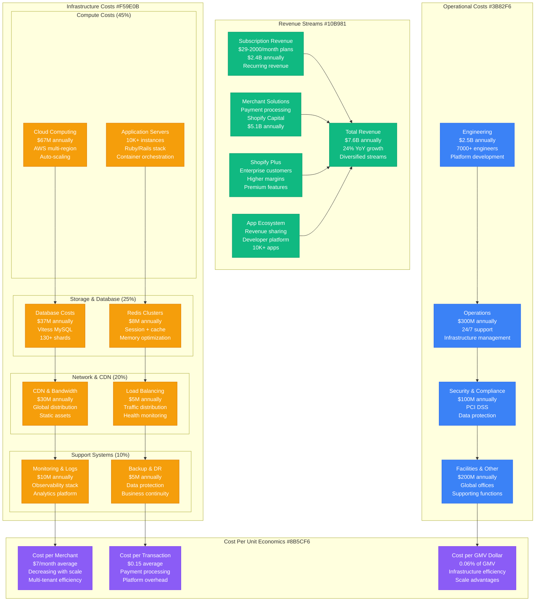
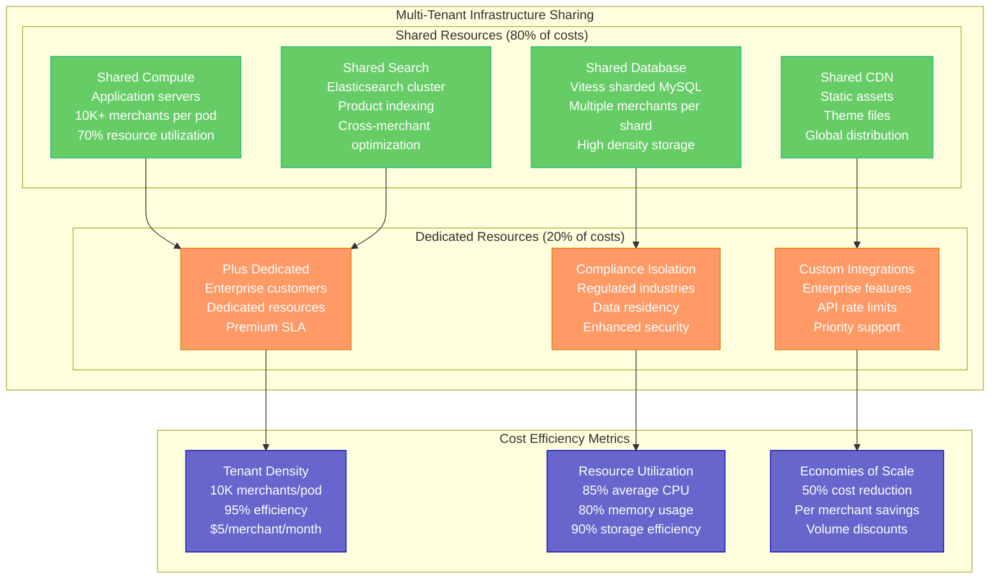
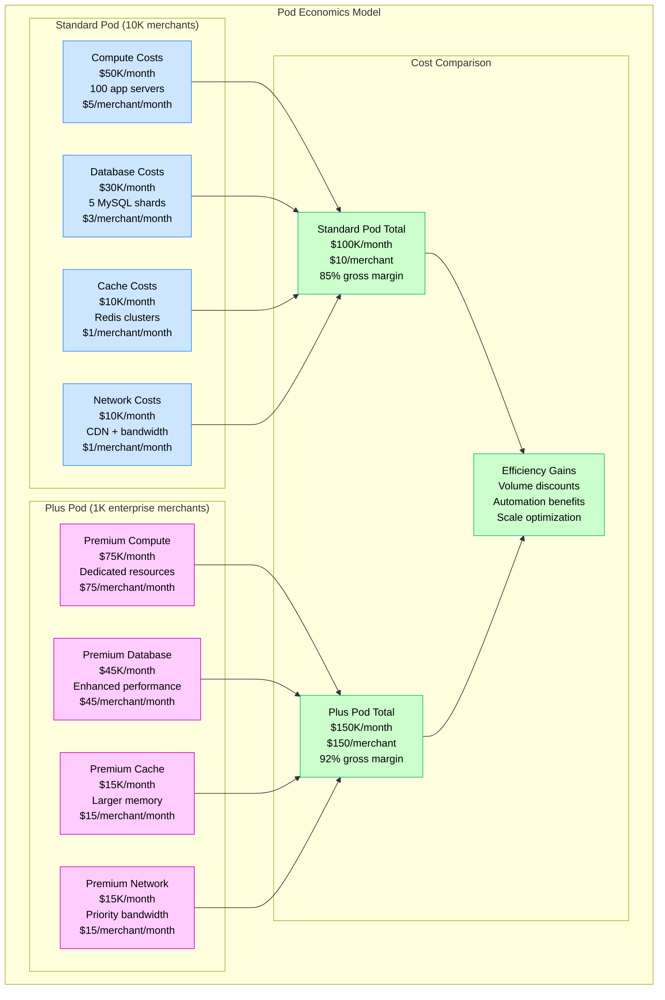
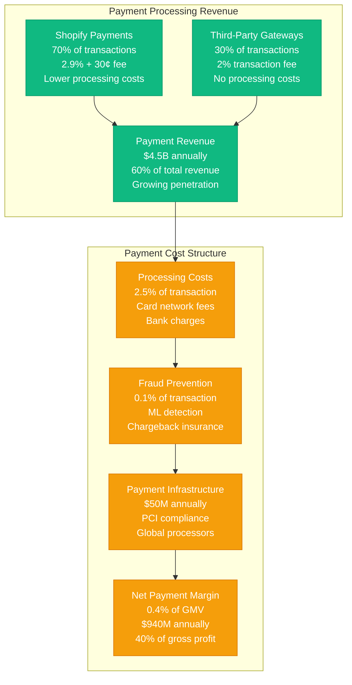
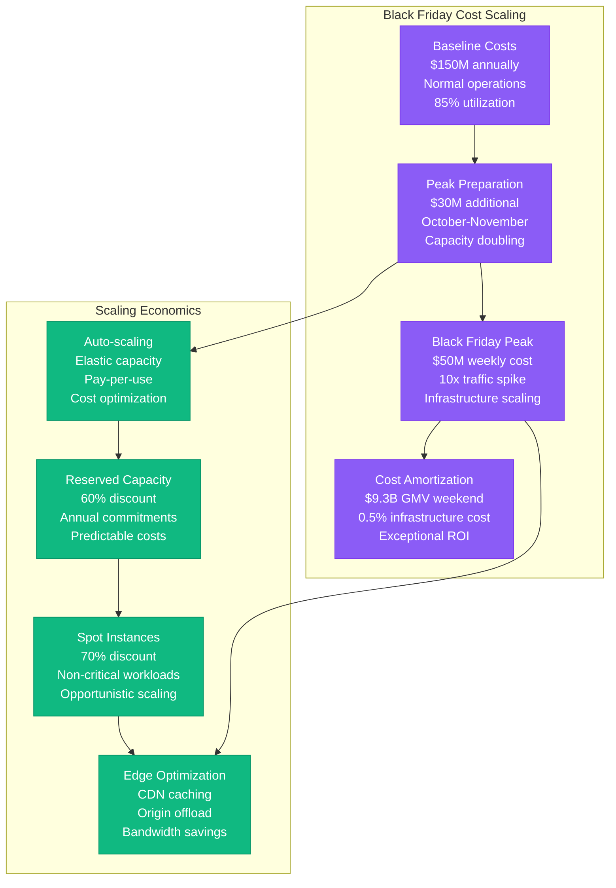
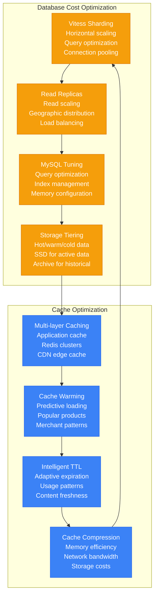
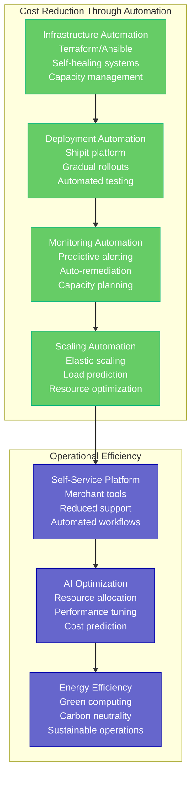
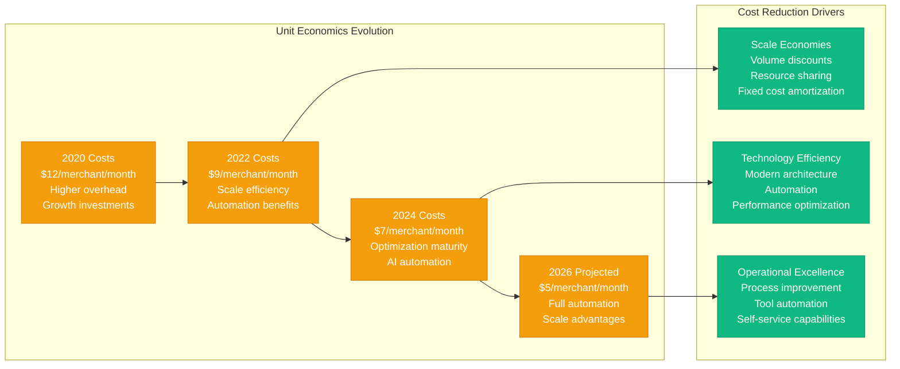
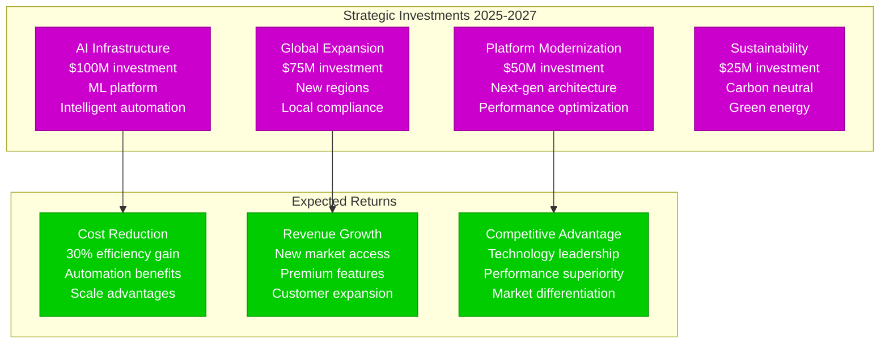

# Shopify Cost Breakdown - "The E-commerce Economics Engine"

## Overview

Shopify operates one of the world's largest e-commerce platforms with estimated $150M+ annual infrastructure spend while maintaining industry-leading gross margins of 50%+. Their economics are driven by massive scale, efficient multi-tenancy, and recurring revenue from 1.75+ million merchants generating $235+ billion GMV.

## Complete Cost Architecture

## Detailed Infrastructure Cost Analysis

### Multi-Tenant Cost Efficiency

### Pod-Based Cost Allocation

## Revenue Model Deep Dive

### Subscription Tier Economics

| Plan Tier | Monthly Price | Gross Margin | Customer Count | Annual Revenue | Cost to Serve |
|-----------|---------------|--------------|----------------|----------------|---------------|
| Basic Shopify | $29 | 85% | 800K | $280M | $4.35/month |
| Shopify | $79 | 87% | 600K | $570M | $10.27/month |
| Advanced | $299 | 90% | 200K | $717M | $29.90/month |
| Plus (Enterprise) | $2000+ | 92% | 25K | $800M+ | $160/month |

### Payment Processing Economics

## Black Friday Economics

### Peak Traffic Cost Management

### Black Friday ROI Analysis

**2023 Black Friday Weekend:**
- **GMV Processed**: $9.3 billion
- **Infrastructure Cost**: $45M (0.48% of GMV)
- **Payment Revenue**: $270M (2.9% average fee)
- **Net Revenue**: $225M (after processing costs)
- **Infrastructure ROI**: 500% (revenue/infrastructure cost)

## Cost Optimization Strategies

### Database Cost Management

### Automation and Efficiency

## Financial Performance Metrics

### Unit Economics Trends

### Gross Margin Analysis

- **Overall Gross Margin**: 50.4% (2023)
- **Subscription Gross Margin**: 80%+ (pure software)
- **Merchant Solutions Margin**: 40%+ (payment processing)
- **Plus Gross Margin**: 85%+ (premium pricing)

### Infrastructure as % of Revenue

- **2020**: 4.2% of revenue
- **2022**: 3.1% of revenue
- **2024**: 2.0% of revenue (estimated)
- **Target**: 1.5% of revenue by 2026

## Future Cost Projections (2025-2027)

### Investment Areas

This cost structure enables Shopify to maintain industry-leading margins while investing heavily in growth and technology innovation, positioning them to handle massive scale increases while improving unit economics through automation and optimization.