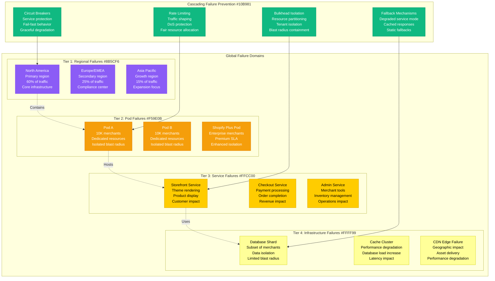
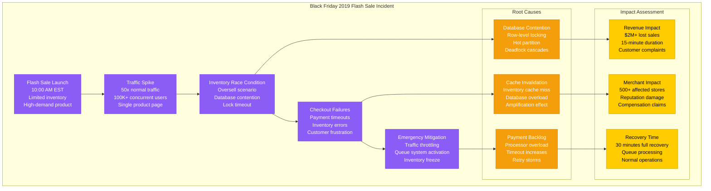
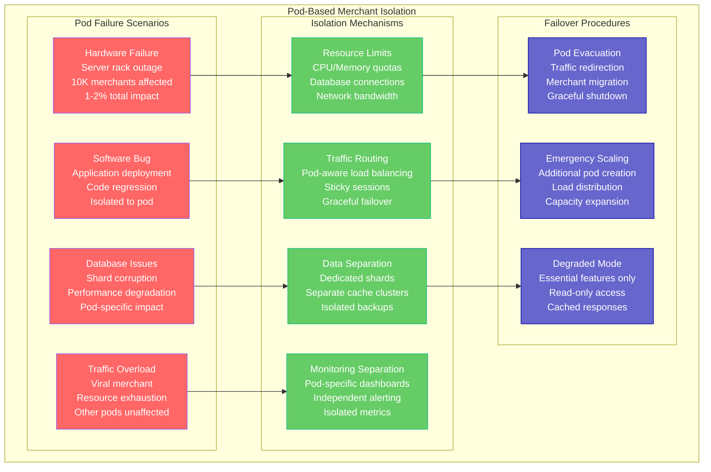
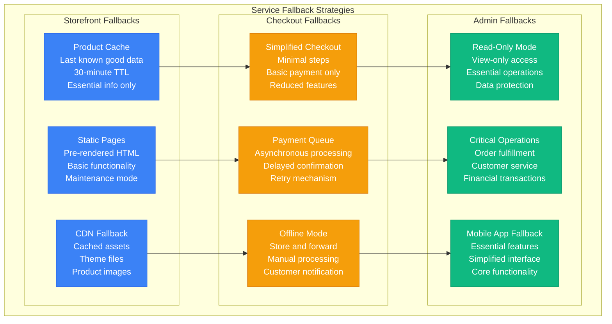
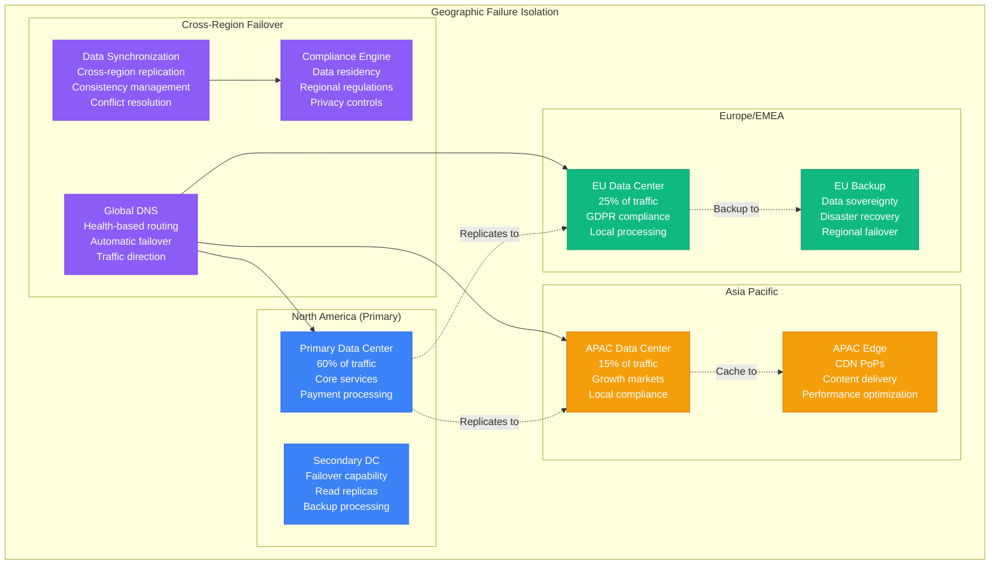
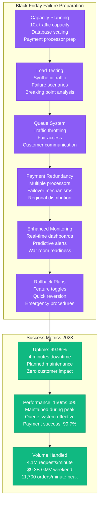

# Shopify Failure Domains - "The E-commerce Resilience Map"

## Overview

Shopify's architecture is designed to handle massive traffic spikes (100,000+ RPS during Black Friday) while maintaining 99.99%+ uptime for 1.75+ million merchants. Their failure domain isolation ensures that issues in one area don't cascade into global outages, with particular focus on merchant isolation and payment reliability.

## Global Failure Domain Architecture



## Historical Incident Analysis

### Black Friday 2019 - Flash Sale Overload



**Lessons Learned:**
- **Queue System**: Implemented waiting room for high-traffic events
- **Inventory Locking**: Improved inventory reservation system
- **Payment Resilience**: Enhanced payment processor redundancy
- **Monitoring**: Real-time inventory and payment health dashboards

### 2021 Database Shard Outage

```mermaid
graph TB
    subgraph "Database Shard Outage - March 2021"
        MAINTENANCE[Planned Maintenance<br/>MySQL version upgrade<br/>Non-peak hours<br/>Shard 42 (orders)]

        UPGRADE_FAILURE[Upgrade Failure<br/>Schema migration error<br/>Table corruption<br/>Rollback attempted]

        FAILOVER_ISSUES[Failover Problems<br/>Replica lag spike<br/>Connection timeouts<br/>Application errors]

        MERCHANT_IMPACT_2021[Merchant Impact<br/>8,000 affected stores<br/>Order processing halt<br/>Admin dashboard errors]

        RECOVERY_PLAN[Recovery Execution<br/>Emergency rollback<br/>Manual data repair<br/>Service restoration]

        subgraph "Technical Details"
            SCHEMA_CORRUPTION[Schema Corruption<br/>Migration script bug<br/>Index inconsistency<br/>Data integrity issues]
            REPLICA_LAG[Replica Lag<br/>10-minute delay<br/>Read inconsistency<br/>Application confusion]
            CONNECTION_POOL[Connection Pool Exhaustion<br/>Retry amplification<br/>Circuit breaker activation<br/>Service degradation]
        end

        subgraph "Resolution Metrics"
            DETECTION_TIME[Detection: 3 minutes<br/>Automated alerts<br/>Customer reports<br/>Health check failures]
            RESPONSE_TIME[Response: 8 minutes<br/>War room activation<br/>Expert assembly<br/>Decision making]
            RESOLUTION_TIME[Resolution: 45 minutes<br/>Data restoration<br/>Service validation<br/>Normal operations]
        end

        MAINTENANCE --> UPGRADE_FAILURE
        UPGRADE_FAILURE --> FAILOVER_ISSUES
        FAILOVER_ISSUES --> MERCHANT_IMPACT_2021
        MERCHANT_IMPACT_2021 --> RECOVERY_PLAN

        UPGRADE_FAILURE --> SCHEMA_CORRUPTION
        FAILOVER_ISSUES --> REPLICA_LAG
        MERCHANT_IMPACT_2021 --> CONNECTION_POOL

        RECOVERY_PLAN --> DETECTION_TIME
        DETECTION_TIME --> RESPONSE_TIME
        RESPONSE_TIME --> RESOLUTION_TIME
    end

    %% Apply outage colors
    classDef outageStyle fill:#8B5CF6,stroke:#7C3AED,color:#fff
    classDef technicalStyle fill:#F59E0B,stroke:#D97706,color:#fff
    classDef resolutionStyle fill:#10B981,stroke:#059669,color:#fff

    class MAINTENANCE,UPGRADE_FAILURE,FAILOVER_ISSUES,MERCHANT_IMPACT_2021,RECOVERY_PLAN outageStyle
    class SCHEMA_CORRUPTION,REPLICA_LAG,CONNECTION_POOL technicalStyle
    class DETECTION_TIME,RESPONSE_TIME,RESOLUTION_TIME resolutionStyle
```

**Improvements Made:**
- **Blue-Green Deployments**: Zero-downtime database upgrades
- **Schema Validation**: Pre-flight checks for migrations
- **Replica Monitoring**: Enhanced lag detection and alerting
- **Connection Management**: Improved pool configuration and monitoring

## Pod Architecture Isolation

### Merchant Isolation Strategy



## Circuit Breaker Implementation

### Service-Level Protection

```mermaid
stateDiagram-v2
    [*] --> Closed: Normal Operation
    Closed --> Open: Error Rate > 50%
    Open --> HalfOpen: 60s cooldown
    HalfOpen --> Closed: Success Rate > 90%
    HalfOpen --> Open: Error Rate > 20%

    state Closed {
        [*] --> MonitorHealth
        MonitorHealth --> ProcessRequests
        ProcessRequests --> TrackMetrics
        TrackMetrics --> MonitorHealth
        note right of TrackMetrics : Success rate: 95%+\nLatency: <200ms\nThroughput: Normal
    }

    state Open {
        [*] --> RejectRequests
        RejectRequests --> ServeFallback
        ServeFallback --> WaitCooldown
        WaitCooldown --> RejectRequests
        note right of ServeFallback : Cached responses\nStatic content\nDegraded features
    }

    state HalfOpen {
        [*] --> LimitedRequests
        LimitedRequests --> TestService
        TestService --> EvaluateHealth
        EvaluateHealth --> LimitedRequests
        note right of TestService : 10% traffic allowed\nHealth validation\nGradual recovery
    }
```

### Fallback Strategies by Service



## Blast Radius Containment

### Impact Assessment Matrix

| Failure Type | Affected Merchants | Revenue Impact | Recovery Time | Mitigation Priority |
|--------------|-------------------|----------------|---------------|-------------------|
| Single Server | 0.01% (100 stores) | <$10K/hour | 5 minutes | Automatic failover |
| Pod Failure | 0.5% (10K stores) | $100K-500K/hour | 15 minutes | Pod evacuation |
| Database Shard | 0.5-2% (variable) | $200K-1M/hour | 30 minutes | Shard failover |
| Regional Outage | 15-60% (variable) | $2M-10M/hour | 60 minutes | Cross-region failover |
| Payment System | 100% (all active) | $5M-20M/hour | 120 minutes | Payment processor failover |

### Geographic Isolation



## Incident Response Procedures

### War Room Activation

```mermaid
graph TB
    subgraph "Incident Response Timeline"
        DETECTION[Incident Detection<br/>Automated monitoring<br/>Customer reports<br/>Partner alerts]

        SEVERITY[Severity Assessment<br/>Impact evaluation<br/>Merchant count<br/>Revenue impact]

        WAR_ROOM[War Room Activation<br/>Video conference<br/>Expert assembly<br/>Communication lead]

        INVESTIGATION[Root Cause Analysis<br/>Log correlation<br/>System diagnostics<br/>Performance analysis]

        MITIGATION[Mitigation Actions<br/>Traffic rerouting<br/>Service isolation<br/>Fallback activation]

        COMMUNICATION[Customer Communication<br/>Status page updates<br/>Merchant notifications<br/>Partner alerts]

        RECOVERY[Full Recovery<br/>Service restoration<br/>Performance validation<br/>Monitoring confirmation]

        POSTMORTEM[Post-Incident Review<br/>Timeline analysis<br/>Improvement actions<br/>Process updates]
    end

    %% Timeline flow
    DETECTION --> SEVERITY
    SEVERITY --> WAR_ROOM
    WAR_ROOM --> INVESTIGATION
    INVESTIGATION --> MITIGATION
    MITIGATION --> COMMUNICATION
    COMMUNICATION --> RECOVERY
    RECOVERY --> POSTMORTEM

    %% Parallel activities
    INVESTIGATION -.->|Continuous| COMMUNICATION
    MITIGATION -.->|Updates| COMMUNICATION

    subgraph "Response Time SLAs"
        P0_SLA[P0 (Critical)<br/>Detection: 1 min<br/>Response: 5 min<br/>Mitigation: 15 min]

        P1_SLA[P1 (High)<br/>Detection: 5 min<br/>Response: 15 min<br/>Mitigation: 60 min]

        P2_SLA[P2 (Medium)<br/>Detection: 15 min<br/>Response: 60 min<br/>Mitigation: 4 hours]
    end

    SEVERITY --> P0_SLA
    WAR_ROOM --> P1_SLA
    MITIGATION --> P2_SLA

    %% Apply response colors
    classDef processStyle fill:#3B82F6,stroke:#2563EB,color:#fff
    classDef slaStyle fill:#10B981,stroke:#059669,color:#fff

    class DETECTION,SEVERITY,WAR_ROOM,INVESTIGATION,MITIGATION,COMMUNICATION,RECOVERY,POSTMORTEM processStyle
    class P0_SLA,P1_SLA,P2_SLA slaStyle
```

## Black Friday Specific Preparations

### Traffic Surge Management



This failure domain architecture ensures Shopify maintains world-class reliability during peak traffic events, protecting both merchant revenue and customer experience while handling massive scale growth across their global e-commerce platform.