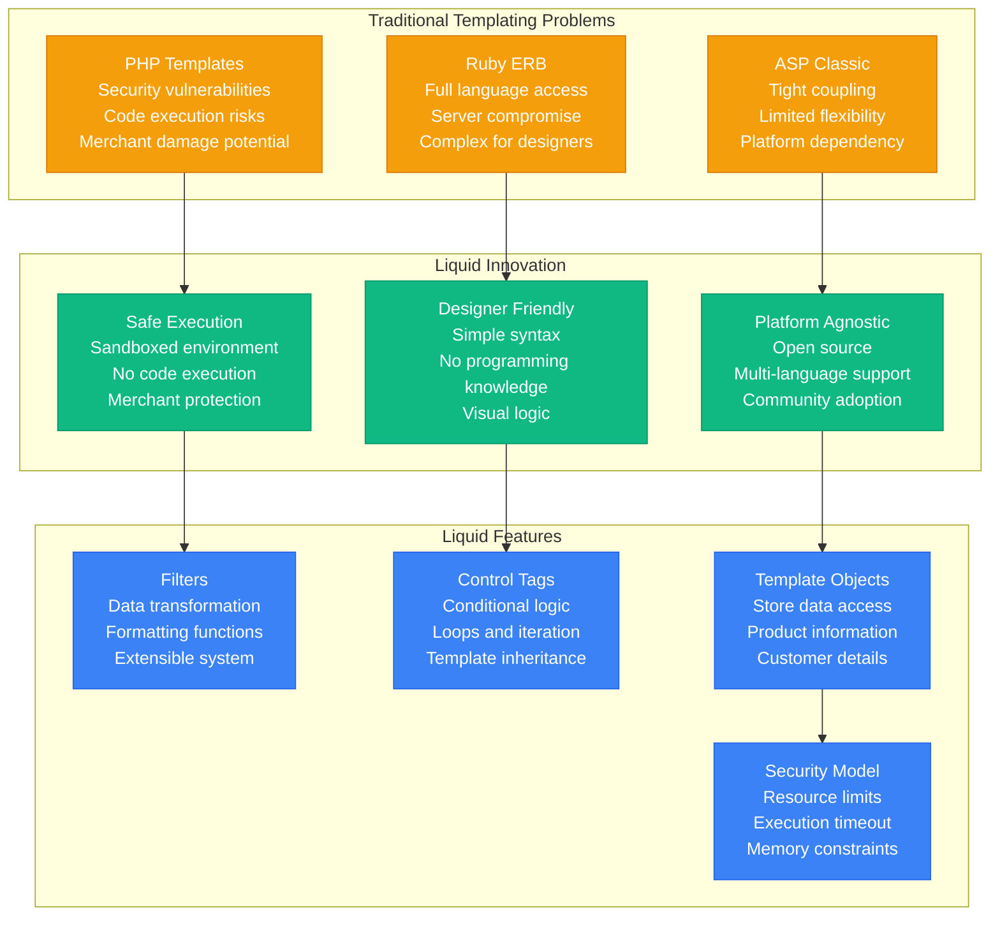
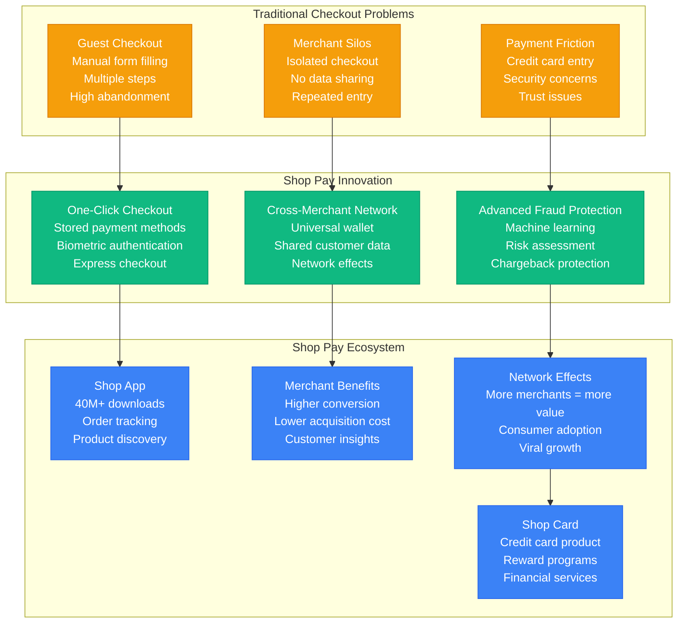
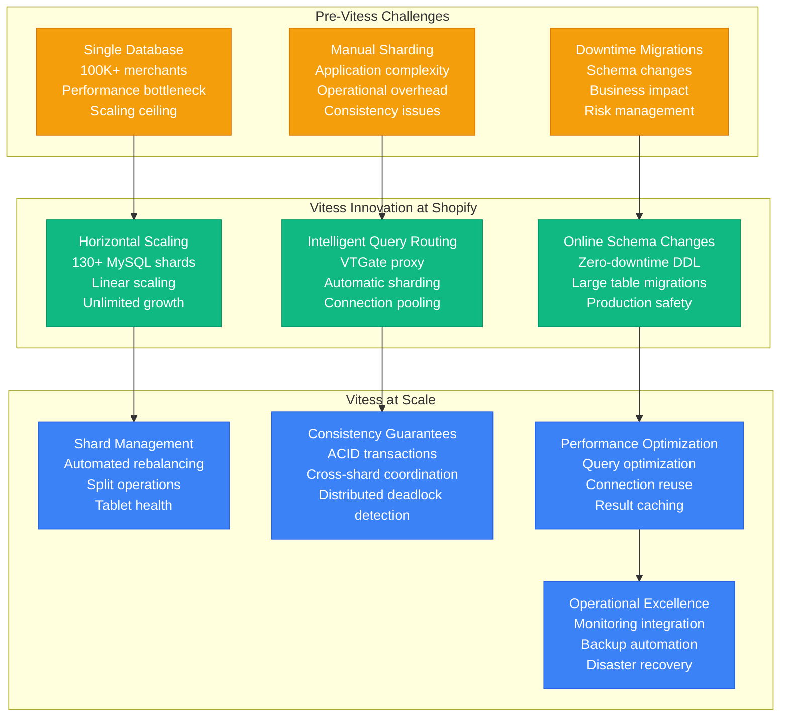
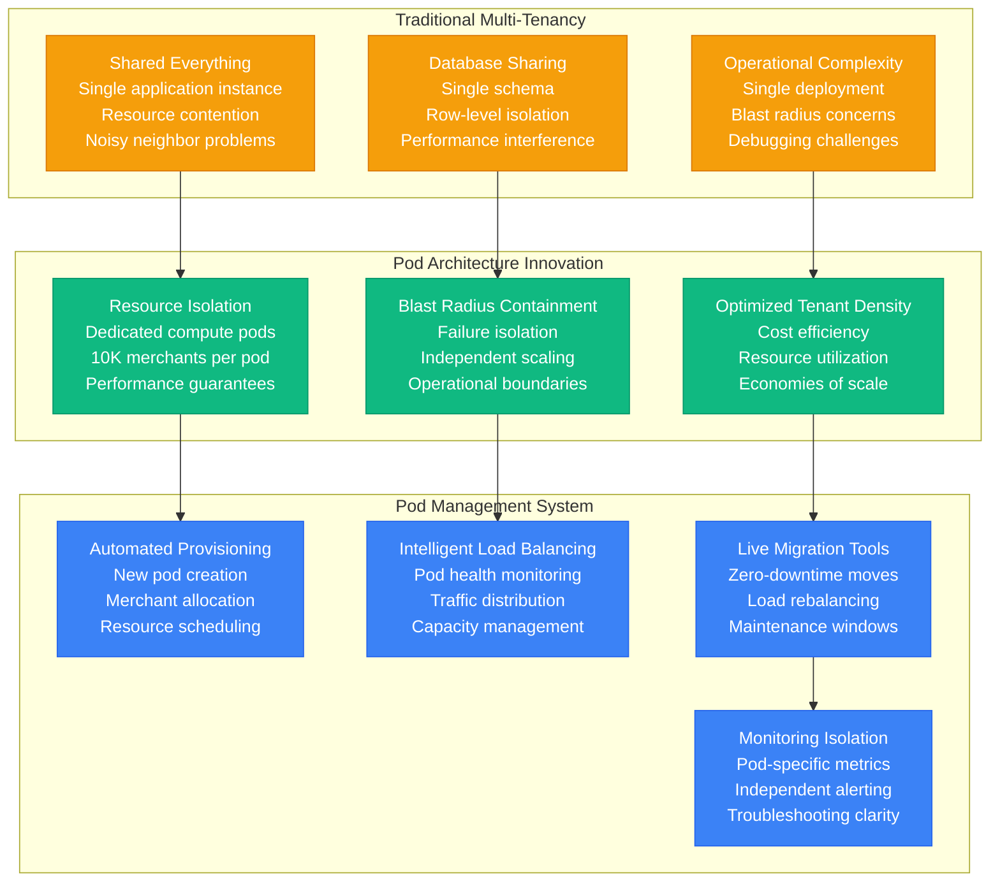
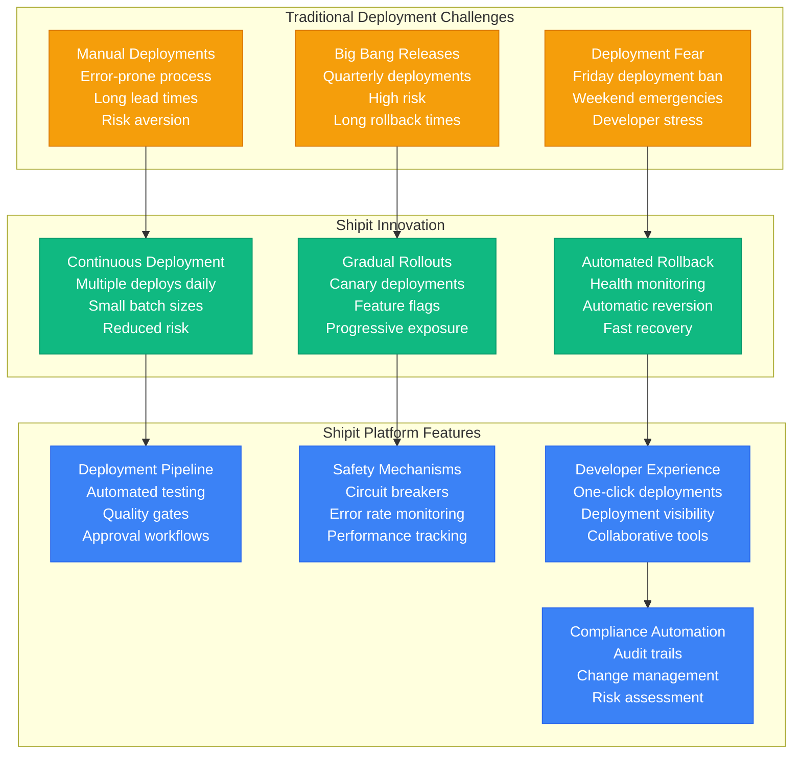
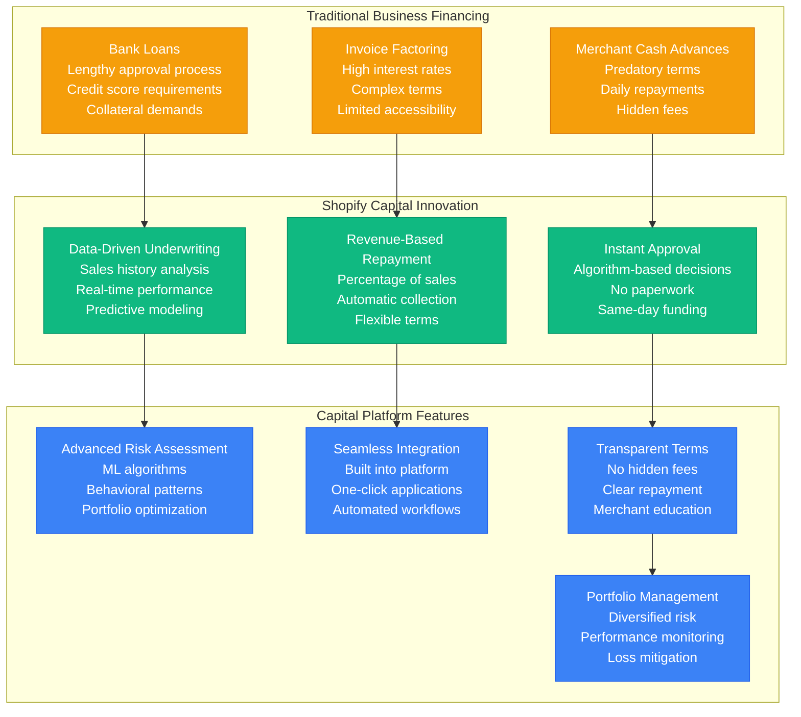
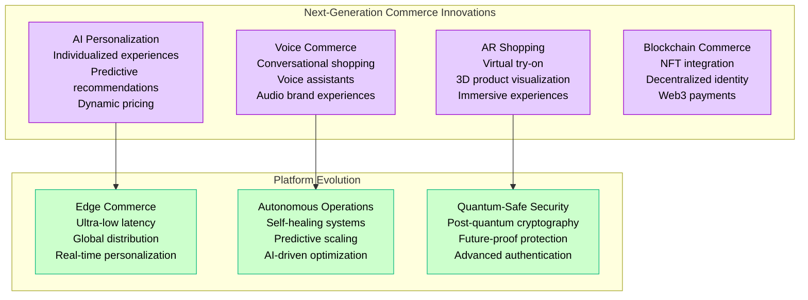

# Shopify Novel Solutions - "E-commerce Platform Innovations"

## Overview

Shopify has pioneered numerous breakthrough technologies that redefined e-commerce platforms, from Liquid templating to Shop Pay's cross-merchant network. These innovations solve fundamental problems of scalability, developer experience, and merchant success while creating entirely new business models and market opportunities.

## Core Innovation Architecture

```mermaid
graph TB
    subgraph Platform_Innovations__10B981[Platform Innovations #10B981]
        subgraph Developer_Experience_Revolution[Developer Experience Revolution]
            LIQUID[Liquid Templating<br/>Safe template language<br/>Sandboxed execution<br/>Non-programmer friendly]
            THEME_STORE[Theme Store<br/>Marketplace ecosystem<br/>Developer revenue<br/>Design standardization]
            APP_PLATFORM[App Platform<br/>10K+ applications<br/>Revenue sharing model<br/>Extensible architecture]
        end

        subgraph Modular_Monolith_Architecture[Modular Monolith Architecture]
            COMPONENT_BOUNDARIES[Component Boundaries<br/>Clear service isolation<br/>Shared database<br/>Single deployment]
            RAILS_AT_SCALE[Rails at Scale<br/>Performance optimization<br/>Memory management<br/>Concurrent processing]
            FEATURE_FLAGS[Feature Flags<br/>Gradual rollouts<br/>A/B testing<br/>Risk mitigation]
        end
    end

    subgraph Commerce_Innovations__3B82F6[Commerce Innovations #3B82F6]
        subgraph Shop_Pay_Ecosystem[Shop Pay Ecosystem]
            SHOP_PAY[Shop Pay<br/>Cross-merchant payments<br/>1-click checkout<br/>40M+ consumers]
            SHOP_NETWORK[Shop Network<br/>Consumer discovery<br/>Social commerce<br/>Merchant benefits]
            ACCELERATED_CHECKOUT[Accelerated Checkout<br/>70% faster completion<br/>Biometric authentication<br/>Fraud protection]
        end

        subgraph Fulfillment_Innovation[Fulfillment Innovation]
            FULFILLMENT_NETWORK[Fulfillment Network<br/>3PL integration<br/>Inventory optimization<br/>Shipping intelligence]
            SHOP_PROMISE[Shop Promise<br/>Delivery guarantees<br/>Customer expectations<br/>Merchant accountability]
            LOCAL_DELIVERY[Local Delivery<br/>Same-day fulfillment<br/>Hyperlocal commerce<br/>Sustainability focus]
        end
    end

    subgraph Scale_Solutions__F59E0B[Scale Solutions #F59E0B]
        subgraph Database_Innovations[Database Innovations]
            VITESS_ADOPTION[Vitess at Scale<br/>130+ MySQL shards<br/>Horizontal scaling<br/>Zero-downtime migration]
            MULTI_TENANT_SHARDING[Multi-tenant Sharding<br/>Merchant isolation<br/>Resource efficiency<br/>Performance guarantees]
            ONLINE_SCHEMA_CHANGES[Online Schema Changes<br/>Zero-downtime DDL<br/>Large table migrations<br/>Production safety]
        end

        subgraph Performance_Engineering[Performance Engineering]
            POD_ARCHITECTURE[Pod Architecture<br/>Blast radius isolation<br/>Tenant boundaries<br/>Resource allocation]
            QUEUE_SYSTEM[Queue System<br/>Flash sale handling<br/>Traffic throttling<br/>Fair access control]
            SHIPIT_DEPLOYMENT[Shipit Deployment<br/>Continuous deployment<br/>Gradual rollouts<br/>Automated rollback]
        end
    end

    subgraph Business_Model_Innovations__8B5CF6[Business Model Innovations #8B5CF6]
        subgraph Revenue_Diversification[Revenue Diversification]
            SHOPIFY_CAPITAL[Shopify Capital<br/>Merchant financing<br/>Revenue-based loans<br/>Data-driven underwriting]
            PLUS_ENTERPRISE[Shopify Plus<br/>Enterprise platform<br/>Dedicated resources<br/>Premium support]
            PARTNER_ECOSYSTEM[Partner Ecosystem<br/>Developer revenue<br/>Agency programs<br/>Solution providers]
        end

        subgraph Market_Expansion[Market Expansion]
            INTERNATIONAL_COMMERCE[International Commerce<br/>Multi-currency<br/>Local payments<br/>Compliance automation]
            B2B_PLATFORM[B2B Platform<br/>Wholesale commerce<br/>Trade workflows<br/>Enterprise features]
            POS_INTEGRATION[POS Integration<br/>Omnichannel retail<br/>Unified inventory<br/>Customer journey]
        end
    end

    %% Innovation relationships
    LIQUID --> THEME_STORE
    THEME_STORE --> APP_PLATFORM
    SHOP_PAY --> SHOP_NETWORK
    SHOP_NETWORK --> ACCELERATED_CHECKOUT
    VITESS_ADOPTION --> MULTI_TENANT_SHARDING
    POD_ARCHITECTURE --> QUEUE_SYSTEM
    SHOPIFY_CAPITAL --> PLUS_ENTERPRISE
    INTERNATIONAL_COMMERCE --> B2B_PLATFORM

    %% Apply innovation colors
    classDef platformStyle fill:#10B981,stroke:#059669,color:#fff
    classDef commerceStyle fill:#3B82F6,stroke:#2563EB,color:#fff
    classDef scaleStyle fill:#F59E0B,stroke:#D97706,color:#fff
    classDef businessStyle fill:#8B5CF6,stroke:#7C3AED,color:#fff

    class LIQUID,THEME_STORE,APP_PLATFORM,COMPONENT_BOUNDARIES,RAILS_AT_SCALE,FEATURE_FLAGS platformStyle
    class SHOP_PAY,SHOP_NETWORK,ACCELERATED_CHECKOUT,FULFILLMENT_NETWORK,SHOP_PROMISE,LOCAL_DELIVERY commerceStyle
    class VITESS_ADOPTION,MULTI_TENANT_SHARDING,ONLINE_SCHEMA_CHANGES,POD_ARCHITECTURE,QUEUE_SYSTEM,SHIPIT_DEPLOYMENT scaleStyle
    class SHOPIFY_CAPITAL,PLUS_ENTERPRISE,PARTNER_ECOSYSTEM,INTERNATIONAL_COMMERCE,B2B_PLATFORM,POS_INTEGRATION businessStyle
```



## Breakthrough #1: Liquid Templating Language

### The Safe Template Innovation



### Liquid Impact and Adoption

**Industry Adoption:**
- **Jekyll**: GitHub Pages static site generator
- **Salesforce**: Community Cloud templating
- **Other E-commerce**: Multiple platforms adopted Liquid
- **Open Source**: 15K+ GitHub stars, active community

**Shopify Benefits:**
- **Security**: Zero template-based security incidents
- **Developer Ecosystem**: 10K+ themes and apps
- **Merchant Empowerment**: Non-technical customization
- **Platform Differentiation**: Unique competitive advantage

## Breakthrough #2: Shop Pay Cross-Merchant Network

### The Checkout Revolution



### Shop Pay Performance Metrics

**Conversion Improvements:**
- **Checkout Speed**: 70% faster than standard checkout
- **Conversion Rate**: 1.72x higher completion rate
- **Cart Abandonment**: 50% reduction in abandonment
- **Mobile Optimization**: 85% mobile transaction rate

**Network Scale:**
- **Active Users**: 40M+ Shop Pay users
- **Participating Merchants**: 100K+ stores enabled
- **Transaction Volume**: $20B+ annual GMV
- **Geographic Reach**: Available in 45+ countries

## Breakthrough #3: Vitess Database Sharding

### The Scale Database Solution



### Vitess Migration Success

**Migration Metrics (2016-2018):**
- **Duration**: 18-month gradual migration
- **Downtime**: Zero planned downtime
- **Data Volume**: 100TB+ migrated
- **Performance**: 10x query throughput improvement
- **Reliability**: 99.99%+ uptime maintained

**Post-Migration Benefits:**
- **Scalability**: Support for 1.75M+ merchants
- **Performance**: <10ms query response time
- **Flexibility**: Easy shard management
- **Cost Efficiency**: Linear cost scaling

## Breakthrough #4: Pod Architecture for Multi-Tenancy

### The Isolation Innovation



## Breakthrough #5: Shipit Deployment Platform

### The Continuous Deployment Revolution



### Shipit Impact Metrics

**Deployment Frequency:**
- **2015**: 1 deployment per week
- **2018**: 5 deployments per day
- **2024**: 50+ deployments per day
- **Lead Time**: 30 minutes commit to production

**Quality Improvements:**
- **Change Failure Rate**: <0.1%
- **Mean Time to Recovery**: 5 minutes
- **Deployment Success Rate**: 99.9%
- **Developer Satisfaction**: 95% positive feedback

## Breakthrough #6: Shopify Capital Innovation

### The Merchant Financing Revolution



### Shopify Capital Performance

**Business Metrics:**
- **Total Funded**: $4B+ since launch
- **Default Rate**: <3% (industry: 10-15%)
- **Approval Rate**: 60% of applicants
- **Average Advance**: $25,000
- **Repayment Period**: 6-18 months average

**Merchant Impact:**
- **Revenue Growth**: 25% average increase post-funding
- **Inventory Expansion**: 40% of funding used for inventory
- **Marketing Investment**: 30% of funding for advertising
- **Survival Rate**: 95% of funded merchants still active

## Open Source Contributions

### Major Open Source Projects

```mermaid
graph TB
    subgraph Shopify_s_Open_Source_Ecosystem[Shopify's Open Source Ecosystem]
        ACTIVEMERCHANT[ActiveMerchant<br/>Payment processing<br/>Gateway abstraction<br/>Ruby gem standard]

        LIQUID_OSS[Liquid (Open Source)<br/>Template language<br/>Cross-platform support<br/>Community adoption]

        REACT_NATIVE[React Native Contributions<br/>Mobile development<br/>Performance improvements<br/>iOS/Android parity]

        POLARIS[Polaris Design System<br/>UI component library<br/>Design consistency<br/>Developer productivity]

        HYDROGEN[Hydrogen Framework<br/>React-based storefront<br/>Edge rendering<br/>Modern web standards]

        SHOPIFY_CLI[Shopify CLI<br/>Developer tools<br/>App development<br/>Theme development]
    end

    subgraph Community_Impact[Community Impact]
        DEVELOPER_ECOSYSTEM[Developer Ecosystem<br/>200K+ developers<br/>App partners<br/>Theme designers]

        INDUSTRY_STANDARDS[Industry Standards<br/>E-commerce patterns<br/>Best practices<br/>Technology adoption]

        EDUCATIONAL_IMPACT[Educational Impact<br/>Tutorials and guides<br/>Conference talks<br/>Knowledge sharing]
    end

    ACTIVEMERCHANT --> DEVELOPER_ECOSYSTEM
    LIQUID_OSS --> INDUSTRY_STANDARDS
    POLARIS --> EDUCATIONAL_IMPACT
    HYDROGEN --> DEVELOPER_ECOSYSTEM

    %% Apply open source colors
    classDef projectStyle fill:#10B981,stroke:#059669,color:#fff
    classDef impactStyle fill:#3B82F6,stroke:#2563EB,color:#fff

    class ACTIVEMERCHANT,LIQUID_OSS,REACT_NATIVE,POLARIS,HYDROGEN,SHOPIFY_CLI projectStyle
    class DEVELOPER_ECOSYSTEM,INDUSTRY_STANDARDS,EDUCATIONAL_IMPACT impactStyle
```

## Innovation Impact Metrics

### Technology Adoption

| Innovation | Launch Year | Industry Adoption | Patent Applications | Economic Impact |
|------------|-------------|------------------|-------------------|----------------|
| Liquid Templates | 2008 | 15+ platforms | 5 patents | Template security standard |
| Shop Pay | 2020 | Shopify exclusive | 20+ patents | $20B+ GMV processed |
| Vitess Adoption | 2016 | 50+ companies | Contribution-based | Database scaling solution |
| Pod Architecture | 2018 | SaaS industry pattern | 8 patents | Multi-tenant optimization |
| Shipit Platform | 2015 | Internal tool | 3 patents | Deployment automation |

### Market Disruption

- **Template Security**: Established safe templating standards
- **Cross-Merchant Payments**: Created new payment network model
- **Database Sharding**: Popularized Vitess for horizontal scaling
- **Multi-Tenant Architecture**: Influenced SaaS isolation patterns
- **Merchant Financing**: Disrupted traditional business lending

## Future Innovation Pipeline (2025-2027)

### Emerging Technologies



These innovations represent fundamental breakthroughs that have redefined e-commerce platform architecture, developer experience, and merchant success, establishing Shopify as the technology leader in commerce infrastructure while creating entirely new business models and market categories.