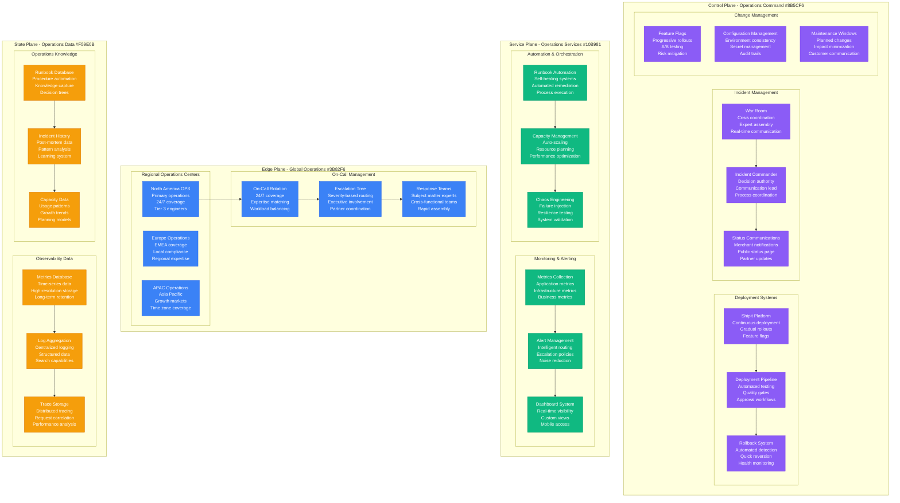
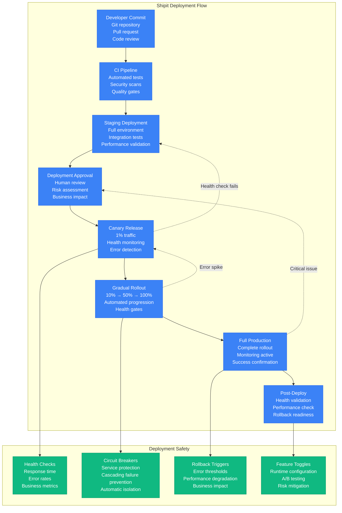
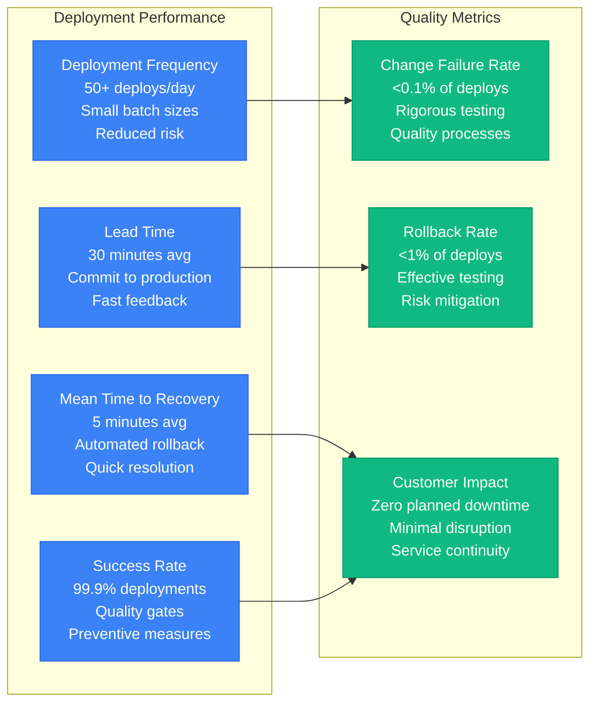
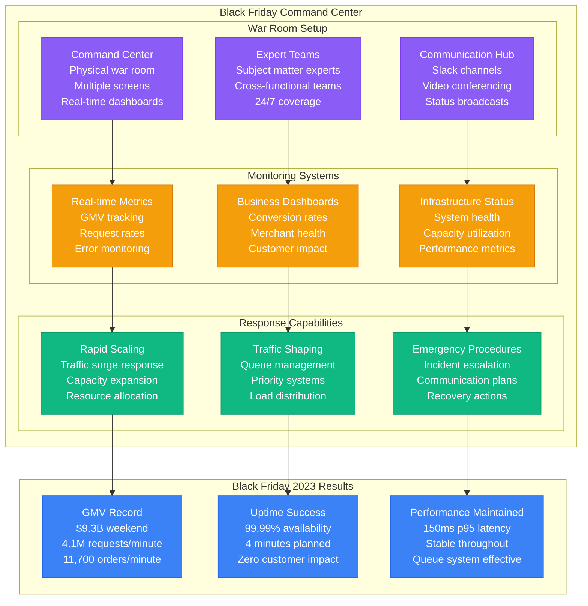
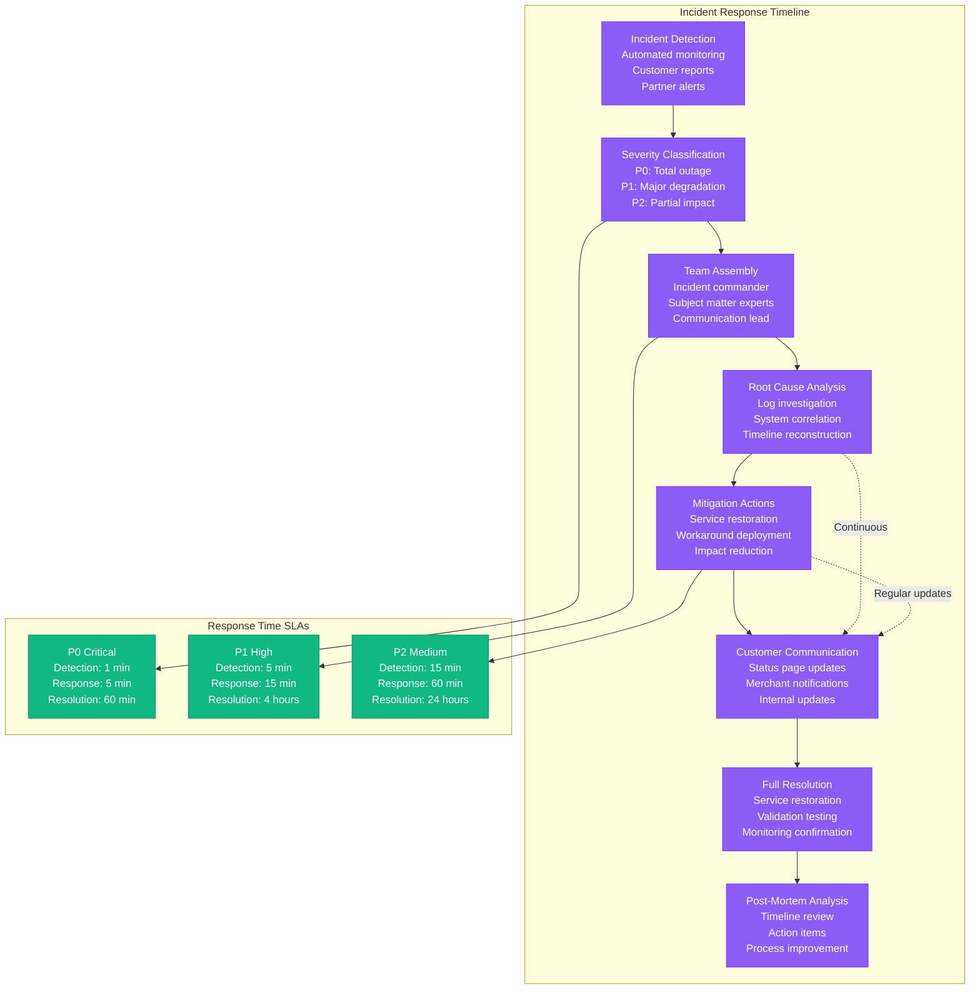
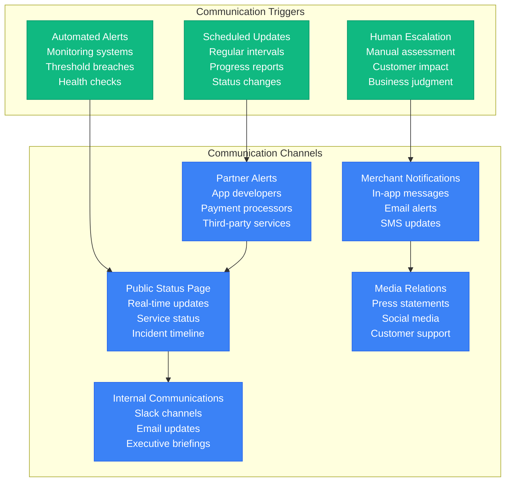
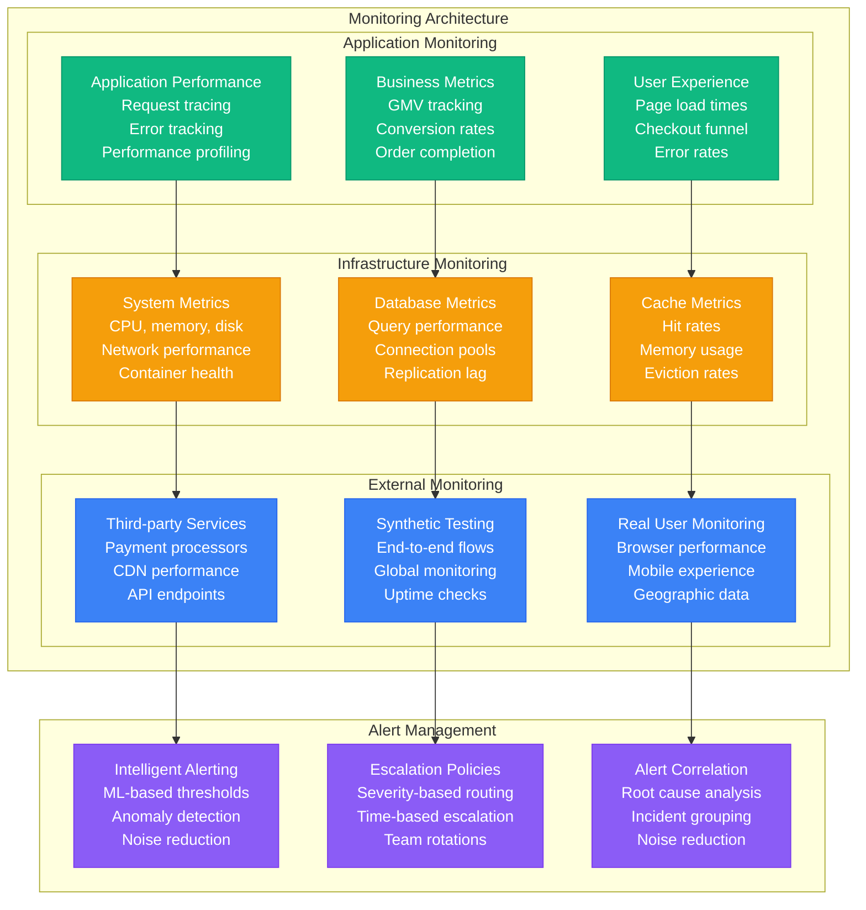

# Shopify Production Operations - "The E-commerce War Room"

## Overview

Shopify operates one of the world's most complex e-commerce platforms, handling 1.75+ million merchants, $235+ billion GMV, and massive traffic spikes during events like Black Friday (100,000+ RPS). Their operational excellence comes from battle-tested incident response, automated deployment systems, and world-class monitoring that ensures 99.99%+ uptime.

## Operations Architecture



## Shipit Deployment Platform

### Continuous Deployment Pipeline



### Deployment Metrics and SLAs



## Black Friday Operations

### Black Friday War Room



### Traffic Management During Peak Events

```mermaid
graph TB
    subgraph Peak_Event_Traffic_Management[Peak Event Traffic Management]
        TRAFFIC_PREDICTION[Traffic Prediction<br/>ML-based forecasting<br/>Historical patterns<br/>External factors]

        CAPACITY_PLANNING[Capacity Planning<br/>Infrastructure scaling<br/>Database preparation<br/>CDN optimization]

        QUEUE_SYSTEM[Queue System<br/>Traffic throttling<br/>Fair access<br/>Customer communication]

        PRIORITY_ROUTING[Priority Routing<br/>VIP merchants<br/>Plus customers<br/>Critical operations]

        LOAD_SHEDDING[Load Shedding<br/>Non-essential features<br/>Graceful degradation<br/>Core functionality]

        PERFORMANCE_MONITORING[Performance Monitoring<br/>Real-time metrics<br/>Alert thresholds<br/>Response automation]
    end

    %% Traffic management flow
    TRAFFIC_PREDICTION --> CAPACITY_PLANNING
    CAPACITY_PLANNING --> QUEUE_SYSTEM
    QUEUE_SYSTEM --> PRIORITY_ROUTING
    PRIORITY_ROUTING --> LOAD_SHEDDING
    LOAD_SHEDDING --> PERFORMANCE_MONITORING

    subgraph Black_Friday_Traffic_Handling[Black Friday Traffic Handling]
        BASELINE_10K[Baseline: 10,500 RPS<br/>Normal operations<br/>Standard capacity<br/>Regular monitoring]

        RAMPUP_25K[Ramp-up: 25,000 RPS<br/>Early November<br/>Capacity doubling<br/>Enhanced monitoring]

        PEAK_100K[Peak: 100,000+ RPS<br/>Black Friday<br/>Maximum capacity<br/>War room active]

        SUSTAINED_50K[Sustained: 50,000 RPS<br/>Cyber Monday<br/>Continued vigilance<br/>Performance optimization]
    end

    PERFORMANCE_MONITORING --> BASELINE_10K
    BASELINE_10K --> RAMPUP_25K
    RAMPUP_25K --> PEAK_100K
    PEAK_100K --> SUSTAINED_50K

    %% Apply traffic colors
    classDef managementStyle fill:#F59E0B,stroke:#D97706,color:#fff
    classDef trafficStyle fill:#3B82F6,stroke:#2563EB,color:#fff

    class TRAFFIC_PREDICTION,CAPACITY_PLANNING,QUEUE_SYSTEM,PRIORITY_ROUTING,LOAD_SHEDDING,PERFORMANCE_MONITORING managementStyle
    class BASELINE_10K,RAMPUP_25K,PEAK_100K,SUSTAINED_50K trafficStyle
```



## Incident Response Process

### Incident Classification and Response



### Incident Communication Strategy



## Monitoring and Observability

### Comprehensive Monitoring Stack



## Operations Team Structure

### Global Operations Organization

```mermaid
graph TB
    subgraph Operations_Leadership[Operations Leadership]
        VP_OPS[VP of Operations<br/>Global operations<br/>Strategic direction<br/>Executive reporting]

        DIR_INFRA[Director Infrastructure<br/>Platform reliability<br/>Capacity planning<br/>Architecture decisions]

        DIR_SECURITY[Director Security<br/>Threat detection<br/>Incident response<br/>Compliance oversight]
    end

    subgraph Regional_Operations_Teams[Regional Operations Teams]
        subgraph North_America__Primary[North America (Primary)]
            NA_INFRA[Infrastructure Team<br/>12 engineers<br/>Platform operations<br/>Database management]
            NA_SECURITY[Security Team<br/>8 engineers<br/>Threat hunting<br/>Incident response]
            NA_ON_CALL[On-Call Team<br/>24/7 coverage<br/>Tier 2/3 support<br/>Escalation handling]
        end

        subgraph Europe_EMEA[Europe/EMEA]
            EU_INFRA[EMEA Infrastructure<br/>6 engineers<br/>Regional support<br/>Compliance focus]
            EU_SECURITY[EMEA Security<br/>4 engineers<br/>Regional threats<br/>GDPR compliance]
        end

        subgraph Asia_Pacific[Asia Pacific]
            APAC_INFRA[APAC Infrastructure<br/>4 engineers<br/>Growth markets<br/>Local partnerships]
            APAC_SUPPORT[APAC Support<br/>Customer success<br/>Merchant escalations<br/>Partner relations]
        end
    end

    subgraph Specialized_Teams[Specialized Teams]
        DATA_TEAM[Data Platform Team<br/>Analytics infrastructure<br/>Data pipeline<br/>Business intelligence]

        AUTOMATION_TEAM[Automation Team<br/>Infrastructure as code<br/>CI/CD pipelines<br/>Process automation]

        CHAOS_TEAM[Chaos Engineering<br/>Resilience testing<br/>Failure simulation<br/>System validation]
    end

    %% Organizational structure
    VP_OPS --> DIR_INFRA
    VP_OPS --> DIR_SECURITY

    DIR_INFRA --> NA_INFRA
    DIR_INFRA --> EU_INFRA
    DIR_INFRA --> APAC_INFRA

    DIR_SECURITY --> NA_SECURITY
    DIR_SECURITY --> EU_SECURITY

    NA_INFRA --> NA_ON_CALL
    EU_INFRA --> APAC_SUPPORT

    NA_INFRA --> DATA_TEAM
    EU_INFRA --> AUTOMATION_TEAM
    APAC_INFRA --> CHAOS_TEAM

    %% Apply org colors
    classDef leadershipStyle fill:#8B5CF6,stroke:#7C3AED,color:#fff
    classDef naStyle fill:#3B82F6,stroke:#2563EB,color:#fff
    classDef euStyle fill:#10B981,stroke:#059669,color:#fff
    classDef apacStyle fill:#F59E0B,stroke:#D97706,color:#fff
    classDef specializedStyle fill:#9900CC,stroke:#660099,color:#fff

    class VP_OPS,DIR_INFRA,DIR_SECURITY leadershipStyle
    class NA_INFRA,NA_SECURITY,NA_ON_CALL naStyle
    class EU_INFRA,EU_SECURITY euStyle
    class APAC_INFRA,APAC_SUPPORT apacStyle
    class DATA_TEAM,AUTOMATION_TEAM,CHAOS_TEAM specializedStyle
```

## Operational Excellence Metrics

### Performance Targets and Achievements

| Metric | Target | Achieved 2023 | Industry Benchmark | Improvement |
|--------|--------|---------------|-------------------|-------------|
| Uptime SLA | 99.9% | 99.99% | 99.5% | ↑ 0.09% |
| MTTR | 15 minutes | 5 minutes | 30 minutes | ↓ 67% |
| Deployment Frequency | 20/day | 50+/day | 5/week | ↑ 10x |
| Change Failure Rate | <1% | 0.1% | 2-3% | ↓ 90% |
| Lead Time | 60 minutes | 30 minutes | 4 hours | ↓ 50% |
| Customer Impact | <0.01% | 0.005% | 0.1% | ↓ 50% |

### Reliability Achievements

- **Black Friday 2023**: 99.99% uptime during peak traffic
- **Deployment Success**: 99.9% successful deployments
- **Incident Response**: <1 minute detection to response
- **Customer Impact**: <0.005% of requests affected by incidents
- **Recovery Time**: 95% of incidents resolved within SLA
- **Escalation Rate**: <2% of incidents escalate beyond Tier 2

This operational excellence framework enables Shopify to handle massive e-commerce scale during peak events like Black Friday while maintaining world-class reliability and performance for 1.75+ million merchants processing $235+ billion in annual GMV.