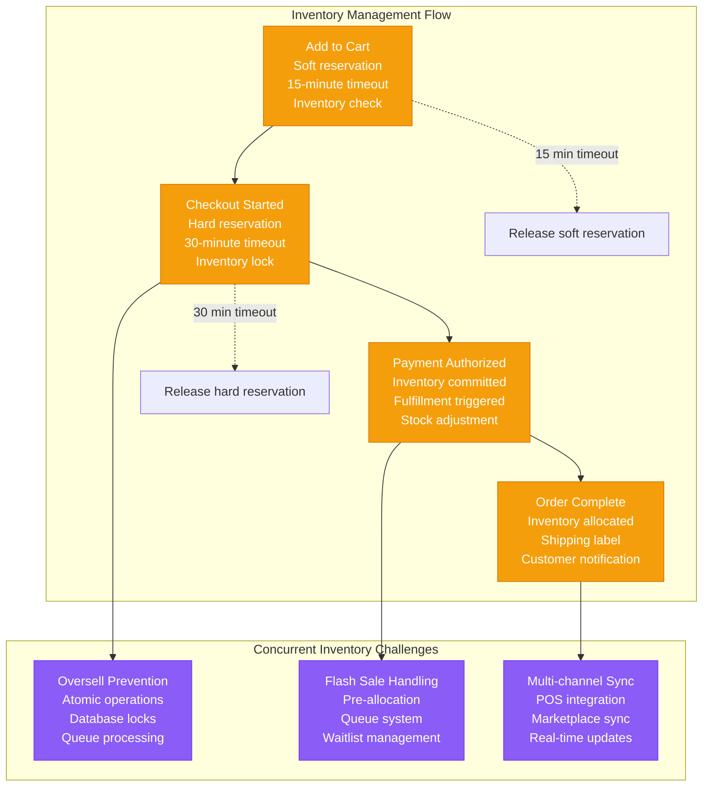
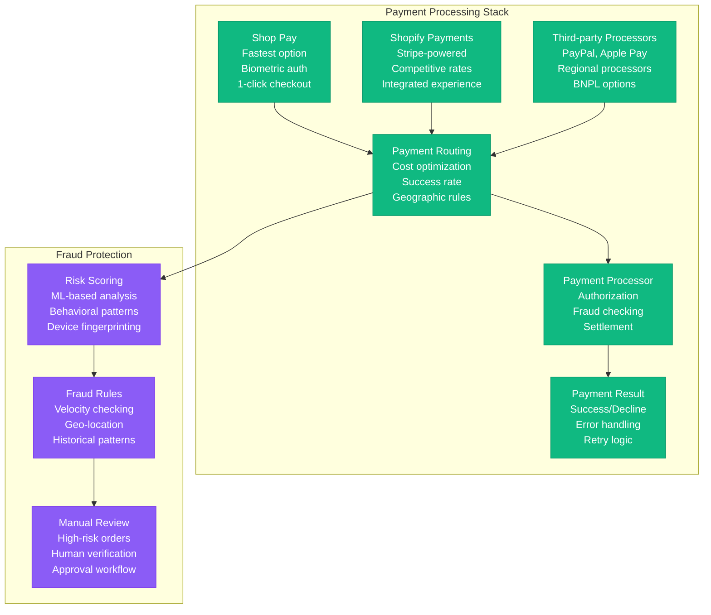
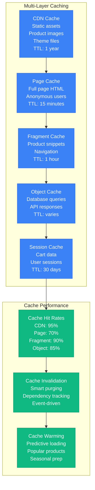
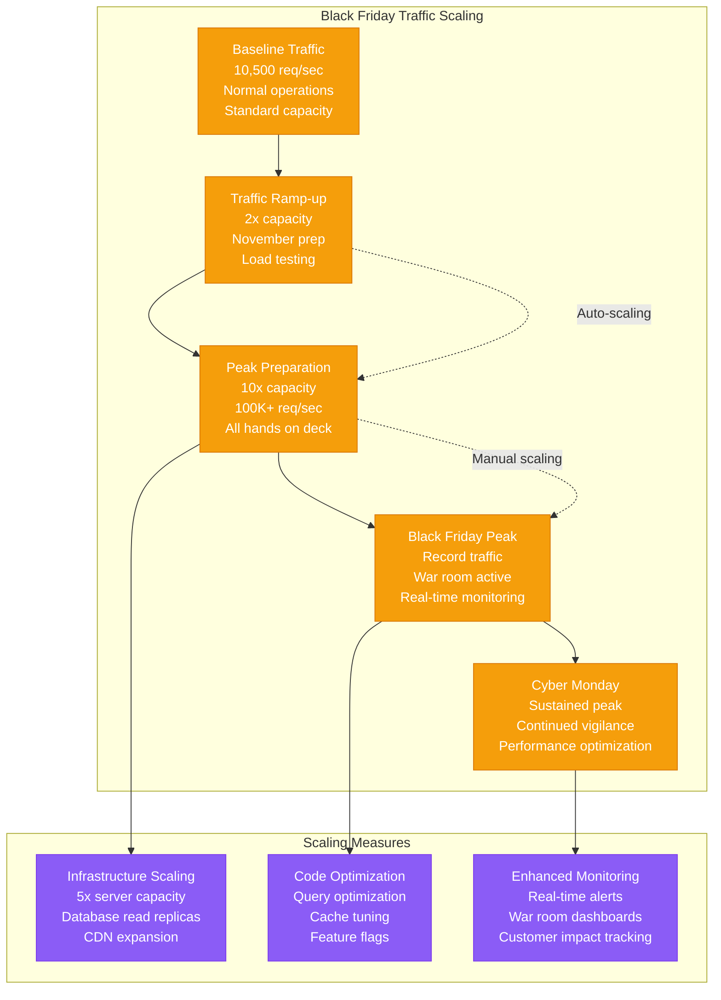

# Shopify Request Flow - "The E-commerce Golden Path"

## Overview

Shopify processes 10,500+ requests per second baseline, scaling to 100,000+ RPS during Black Friday. This diagram shows the complete customer journey from storefront visit to order completion, including the famous 6-step checkout process and real-time inventory management.

## Complete Request Flow Diagram

```mermaid
sequenceDiagram
    participant Customer as Customer Browser<br/>(Global)
    participant CDN as Shopify CDN<br/>(300+ locations)
    participant LB as Load Balancer<br/>(Geographic routing)
    participant Rails as Rails Application<br/>(Ruby + Puma)
    participant Cache as Redis Cache<br/>(Session + Cart)
    participant Vitess as Vitess Gateway<br/>(MySQL sharding)
    participant Payments as Payments Engine<br/>(Shop Pay + processors)
    participant Inventory as Inventory Service<br/>(Real-time tracking)

    Note over Customer,Inventory: 10,500+ req/sec baseline, 100K+ RPS peak

    %% Storefront Page Load
    Customer->>CDN: GET /products/awesome-tshirt
    Note right of CDN: Cache hit rate: 85% for product pages<br/>Global edge locations<br/>Intelligent caching

    alt Cache Hit (Static Assets)
        CDN-->>Customer: Static Assets (CSS/JS/Images)<br/>Latency: 50ms global avg
    else Cache Miss (Dynamic Content)
        CDN->>LB: Forward to origin
        Note right of LB: Geographic routing<br/>North America: 60% traffic<br/>Europe: 25%, APAC: 15%

        LB->>Rails: Route to Rails app
        Note right of Rails: Ruby 3.1 + YJIT<br/>Puma web server<br/>10K+ app instances

        Rails->>Cache: Check product cache
        Note right of Cache: Redis clusters<br/>50+ instances<br/>95% hit rate

        alt Cache Hit
            Cache-->>Rails: Product data
            Rails-->>LB: Rendered HTML + JSON
        else Cache Miss
            Rails->>Vitess: SELECT products WHERE id=?
            Note right of Vitess: 130+ shards<br/>Query routing<br/>Read replica selection

            Vitess-->>Rails: Product data<br/>Latency: 5-15ms
            Rails->>Cache: Store in cache (TTL: 1hr)
            Rails-->>LB: Rendered HTML + JSON
        end

        LB-->>CDN: Response + Cache headers
        CDN-->>Customer: Product page<br/>Total: 180ms p95
    end

    %% Add to Cart Flow
    Customer->>CDN: POST /cart/add (AJAX)
    CDN->>LB: Forward cart request
    LB->>Rails: Add to cart

    Rails->>Cache: GET cart session
    Note right of Cache: Session storage<br/>Cart persistence<br/>30-day TTL

    Rails->>Inventory: Check availability
    Note right of Inventory: Real-time inventory<br/>Reserved quantities<br/>Oversell prevention

    Inventory-->>Rails: Available: 47 units
    Rails->>Cache: UPDATE cart session
    Rails-->>LB: Cart updated (200 OK)
    LB-->>CDN: Cache cart response
    CDN-->>Customer: Cart badge update<br/>Latency: 120ms

    %% Checkout Initialization
    Customer->>CDN: GET /checkout
    CDN->>LB: Checkout page request
    LB->>Rails: Initialize checkout

    Rails->>Cache: Get cart + customer session
    Rails->>Vitess: Get customer data
    Note right of Vitess: Customer shard selection<br/>Based on customer_id hash<br/>Read from replica

    Vitess-->>Rails: Customer profile + addresses
    Rails->>Cache: Cache checkout session
    Rails-->>LB: Checkout step 1 (Contact info)
    LB-->>CDN: Cache checkout assets
    CDN-->>Customer: Checkout page<br/>Conversion optimized<br/>Mobile-first design

    %% 6-Step Checkout Process
    Note over Customer,Payments: Shopify's optimized 6-step checkout

    %% Step 1: Contact Information
    Customer->>Rails: POST contact info
    Rails->>Cache: Update checkout session
    Rails-->>Customer: Step 2: Shipping address

    %% Step 2: Shipping Address
    Customer->>Rails: POST shipping address
    Rails->>Vitess: Validate address
    Rails->>Cache: Update checkout session
    Rails-->>Customer: Step 3: Shipping method

    %% Step 3: Shipping Method
    Customer->>Rails: POST shipping method
    Rails->>Rails: Calculate shipping costs
    Note right of Rails: Real-time shipping rates<br/>Multiple carriers<br/>Zone-based pricing

    Rails->>Cache: Update totals
    Rails-->>Customer: Step 4: Payment method

    %% Step 4: Payment Method
    Customer->>Rails: POST payment method
    Note right of Rails: Shop Pay integration<br/>Credit cards<br/>Digital wallets<br/>BNPL options

    Rails->>Payments: Validate payment method
    Note right of Payments: PCI DSS compliant<br/>Tokenization<br/>Fraud scoring

    Payments-->>Rails: Validation result
    Rails->>Cache: Update payment info
    Rails-->>Customer: Step 5: Review order

    %% Step 5: Review Order
    Customer->>Rails: GET order review
    Rails->>Cache: Get complete checkout
    Rails->>Vitess: Final inventory check
    Rails->>Rails: Calculate final totals
    Rails-->>Customer: Order summary<br/>Tax calculation<br/>Final pricing

    %% Step 6: Complete Order
    Customer->>Rails: POST complete order
    Note right of Rails: Order completion<br/>Inventory reservation<br/>Payment processing

    %% Atomic Order Processing
    Rails->>Rails: Begin transaction
    Rails->>Inventory: Reserve inventory
    Inventory-->>Rails: Reserved successfully

    Rails->>Payments: Process payment
    Note right of Payments: Real-time processing<br/>Multiple processors<br/>Fraud checking

    alt Payment Success
        Payments-->>Rails: Payment authorized
        Rails->>Vitess: INSERT order record
        Note right of Vitess: Order shard selection<br/>Based on shop_id<br/>ACID transaction

        Vitess-->>Rails: Order created (ID: 12345)
        Rails->>Cache: Clear cart session
        Rails->>Rails: Trigger fulfillment
        Rails-->>Customer: Order confirmation<br/>Order #12345<br/>Estimated delivery

        %% Post-order processing
        Rails->>Rails: Send confirmation email
        Rails->>Rails: Update analytics
        Rails->>Rails: Trigger webhooks
        Note right of Rails: App notifications<br/>Inventory updates<br/>Shipping labels

    else Payment Failed
        Payments-->>Rails: Payment declined
        Rails->>Inventory: Release reservation
        Rails-->>Customer: Payment error<br/>Please try again<br/>Suggested alternatives
    end
```



## Checkout Optimization Deep Dive

### The Famous 6-Step Process

```mermaid
graph TB
    subgraph "Shopify's Optimized Checkout Flow"
        STEP1[Step 1: Contact Information<br/>Email + SMS opt-in<br/>Guest vs account<br/>Auto-fill detection]

        STEP2[Step 2: Shipping Address<br/>Address validation<br/>Auto-complete<br/>Multiple addresses]

        STEP3[Step 3: Shipping Method<br/>Real-time rates<br/>Carrier selection<br/>Delivery options]

        STEP4[Step 4: Payment Method<br/>Shop Pay (fastest)<br/>Credit cards<br/>Digital wallets]

        STEP5[Step 5: Review Order<br/>Final verification<br/>Promo codes<br/>Tax calculation]

        STEP6[Step 6: Complete Order<br/>Inventory check<br/>Payment processing<br/>Order creation]

        %% Conversion optimization
        STEP1 --> STEP2
        STEP2 --> STEP3
        STEP3 --> STEP4
        STEP4 --> STEP5
        STEP5 --> STEP6

        %% Optimization features
        STEP1 -.->|Auto-fill| STEP2
        STEP4 -.->|Shop Pay shortcut| STEP6
    end

    subgraph "Conversion Optimizations"
        MOBILE[Mobile-First Design<br/>70%+ mobile traffic<br/>Touch-optimized<br/>One-handed operation]

        SHOP_PAY[Shop Pay Integration<br/>1-click checkout<br/>Biometric auth<br/>70% faster checkout]

        AUTOCOMPLETE[Smart Auto-complete<br/>Address validation<br/>Payment tokenization<br/>Reduced friction]

        ABANDONMENT[Cart Abandonment<br/>Email recovery<br/>SMS reminders<br/>Personalized offers]
    end

    STEP1 --> MOBILE
    STEP4 --> SHOP_PAY
    STEP2 --> AUTOCOMPLETE
    STEP6 --> ABANDONMENT

    %% Apply checkout colors
    classDef stepStyle fill:#3B82F6,stroke:#2563EB,color:#fff
    classDef optimizationStyle fill:#10B981,stroke:#059669,color:#fff

    class STEP1,STEP2,STEP3,STEP4,STEP5,STEP6 stepStyle
    class MOBILE,SHOP_PAY,AUTOCOMPLETE,ABANDONMENT optimizationStyle
```

### Performance Metrics by Step

| Checkout Step | Completion Rate | Avg Time | Drop-off Rate | Optimization |
|---------------|----------------|----------|---------------|-------------|
| Contact Info | 85% | 45 seconds | 15% | Auto-fill, guest checkout |
| Shipping Address | 92% | 60 seconds | 8% | Address validation, maps |
| Shipping Method | 95% | 30 seconds | 5% | Smart defaults, free shipping |
| Payment Method | 88% | 90 seconds | 12% | Shop Pay, digital wallets |
| Review Order | 96% | 45 seconds | 4% | Clear pricing, trust signals |
| Complete Order | 94% | 15 seconds | 6% | Fast processing, confirmation |

## Real-Time Inventory Management

### Inventory Flow During Checkout



## Payment Processing Architecture

### Multi-Processor Payment Flow



## Performance Optimization Strategies

### Caching Strategy



## Black Friday Preparation

### Traffic Scaling Strategy



## Request Flow Performance Guarantees

### Latency SLAs by Request Type

| Request Type | p50 Latency | p95 Latency | p99 Latency | Timeout |
|-------------|-------------|-------------|-------------|---------|
| Static Assets (CDN) | 20ms | 50ms | 100ms | 10s |
| Product Pages | 80ms | 180ms | 300ms | 10s |
| Search Results | 100ms | 250ms | 500ms | 15s |
| Cart Operations | 60ms | 120ms | 200ms | 10s |
| Checkout Steps | 100ms | 200ms | 400ms | 30s |
| Payment Processing | 800ms | 2000ms | 5000ms | 30s |
| Order Completion | 500ms | 1200ms | 3000ms | 60s |

### Throughput Capabilities

- **Normal Operations**: 10,500+ req/sec sustained
- **Peak Shopping**: 50,000+ req/sec (holiday weekends)
- **Black Friday**: 100,000+ req/sec (record: 4.1M req/min)
- **Database Capacity**: 50,000+ queries/sec across shards
- **Cache Throughput**: 500,000+ operations/sec Redis

This request flow architecture enables Shopify to handle massive e-commerce scale while maintaining excellent conversion rates and customer experience, processing billions in GMV annually across 1.75+ million merchant stores.