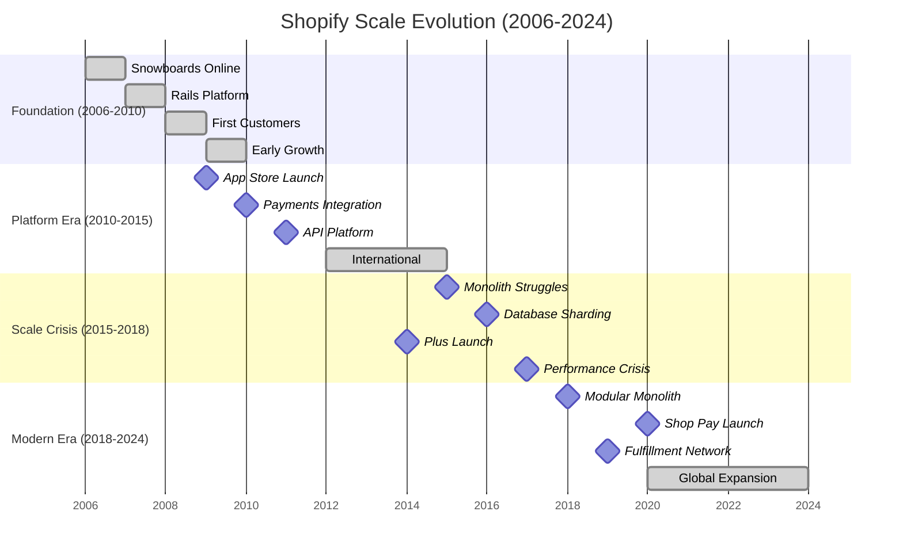
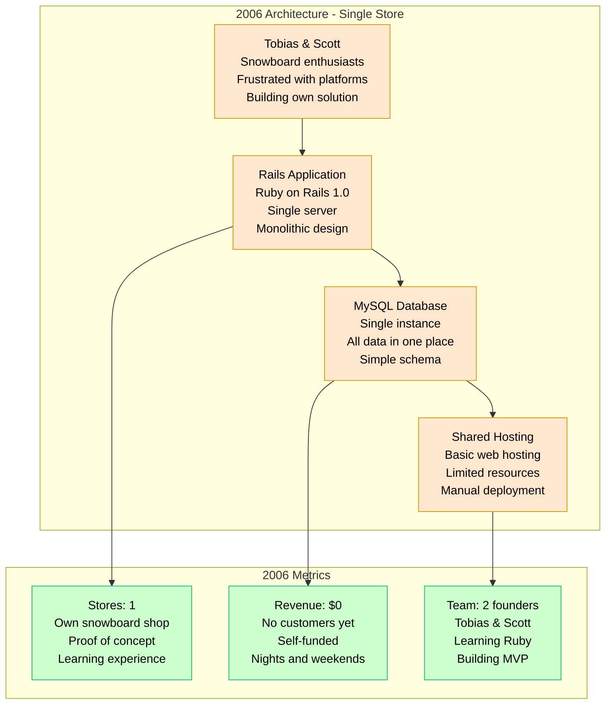
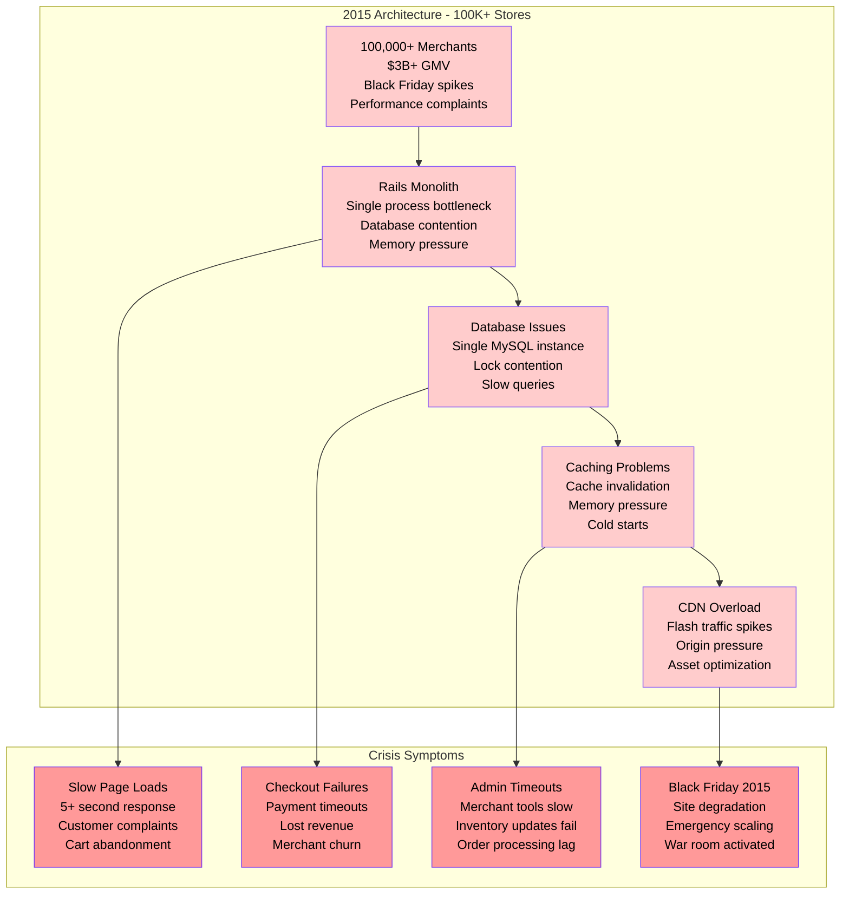
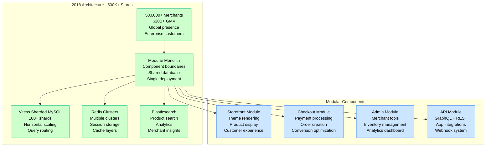
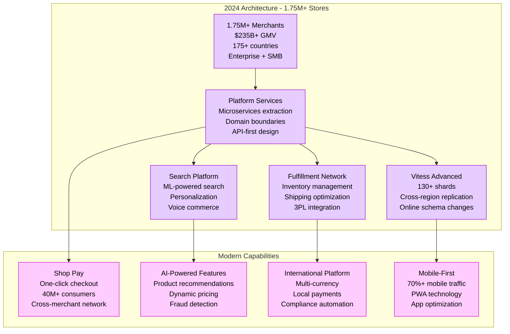
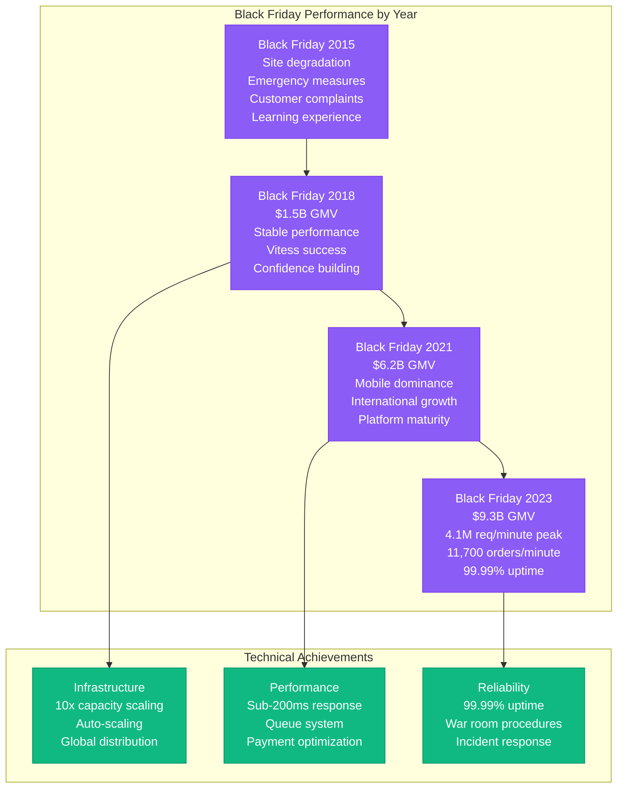
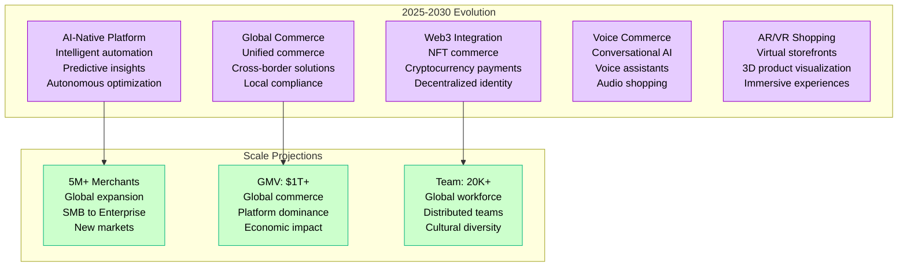

# Shopify Scale Evolution - "From Snowboard Shop to E-commerce Empire"

## Overview

Shopify's evolution from a small snowboard shop in 2006 to powering 1.75+ million merchants with $235+ billion GMV represents one of the most dramatic scaling journeys in e-commerce. This timeline shows key architectural decisions, technology migrations, and growth inflection points over 18 years.

## Scale Evolution Timeline



## Architecture Evolution by Scale

### 2006: Snowboard Shop - "The Ruby on Rails Genesis"



**2006-2008 Breakthrough Moments:**
- **The Problem**: Existing platforms were inflexible
- **The Solution**: Build their own with Ruby on Rails
- **The Insight**: Other merchants had the same problem
- **The Pivot**: Sell the platform, not just snowboards

### 2010: Platform Launch - "The Multi-Tenant Challenge"

```mermaid
graph TB
    subgraph 2010 Architecture - 1,000 Stores
        CUSTOMERS[1,000 Merchants<br/>Small businesses<br/>$100M+ GMV<br/>Growing community]

        RAILS_MONOLITH[Rails Monolith<br/>Multi-tenant design<br/>Single codebase<br/>Shared database]

        MYSQL_MASTER[MySQL Master<br/>Single database<br/>All tenant data<br/>Growing pressure]

        MYSQL_SLAVE[MySQL Slaves<br/>Read replicas<br/>Basic scaling<br/>Report queries]

        CDN[Content Delivery<br/>Static assets<br/>Theme files<br/>Image hosting]

        CUSTOMERS --> RAILS_MONOLITH
        RAILS_MONOLITH --> MYSQL_MASTER
        MYSQL_MASTER --> MYSQL_SLAVE
        RAILS_MONOLITH --> CDN
    end

    subgraph Platform Features
        THEMES[Theme System<br/>Liquid templating<br/>Customizable designs<br/>Developer ecosystem]

        APPS[App Store<br/>Third-party integrations<br/>Revenue sharing<br/>Extended functionality]

        PAYMENTS[Payment Processing<br/>Credit card integration<br/>Multiple gateways<br/>Fraud protection]

        API[REST API<br/>Developer access<br/>Integrations<br/>Mobile apps]
    end

    RAILS_MONOLITH --> THEMES
    RAILS_MONOLITH --> APPS
    RAILS_MONOLITH --> PAYMENTS
    RAILS_MONOLITH --> API

    %% Apply platform colors
    classDef platformStyle fill:#CCE6FF,stroke:#3B82F6,color:#000
    classDef featureStyle fill:#E6CCFF,stroke:#9900CC,color:#000

    class CUSTOMERS,RAILS_MONOLITH,MYSQL_MASTER,MYSQL_SLAVE,CDN platformStyle
    class THEMES,APPS,PAYMENTS,API featureStyle
```

**2010 Metrics:**
- **Merchants**: 1,000 active stores
- **GMV**: $100M+ annually
- **Team**: 25 employees
- **Funding**: Series A ($7M)

### 2015: The Scaling Crisis - "When Rails Hits the Wall"



**The Great Migration Decision (2016):**
- **Problem**: Single database couldn't handle 100K+ merchants
- **Solution**: Database sharding with Vitess
- **Risk**: Massive architectural change with zero downtime
- **Timeline**: 18-month migration project

### 2018: The Modular Monolith - "Scaling Without Microservices"



**2018 Architectural Decisions:**
- **Modular Monolith**: Clear boundaries without microservice complexity
- **Vitess Adoption**: Horizontal database scaling
- **Component Isolation**: Independent deployment within monolith
- **Shared Database**: Maintain transaction consistency

### 2024: Global E-commerce Platform - "The Multi-Billion GMV Scale"



**2024 Metrics:**
- **Merchants**: 1.75+ million stores
- **GMV**: $235+ billion annually
- **Team**: 10,000+ employees globally
- **Valuation**: $65+ billion (public company)

## Technology Evolution Milestones

### Ruby on Rails Evolution

```mermaid
graph TB
    subgraph Rails Journey at Shopify
        RAILS_1[Rails 1.0 (2006)<br/>First version<br/>Convention over config<br/>Rapid development]

        RAILS_2[Rails 2.0 (2008)<br/>REST routing<br/>Better performance<br/>Plugin ecosystem]

        RAILS_3[Rails 3.0 (2012)<br/>Bundler integration<br/>Query interface<br/>Modular design]

        RAILS_4[Rails 4.0 (2015)<br/>Strong parameters<br/>Russian doll caching<br/>Background jobs]

        RAILS_5[Rails 5.0 (2018)<br/>Action Cable<br/>API mode<br/>Rails as API backend]

        RAILS_6[Rails 6.0 (2020)<br/>Multiple databases<br/>Parallel testing<br/>Action Mailbox]

        RAILS_7[Rails 7.0 (2024)<br/>Hotwire integration<br/>Import maps<br/>Modern frontend]

        %% Rails progression
        RAILS_1 --> RAILS_2
        RAILS_2 --> RAILS_3
        RAILS_3 --> RAILS_4
        RAILS_4 --> RAILS_5
        RAILS_5 --> RAILS_6
        RAILS_6 --> RAILS_7
    end

    subgraph Shopify's Rails Contributions
        ACTIVEMERCHANT[ActiveMerchant<br/>Payment processing<br/>Gateway abstraction<br/>Open source library]

        LIQUID[Liquid Templating<br/>Safe template language<br/>Merchant customization<br/>Sandboxed execution]

        SHIPIT[Shipit Deployment<br/>Continuous deployment<br/>Gradual rollouts<br/>Safe releases]

        PERFORMANCE[Performance Improvements<br/>Memory optimization<br/>Database efficiency<br/>Response time reduction]
    end

    RAILS_2 --> ACTIVEMERCHANT
    RAILS_3 --> LIQUID
    RAILS_5 --> SHIPIT
    RAILS_7 --> PERFORMANCE

    %% Apply Rails colors
    classDef railsStyle fill:#8B5CF6,stroke:#7C3AED,color:#fff
    classDef contributionStyle fill:#10B981,stroke:#059669,color:#fff

    class RAILS_1,RAILS_2,RAILS_3,RAILS_4,RAILS_5,RAILS_6,RAILS_7 railsStyle
    class ACTIVEMERCHANT,LIQUID,SHIPIT,PERFORMANCE contributionStyle
```

## Breaking Points and Solutions

### 2010: The Multi-Tenancy Challenge

**Problem**: How to serve 1,000+ merchants from single application
**Solution**: Rails multi-tenancy with shared database
**Impact**: Enabled rapid customer growth with shared resources

### 2015: The Database Wall

**Problem**: Single MySQL instance couldn't handle 100K+ merchants
**Solution**: Vitess horizontal sharding
**Impact**: Unlimited database scaling capability

### 2017: The Monolith Performance Crisis

**Problem**: Single Rails process became bottleneck
**Solution**: Modular monolith with component boundaries
**Impact**: Maintained development velocity while improving performance

### 2020: The Global Commerce Opportunity

**Problem**: Traditional e-commerce platforms limited merchant growth
**Solution**: Shop Pay cross-merchant network
**Impact**: New revenue stream and merchant acquisition tool

### 2023: The AI Revolution

**Problem**: Merchants need intelligent automation
**Solution**: AI-powered features throughout platform
**Impact**: Improved merchant success and platform differentiation

## Cost Evolution and Unit Economics

### Infrastructure Cost per Merchant

```mermaid
graph LR
    subgraph Cost Optimization Journey
        COST_2010[2010: $50/month<br/>High hosting costs<br/>Single tenant overhead<br/>Limited optimization]

        COST_2015[2015: $15/month<br/>Better multi-tenancy<br/>Shared infrastructure<br/>Economy of scale]

        COST_2020[2020: $8/month<br/>Vitess efficiency<br/>Cloud optimization<br/>Automated scaling]

        COST_2024[2024: $5/month<br/>Modern architecture<br/>AI optimization<br/>Global efficiency]

        COST_2010 --> COST_2015
        COST_2015 --> COST_2020
        COST_2020 --> COST_2024
    end

    %% Cost reduction annotations
    COST_2010 -.->|70% reduction| COST_2015
    COST_2015 -.->|47% reduction| COST_2020
    COST_2020 -.->|37% reduction| COST_2024

    subgraph Revenue per Merchant
        REVENUE_GROWTH[Revenue Growth<br/>$29-2000/month plans<br/>Payment processing<br/>App ecosystem<br/>Plus enterprise]

        CUSTOMER_LTV[Customer LTV<br/>Multi-year retention<br/>Growing GMV<br/>Expanding usage<br/>Platform stickiness]
    end

    COST_2024 --> REVENUE_GROWTH
    REVENUE_GROWTH --> CUSTOMER_LTV

    %% Apply cost/revenue colors
    classDef costStyle fill:#FF6666,stroke:#8B5CF6,color:#fff
    classDef revenueStyle fill:#66FF66,stroke:#00CC00,color:#000

    class COST_2010,COST_2015,COST_2020,COST_2024 costStyle
    class REVENUE_GROWTH,CUSTOMER_LTV revenueStyle
```



## Growth Metrics Evolution

### Key Performance Indicators by Era

| Era | Merchants | GMV | Revenue | Team Size | Valuation |
|-----|-----------|-----|---------|-----------|-----------|
| 2006-2008 | 1-100 | $0-10M | $0-1M | 2-10 | $0 |
| 2009-2012 | 100-10K | $10M-500M | $1M-50M | 10-100 | $100M |
| 2013-2016 | 10K-300K | $500M-15B | $50M-400M | 100-1K | $1B |
| 2017-2020 | 300K-1M | $15B-120B | $400M-3B | 1K-7K | $10B |
| 2021-2024 | 1M-1.75M | $120B-235B | $3B-7B | 7K-10K | $65B |

### Black Friday Performance Evolution



## Future Projections (2025-2030)

### Technology Roadmap



This evolution represents one of the most successful scaling journeys in SaaS history, growing from a two-person snowboard shop to powering nearly 2 million merchants globally while maintaining technical excellence and platform reliability through massive growth phases.