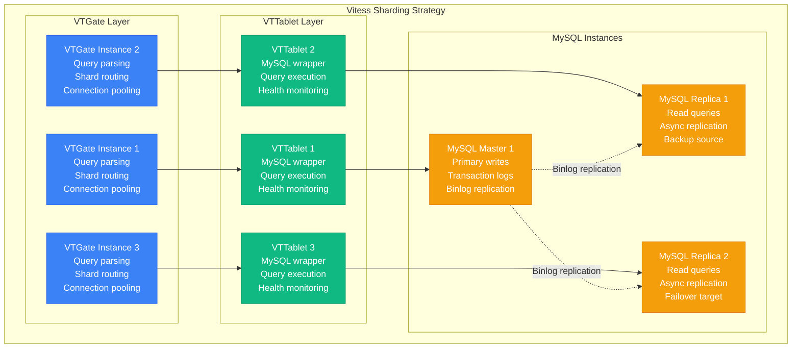
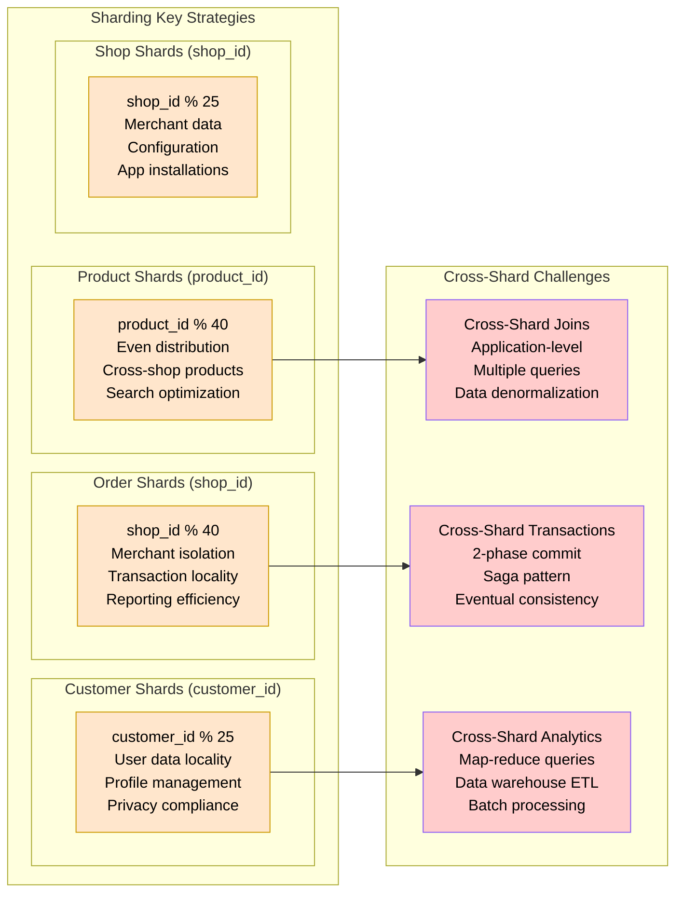
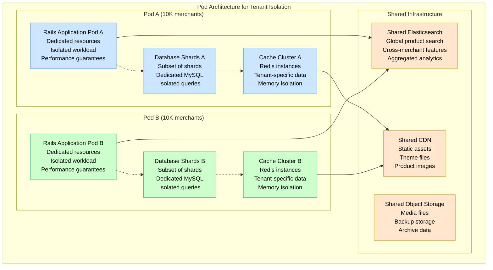
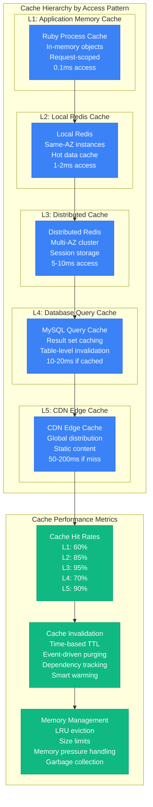
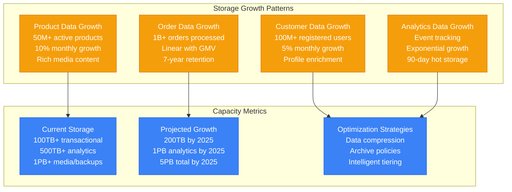
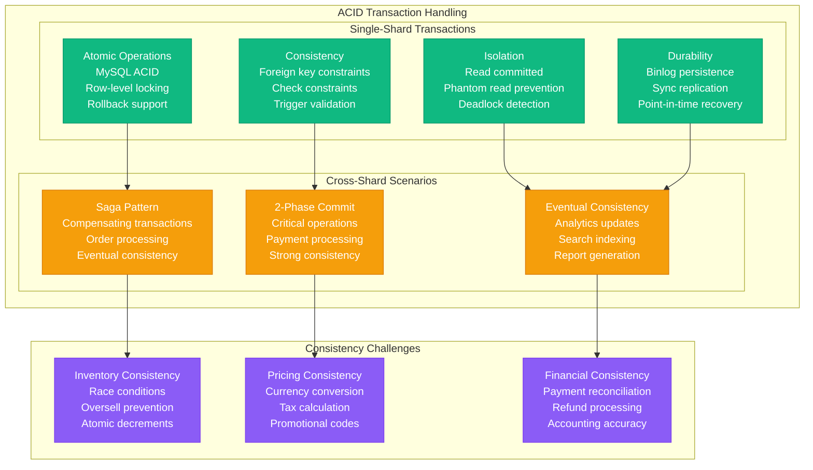
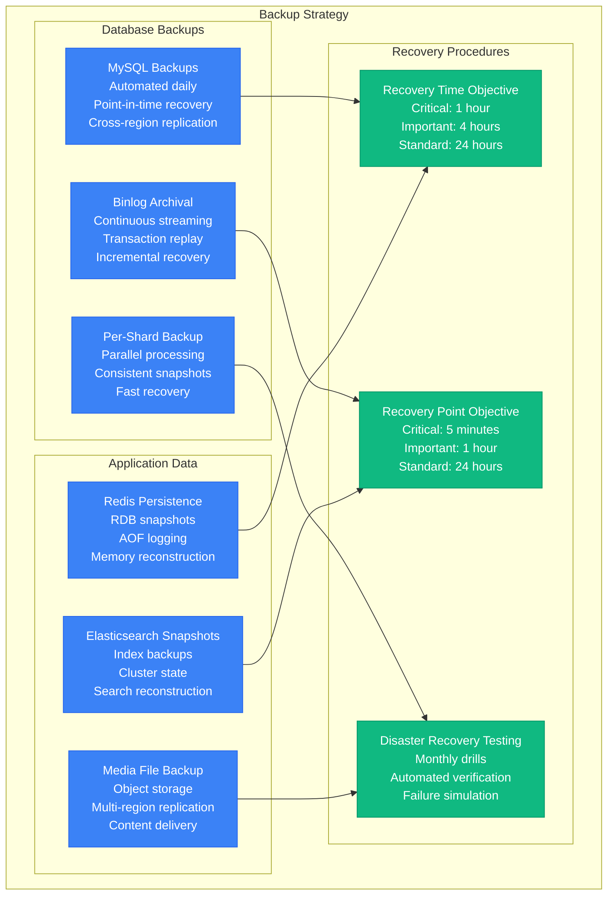

# Shopify Storage Architecture - "The Multi-Tenant Data Empire"

## Overview

Shopify's storage architecture handles 1.75+ million merchants with billions of orders, products, and customer records. Their Vitess-sharded MySQL architecture scales horizontally across 130+ shards while maintaining ACID transactions and supporting massive Black Friday traffic spikes.

## Complete Storage Architecture

```mermaid
graph TB
    subgraph "Edge Plane - Data Access Layer #3B82F6"
        subgraph "Application Cache Layer"
            REDIS_CLUSTER[Redis Clusters<br/>50+ instances<br/>Session + Cart storage<br/>Hot data caching]
            MEMCACHED[Memcached<br/>Fragment caching<br/>Query result cache<br/>Computed data]
            CDN_CACHE[CDN Edge Cache<br/>Static assets<br/>Product images<br/>Theme files]
        end

        subgraph "Search & Analytics Cache"
            ELASTIC_CACHE[Elasticsearch Cache<br/>Search results<br/>Faceted navigation<br/>Real-time indexing]
            ANALYTICS_CACHE[Analytics Cache<br/>Merchant dashboards<br/>Report data<br/>Aggregated metrics]
        end
    end

    subgraph "Service Plane - Data Services #10B981"
        subgraph "Data Access Layer"
            VITESS_GATEWAY[VTGate (Vitess)<br/>Query routing<br/>Connection pooling<br/>Query optimization]
            READ_REPLICAS[Read Replica Router<br/>Load balancing<br/>Lag monitoring<br/>Failover logic]
            WRITE_ROUTER[Write Router<br/>Master selection<br/>Transaction coordination<br/>Consistency guarantees]
        end

        subgraph "Search & Indexing"
            SEARCH_API[Search API<br/>Product search<br/>Autocomplete<br/>Filters & facets]
            INDEX_BUILDER[Index Builder<br/>Real-time indexing<br/>Elasticsearch sync<br/>Change data capture]
            ANALYTICS_API[Analytics API<br/>Merchant insights<br/>Sales reports<br/>Performance metrics]
        end
    end

    subgraph "State Plane - Persistent Storage #F59E0B"
        subgraph "Vitess Sharded MySQL (130+ Shards)"
            subgraph "Product Shards (40 shards)"
                PRODUCT_SHARD1[Product Shard 1<br/>MySQL 8.0<br/>SSD storage<br/>2 read replicas]
                PRODUCT_SHARD2[Product Shard 2<br/>MySQL 8.0<br/>SSD storage<br/>2 read replicas]
                PRODUCT_SHARDS[... 38 more shards<br/>Distributed by<br/>product_id hash]
            end

            subgraph "Order Shards (40 shards)"
                ORDER_SHARD1[Order Shard 1<br/>MySQL 8.0<br/>Transaction logs<br/>2 read replicas]
                ORDER_SHARD2[Order Shard 2<br/>MySQL 8.0<br/>Transaction logs<br/>2 read replicas]
                ORDER_SHARDS[... 38 more shards<br/>Distributed by<br/>shop_id hash]
            end

            subgraph "Customer Shards (25 shards)"
                CUSTOMER_SHARD1[Customer Shard 1<br/>MySQL 8.0<br/>Profile data<br/>2 read replicas]
                CUSTOMER_SHARD2[Customer Shard 2<br/>MySQL 8.0<br/>Profile data<br/>2 read replicas]
                CUSTOMER_SHARDS[... 23 more shards<br/>Distributed by<br/>customer_id hash]
            end

            subgraph "Shop Shards (25 shards)"
                SHOP_SHARD1[Shop Shard 1<br/>MySQL 8.0<br/>Merchant data<br/>2 read replicas]
                SHOP_SHARD2[Shop Shard 2<br/>MySQL 8.0<br/>Merchant data<br/>2 read replicas]
                SHOP_SHARDS[... 23 more shards<br/>Distributed by<br/>shop_id hash]
            end
        end

        subgraph "Specialized Storage Systems"
            ELASTICSEARCH[Elasticsearch Cluster<br/>Product search index<br/>50M+ products<br/>Real-time updates]

            KAFKA[Apache Kafka<br/>Event streaming<br/>Change data capture<br/>Microservice communication]

            BLOB_STORAGE[Object Storage<br/>Product images<br/>Theme assets<br/>Document storage]
        end

        subgraph "Analytics & Reporting"
            ANALYTICS_DB[Analytics Warehouse<br/>BigQuery/Redshift<br/>Historical data<br/>Business intelligence]

            AUDIT_LOGS[Audit Log Storage<br/>Compliance logs<br/>Change tracking<br/>Security events]

            BACKUP_STORAGE[Backup Storage<br/>Point-in-time recovery<br/>Cross-region replication<br/>7-year retention]
        end
    end

    subgraph "Control Plane - Storage Management #8B5CF6"
        subgraph "Shard Management"
            SHARD_MANAGER[Shard Manager<br/>Rebalancing<br/>Split operations<br/>Health monitoring]
            TOPOLOGY_MGR[Topology Manager<br/>Master/replica config<br/>Failover coordination<br/>Capacity planning]
            BACKUP_MGR[Backup Manager<br/>Automated backups<br/>Recovery procedures<br/>Compliance automation]
        end

        subgraph "Performance Monitoring"
            QUERY_ANALYZER[Query Analyzer<br/>Slow query detection<br/>Performance optimization<br/>Index recommendations]
            CAPACITY_MONITOR[Capacity Monitor<br/>Storage growth<br/>Performance metrics<br/>Scaling triggers]
            REPLICATION_MONITOR[Replication Monitor<br/>Lag detection<br/>Consistency checking<br/>Failover automation]
        end
    end

    %% Data flow connections
    REDIS_CLUSTER --> VITESS_GATEWAY
    MEMCACHED --> READ_REPLICAS
    CDN_CACHE --> WRITE_ROUTER

    VITESS_GATEWAY --> PRODUCT_SHARD1
    VITESS_GATEWAY --> ORDER_SHARD1
    VITESS_GATEWAY --> CUSTOMER_SHARD1
    VITESS_GATEWAY --> SHOP_SHARD1

    READ_REPLICAS --> PRODUCT_SHARD2
    READ_REPLICAS --> ORDER_SHARD2
    READ_REPLICAS --> CUSTOMER_SHARD2
    READ_REPLICAS --> SHOP_SHARD2

    SEARCH_API --> ELASTICSEARCH
    INDEX_BUILDER --> KAFKA
    ANALYTICS_API --> ANALYTICS_DB

    %% Control connections
    SHARD_MANAGER --> TOPOLOGY_MGR
    TOPOLOGY_MGR --> BACKUP_MGR
    QUERY_ANALYZER --> CAPACITY_MONITOR
    CAPACITY_MONITOR --> REPLICATION_MONITOR

    %% Apply four-plane colors
    classDef edgeStyle fill:#3B82F6,stroke:#2563EB,color:#fff
    classDef serviceStyle fill:#10B981,stroke:#059669,color:#fff
    classDef stateStyle fill:#F59E0B,stroke:#D97706,color:#fff
    classDef controlStyle fill:#8B5CF6,stroke:#7C3AED,color:#fff

    class REDIS_CLUSTER,MEMCACHED,CDN_CACHE,ELASTIC_CACHE,ANALYTICS_CACHE edgeStyle
    class VITESS_GATEWAY,READ_REPLICAS,WRITE_ROUTER,SEARCH_API,INDEX_BUILDER,ANALYTICS_API serviceStyle
    class PRODUCT_SHARD1,PRODUCT_SHARD2,PRODUCT_SHARDS,ORDER_SHARD1,ORDER_SHARD2,ORDER_SHARDS,CUSTOMER_SHARD1,CUSTOMER_SHARD2,CUSTOMER_SHARDS,SHOP_SHARD1,SHOP_SHARD2,SHOP_SHARDS,ELASTICSEARCH,KAFKA,BLOB_STORAGE,ANALYTICS_DB,AUDIT_LOGS,BACKUP_STORAGE stateStyle
    class SHARD_MANAGER,TOPOLOGY_MGR,BACKUP_MGR,QUERY_ANALYZER,CAPACITY_MONITOR,REPLICATION_MONITOR controlStyle
```

## Vitess Sharding Strategy

### Horizontal Sharding Architecture



### Sharding Key Distribution



## Multi-Tenant Storage Isolation

### Pod-Based Tenant Isolation



## Caching Strategy

### Multi-Layer Cache Hierarchy



## Storage Performance Characteristics

### Database Performance Metrics

| Metric | Target | Achieved | Monitoring |
|--------|--------|----------|------------|
| Query Response Time | <10ms p95 | 8ms p95 | Real-time alerts |
| Write Latency | <20ms p95 | 15ms p95 | Per-shard monitoring |
| Read Replica Lag | <1 second | 200ms avg | Lag monitoring |
| Connection Pool | 95% utilization | 85% avg | Pool exhaustion alerts |
| Disk I/O | <80% utilization | 65% avg | Per-instance monitoring |
| Memory Usage | <80% utilization | 70% avg | OOM prevention |

### Storage Capacity Planning



## Data Consistency and ACID Guarantees

### Transaction Management



## Backup and Disaster Recovery

### Comprehensive Backup Strategy



### Geographic Distribution

- **Primary Region**: North America (AWS us-east-1)
- **Secondary Regions**: Europe (eu-west-1), Asia Pacific (ap-southeast-1)
- **Backup Regions**: Cross-region replication for all critical data
- **Recovery Strategy**: Automated failover with manual override capabilities

This storage architecture enables Shopify to handle massive scale during events like Black Friday while maintaining data consistency, merchant isolation, and sub-200ms response times for billions of transactions across 1.75+ million merchant stores globally.