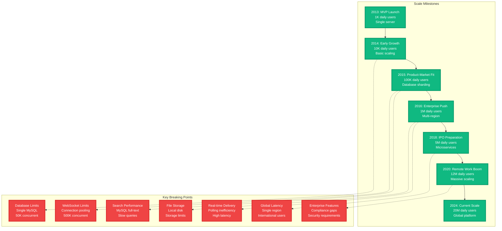
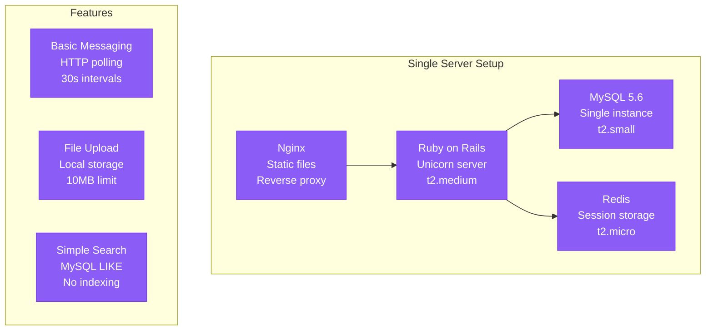
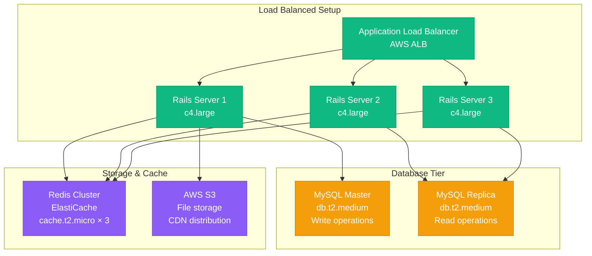
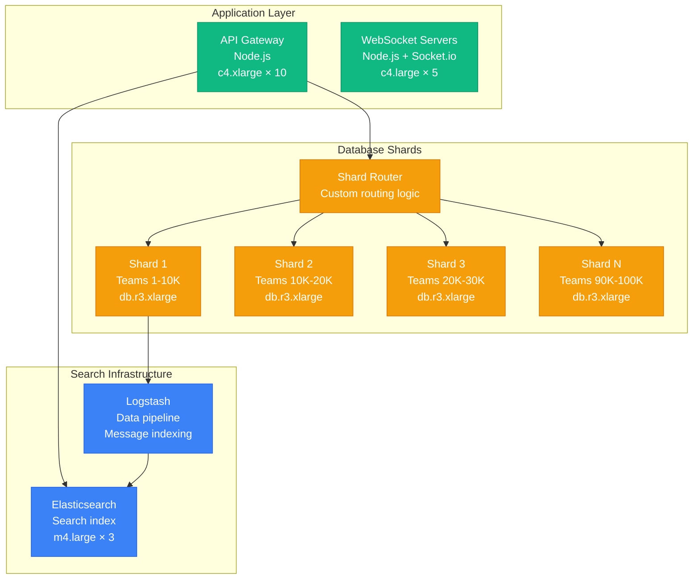
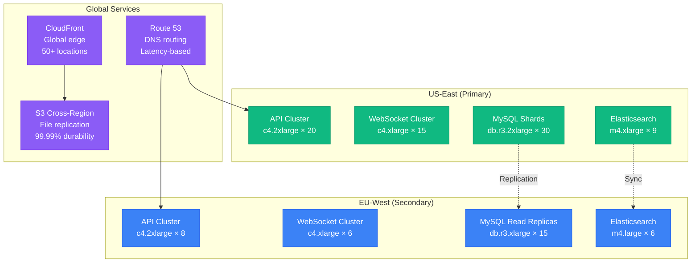
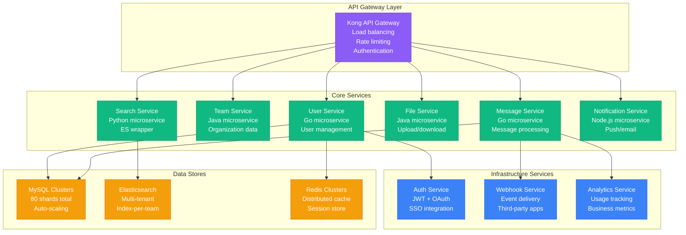
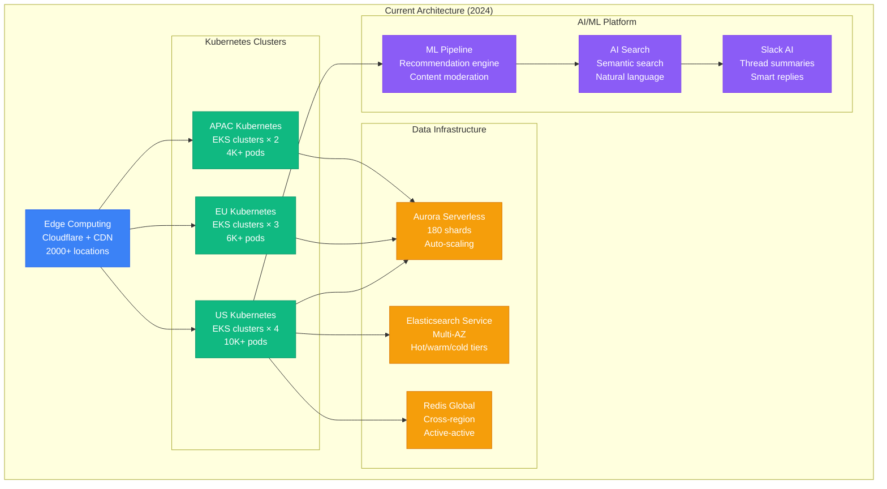

# Slack Scale Evolution - From Startup to 20M Daily Active Users

## Overview
Slack's architectural evolution from a gaming company side project to enterprise messaging platform serving 20M+ daily active users, with key breaking points and solutions at each scale milestone.

## Scale Journey Overview

## Phase 1: MVP Launch (2013) - 1K Daily Users

### Initial Architecture

### Technology Stack
- **Backend**: Ruby on Rails 4.0
- **Database**: MySQL 5.6 (single instance)
- **Cache**: Redis for sessions
- **Frontend**: jQuery + Backbone.js
- **Hosting**: Single AWS EC2 instance

### Limitations Hit
- **Concurrent users**: Max 1K before response time degradation
- **Polling overhead**: High server load from HTTP polling
- **Storage**: Local disk filling up with uploaded files
- **Search**: Full table scans causing query timeouts

### Monthly Cost: $500
- EC2 instances: $300
- RDS MySQL: $150
- S3 backup: $50

## Phase 2: Early Growth (2014) - 10K Daily Users

### Scaling Solutions

### Key Improvements
- **WebSocket introduction**: Reduced polling to real-time updates
- **Read replicas**: Split read/write traffic for better performance
- **CDN**: CloudFront for static file delivery
- **Redis clustering**: Session sharing across app servers

### Performance Metrics
- **Response time**: p99 < 500ms
- **Concurrent WebSocket**: 10K connections
- **Database queries**: 1K QPS average
- **File uploads**: 1GB/day

### Monthly Cost: $2,800
- EC2 instances: $1,200
- RDS cluster: $800
- ElastiCache: $300
- S3 + CloudFront: $500

## Phase 3: Product-Market Fit (2015) - 100K Daily Users

### Database Sharding Introduction

### Major Architectural Changes
- **Custom sharding**: Team-based database partitioning
- **Elasticsearch**: Dedicated search infrastructure
- **Message queuing**: Redis for real-time event distribution
- **Microservices**: Split monolith into focused services

### Breaking Point Solutions
- **Database sharding**: Solved single MySQL bottleneck
- **Elasticsearch**: Replaced slow MySQL full-text search
- **WebSocket optimization**: Connection pooling and sticky sessions
- **CDN expansion**: Multiple regions for global users

### Performance Metrics
- **Concurrent users**: 100K+ active connections
- **Message throughput**: 10K messages/second peak
- **Search latency**: p99 < 200ms
- **Database shards**: 10 shards, 10K teams each

### Monthly Cost: $18,000
- EC2 compute: $8,000
- RDS shards: $6,000
- Elasticsearch: $2,000
- ElastiCache: $1,200
- S3 + CloudFront: $800

## Phase 4: Enterprise Push (2016) - 1M Daily Users

### Multi-Region Architecture

### Enterprise Features Added
- **SSO integration**: SAML, OAuth with enterprise providers
- **Compliance**: SOC 2, HIPAA certification process
- **Data residency**: Regional data storage requirements
- **Advanced security**: DLP, audit logging, retention policies

### Scale Challenges Solved
- **Global latency**: Multi-region deployment
- **Enterprise security**: Dedicated security infrastructure
- **File storage scaling**: S3 with intelligent tiering
- **Search performance**: Dedicated Elasticsearch clusters per region

### Performance Metrics
- **Global users**: 1M+ daily active across 12 time zones
- **Message volume**: 100K messages/second peak
- **File storage**: 10TB+ total, 500GB/day growth
- **Search queries**: 50K searches/second peak

### Monthly Cost: $120,000
- EC2 compute: $45,000
- RDS cluster: $35,000
- Elasticsearch: $15,000
- S3 + data transfer: $12,000
- ElastiCache: $8,000
- Enterprise security: $5,000

## Phase 5: IPO Preparation (2018) - 5M Daily Users

### Microservices Architecture

### IPO-Ready Infrastructure
- **Service mesh**: Istio for service-to-service communication
- **Observability**: Complete tracing, metrics, and logging
- **Security**: Zero-trust network, encryption everywhere
- **Compliance**: SOC 2 Type II, regular audits

### Performance Metrics
- **Daily active users**: 5M+ across 150+ countries
- **Peak message rate**: 500K messages/second
- **Service availability**: 99.99% uptime SLA
- **API latency**: p99 < 100ms for core endpoints

### Monthly Cost: $450,000
- EC2/EKS compute: $180,000
- RDS Aurora clusters: $120,000
- Elasticsearch Service: $45,000
- S3 + data transfer: $35,000
- ElastiCache: $25,000
- Security & compliance: $25,000
- Monitoring & logging: $20,000

## Phase 6: Remote Work Boom (2020) - 12M Daily Users

### COVID-19 Scale Response

```mermaid
graph TB
    subgraph "Emergency Scaling (March 2020)"
        SCALE_OUT[Auto Scaling<br/>10x capacity<br/>2-week deployment]
        REGIONAL[Regional Expansion<br/>Asia-Pacific<br/>South America]
        CAPACITY[Capacity Planning<br/>Predictive scaling<br/>Load forecasting]
    end

    subgraph "Performance Optimizations"
        WS_POOL[WebSocket Pooling<br/>Connection efficiency<br/>Reduced memory]
        MSG_BATCH[Message Batching<br/>Bulk operations<br/>Reduced DB load]
        CACHE_WARM[Cache Warming<br/>Predictive loading<br/>Faster responses]
    end

    subgraph "New Features for Remote Work"
        VIDEO[Video Calling<br/>Jitsi integration<br/>HD quality]
        SCREEN[Screen Sharing<br/>WebRTC implementation<br/>Low latency]
        HUDDLES[Huddles<br/>Audio rooms<br/>Spatial audio]
        WORKFLOW[Workflow Builder<br/>Automation platform<br/>No-code tools]
    end

    SCALE_OUT --> REGIONAL
    REGIONAL --> CAPACITY

    WS_POOL --> MSG_BATCH
    MSG_BATCH --> CACHE_WARM

    VIDEO --> SCREEN
    SCREEN --> HUDDLES
    HUDDLES --> WORKFLOW

    classDef emergencyStyle fill:#EF4444,stroke:#DC2626,color:#fff
    classDef optimizeStyle fill:#F59E0B,stroke:#D97706,color:#fff
    classDef featureStyle fill:#10B981,stroke:#059669,color:#fff

    class SCALE_OUT,REGIONAL,CAPACITY emergencyStyle
    class WS_POOL,MSG_BATCH,CACHE_WARM optimizeStyle
    class VIDEO,SCREEN,HUDDLES,WORKFLOW featureStyle
```

### Crisis Response Metrics
- **Traffic spike**: 300% increase in 2 weeks
- **Scaling response**: Auto-scaled from 5M to 12M DAU
- **Uptime maintained**: 99.98% during crisis period
- **Feature delivery**: Major features shipped monthly

### Infrastructure Expansion
- **Global regions**: Expanded to 8 AWS regions
- **Edge computing**: Cloudflare Workers for real-time features
- **Database scaling**: Increased to 120 MySQL shards
- **WebSocket capacity**: 12M+ concurrent connections

### Monthly Cost: $2.1M
- Compute (global): $800,000
- Database clusters: $450,000
- Elasticsearch: $180,000
- CDN + edge: $120,000
- Storage (S3): $85,000
- Networking: $75,000
- Security & compliance: $65,000
- Video infrastructure: $325,000

## Phase 7: Current Scale (2024) - 20M Daily Users

### Enterprise Platform Architecture

### Current Scale Metrics
- **Daily active users**: 20M+ across 750K+ organizations
- **Messages per day**: 10B+ messages
- **Concurrent connections**: 12M+ WebSocket connections
- **Global reach**: 150+ countries, 8 primary regions
- **Enterprise customers**: 95% of Fortune 100

### Technology Evolution
- **Serverless adoption**: 40% of workloads on Lambda/Fargate
- **AI integration**: LLM-powered features throughout platform
- **Edge computing**: Real-time features at CDN edge
- **Observability**: Full distributed tracing, chaos engineering

### Monthly Infrastructure Cost: $78M
- Global compute: $28M
- Database & storage: $18M
- AI/ML infrastructure: $12M
- CDN & networking: $8M
- Security & compliance: $6M
- Monitoring & observability: $3M
- Development & testing: $3M

## Key Learnings Across Scale

### Technical Debt Management
- **Database sharding**: Early investment paid off at scale
- **Microservices**: Enabled independent team scaling
- **Observability**: Critical for debugging distributed systems
- **Automation**: Essential for managing complexity

### Organizational Scaling
- **Team structure**: Mirrored service architecture (Conway's Law)
- **DevOps culture**: Ownership of production systems
- **Incident response**: Mature processes for reliability
- **Security-first**: Built into development lifecycle

### Cost Optimization
- **Reserved instances**: 60% of compute on reserved pricing
- **Auto-scaling**: Reduced idle capacity by 40%
- **Storage tiering**: 80% cost reduction for archived data
- **Regional optimization**: Compute closer to users

*Based on public presentations by Slack engineering team, IPO filings, incident reports, and disclosed scale metrics from engineering blog posts and conference talks.*