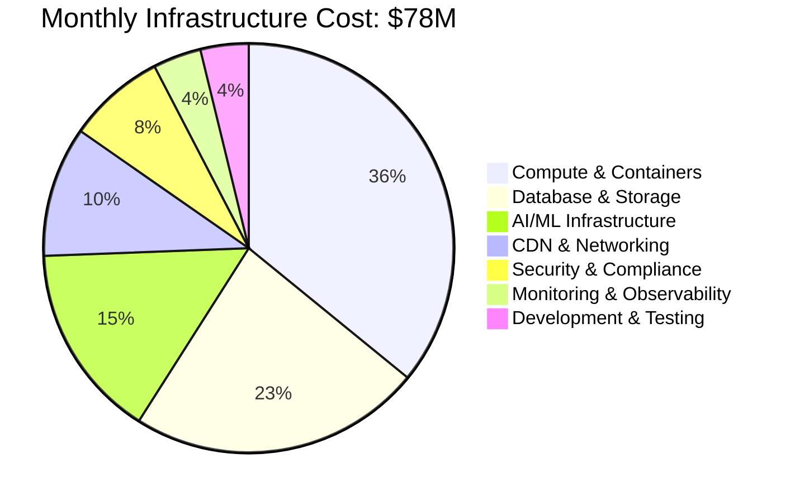
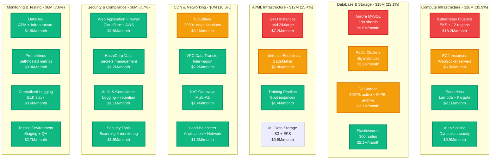
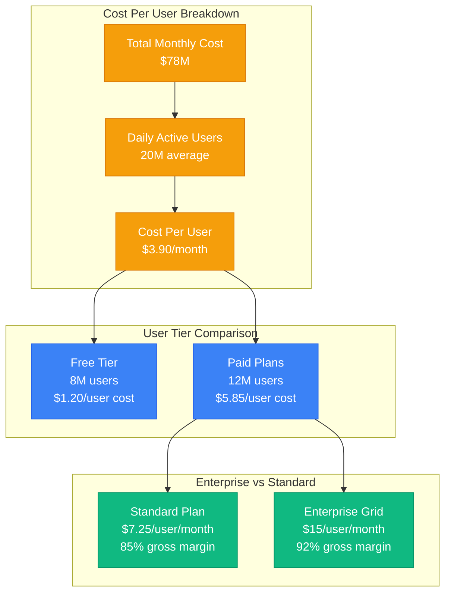
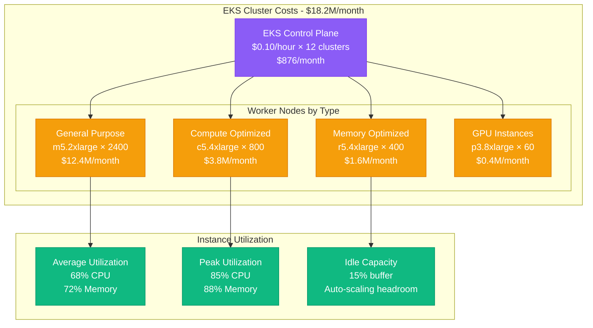
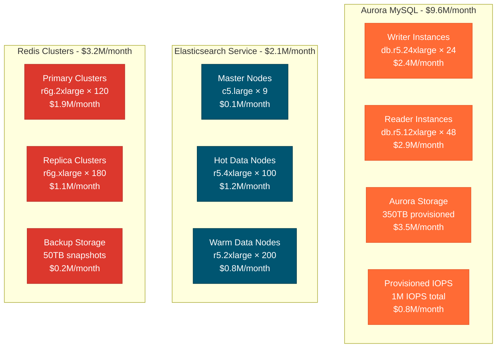
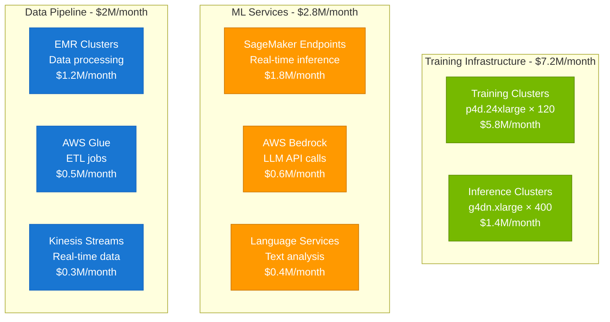
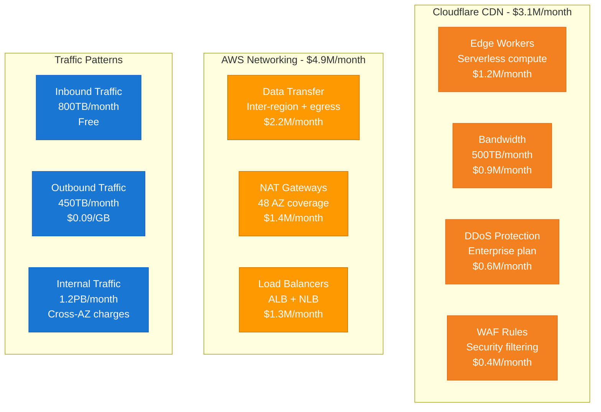
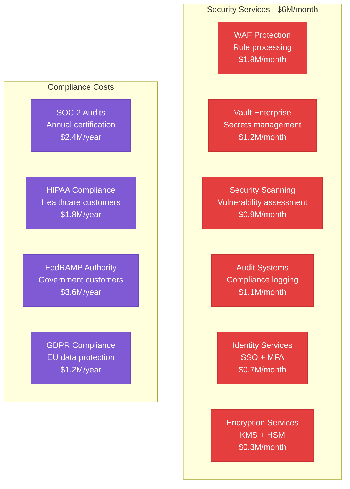
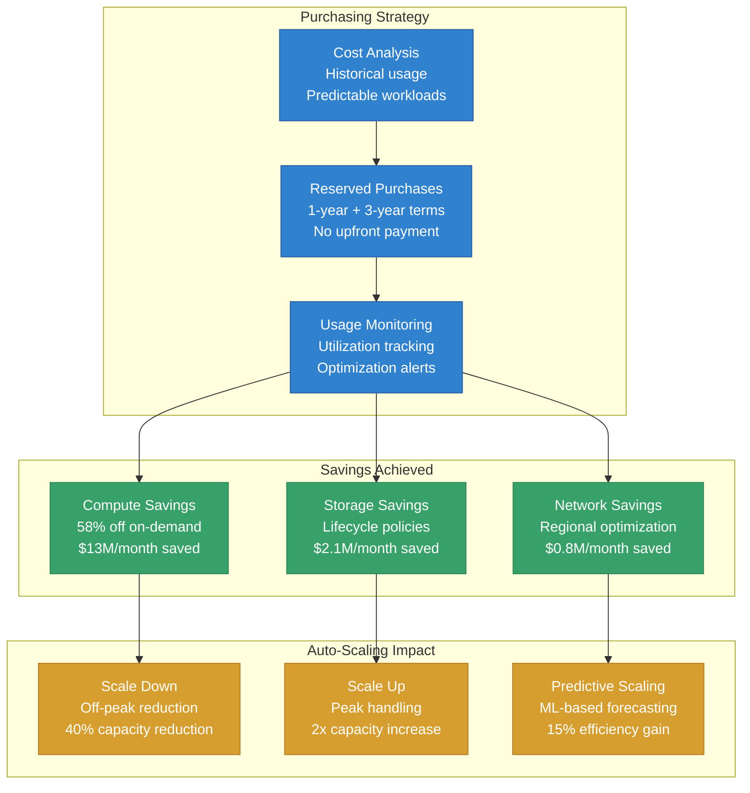

# Slack Cost Breakdown - $78M/Month Infrastructure Economics

## Overview
Detailed analysis of Slack's $78M monthly infrastructure costs serving 20M daily active users, including compute, storage, networking, and operational expenses with optimization strategies.

## Total Cost Overview

## Detailed Cost Breakdown

## Cost Per User Analysis

### Unit Economics

### Regional Cost Distribution
| Region | Monthly Cost | DAU | Cost/User | Primary Services |
|--------|--------------|-----|-----------|-----------------|
| US-East-1 | $28.2M | 8.5M | $3.32 | Primary region, all services |
| US-West-2 | $12.4M | 3.2M | $3.88 | Disaster recovery, compliance |
| EU-West-1 | $15.1M | 4.1M | $3.68 | GDPR compliance, data residency |
| EU-Central-1 | $8.3M | 2.1M | $3.95 | German data residency |
| Asia-Pacific | $9.2M | 1.8M | $5.11 | Higher latency, premium instances |
| Other Regions | $4.8M | 0.3M | $16.00 | Specialized compliance needs |

## Compute Infrastructure Costs

### Kubernetes Cluster Breakdown

### Reserved Instance Savings
- **On-Demand cost**: $31.2M (baseline pricing)
- **Reserved Instance cost**: $18.2M (58% savings)
- **Spot Instance usage**: 15% of compute for batch jobs
- **Savings Plans**: Additional 12% reduction on Lambda/Fargate

## Database Infrastructure Costs

### MySQL Aurora Cluster Costs

### Storage Cost Optimization
| Storage Type | Capacity | Monthly Cost | $/GB | Use Case |
|--------------|----------|--------------|------|----------|
| Aurora SSD | 350TB | $3.5M | $10.00 | Active database |
| S3 Standard | 150TB | $3.5M | $23.00 | Recent files |
| S3 IA | 280TB | $1.8M | $6.43 | Archived files |
| S3 Glacier | 15PB | $600K | $0.04 | Long-term archive |
| S3 Deep Archive | 35PB | $280K | $0.008 | Compliance storage |

## AI/ML Infrastructure Costs

### Machine Learning Pipeline Costs

### AI Feature Cost Analysis
- **Search relevance**: $2.1M/month (semantic search, NLP)
- **Content moderation**: $1.8M/month (image/text analysis)
- **Smart replies**: $1.2M/month (conversation AI)
- **Thread summaries**: $0.9M/month (text summarization)
- **Translation**: $0.6M/month (real-time translation)

## Network & CDN Costs

### Global CDN Distribution

### Bandwidth Optimization
- **Image compression**: 40% bandwidth reduction using WebP
- **Text compression**: gzip/brotli reducing transfer by 70%
- **CDN caching**: 94% cache hit rate for static assets
- **Regional optimization**: Keep traffic within regions where possible

## Security & Compliance Costs

### Security Infrastructure

## Cost Optimization Strategies

### Reserved Instance Strategy

### Cost Monitoring & Alerts
- **Budget alerts**: 85%, 95%, 100% of monthly budget
- **Anomaly detection**: ML-based spending pattern analysis
- **Resource tagging**: Department and team cost allocation
- **Weekly reviews**: Engineering team cost optimization meetings

## ROI Analysis

### Infrastructure Investment vs Revenue
| Metric | Value | Notes |
|--------|-------|-------|
| Monthly Infrastructure Cost | $78M | Total operational cost |
| Monthly Revenue | $340M | Estimated based on user numbers |
| Infrastructure % of Revenue | 23% | Industry benchmark: 20-30% |
| Cost per paying user | $5.85 | Paid users only |
| Gross margin | 77% | After infrastructure costs |

### Optimization Opportunities
- **Spot instances**: Additional 20% savings on batch workloads
- **Multi-cloud**: Price competition between AWS/GCP/Azure
- **Edge computing**: Reduce core infrastructure load
- **Compression**: Further bandwidth optimization
- **Serverless migration**: Pay-per-use for variable workloads

## Future Cost Projections

### Growth Scenarios
- **Conservative (15% user growth)**: $89M/month by 2025
- **Moderate (25% user growth)**: $95M/month by 2025
- **Aggressive (40% user growth)**: $106M/month by 2025
- **AI features expansion**: Additional $15-25M/month for advanced AI

### Cost Control Measures
- **Efficiency targets**: 10% year-over-year improvement
- **Automation**: Reduce operational overhead
- **Right-sizing**: Continuous instance optimization
- **Innovation**: New technologies for cost reduction

*Cost estimates based on AWS pricing as of 2024, Slack's disclosed scale metrics, and industry benchmarks for similar SaaS platforms. Actual costs may vary based on negotiated enterprise pricing and specific configuration choices.*