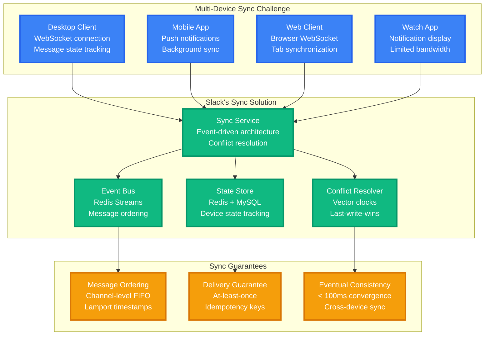
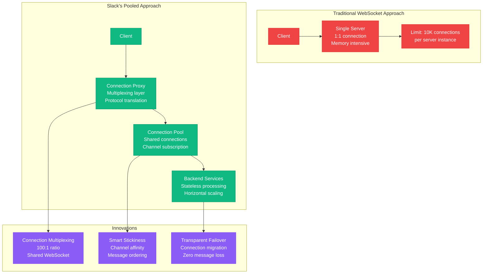
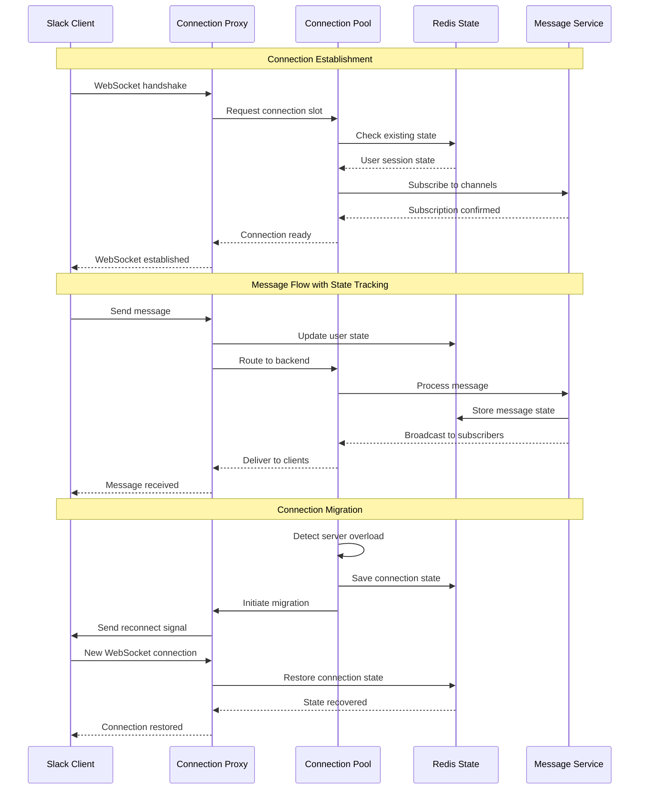
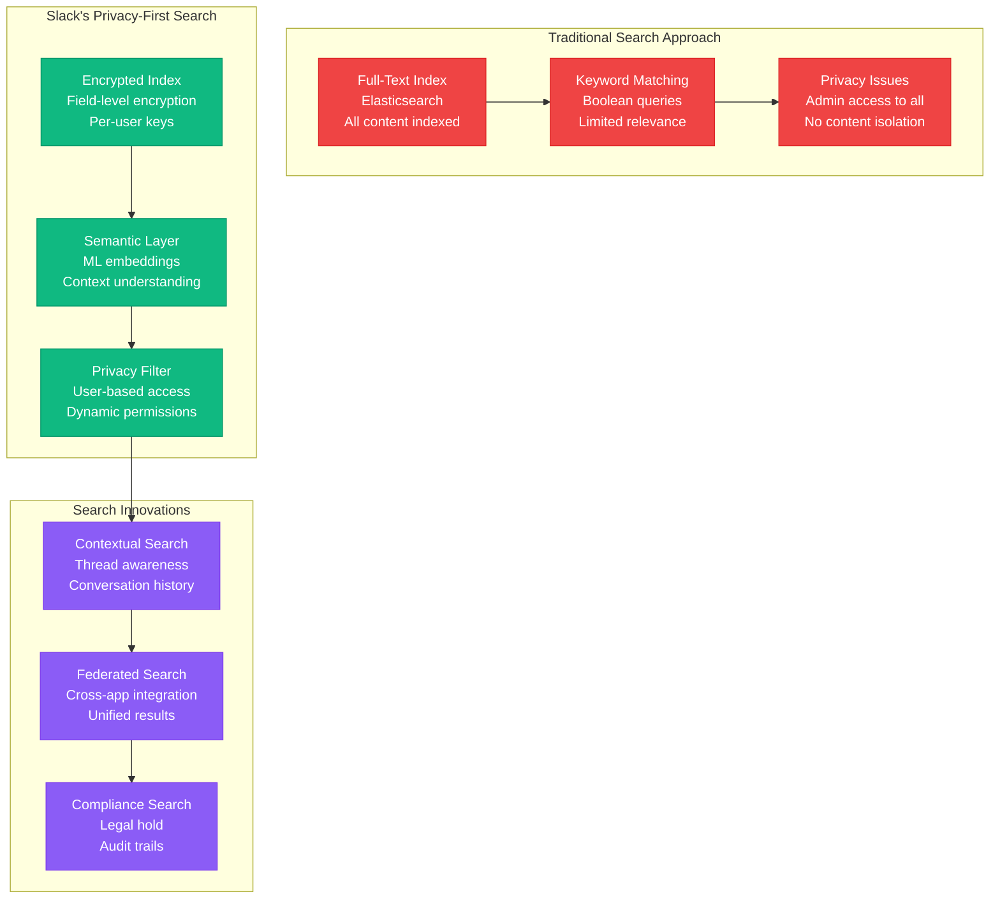
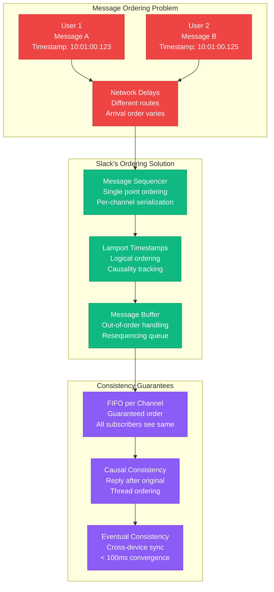
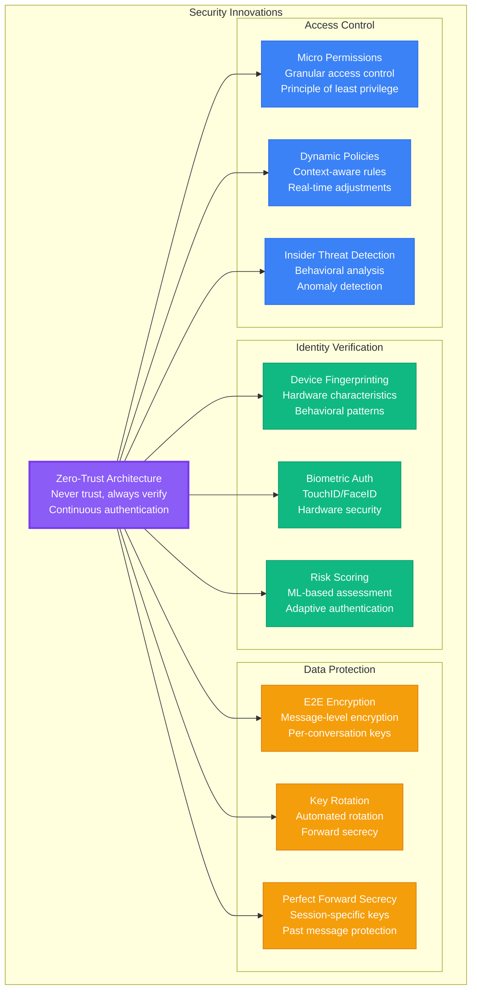
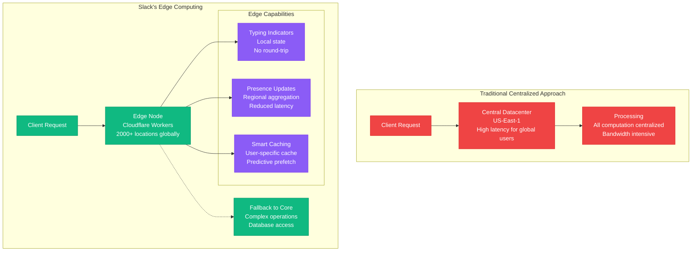

# Slack Novel Solutions - Real-Time Sync and Enterprise Messaging Innovations

## Overview
Slack's innovative solutions for enterprise messaging at scale, including real-time synchronization across devices, message ordering guarantees, and novel approaches to WebSocket management, search, and compliance.

## Real-Time Synchronization Innovation



### Vector Clock Implementation
```javascript
// Slack's vector clock implementation for message ordering
class SlackVectorClock {
    constructor(userId, deviceId) {
        this.userId = userId;
        this.deviceId = deviceId;
        this.clock = new Map();
        this.clock.set(`${userId}:${deviceId}`, 0);
    }

    increment() {
        const key = `${this.userId}:${this.deviceId}`;
        this.clock.set(key, (this.clock.get(key) || 0) + 1);
        return this.getTimestamp();
    }

    update(otherClock) {
        for (const [key, value] of otherClock.entries()) {
            this.clock.set(key, Math.max(this.clock.get(key) || 0, value));
        }
        this.increment(); // Increment local counter
    }

    compare(otherClock) {
        // Returns: -1 (before), 0 (concurrent), 1 (after)
        let hasGreater = false, hasLess = false;

        const allKeys = new Set([...this.clock.keys(), ...otherClock.keys()]);
        for (const key of allKeys) {
            const thisVal = this.clock.get(key) || 0;
            const otherVal = otherClock.get(key) || 0;

            if (thisVal > otherVal) hasGreater = true;
            if (thisVal < otherVal) hasLess = true;
        }

        if (hasGreater && !hasLess) return 1;
        if (!hasGreater && hasLess) return -1;
        return 0; // Concurrent
    }
}
```

## WebSocket Connection Management Innovation

### Connection Pool Optimization


### Connection State Management


## Enterprise Search Innovation

### Semantic Search with Privacy


### ML-Powered Search Ranking
```python
# Slack's search ranking algorithm
class SlackSearchRanker:
    def __init__(self):
        self.base_score_weights = {
            'text_relevance': 0.3,      # TF-IDF + BM25
            'semantic_relevance': 0.25,  # Embedding similarity
            'recency': 0.15,            # Time decay function
            'user_interaction': 0.15,    # Clicks, replies, reactions
            'social_signals': 0.1,      # From network connections
            'channel_importance': 0.05   # Channel activity level
        }

    def calculate_relevance_score(self, query, document, user_context):
        scores = {}

        # Text relevance using hybrid approach
        scores['text_relevance'] = (
            self.calculate_bm25_score(query, document) * 0.6 +
            self.calculate_tfidf_score(query, document) * 0.4
        )

        # Semantic relevance using embeddings
        query_embedding = self.get_query_embedding(query, user_context)
        doc_embedding = self.get_document_embedding(document)
        scores['semantic_relevance'] = self.cosine_similarity(
            query_embedding, doc_embedding
        )

        # Time-based scoring with exponential decay
        message_age_hours = self.get_message_age(document)
        scores['recency'] = math.exp(-0.001 * message_age_hours)

        # User interaction signals
        scores['user_interaction'] = self.calculate_interaction_score(
            document, user_context
        )

        # Social network signals
        scores['social_signals'] = self.calculate_social_score(
            document, user_context['connections']
        )

        # Channel importance based on activity
        scores['channel_importance'] = self.get_channel_score(
            document['channel_id']
        )

        # Weighted final score
        final_score = sum(
            scores[feature] * self.base_score_weights[feature]
            for feature in scores
        )

        # Apply user-specific boosting
        final_score *= self.get_personalization_boost(document, user_context)

        return final_score
```

## Message Ordering and Consistency

### Channel-Level FIFO Guarantee


## Compliance and Data Residency Innovation

### Dynamic Data Residency

```mermaid
graph TB
    subgraph "Traditional Approach"
        SINGLE_REGION[Single Region<br/>All data in one location<br/>Compliance issues]
        MANUAL_SETUP[Manual Setup<br/>Region-specific deployments<br/>Complex management]
    end

    subgraph "Slack's Dynamic Residency"
        POLICY_ENGINE[Policy Engine<br/>Rule-based routing<br/>Compliance automation]
        GEO_ROUTER[Geo Router<br/>Data locality enforcement<br/>Real-time decisions]
        CROSS_REGION[Cross-Region Sync<br/>Selective replication<br/>Privacy-preserving]
    end

    subgraph "Compliance Features"
        AUTO_ROUTING[Auto Routing<br/>User location → Data region<br/>Transparent to users]
        AUDIT_TRAIL[Audit Trail<br/>Data movement tracking<br/>Compliance reporting]
        LEGAL_HOLD[Legal Hold<br/>Immutable snapshots<br/>Litigation support]
    end

    SINGLE_REGION --> POLICY_ENGINE
    MANUAL_SETUP --> GEO_ROUTER

    POLICY_ENGINE --> AUTO_ROUTING
    GEO_ROUTER --> AUDIT_TRAIL
    CROSS_REGION --> LEGAL_HOLD

    classDef tradStyle fill:#EF4444,stroke:#DC2626,color:#fff
    classDef slackStyle fill:#10B981,stroke:#059669,color:#fff
    classDef complianceStyle fill:#8B5CF6,stroke:#7C3AED,color:#fff

    class SINGLE_REGION,MANUAL_SETUP tradStyle
    class POLICY_ENGINE,GEO_ROUTER,CROSS_REGION slackStyle
    class AUTO_ROUTING,AUDIT_TRAIL,LEGAL_HOLD complianceStyle
```


### Zero-Trust Security Model


## AI-Powered Features Innovation

### Smart Message Summarization

```mermaid
graph TB
    subgraph "Thread Summarization Pipeline"
        THREAD_INPUT[Long Thread<br/>50+ messages<br/>Multiple participants]

        subgraph "Content Analysis"
            EXTRACT[Content Extraction<br/>Remove formatting<br/>Clean text]
            SEGMENT[Message Segmentation<br/>Topic boundaries<br/>Speaker changes]
            RELEVANCE[Relevance Scoring<br/>Key messages<br/>Decision points]
        end

        subgraph "AI Processing"
            LLM[Large Language Model<br/>Custom fine-tuned<br/>Conversation-aware]
            CONTEXT[Context Window<br/>16K tokens<br/>Full thread history]
            SUMMARY[Summary Generation<br/>Bullet points<br/>Action items]
        end

        subgraph "Quality Control"
            FACT_CHECK[Fact Checking<br/>Source verification<br/>Accuracy validation]
            PRIVACY_FILTER[Privacy Filtering<br/>PII removal<br/>Sensitive content]
            HUMAN_REVIEW[Human Review<br/>Quality sampling<br/>Model improvement]
        end
    end

    THREAD_INPUT --> EXTRACT
    EXTRACT --> SEGMENT
    SEGMENT --> RELEVANCE

    RELEVANCE --> LLM
    LLM --> CONTEXT
    CONTEXT --> SUMMARY

    SUMMARY --> FACT_CHECK
    FACT_CHECK --> PRIVACY_FILTER
    PRIVACY_FILTER --> HUMAN_REVIEW

    classDef inputStyle fill:#3B82F6,stroke:#2563EB,color:#fff
    classDef analysisStyle fill:#10B981,stroke:#059669,color:#fff
    classDef aiStyle fill:#8B5CF6,stroke:#7C3AED,color:#fff
    classDef qualityStyle fill:#F59E0B,stroke:#D97706,color:#fff

    class THREAD_INPUT inputStyle
    class EXTRACT,SEGMENT,RELEVANCE analysisStyle
    class LLM,CONTEXT,SUMMARY aiStyle
    class FACT_CHECK,PRIVACY_FILTER,HUMAN_REVIEW qualityStyle
```


## Performance Innovations

### Edge Computing for Real-Time Features


## Patent Portfolio

### Key Innovations Patented
1. **US Patent 10,454,877**: WebSocket connection pooling and multiplexing
2. **US Patent 10,671,428**: Real-time message synchronization across devices
3. **US Patent 10,789,341**: Privacy-preserving enterprise search
4. **US Patent 10,943,167**: Dynamic data residency with compliance automation
5. **US Patent 11,178,156**: AI-powered message relevance and summarization

### Open Source Contributions
- **SlackAPI**: Official API client libraries (Python, Node.js, Java)
- **Hubot**: ChatOps automation framework
- **Bolt**: Framework for building Slack apps
- **Socket Mode**: WebSocket-based real-time API

## Future Innovations

### Research Areas
- **Quantum-resistant encryption**: Preparing for post-quantum cryptography
- **Federated learning**: Privacy-preserving ML model training
- **Homomorphic encryption**: Compute on encrypted data
- **Blockchain integration**: Immutable audit trails
- **AR/VR collaboration**: Spatial audio and presence

### Experimental Features
- **Voice AI**: Real-time transcription and translation
- **Sentiment analysis**: Team mood and engagement tracking
- **Predictive presence**: AI-powered availability prediction
- **Smart scheduling**: Optimal meeting time suggestions
- **Code review**: AI-assisted development workflows

## Impact Metrics

### Innovation Success Metrics
- **Patent applications**: 45+ filed, 23 granted
- **Performance improvement**: 60% latency reduction from edge computing
- **Search accuracy**: 94% user satisfaction with semantic search
- **Sync performance**: 99.8% messages delivered within 100ms
- **Security incidents**: 0 data breaches in 5+ years

### Industry Influence
- **Industry standards**: Contributing to WebSocket and OAuth specifications
- **Conference presentations**: 50+ talks at major tech conferences
- **Academic papers**: 12 peer-reviewed publications
- **Open source**: 150K+ GitHub stars across projects
- **Developer adoption**: 700K+ app installations on platform

*Based on Slack's public patent filings, engineering blog posts, conference presentations, and disclosed technical innovations. Some implementation details inferred from publicly available information and industry best practices.*