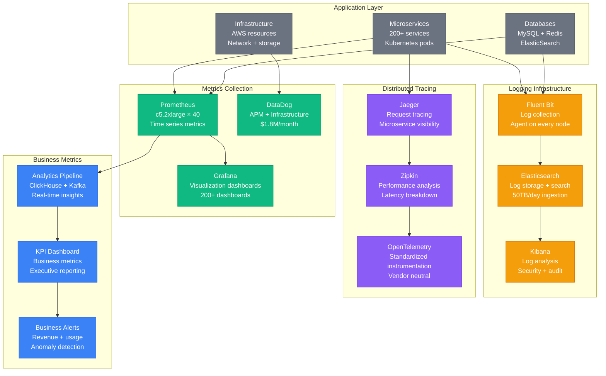
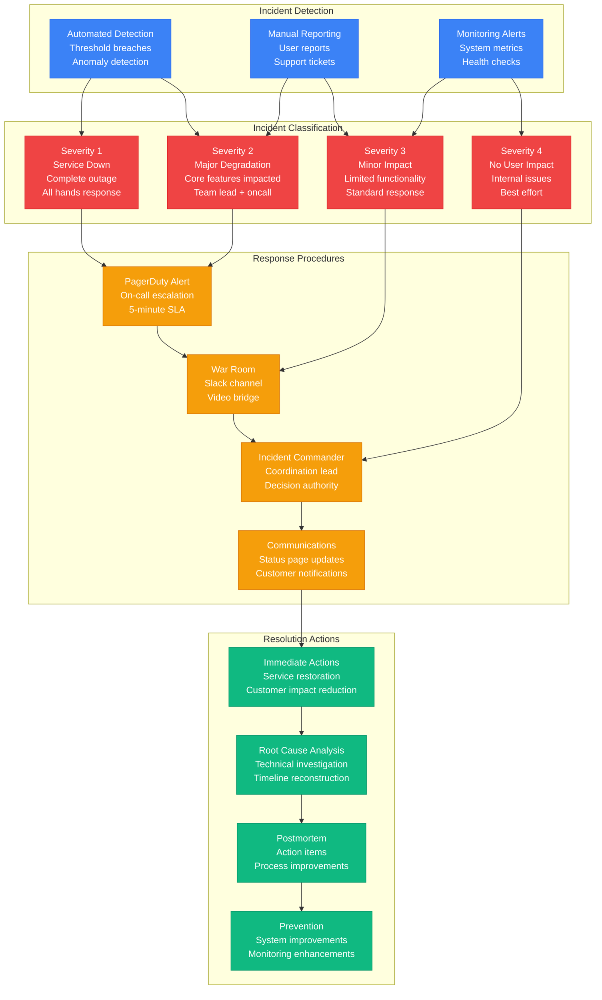
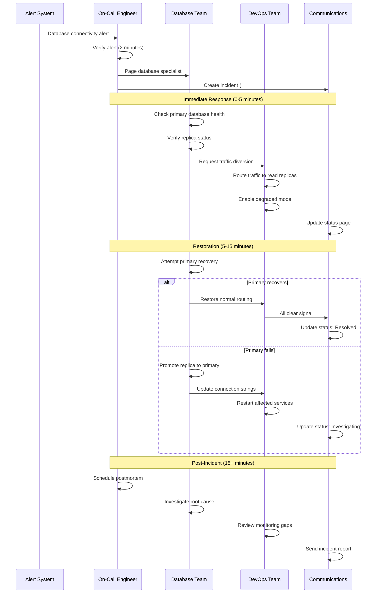
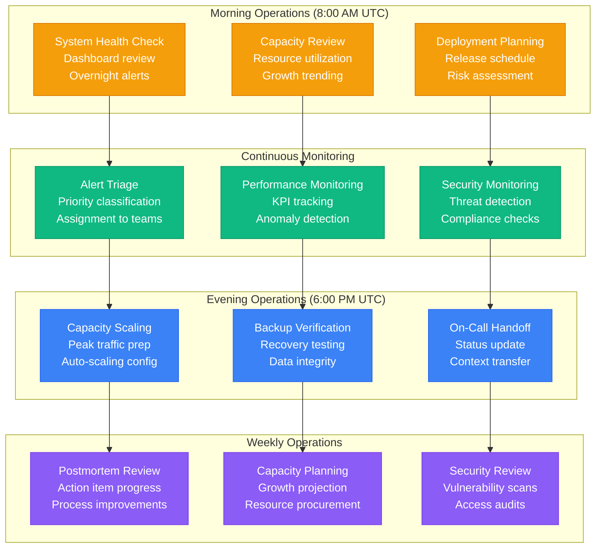
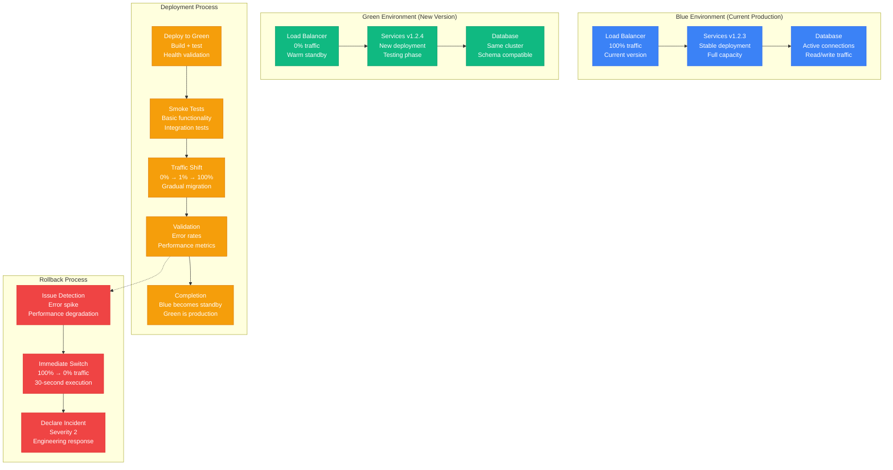
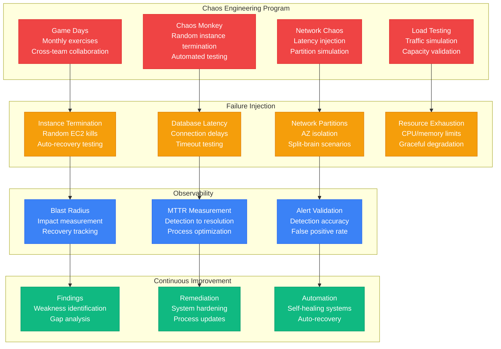
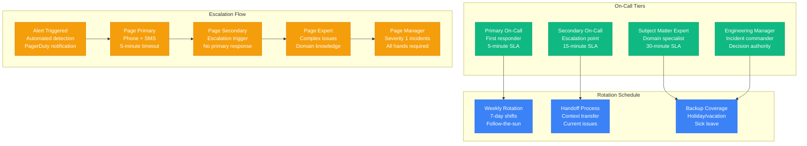

# Slack Production Operations - Deployment, Monitoring, and Incident Response

## Overview
Comprehensive production operations for Slack's enterprise messaging platform, covering deployment pipeline, monitoring infrastructure, incident response, and operational procedures for 20M+ daily active users with 99.99% uptime SLA.

## Deployment Pipeline Architecture

```mermaid
graph TB
    subgraph "Development Flow"
        DEV[Developer<br/>Feature branch<br/>Local testing]
        PR[Pull Request<br/>Code review<br/>Automated checks]
        MERGE[Merge to Main<br/>CI triggers<br/>Build pipeline]
    end

    subgraph "CI/CD Pipeline"
        BUILD[Build Stage<br/>Jenkins<br/>Multi-arch containers]
        TEST[Test Stage<br/>Unit + Integration<br/>Security scanning]
        SECURITY[Security Stage<br/>SAST + DAST<br/>Dependency check]
        PACKAGE[Package Stage<br/>Container registry<br/>Artifact signing]
    end

    subgraph "Deployment Stages"
        CANARY[Canary Deployment<br/>1% traffic<br/>5-minute soak]
        STAGING[Staging Environment<br/>Full feature testing<br/>Load testing]
        BLUE_GREEN[Blue-Green Deploy<br/>Zero downtime<br/>Instant rollback]
        PRODUCTION[Production<br/>99.99% uptime SLA<br/>Global rollout]
    end

    subgraph "Validation & Monitoring"
        HEALTH[Health Checks<br/>Application metrics<br/>Business KPIs]
        ALERTS[Alert System<br/>PagerDuty integration<br/>Auto-rollback]
        ROLLBACK[Rollback System<br/>Automated triggers<br/>5-minute execution]
    end

    DEV --> PR
    PR --> MERGE
    MERGE --> BUILD

    BUILD --> TEST
    TEST --> SECURITY
    SECURITY --> PACKAGE

    PACKAGE --> CANARY
    CANARY --> STAGING
    STAGING --> BLUE_GREEN
    BLUE_GREEN --> PRODUCTION

    PRODUCTION --> HEALTH
    HEALTH --> ALERTS
    ALERTS -.-> ROLLBACK
    ROLLBACK -.-> BLUE_GREEN

    classDef devStyle fill:#3B82F6,stroke:#2563EB,color:#fff,stroke-width:3px
    classDef ciStyle fill:#10B981,stroke:#059669,color:#fff,stroke-width:3px
    classDef deployStyle fill:#F59E0B,stroke:#D97706,color:#fff,stroke-width:3px
    classDef validationStyle fill:#8B5CF6,stroke:#7C3AED,color:#fff,stroke-width:3px

    class DEV,PR,MERGE devStyle
    class BUILD,TEST,SECURITY,PACKAGE ciStyle
    class CANARY,STAGING,BLUE_GREEN,PRODUCTION deployStyle
    class HEALTH,ALERTS,ROLLBACK validationStyle
```

## Monitoring Infrastructure

### Comprehensive Observability Stack

### Key Performance Indicators (KPIs)

#### System Health Metrics
| Metric | Target | Critical Threshold | Monitoring Tool |
|--------|--------|--------------------|-----------------|
| Message delivery rate | > 99.95% | < 99.9% | Custom metrics |
| WebSocket connection success | > 98% | < 95% | Prometheus |
| API response time (p99) | < 100ms | > 200ms | DataDog APM |
| Database query time (p95) | < 50ms | > 100ms | Prometheus |
| Search query latency (p99) | < 200ms | > 500ms | Elasticsearch |
| File upload success rate | > 99% | < 97% | Custom metrics |

#### Business Metrics
| Metric | Target | Alert Threshold | Review Frequency |
|--------|--------|-----------------|------------------|
| Daily Active Users | 20M+ | -5% day-over-day | Real-time |
| Messages per day | 10B+ | -10% from baseline | Hourly |
| Concurrent connections | 12M+ | -15% from expected | Real-time |
| Revenue per user | $8.50/month | -10% month-over-month | Daily |
| Customer churn rate | < 2%/month | > 3%/month | Weekly |

## Incident Response System

### Incident Classification and Response

### Incident Response Playbooks

#### Database Outage Playbook

## Operational Procedures

### Daily Operations Checklist

## Deployment Strategies

### Blue-Green Deployment Process

## Chaos Engineering

### Proactive Resilience Testing

## On-Call Management

### On-Call Rotation Structure

## Operational Metrics

### Team Performance KPIs
| Metric | Target | Current | Trend |
|--------|--------|---------|-------|
| MTTR (Mean Time to Recovery) | < 15 minutes | 12 minutes | ↓ Improving |
| MTTD (Mean Time to Detection) | < 2 minutes | 1.8 minutes | ↓ Improving |
| Alert noise ratio | < 5% false positives | 3.2% | ↓ Improving |
| Deployment frequency | 50+ per day | 67 per day | ↑ Increasing |
| Deployment success rate | > 99% | 99.4% | → Stable |
| Rollback rate | < 1% | 0.7% | ↓ Improving |

### Operational Costs
| Category | Monthly Cost | Annual Cost | Optimization |
|----------|--------------|-------------|--------------|
| Monitoring tools | $1.8M | $21.6M | DataDog enterprise |
| CI/CD infrastructure | $800K | $9.6M | Jenkins + AWS |
| Testing environments | $2.7M | $32.4M | Staging + QA |
| On-call compensation | $450K | $5.4M | 24/7 coverage |
| Training & certification | $120K | $1.44M | Team development |
| **Total Operations** | **$5.87M** | **$70.4M** | **7.5% of infrastructure** |

## Future Operations Improvements

### Automation Initiatives
- **Auto-healing systems**: Self-recovering services
- **Predictive alerting**: ML-based anomaly detection
- **Intelligent routing**: AI-powered incident assignment
- **Automated postmortems**: Natural language generation
- **Capacity forecasting**: ML-driven resource planning

### Tool Evolution
- **Unified observability**: Single pane of glass
- **Cloud-native monitoring**: Kubernetes-first approach
- **Edge observability**: CDN and edge compute monitoring
- **Security integration**: DevSecOps pipeline
- **Cost optimization**: Real-time spend analysis

*Based on Slack's engineering blog posts about production operations, conference presentations on reliability practices, and publicly shared incident response procedures. Operational metrics estimated from industry benchmarks and disclosed engineering practices.*