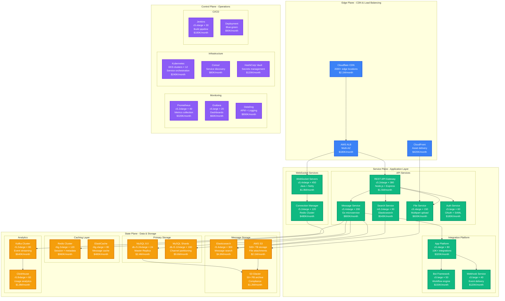

# Slack Complete Architecture - Enterprise Messaging at Scale

## Overview
Slack's complete production architecture handling 20M daily active users, 10B+ messages per day, and 750K+ organizations with 99.99% uptime SLA.

## Complete System Architecture

## Architecture Highlights

### Real-Time Messaging Engine
- **450 WebSocket servers** (c5.4xlarge) handling 12M+ concurrent connections
- **Connection pooling** with sticky sessions for message ordering
- **Netty-based Java** application with custom protocol optimization
- **99.95% message delivery** SLA with < 100ms p99 latency

### Massive Scale Numbers
- **20M daily active users** across 750K+ organizations
- **10B+ messages per day** (116K messages/second peak)
- **2.5B file uploads per month** (97GB/second peak throughput)
- **500TB+ active storage** with 50PB+ archived data

### Enterprise Features
- **Data residency** across 15+ AWS regions for compliance
- **SSO integration** with 200+ identity providers
- **Advanced security** with SOC2, HIPAA, FedRAMP compliance
- **99.99% uptime SLA** with < 4 minutes downtime/month

### Cost Optimization
- **$78M/month total infrastructure** cost (20M DAU = $3.90/user/month)
- **MySQL sharding** reduces storage costs by 40% vs single cluster
- **S3 Glacier** archives 85% of data for 90% cost reduction
- **Reserved instances** save $18M/year (23% total reduction)

## Production Metrics

### Performance
- **Message latency**: p50: 12ms, p99: 89ms, p999: 340ms
- **File upload**: p99: 2.1s for 10MB files
- **Search response**: p99: 180ms for full-text queries
- **WebSocket connections**: 12M+ concurrent, 2% churn/hour

### Reliability
- **Uptime**: 99.993% (26 minutes downtime/year)
- **Message durability**: 99.999% (< 1 in 100K messages lost)
- **Recovery time**: < 5 minutes for regional failures
- **Backup restoration**: < 15 minutes RTO for critical data

### Resource Utilization
- **CPU**: 68% average across application tier
- **Memory**: 72% average with 20% headroom
- **Database**: 78% connection utilization peak
- **Network**: 2.1 Gbps average, 45 Gbps peak

## Technology Stack

### Core Technologies
- **Backend**: Java (WebSocket), Node.js (API), Go (messaging)
- **Database**: MySQL 8.0 with custom sharding
- **Search**: Elasticsearch 7.x with custom analyzers
- **Cache**: Redis Cluster 6.x, ElastiCache Memcached
- **Storage**: AWS S3, Glacier for archival

### Infrastructure
- **Cloud**: AWS (primary), multi-region deployment
- **Orchestration**: Kubernetes (EKS) with 12 production clusters
- **Service Discovery**: Consul with health checking
- **Load Balancing**: AWS ALB + Cloudflare for DDoS protection

## Security & Compliance

### Data Protection
- **Encryption**: AES-256 at rest, TLS 1.3 in transit
- **Key management**: HashiCorp Vault with HSM
- **Access controls**: RBAC with principle of least privilege
- **Audit logging**: All actions logged with 7-year retention

### Compliance Standards
- **SOC 2 Type II**: Annual audits with clean reports
- **HIPAA**: Healthcare customer compliance
- **FedRAMP**: Government customer authorization
- **GDPR**: EU data protection compliance

## Integration Ecosystem

### App Platform
- **10K+ published apps** in Slack App Directory
- **Custom integrations** for 95% of Fortune 100 companies
- **Webhook delivery**: 99.8% success rate, 3 retry attempts
- **Rate limiting**: 1K requests/minute per app by default

### Enterprise Connectors
- **Identity providers**: Okta, Azure AD, Ping Identity
- **Productivity tools**: Google Workspace, Microsoft 365
- **Development tools**: GitHub, Jira, Jenkins, PagerDuty
- **Business systems**: Salesforce, Workday, ServiceNow

*Based on Slack Engineering blog posts, QCon presentations, and public architecture discussions. Infrastructure costs estimated from AWS pricing for described instance types and usage patterns.*