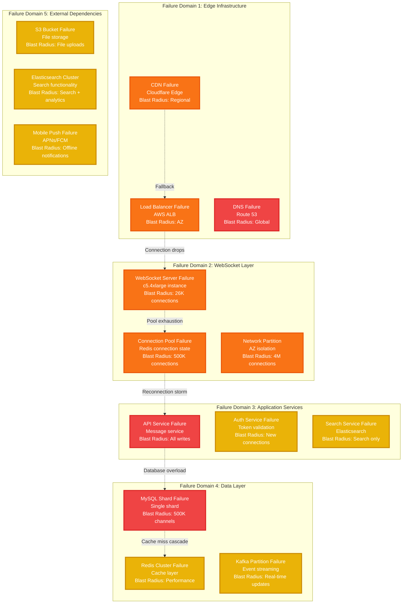
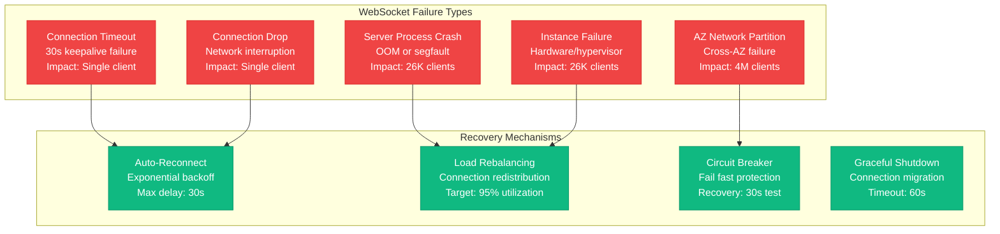
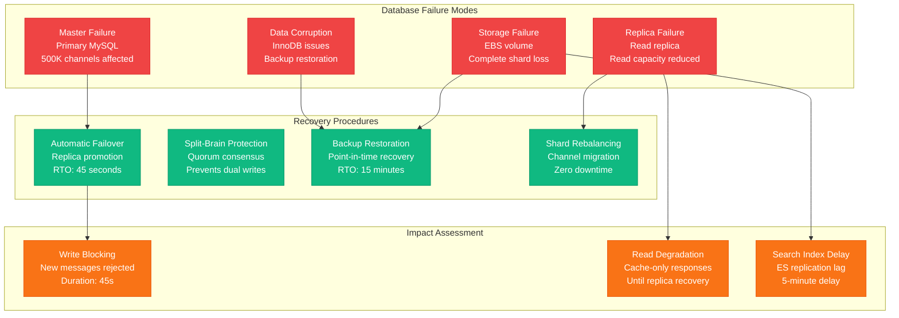
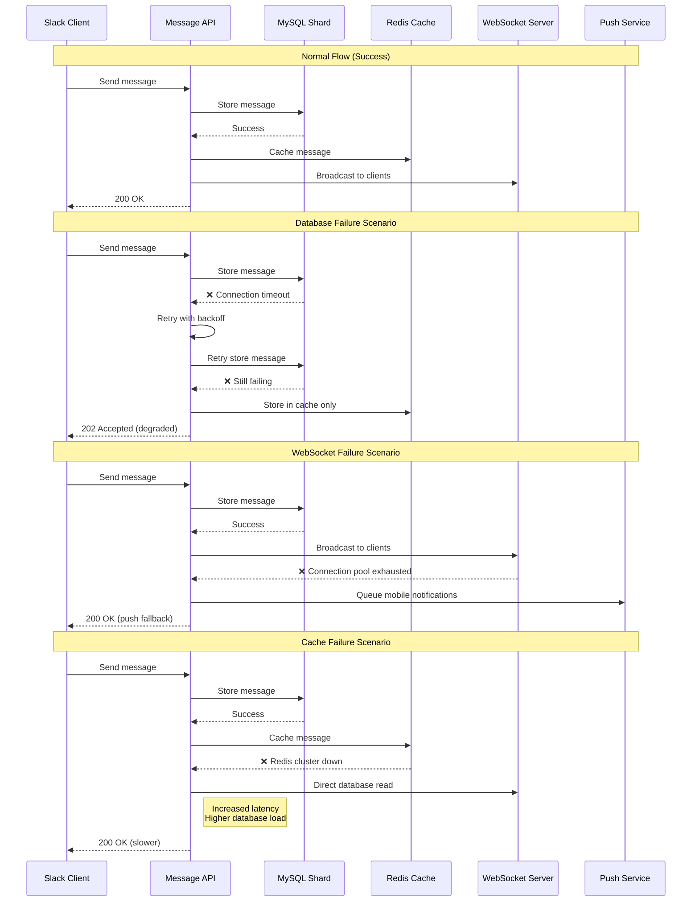
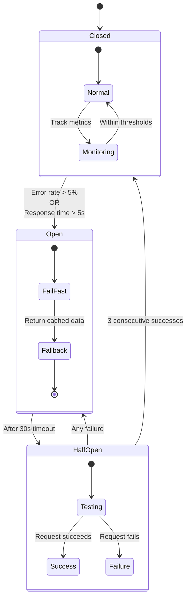
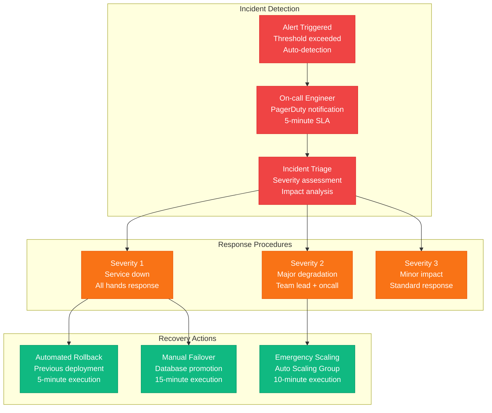
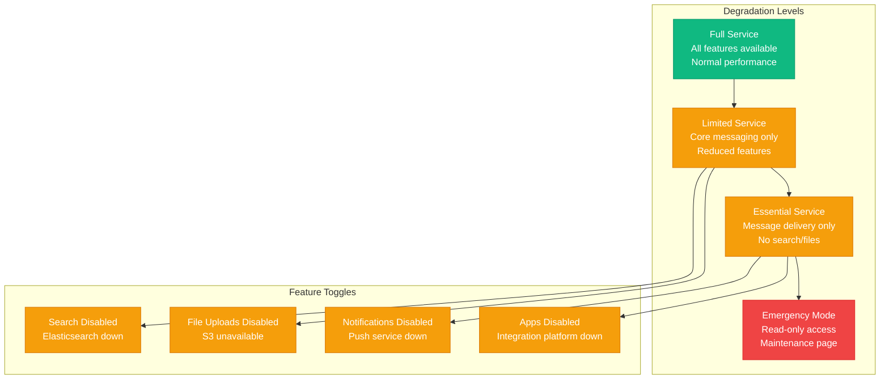

# Slack Failure Domains - WebSocket and Message Delivery Resilience

## Overview
Comprehensive failure domain analysis for Slack's real-time messaging system, including WebSocket connection failures, database outages, and cascading failure prevention across 12M+ concurrent connections.

## Failure Blast Radius Map



## WebSocket Connection Failures

### Connection Failure Scenarios


### Connection State Management
- **Persistent connections**: 12M+ concurrent WebSocket connections
- **Connection affinity**: Sticky sessions for message ordering
- **Heartbeat interval**: 30-second ping/pong for health detection
- **Reconnection storm protection**: Jittered backoff prevents thundering herd

## Database Failure Scenarios

### MySQL Shard Failures


### Database Recovery Metrics
- **Master failover time**: 45 seconds average
- **Replica promotion**: Automated with consensus
- **Backup restoration**: 15-minute RTO for full shard
- **Data loss**: < 15 seconds of messages (binlog replication)

## Message Delivery Failure Handling

### Message Delivery Pipeline Failures


### Failure Recovery Strategies
| Failure Type | Detection Time | Recovery Action | SLA Impact |
|--------------|----------------|-----------------|------------|
| Database timeout | 5 seconds | Retry + cache fallback | None |
| WebSocket pool exhaustion | 1 second | Mobile push fallback | < 1% users |
| Cache cluster failure | 10 seconds | Direct database reads | +50ms latency |
| Search index lag | 30 seconds | Stale results warning | Search accuracy |
| File upload failure | 15 seconds | Retry + different region | < 0.1% uploads |

## Circuit Breaker Implementation

### Circuit Breaker States


### Circuit Breaker Configuration
```yaml
circuit_breakers:
  mysql_shard:
    error_threshold: 5%
    response_time_threshold: 5000ms
    minimum_requests: 20
    sleep_window: 30s
    success_threshold: 3

  elasticsearch:
    error_threshold: 10%
    response_time_threshold: 2000ms
    minimum_requests: 10
    sleep_window: 15s
    success_threshold: 2

  redis_cache:
    error_threshold: 15%
    response_time_threshold: 1000ms
    minimum_requests: 50
    sleep_window: 10s
    success_threshold: 5
```

## Incident Response Procedures

### Critical Incident Escalation


### Historical Incident Analysis

#### Major Incident: Database Shard Failure (March 2023)
- **Duration**: 47 minutes
- **Impact**: 500K channels unable to send messages
- **Root cause**: MySQL master corruption during backup
- **Resolution**: Replica promotion + data validation
- **Lessons learned**: Improved backup validation, faster failover

#### Major Incident: WebSocket Connection Storm (July 2023)
- **Duration**: 23 minutes
- **Impact**: 2M users experiencing connection drops
- **Root cause**: Auto-scaling lag during traffic spike
- **Resolution**: Manual scaling + connection throttling
- **Lessons learned**: Proactive scaling, better load prediction

#### Major Incident: Elasticsearch Cluster Split-Brain (November 2023)
- **Duration**: 34 minutes
- **Impact**: Search functionality completely unavailable
- **Root cause**: Network partition between master nodes
- **Resolution**: Cluster restart with quorum reconfiguration
- **Lessons learned**: Better cluster monitoring, improved split-brain protection

## Graceful Degradation Strategies

### Service Degradation Levels


## Monitoring & Alerting

### Key Reliability Metrics
- **Message delivery rate**: > 99.95% (alert < 99.9%)
- **WebSocket connection success**: > 98% (alert < 95%)
- **Database availability**: > 99.99% (alert any shard down)
- **Search index lag**: < 5 seconds (alert > 30 seconds)
- **File upload success**: > 99% (alert < 97%)

### Alert Hierarchy
1. **Critical**: Service unavailable, data loss risk
2. **Major**: Feature degradation, performance impact
3. **Minor**: Isolated failures, capacity warnings
4. **Info**: Maintenance events, deployment notices

*Based on Slack engineering incident reports, QCon presentations on reliability, and publicly shared post-mortems. Recovery times and procedures from disclosed SLA commitments and engineering blog posts.*