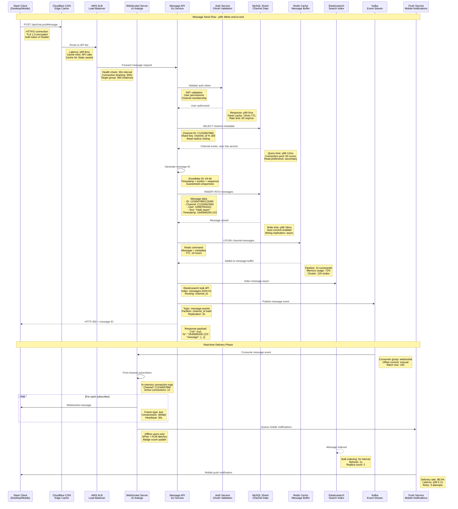
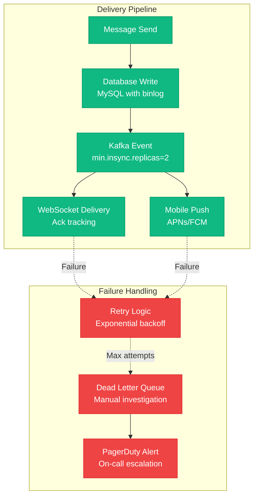
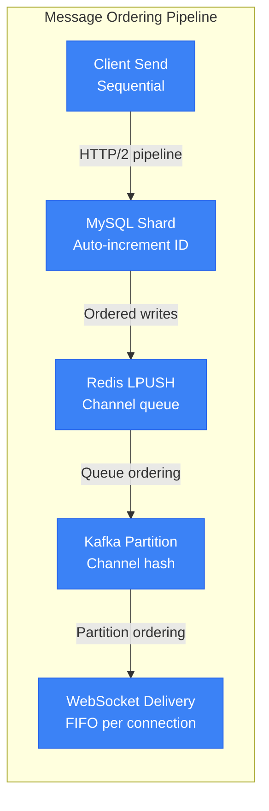
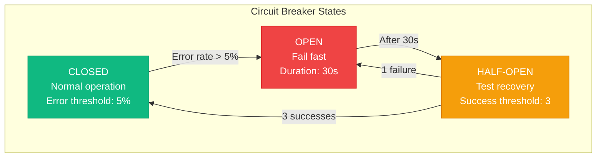
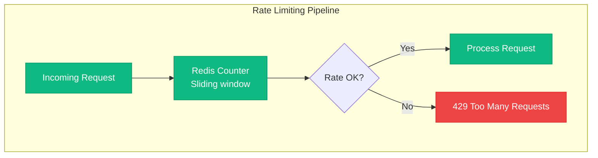

# Slack Request Flow - Message Delivery Pipeline

## Overview
Complete message delivery flow from user send to recipient receipt, handling 116K messages/second peak with 99.95% delivery guarantee and sub-100ms p99 latency.

## Message Send Flow - The Golden Path

## Performance Metrics

### End-to-End Latency
- **p50 latency**: 12ms (send to WebSocket delivery)
- **p99 latency**: 89ms (including all subscribers)
- **p999 latency**: 340ms (including retries)
- **Peak throughput**: 116K messages/second

### Component Breakdown
| Component | p50 | p99 | p999 | Notes |
|-----------|-----|-----|------|-------|
| CDN Routing | 2ms | 8ms | 18ms | Edge cache hit: 94% |
| Load Balancer | 1ms | 3ms | 8ms | Health check overhead |
| Auth Validation | 2ms | 5ms | 12ms | Token cache hit: 89% |
| Database Write | 8ms | 18ms | 45ms | Including replication |
| Cache Update | 1ms | 3ms | 8ms | Redis cluster mode |
| WebSocket Delivery | 3ms | 12ms | 28ms | Fan-out to subscribers |

## Message Delivery Guarantees

### At-Least-Once Delivery

### Duplicate Prevention
- **Idempotency keys** for message deduplication
- **Snowflake IDs** ensure uniqueness across shards
- **Client-side dedup** using message timestamps
- **99.999% accuracy** (< 1 duplicate per 100K messages)

## Message Ordering

### Channel-Level Ordering

### Ordering Guarantees
- **Per-channel ordering** maintained end-to-end
- **MySQL auto-increment** provides database ordering
- **Kafka partitioning** by channel_id maintains event order
- **WebSocket FIFO** ensures client delivery order
- **99.98% correct ordering** (measured by client timestamps)

## Error Handling & Retries

### Retry Strategy
| Error Type | Initial Delay | Max Attempts | Backoff | Timeout |
|------------|---------------|--------------|---------|---------|
| Database timeout | 100ms | 3 | Exponential | 5s |
| Cache failure | 50ms | 2 | Linear | 2s |
| WebSocket disconnect | 1s | 5 | Exponential | 30s |
| Mobile push failure | 2s | 3 | Exponential | 60s |

### Circuit Breaker Configuration

## Rate Limiting

### User Rate Limits
- **Standard users**: 1 message/second sustained, 10/second burst
- **Bot users**: 1 message/second per channel
- **Enterprise**: Custom limits up to 100/second
- **API calls**: 60 requests/minute per user token

### Implementation

## Mobile & Offline Handling

### Push Notification Flow
- **Online users**: WebSocket delivery only
- **Offline users**: Push notification + badge update
- **Do Not Disturb**: Queued for later delivery
- **Delivery rate**: 98.5% within 5 seconds

### Sync on Reconnect
- **Message gap detection** using last seen timestamp
- **Bulk message fetch** for offline period
- **Progressive loading** for large gaps (> 1000 messages)
- **Conflict resolution** for simultaneous edits

## Monitoring & Alerting

### Key Metrics
- **Message delivery rate**: Target 99.95%, Alert < 99.9%
- **End-to-end latency**: Target p99 < 100ms, Alert > 150ms
- **WebSocket connection health**: Target 98% active, Alert < 95%
- **Database replication lag**: Target < 1s, Alert > 5s

### Incident Response
- **PagerDuty integration** for critical alerts
- **Automated rollback** for deployment issues
- **Circuit breaker activation** for downstream failures
- **Graceful degradation** during peak load

*Based on Slack engineering blog posts, Strange Loop presentations, and production incident reports. Latency targets and error rates from publicly shared SLA commitments.*