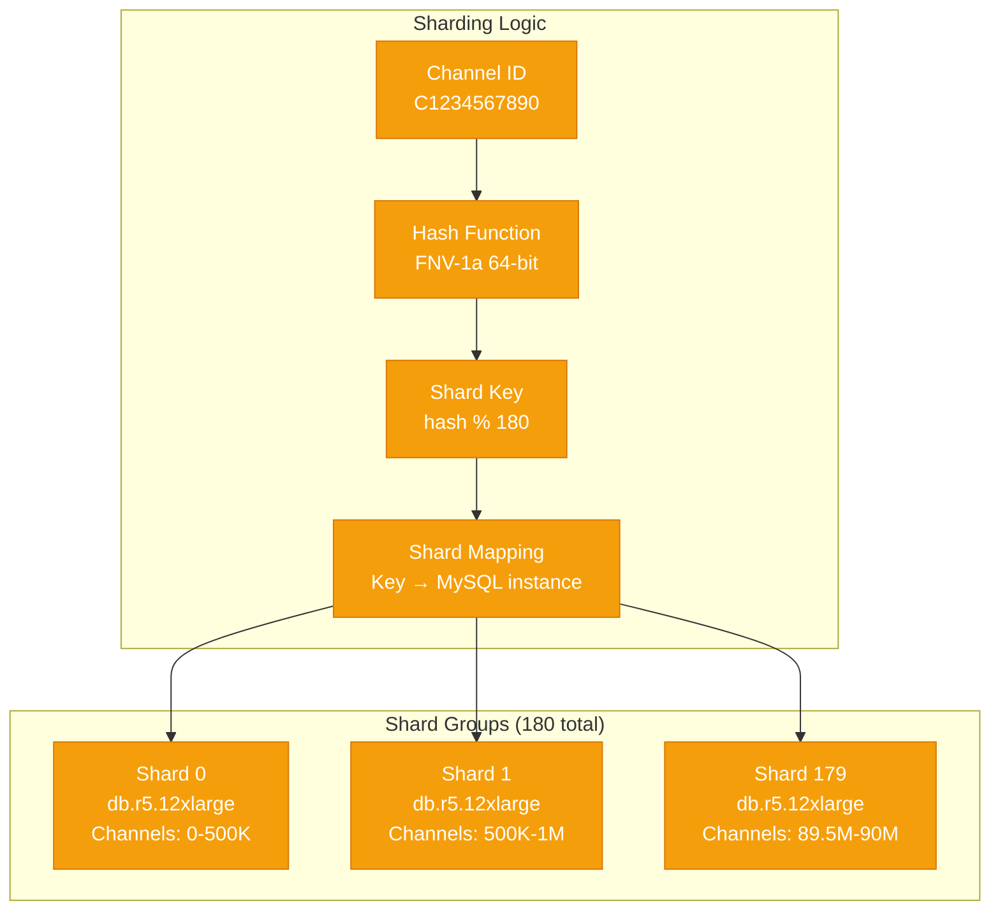
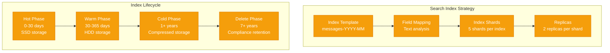
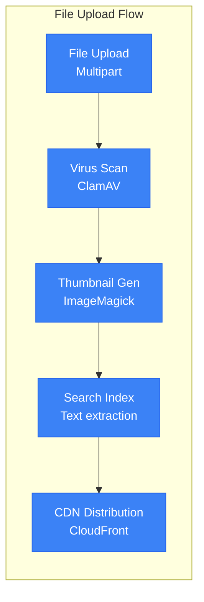
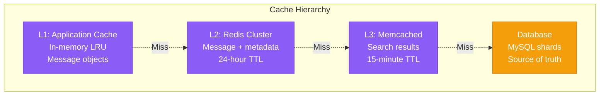
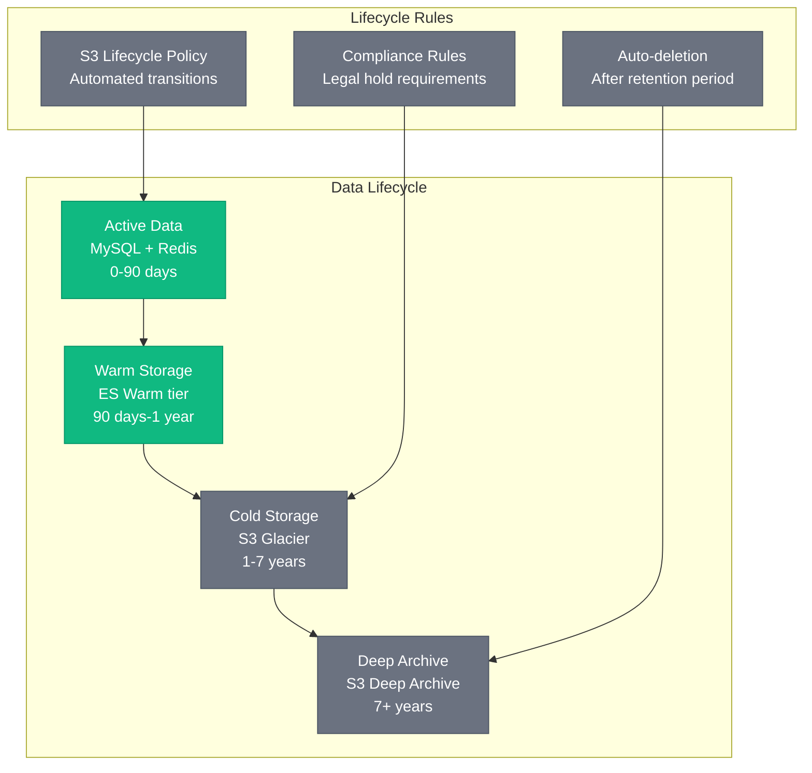

# Slack Storage Architecture - Message History and Search at Scale

## Overview
Slack's storage architecture managing 10B+ messages/day, 500TB+ active data, 50PB+ archived storage with 180-shard MySQL cluster and Elasticsearch for search across 750K+ organizations.

## Complete Storage Architecture

```mermaid
graph TB
    subgraph "Application Layer"
        APP[Message Service<br/>Go + gRPC<br/>200 instances]
        SEARCH_API[Search API<br/>Node.js<br/>90 instances]
        FILE_API[File Service<br/>Java<br/>150 instances]
    end

    subgraph "State Plane - Primary Storage"
        subgraph "MySQL Sharding (180 Shards)"
            SHARD_ROUTER[Shard Router<br/>Vitess<br/>Consistent hashing]

            subgraph "Shard Group 1"
                MYSQL_1[MySQL 8.0<br/>db.r5.12xlarge<br/>Channels 1-500K]
                REPLICA_1[Read Replica<br/>db.r5.8xlarge<br/>2x replicas]
            end

            subgraph "Shard Group 2"
                MYSQL_2[MySQL 8.0<br/>db.r5.12xlarge<br/>Channels 500K-1M]
                REPLICA_2[Read Replica<br/>db.r5.8xlarge<br/>2x replicas]
            end

            subgraph "Shard Group N"
                MYSQL_N[MySQL 8.0<br/>db.r5.12xlarge<br/>Channels 89.5M-90M]
                REPLICA_N[Read Replica<br/>db.r5.8xlarge<br/>2x replicas]
            end
        end

        subgraph "Message Search Storage"
            ES_MASTER[Elasticsearch Master<br/>c5.large × 3<br/>Cluster coordination]

            subgraph "ES Hot Tier"
                ES_HOT_1[ES Data Node<br/>r5.4xlarge × 100<br/>Recent 30 days<br/>150TB SSD]
                ES_HOT_2[ES Data Node<br/>r5.4xlarge × 100<br/>Recent 30 days<br/>150TB SSD]
                ES_HOT_3[ES Data Node<br/>r5.4xlarge × 100<br/>Recent 30 days<br/>150TB SSD]
            end

            subgraph "ES Warm Tier"
                ES_WARM_1[ES Data Node<br/>r5.2xlarge × 200<br/>30-365 days<br/>800TB HDD]
                ES_WARM_2[ES Data Node<br/>r5.2xlarge × 200<br/>30-365 days<br/>800TB HDD]
            end
        end

        subgraph "File Storage"
            S3_PRIMARY[S3 Primary<br/>Standard storage<br/>Recent 90 days<br/>150TB active]
            S3_IA[S3 Infrequent Access<br/>90 days - 1 year<br/>280TB archived]
            S3_GLACIER[S3 Glacier<br/>1+ years<br/>50PB+ archived]

            CDN_FILES[CloudFront<br/>File CDN<br/>Edge caching<br/>2000+ locations]
        end

        subgraph "Caching Layer"
            REDIS_MESSAGES[Redis Cluster<br/>r6g.2xlarge × 60<br/>Message cache<br/>Hot channels]
            REDIS_METADATA[Redis Cluster<br/>r6g.xlarge × 60<br/>Channel metadata<br/>User sessions]
            MEMCACHE[ElastiCache<br/>r6g.xlarge × 80<br/>Search results<br/>File metadata]
        end

        subgraph "Analytics Storage"
            CLICKHOUSE[ClickHouse<br/>r5.8xlarge × 60<br/>Usage analytics<br/>Event aggregation]
            KAFKA[Kafka Cluster<br/>r5.2xlarge × 80<br/>Event streaming<br/>3 AZ replication]
        end
    end

    subgraph "Data Processing"
        ETL[ETL Pipeline<br/>Apache Airflow<br/>Daily aggregation]
        BACKUP[Backup Service<br/>Percona XtraBackup<br/>Daily snapshots]
        ARCHIVE[Archive Service<br/>Lifecycle management<br/>S3 transitions]
    end

    %% Application to Storage
    APP --> SHARD_ROUTER
    SEARCH_API --> ES_MASTER
    FILE_API --> S3_PRIMARY

    %% Sharding
    SHARD_ROUTER --> MYSQL_1
    SHARD_ROUTER --> MYSQL_2
    SHARD_ROUTER --> MYSQL_N

    %% Replication
    MYSQL_1 --> REPLICA_1
    MYSQL_2 --> REPLICA_2
    MYSQL_N --> REPLICA_N

    %% Search cluster
    ES_MASTER --> ES_HOT_1
    ES_MASTER --> ES_HOT_2
    ES_MASTER --> ES_HOT_3
    ES_MASTER --> ES_WARM_1
    ES_MASTER --> ES_WARM_2

    %% File storage lifecycle
    S3_PRIMARY --> S3_IA
    S3_IA --> S3_GLACIER
    S3_PRIMARY --> CDN_FILES

    %% Caching
    APP --> REDIS_MESSAGES
    APP --> REDIS_METADATA
    SEARCH_API --> MEMCACHE

    %% Analytics
    APP --> KAFKA
    KAFKA --> CLICKHOUSE

    %% Data processing
    MYSQL_1 --> BACKUP
    MYSQL_2 --> BACKUP
    MYSQL_N --> BACKUP
    S3_PRIMARY --> ARCHIVE
    CLICKHOUSE --> ETL

    %% Apply 4-plane colors
    classDef serviceStyle fill:#10B981,stroke:#059669,color:#fff,stroke-width:3px
    classDef stateStyle fill:#F59E0B,stroke:#D97706,color:#fff,stroke-width:3px
    classDef cacheStyle fill:#8B5CF6,stroke:#7C3AED,color:#fff,stroke-width:3px

    class APP,SEARCH_API,FILE_API serviceStyle
    class SHARD_ROUTER,MYSQL_1,MYSQL_2,MYSQL_N,REPLICA_1,REPLICA_2,REPLICA_N stateStyle
    class ES_MASTER,ES_HOT_1,ES_HOT_2,ES_HOT_3,ES_WARM_1,ES_WARM_2 stateStyle
    class S3_PRIMARY,S3_IA,S3_GLACIER,CDN_FILES stateStyle
    class CLICKHOUSE,KAFKA stateStyle
    class REDIS_MESSAGES,REDIS_METADATA,MEMCACHE cacheStyle
    class ETL,BACKUP,ARCHIVE cacheStyle
```



## Database Sharding Strategy

### Shard Distribution


### Shard Specifications
- **180 MySQL shards** (db.r5.12xlarge instances)
- **500K channels per shard** average distribution
- **2 read replicas** per shard for read scaling
- **~56GB RAM** and 48 vCPUs per shard
- **3TB local SSD** storage per shard

### Rebalancing Strategy
- **Hot shard detection** using CPU/memory metrics
- **Channel migration** during low-traffic windows
- **Zero-downtime rebalancing** with read-before-write validation
- **Vitess orchestration** for shard operations

## Message Storage Schema

### Core Tables per Shard
```sql
-- Messages table (partitioned by month)
CREATE TABLE messages_2024_01 (
    id BIGINT PRIMARY KEY,              -- Snowflake ID
    channel_id VARCHAR(11) NOT NULL,    -- Channel identifier
    user_id VARCHAR(11) NOT NULL,       -- User identifier
    message_type ENUM('message', 'file_share', 'join', 'leave'),
    text TEXT,                          -- Message content
    attachments JSON,                   -- File attachments
    thread_ts DECIMAL(16,6),           -- Thread timestamp
    reply_count INT DEFAULT 0,          -- Thread reply count
    created_at TIMESTAMP DEFAULT NOW(),
    updated_at TIMESTAMP ON UPDATE NOW(),
    deleted_at TIMESTAMP NULL,

    INDEX idx_channel_ts (channel_id, created_at),
    INDEX idx_thread (thread_ts, created_at),
    INDEX idx_user (user_id, created_at)
) PARTITION BY RANGE (MONTH(created_at));

-- Channel metadata
CREATE TABLE channels (
    id VARCHAR(11) PRIMARY KEY,
    team_id VARCHAR(11) NOT NULL,
    name VARCHAR(80) NOT NULL,
    topic VARCHAR(250),
    purpose VARCHAR(250),
    is_archived BOOLEAN DEFAULT FALSE,
    member_count INT DEFAULT 0,
    message_count BIGINT DEFAULT 0,
    created_at TIMESTAMP DEFAULT NOW(),

    INDEX idx_team (team_id),
    INDEX idx_name (name),
    INDEX idx_archived (is_archived, team_id)
);
```

### Storage Metrics
- **Average message size**: 312 bytes
- **Messages per shard**: ~150M messages
- **Storage per shard**: ~2.8TB active data
- **Daily growth**: ~180GB new messages per day
- **Retention policy**: 7 years for Enterprise, 90 days for Free

## Search Architecture

### Elasticsearch Configuration


### Search Index Mapping
```json
{
  "mappings": {
    "properties": {
      "channel_id": {"type": "keyword"},
      "user_id": {"type": "keyword"},
      "text": {
        "type": "text",
        "analyzer": "slack_analyzer",
        "search_analyzer": "slack_search_analyzer"
      },
      "timestamp": {"type": "date"},
      "thread_ts": {"type": "keyword"},
      "attachments": {
        "type": "nested",
        "properties": {
          "name": {"type": "text"},
          "type": {"type": "keyword"}
        }
      }
    }
  }
}
```

### Search Performance
- **Query latency**: p99 < 180ms for full-text search
- **Index size**: 120TB total across all indices
- **Indexing rate**: 125K documents/second peak
- **Search QPS**: 15K queries/second peak
- **Cache hit rate**: 78% for repeated searches

## File Storage Strategy

### S3 Storage Classes
| Storage Class | Retention | Size | Monthly Cost | Use Case |
|---------------|-----------|------|--------------|----------|
| S3 Standard | 0-90 days | 150TB | $3.5M | Active files |
| S3 IA | 90 days-1 year | 280TB | $1.8M | Archived files |
| S3 Glacier | 1+ years | 50PB | $1.2M | Compliance |
| S3 Deep Archive | 7+ years | 25PB | $280K | Legal hold |

### File Processing Pipeline


## Caching Strategy

### Multi-Layer Caching


### Cache Performance
- **L1 hit rate**: 45% (application memory)
- **L2 hit rate**: 78% (Redis cluster)
- **L3 hit rate**: 23% (Memcached)
- **Combined hit rate**: 91.2% cache effectiveness
- **Cache warming**: Pre-populate hot channels

## Data Lifecycle Management

### Automated Archival


## Backup & Recovery

### Backup Strategy
- **MySQL**: Percona XtraBackup every 6 hours
- **Elasticsearch**: Snapshot to S3 daily
- **Redis**: RDB snapshots every hour
- **Point-in-time recovery**: 15-minute RPO
- **Cross-region replication**: 3 AWS regions

### Disaster Recovery
- **RTO**: < 15 minutes for database recovery
- **RPO**: < 15 minutes for message data
- **Automated failover**: MySQL master promotion
- **Data validation**: Checksum verification post-recovery
- **Runbook automation**: Terraform + Ansible playbooks

## Consistency Guarantees

### ACID Properties
- **Atomicity**: Transaction boundaries per message
- **Consistency**: Foreign key constraints enforced
- **Isolation**: Read Committed isolation level
- **Durability**: Synchronous binlog replication

### Eventual Consistency
- **Search indexing**: 5-second delay for new messages
- **Cache invalidation**: Write-through for critical data
- **Cross-shard queries**: Best-effort consistency
- **Conflict resolution**: Last-write-wins for edits

*Based on Slack engineering presentations at Strange Loop, QCon, and published architecture blogs. Storage numbers estimated from disclosed scale metrics and AWS pricing for described configurations.*