# Snap (Snapchat) - Complete Architecture

## Overview

Snap's architecture supports 375M+ daily active users sending 6B+ snaps daily with ephemeral messaging, real-time AR filters, and global location services across 4 billion video views per day.

## Complete System Architecture

```mermaid
graph TB
    subgraph "Edge Plane - Global CDN Network"
        CDN[CloudFlare CDN<br/>2000+ PoPs<br/>$8M/month]
        WAF[Cloudflare WAF<br/>DDoS Protection<br/>$500K/month]
        LB[F5 Load Balancer<br/>BIG-IP i4800<br/>1M+ rps capacity]
    end

    subgraph "Service Plane - Core Services"
        API[API Gateway<br/>Kong Enterprise<br/>300K+ rps<br/>p99: 15ms]

        subgraph "Messaging Services"
            SNAP[Snap Service<br/>Go 1.20<br/>5000 instances<br/>c5.4xlarge]
            CHAT[Chat Service<br/>Erlang/OTP<br/>2000 instances<br/>c5.2xlarge]
            STORY[Story Service<br/>Java 17<br/>3000 instances<br/>c5.4xlarge]
        end

        subgraph "Media Processing"
            FILTER[Filter Engine<br/>C++/OpenCV<br/>10000 instances<br/>c5.9xlarge]
            UPLOAD[Media Upload<br/>Go 1.20<br/>4000 instances<br/>c5.4xlarge]
            TRANSCODE[Video Transcode<br/>FFmpeg<br/>8000 instances<br/>c5.12xlarge]
        end

        subgraph "Location Services"
            GEOSERVICE[Geo Service<br/>Go 1.20<br/>1500 instances<br/>c5.2xlarge]
            MAPSERVICE[Map Service<br/>Java 17<br/>1000 instances<br/>c5.4xlarge]
        end
    end

    subgraph "State Plane - Data Storage"
        subgraph "Primary Storage"
            USERDB[(User DB<br/>MySQL 8.0<br/>100TB across 500 shards<br/>db.r6g.24xlarge)]
            SNAPDB[(Snap Metadata DB<br/>Cassandra 4.0<br/>2PB across 2000 nodes<br/>i3.8xlarge)]
            CHATDB[(Chat DB<br/>DynamoDB<br/>50TB<br/>40K RCU/WCU)]
        end

        subgraph "Media Storage"
            S3MEDIA[S3 Media Storage<br/>100PB+ total<br/>Glacier after 30 days<br/>$2M/month]
            S3PROCESSED[S3 Processed Media<br/>50PB active<br/>Standard-IA<br/>$800K/month]
        end

        subgraph "Caching Layer"
            REDIS[Redis Cluster<br/>500+ nodes<br/>20TB memory<br/>r6g.4xlarge<br/>p99: 0.5ms]
            MEMCACHED[Memcached<br/>200+ nodes<br/>5TB memory<br/>r6g.2xlarge]
        end

        subgraph "Analytics Storage"
            KAFKA[Kafka Cluster<br/>200+ brokers<br/>500TB retention<br/>i3.4xlarge]
            SNOWFLAKE[Snowflake DW<br/>10PB analytics<br/>$500K/month]
        end
    end

    subgraph "Control Plane - Operations"
        MONITORING[DataDog APM<br/>Custom Metrics<br/>$200K/month]
        LOGGING[Splunk Enterprise<br/>100TB/day<br/>$300K/month]
        DEPLOYMENT[Spinnaker CD<br/>100+ deployments/day<br/>Blue-Green]
        SECRETS[HashiCorp Vault<br/>10K+ secrets<br/>Auto-rotation]
    end

    %% Edge Connections
    CDN --> WAF
    WAF --> LB
    LB --> API

    %% Service Connections
    API --> SNAP
    API --> CHAT
    API --> STORY
    API --> FILTER
    API --> UPLOAD
    API --> GEOSERVICE

    %% Storage Connections
    SNAP --> USERDB
    SNAP --> SNAPDB
    SNAP --> REDIS

    CHAT --> CHATDB
    CHAT --> REDIS

    STORY --> SNAPDB
    STORY --> S3MEDIA

    FILTER --> S3MEDIA
    FILTER --> S3PROCESSED

    UPLOAD --> S3MEDIA
    UPLOAD --> TRANSCODE

    GEOSERVICE --> REDIS
    MAPSERVICE --> REDIS

    %% Analytics Flow
    SNAP --> KAFKA
    CHAT --> KAFKA
    STORY --> KAFKA
    KAFKA --> SNOWFLAKE

    %% Control Plane Monitoring
    MONITORING -.-> SNAP
    MONITORING -.-> CHAT
    MONITORING -.-> STORY
    LOGGING -.-> SNAP
    LOGGING -.-> CHAT

    %% Apply 4-plane colors
    classDef edgeStyle fill:#3B82F6,stroke:#1E40AF,color:#fff,stroke-width:2px
    classDef serviceStyle fill:#10B981,stroke:#047857,color:#fff,stroke-width:2px
    classDef stateStyle fill:#F59E0B,stroke:#D97706,color:#fff,stroke-width:2px
    classDef controlStyle fill:#8B5CF6,stroke:#7C3AED,color:#fff,stroke-width:2px

    class CDN,WAF,LB edgeStyle
    class API,SNAP,CHAT,STORY,FILTER,UPLOAD,TRANSCODE,GEOSERVICE,MAPSERVICE serviceStyle
    class USERDB,SNAPDB,CHATDB,S3MEDIA,S3PROCESSED,REDIS,MEMCACHED,KAFKA,SNOWFLAKE stateStyle
    class MONITORING,LOGGING,DEPLOYMENT,SECRETS controlStyle
```

## Key Architectural Decisions

### Ephemeral by Design
- **Auto-deletion**: Media files deleted from S3 after viewing/24 hours
- **Metadata retention**: Only message metadata kept for 30 days
- **Privacy compliance**: GDPR/CCPA compliant by design

### Global Scale Requirements
- **375M DAU**: Peak 50M concurrent users
- **6B snaps/day**: Average 69K snaps/second, peak 200K/second
- **AR Filters**: 200M+ filter applications daily
- **Geographic distribution**: 15 AWS regions, 5 GCP regions

### Production Metrics
- **P99 Snap Send**: <500ms end-to-end
- **P99 Filter Apply**: <200ms processing time
- **Availability**: 99.9% (26.3 hours downtime/year)
- **Data durability**: 99.999999999% (11 9's) for media storage

### Infrastructure Costs (Monthly)
- **Compute**: $15M (60% of total)
- **Storage**: $8M (32% of total)
- **Network**: $2M (8% of total)
- **Total**: $25M/month operational costs

### Disaster Recovery
- **RTO**: 4 hours for full service restoration
- **RPO**: 15 minutes for user data
- **Multi-region**: Active-active in US-East, US-West, EU-West
- **Backup strategy**: 3-2-1 rule with cross-region replication

## Critical Performance Requirements

### Snap Sending Pipeline
1. **Media Upload**: <100ms to initiate
2. **Filter Processing**: <200ms for AR application
3. **Encoding/Compression**: <300ms for video
4. **Delivery**: <100ms to recipient notification

### Real-time Features
- **Snap Map updates**: <1 second location refresh
- **Chat delivery**: <50ms in same region
- **Story upload**: <2 seconds for HD video
- **Filter download**: <500ms for new lens

## Security Architecture

### End-to-End Encryption
- **TLS 1.3**: All client-server communication
- **AES-256**: Media content encryption
- **Signal Protocol**: Chat message encryption
- **Key rotation**: Every 24 hours for media keys

### Privacy Controls
- **Automatic deletion**: Core to system design
- **Location obfuscation**: 1-5 meter accuracy for Snap Map
- **Screenshot detection**: Client-side monitoring
- **Content scanning**: ML-based inappropriate content detection