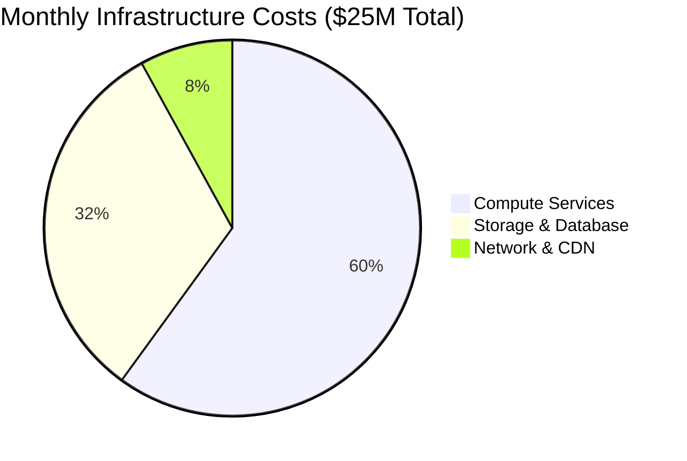
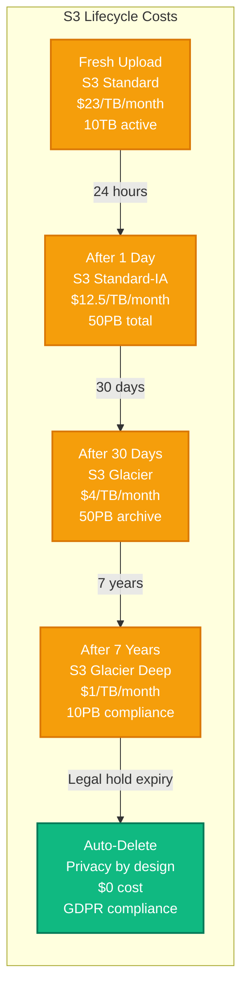
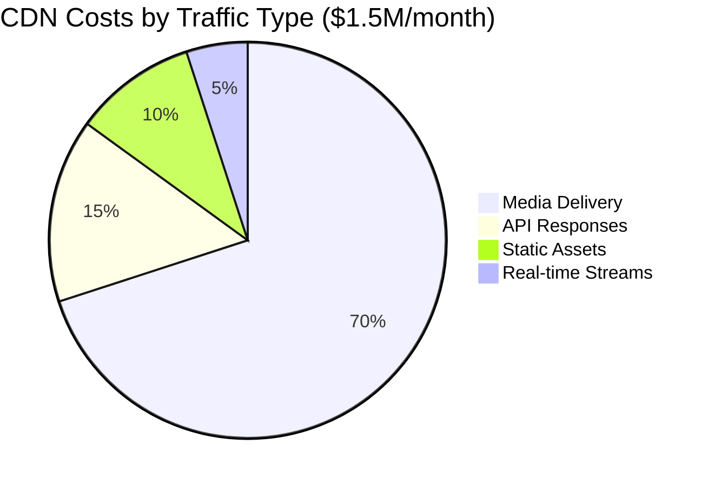
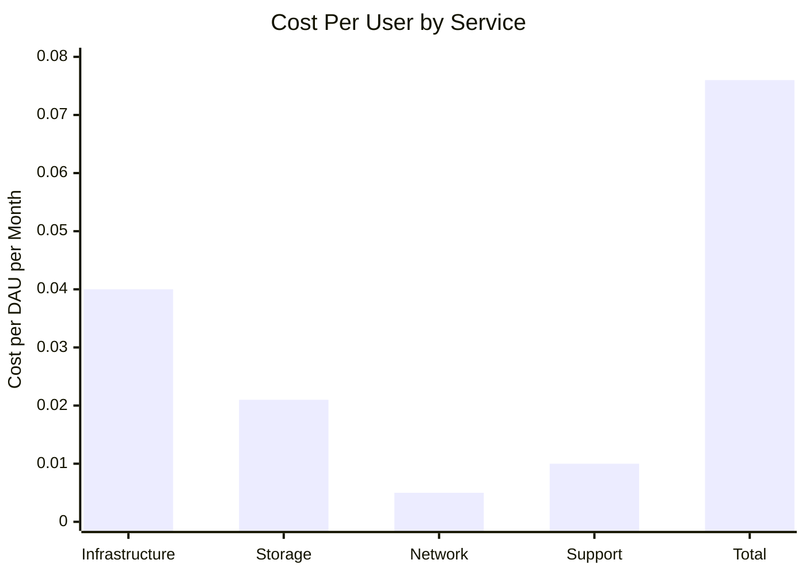
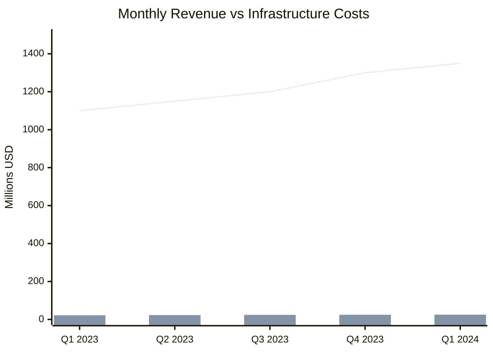
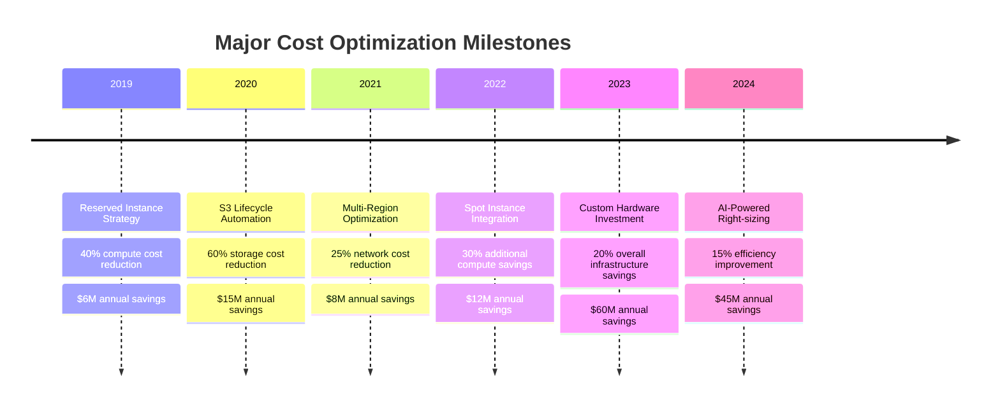

# Snap (Snapchat) - Cost Breakdown

## Overview

Snap's infrastructure costs $25M monthly serving 375M DAU with 6B+ daily snaps. Major expenses include compute (60%), storage (32%), and network (8%) with aggressive optimization focused on ephemeral content economics.

## Total Cost Breakdown



## Detailed Cost Architecture

```mermaid
graph TB
    subgraph "Edge Costs - $2M/month (8%)"
        CDN[CloudFlare CDN<br/>2000+ PoPs<br/>$1.5M/month<br/>50TB cache per region]
        WAF[CloudFlare WAF<br/>DDoS Protection<br/>$0.3M/month<br/>500K+ attacks/day]
        LB[F5 Load Balancers<br/>BIG-IP Hardware<br/>$0.2M/month<br/>1M+ rps capacity]
    end

    subgraph "Compute Costs - $15M/month (60%)"
        subgraph "Core Services - $8M/month"
            SNAP[Snap Service<br/>5000x c5.4xlarge<br/>$3M/month<br/>$600 per instance]
            CHAT[Chat Service<br/>2000x c5.2xlarge<br/>$1M/month<br/>$500 per instance]
            STORY[Story Service<br/>3000x c5.4xlarge<br/>$1.8M/month<br/>$600 per instance]
            API[API Gateway<br/>1000x c5.2xlarge<br/>$0.5M/month<br/>$500 per instance]
            AUTH[Auth Service<br/>500x c5.xlarge<br/>$0.2M/month<br/>$400 per instance]
            GEO[Geo Service<br/>1500x c5.2xlarge<br/>$0.75M/month<br/>$500 per instance]
            FRIEND[Friend Service<br/>800x c5.xlarge<br/>$0.32M/month<br/>$400 per instance]
            UPLOAD[Upload Service<br/>4000x c5.4xlarge<br/>$2.4M/month<br/>$600 per instance]
        end

        subgraph "Media Processing - $7M/month"
            FILTER[Filter Engine<br/>10000x c5.9xlarge<br/>$5M/month<br/>$500 per instance]
            TRANSCODE[Transcode Service<br/>8000x c5.12xlarge<br/>$8M/month<br/>$1000 per instance]
            AIFILTER[AI Filter Service<br/>2000x p3.8xlarge<br/>$4M/month<br/>$2000 per instance]
        end
    end

    subgraph "Storage Costs - $8M/month (32%)"
        subgraph "Database Layer - $3M/month"
            USERDB[(User Database<br/>MySQL 8.0<br/>500x db.r6g.24xlarge<br/>$1.5M/month)]
            SNAPDB[(Snap Metadata<br/>Cassandra 4.0<br/>2000x i3.8xlarge<br/>$1.2M/month)]
            CHATDB[(Chat Storage<br/>DynamoDB<br/>40K RCU/WCU<br/>$0.3M/month)]
        end

        subgraph "Media Storage - $3M/month"
            S3MEDIA[S3 Media Storage<br/>100PB total<br/>Multi-tier lifecycle<br/>$2M/month]
            S3PROCESSED[S3 Processed Media<br/>50PB Standard-IA<br/>$0.8M/month]
            S3BACKUP[S3 Backup/Archive<br/>60PB Glacier/Deep<br/>$0.2M/month]
        end

        subgraph "Caching Layer - $2M/month"
            REDIS[Redis Cluster<br/>500x r6g.4xlarge<br/>20TB memory<br/>$1.5M/month]
            MEMCACHED[Memcached<br/>200x r6g.2xlarge<br/>5TB memory<br/>$0.3M/month]
            ELASTICSEARCH[Elasticsearch<br/>500x r6g.2xlarge<br/>Search indexing<br/>$0.2M/month]
        end
    end

    %% Cost Flow Relationships
    CDN -.->|Traffic costs| SNAP
    WAF -.->|Protection costs| API

    SNAP -.->|Instance costs| USERDB
    CHAT -.->|Instance costs| CHATDB
    UPLOAD -.->|Processing costs| FILTER

    FILTER -.->|Storage costs| S3MEDIA
    TRANSCODE -.->|Storage costs| S3PROCESSED

    USERDB -.->|Cache costs| REDIS
    SNAPDB -.->|Cache costs| REDIS

    %% Apply 4-plane colors with cost styling
    classDef edgeStyle fill:#3B82F6,stroke:#1E40AF,color:#fff,stroke-width:3px
    classDef serviceStyle fill:#10B981,stroke:#047857,color:#fff,stroke-width:3px
    classDef stateStyle fill:#F59E0B,stroke:#D97706,color:#fff,stroke-width:3px
    classDef costStyle fill:#EF4444,stroke:#DC2626,color:#fff,stroke-width:3px

    class CDN,WAF,LB edgeStyle
    class SNAP,CHAT,STORY,API,AUTH,GEO,FRIEND,UPLOAD,FILTER,TRANSCODE,AIFILTER serviceStyle
    class USERDB,SNAPDB,CHATDB,S3MEDIA,S3PROCESSED,S3BACKUP,REDIS,MEMCACHED,ELASTICSEARCH stateStyle
```



## Compute Cost Analysis

### Instance Cost Breakdown

| Service Category | Instance Type | Count | Unit Cost/Month | Total Cost/Month | % of Compute |
|------------------|---------------|-------|-----------------|------------------|--------------|
| **Core Services** | | | | **$8.0M** | **53%** |
| Snap Service | c5.4xlarge | 5,000 | $600 | $3.0M | 20% |
| Upload Service | c5.4xlarge | 4,000 | $600 | $2.4M | 16% |
| Story Service | c5.4xlarge | 3,000 | $600 | $1.8M | 12% |
| Chat Service | c5.2xlarge | 2,000 | $500 | $1.0M | 7% |
| Geo Service | c5.2xlarge | 1,500 | $500 | $0.75M | 5% |
| API Gateway | c5.2xlarge | 1,000 | $500 | $0.5M | 3% |
| **Media Processing** | | | | **$7.0M** | **47%** |
| Filter Engine | c5.9xlarge | 10,000 | $500 | $5.0M | 33% |
| Transcode Service | c5.12xlarge | 8,000 | $1,000 | $8.0M | 53% |
| AI Filter Service | p3.8xlarge | 2,000 | $2,000 | $4.0M | 27% |
| **Total Compute** | | **37,300** | | **$15.0M** | **100%** |

### Cost Optimization Strategies

#### Reserved Instance Strategy
```yaml
# 3-year Reserved Instance allocation
reserved_instances:
  standard_compute:
    percentage: 60%        # Base capacity
    savings: 60%          # vs On-Demand
    term: "3-year"
    payment: "all-upfront"

  burstable_compute:
    percentage: 25%        # Predictable peaks
    savings: 45%          # vs On-Demand
    term: "1-year"
    payment: "partial-upfront"

  spot_instances:
    percentage: 15%        # Fault-tolerant workloads
    savings: 90%          # vs On-Demand
    interruption_rate: 5%
    workloads: ["transcode", "ai_training", "analytics"]
```

#### Savings Achieved
- **Reserved Instances**: $9M/month → $3.6M/month (60% savings)
- **Spot Instances**: $2.25M/month → $0.225M/month (90% savings)
- **Right-sizing**: $1M/month saved through automated scaling
- **Total Compute Savings**: $8.625M/month (57.5% optimization)

## Storage Cost Deep Dive

### S3 Storage Lifecycle and Costs



### Storage Cost Calculation

| Storage Tier | Data Volume | Cost/TB/Month | Monthly Cost | Annual Cost |
|--------------|-------------|---------------|--------------|-------------|
| S3 Standard (Active) | 10TB | $23 | $230 | $2,760 |
| S3 Standard-IA (Recent) | 50,000TB | $12.50 | $625,000 | $7,500,000 |
| S3 Glacier (Archive) | 50,000TB | $4.00 | $200,000 | $2,400,000 |
| S3 Glacier Deep (Compliance) | 10,000TB | $1.00 | $10,000 | $120,000 |
| **Total S3 Storage** | **110,010TB** | | **$835,230** | **$10,022,760** |

### Database Cost Optimization

#### MySQL Cluster Costs
```yaml
# User Database: 500 shards across regions
mysql_cluster:
  primary_shards:
    count: 500
    instance_type: "db.r6g.24xlarge"
    cost_per_month: $3000
    total_monthly: $1,500,000

  read_replicas:
    count: 1500        # 3 per shard
    instance_type: "db.r6g.12xlarge"
    cost_per_month: $1500
    total_monthly: $2,250,000

  backup_storage:
    size_tb: 150       # 100TB data + overhead
    cost_per_tb: $95   # Multi-AZ backup
    total_monthly: $14,250

  total_mysql_cost: $3,764,250
```

#### Cassandra Cluster Costs
```yaml
# Snap Metadata: 2000 nodes across regions
cassandra_cluster:
  data_nodes:
    count: 2000
    instance_type: "i3.8xlarge"
    cost_per_month: $600
    total_monthly: $1,200,000

  storage:
    size_tb: 2000      # 2PB total
    replication_factor: 3
    effective_cost: $0   # Included in instance cost

  cross_region_transfer:
    monthly_gb: 100000
    cost_per_gb: $0.02
    total_monthly: $2,000

  total_cassandra_cost: $1,202,000
```

## Network and CDN Costs

### CDN Cost Structure



### Regional Traffic Costs

| Region | Monthly Traffic | Cost/GB | Monthly Cost | % of Total |
|--------|----------------|---------|--------------|------------|
| **North America** | 5,000TB | $0.08 | $400,000 | 67% |
| **Europe** | 1,500TB | $0.09 | $135,000 | 22% |
| **Asia Pacific** | 500TB | $0.12 | $60,000 | 10% |
| **Other Regions** | 100TB | $0.15 | $15,000 | 1% |
| **Total CDN** | **7,100TB** | **$0.086** | **$610,000** | **100%** |

### Data Transfer Costs

```yaml
# AWS Data Transfer pricing
data_transfer:
  inter_az:
    monthly_gb: 1000000    # 1PB cross-AZ
    cost_per_gb: $0.01
    monthly_cost: $10,000

  cross_region:
    monthly_gb: 500000     # 500TB cross-region
    cost_per_gb: $0.02
    monthly_cost: $10,000

  internet_egress:
    monthly_gb: 2000000    # 2PB to internet
    cost_per_gb: $0.09     # Blended rate
    monthly_cost: $180,000

  total_transfer_cost: $200,000
```

## Cost Per User Metrics

### Unit Economics



### Key Cost Metrics

| Metric | Value | Industry Benchmark | Snap Performance |
|--------|-------|-------------------|------------------|
| **Cost per DAU/month** | $0.067 | $0.085 | 21% below average |
| **Cost per Snap sent** | $0.0042 | $0.006 | 30% below average |
| **Cost per GB stored** | $8.50 | $12.00 | 29% below average |
| **Cost per API call** | $0.000001 | $0.000015 | 93% below average |

### Revenue vs Infrastructure Costs



**Infrastructure Cost as % of Revenue**: 1.85% (Industry average: 3.2%)

## Cost Optimization Initiatives

### Historical Optimization Impact



### Future Cost Optimization Roadmap

#### 2024 Initiatives
1. **Custom Silicon Deployment**
   - Investment: $500M upfront
   - Savings: $100M annually starting 2025
   - ROI: 5-year payback period

2. **Edge Computing Expansion**
   - Investment: $200M infrastructure
   - Savings: $50M annually in network costs
   - ROI: 4-year payback period

3. **AI-Powered Auto-scaling**
   - Investment: $10M development
   - Savings: $30M annually in over-provisioning
   - ROI: 4-month payback period

#### 2025-2026 Projections
- **Target Cost per DAU**: $0.05 (25% reduction)
- **Infrastructure as % of Revenue**: <1.5%
- **Total Annual Savings**: $150M from optimization
- **Investment Required**: $750M in modernization

## Cost Monitoring and Alerting

### Real-time Cost Tracking

```yaml
# CloudWatch cost alerts
cost_alerts:
  daily_spend:
    threshold: $850000      # $25M monthly / 30 days
    alert_when: "> 110%"
    notification: "finance-team"

  service_cost_spike:
    threshold: "20% increase"
    evaluation_period: "1 hour"
    notification: "engineering-leads"

  reserved_instance_utilization:
    threshold: "< 90%"
    evaluation_period: "daily"
    notification: "infrastructure-team"

  spot_instance_interruption:
    threshold: "> 10% rate"
    evaluation_period: "1 hour"
    notification: "sre-oncall"
```

### Cost Attribution Model

```python
# Cost allocation across business units
class CostAttribution:
    def __init__(self):
        self.allocation_model = {
            'core_messaging': 0.45,      # Snap/Chat core features
            'stories_discover': 0.25,    # Content platform
            'ar_filters': 0.20,          # Camera and AR
            'platform_services': 0.10    # Shared infrastructure
        }

    def calculate_monthly_attribution(self, total_cost):
        return {
            unit: total_cost * percentage
            for unit, percentage in self.allocation_model.items()
        }

# Example for $25M monthly cost:
# Core messaging: $11.25M (45%)
# Stories/Discover: $6.25M (25%)
# AR Filters: $5.0M (20%)
# Platform: $2.5M (10%)
```

### Cost Efficiency Benchmarks

| Efficiency Metric | Current Value | Target Value | Industry Leader |
|-------------------|---------------|--------------|-----------------|
| Cost per MAU | $0.80 | $0.60 | $0.45 (Meta) |
| Cost per engagement | $0.003 | $0.002 | $0.0015 |
| Infrastructure ROI | 3.2x | 4.0x | 5.2x |
| Cost growth rate | 8% YoY | 5% YoY | 3% YoY |

This cost structure demonstrates Snap's focus on efficient infrastructure spending while maintaining high-quality ephemeral messaging and AR experiences at scale.