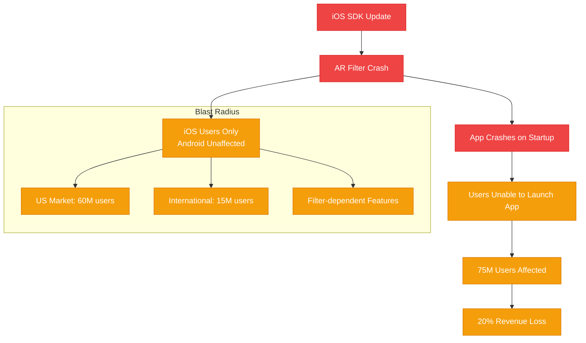
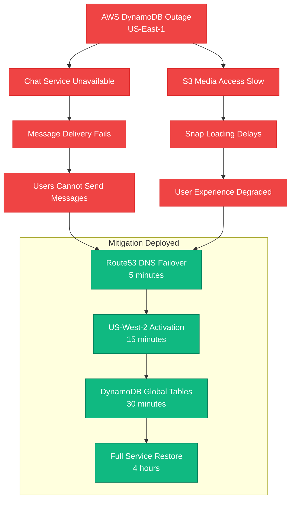
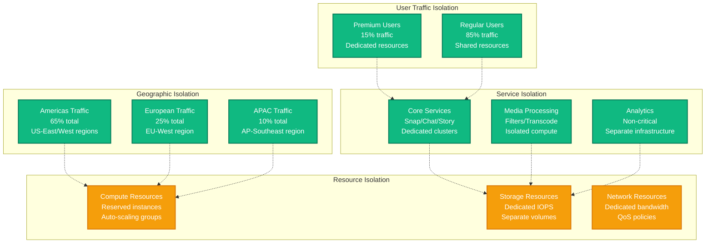
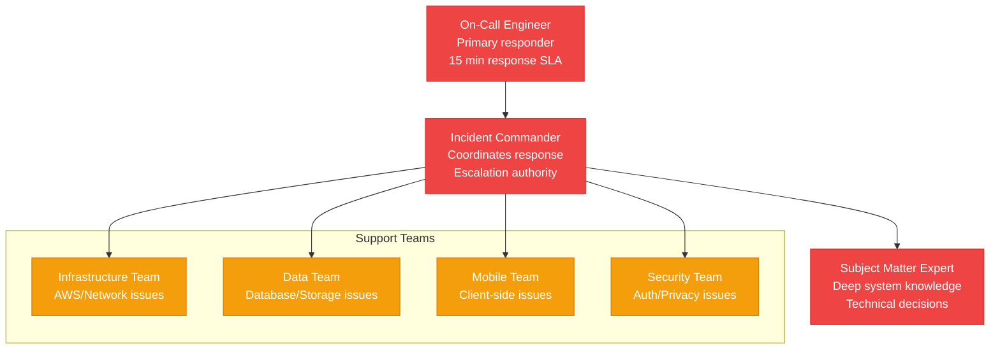

# Snap (Snapchat) - Failure Domains

## Overview

Snap's failure domain strategy protects against cascading failures while maintaining ephemeral messaging guarantees for 375M DAU. Key incidents include the 2022 iOS update that caused 20% DAU drop and the 2021 AWS outage affecting West Coast users.

## Complete Failure Domain Map

```mermaid
graph TB
    subgraph "Region Failure Domains"
        subgraph "US-East-1 Primary"
            USELab[US-East AZ-A<br/>Primary Region<br/>60% traffic]
            USELBb[US-East AZ-B<br/>Hot standby<br/>Cross-AZ failover]
            USELbc[US-East AZ-C<br/>DB replicas<br/>Read traffic]
        end

        subgraph "US-West-2 Secondary"
            USWLa[US-West AZ-A<br/>Secondary Region<br/>20% traffic]
            USWLb[US-West AZ-B<br/>Disaster recovery<br/>Cold standby]
        end

        subgraph "EU-West-1 GDPR"
            EULa[EU-West AZ-A<br/>EU users only<br/>15% traffic]
            EULb[EU-West AZ-B<br/>Data residency<br/>GDPR compliance]
        end
    end

    subgraph "Service Failure Domains"
        subgraph "Critical Path Services"
            SNAP[Snap Service<br/>5K instances<br/>Circuit Breaker: 50 errors/min]
            CHAT[Chat Service<br/>2K instances<br/>Circuit Breaker: 20 errors/min]
            UPLOAD[Upload Service<br/>4K instances<br/>Circuit Breaker: 100 errors/min]
        end

        subgraph "Media Processing"
            FILTER[Filter Engine<br/>10K instances<br/>Graceful degradation<br/>Original media fallback]
            TRANSCODE[Transcode Service<br/>8K instances<br/>Async processing<br/>Queue buffering]
        end

        subgraph "Supporting Services"
            AUTH[Auth Service<br/>1K instances<br/>JWT validation<br/>Local cache fallback]
            FRIEND[Friend Service<br/>500 instances<br/>Social graph<br/>Cached responses]
            GEO[Geo Service<br/>1.5K instances<br/>Location updates<br/>Stale data acceptable]
        end
    end

    subgraph "Data Failure Domains"
        subgraph "Primary Databases"
            USERDB[(User DB<br/>MySQL Cluster<br/>500 shards<br/>Master-Master)]
            SNAPDB[(Snap Metadata<br/>Cassandra<br/>2K nodes<br/>RF=3 quorum)]
            CHATDB[(Chat Storage<br/>DynamoDB<br/>Global Tables<br/>Multi-region)]
        end

        subgraph "Cache Layer"
            REDIS[Redis Cluster<br/>500 nodes<br/>Cross-shard failover<br/>No single point]
            MEMCACHE[Memcached<br/>200 nodes<br/>Consistent hashing<br/>Cache miss tolerance]
        end

        subgraph "Media Storage"
            S3MEDIA[S3 Media<br/>Cross-region replication<br/>99.999999999% durability]
            S3BACKUP[S3 Backup<br/>Multi-region<br/>Versioning enabled]
        end
    end

    subgraph "Network Failure Domains"
        CDN[CloudFlare CDN<br/>2000+ PoPs<br/>Auto-failover<br/>Origin shield]
        LB[F5 Load Balancer<br/>Active-Active<br/>Health checks<br/>30s timeout]
        VPC[VPC Networks<br/>Multiple subnets<br/>NAT Gateway redundancy]
    end

    %% Failure Relationships
    USELab -.->|AZ Failure| USELBb
    USELBb -.->|Region Failure| USWLa
    USWLa -.->|Multi-region Failure| EULa

    SNAP -.->|Service Failure| CHAT
    FILTER -.->|Processing Failure| UPLOAD
    AUTH -.->|Auth Failure| REDIS

    USERDB -.->|Shard Failure| REDIS
    SNAPDB -.->|Node Failure| REDIS
    REDIS -.->|Cache Failure| USERDB

    CDN -.->|CDN Failure| LB
    LB -.->|LB Failure| VPC

    %% Apply 4-plane colors
    classDef edgeStyle fill:#3B82F6,stroke:#1E40AF,color:#fff,stroke-width:2px
    classDef serviceStyle fill:#10B981,stroke:#047857,color:#fff,stroke-width:2px
    classDef stateStyle fill:#F59E0B,stroke:#D97706,color:#fff,stroke-width:2px
    classDef controlStyle fill:#8B5CF6,stroke:#7C3AED,color:#fff,stroke-width:2px

    class CDN,LB,VPC edgeStyle
    class SNAP,CHAT,UPLOAD,FILTER,TRANSCODE,AUTH,FRIEND,GEO serviceStyle
    class USERDB,SNAPDB,CHATDB,REDIS,MEMCACHE,S3MEDIA,S3BACKUP stateStyle
    class USELab,USELBb,USELbc,USWLa,USWLb,EULa,EULb controlStyle
```



## Historical Incidents and Blast Radius

### Major Outage Analysis

#### 2022 iOS App Update Incident
**Duration**: 6 hours
**Impact**: 20% DAU drop (75M users affected)
**Root Cause**: iOS SDK update broke AR filter rendering



**Recovery Actions**:
1. Emergency hotfix release (2 hours)
2. Gradual rollout with feature flags (3 hours)
3. Full recovery with improved SDK testing (1 hour)

#### 2021 AWS US-East-1 Outage
**Duration**: 4 hours
**Impact**: 35% of US users (130M users)
**Root Cause**: AWS DynamoDB service failure



## Circuit Breaker Patterns

### Service-Level Circuit Breakers

```yaml
# Snap Service Circuit Breaker Configuration
circuit_breakers:
  snap_service:
    failure_threshold: 50        # errors per minute
    timeout: 30000              # 30 seconds
    reset_timeout: 60000        # 1 minute recovery
    fallback: "cached_response"

  filter_engine:
    failure_threshold: 100       # high tolerance for media processing
    timeout: 10000              # 10 seconds (fast fail)
    reset_timeout: 30000        # 30 seconds recovery
    fallback: "original_media"   # serve unfiltered content

  chat_service:
    failure_threshold: 20        # low tolerance for messaging
    timeout: 5000               # 5 seconds
    reset_timeout: 120000       # 2 minutes recovery
    fallback: "offline_queue"    # queue messages for later

  upload_service:
    failure_threshold: 100       # file uploads can be retried
    timeout: 60000              # 1 minute for large files
    reset_timeout: 30000        # quick recovery
    fallback: "retry_queue"      # async retry mechanism
```

### Database Circuit Breaker Configuration

```python
# Database connection circuit breaker
class DatabaseCircuitBreaker:
    def __init__(self, db_type):
        self.config = {
            'mysql_user_db': {
                'failure_threshold': 10,    # Low tolerance for user data
                'timeout_ms': 5000,
                'fallback': 'read_replica'
            },
            'cassandra_snap_db': {
                'failure_threshold': 25,    # Higher tolerance
                'timeout_ms': 10000,
                'fallback': 'cache_only'
            },
            'redis_cache': {
                'failure_threshold': 50,    # Cache misses acceptable
                'timeout_ms': 2000,
                'fallback': 'database_direct'
            }
        }

    def execute_with_fallback(self, operation, db_type):
        try:
            return operation()
        except CircuitBreakerOpen:
            return self.execute_fallback(db_type)
```

## Cascading Failure Prevention

### Bulkhead Pattern Implementation



## Graceful Degradation Strategies

### Feature Priority Matrix

| Feature | User Impact | Degradation Strategy | Acceptable Downtime |
|---------|-------------|---------------------|-------------------|
| **Send Snap** | Critical | Queue for async processing | 0 minutes |
| **Receive Snap** | Critical | Show cached/delayed content | 1 minute |
| **Chat Messages** | Critical | Store-and-forward queue | 0 minutes |
| **AR Filters** | High | Serve original media | 30 minutes |
| **Stories** | High | Read-only mode | 15 minutes |
| **Snap Map** | Medium | Show stale locations | 2 hours |
| **Friend Discovery** | Low | Disable temporarily | 24 hours |
| **Lens Studio** | Low | Maintenance mode | 24 hours |

### Degradation Implementation

```python
class SnapDegradationManager:
    def __init__(self):
        self.degradation_levels = {
            'level_0': 'full_service',          # Normal operation
            'level_1': 'reduce_filters',        # Disable complex AR
            'level_2': 'essential_only',        # Snap/Chat only
            'level_3': 'read_only',            # View only, no sends
            'level_4': 'maintenance_mode'       # Emergency shutdown
        }

    def evaluate_system_health(self):
        metrics = {
            'error_rate': self.get_error_rate(),
            'response_time': self.get_response_time(),
            'cpu_usage': self.get_cpu_usage(),
            'memory_usage': self.get_memory_usage()
        }

        if metrics['error_rate'] > 0.1:      # 10% error rate
            return 'level_3'
        elif metrics['response_time'] > 1000:  # 1 second p99
            return 'level_2'
        elif metrics['cpu_usage'] > 0.8:      # 80% CPU
            return 'level_1'
        else:
            return 'level_0'

    def apply_degradation(self, level):
        if level == 'level_1':
            # Disable compute-intensive filters
            self.disable_ar_filters(['face_distortion', 'background_removal'])
        elif level == 'level_2':
            # Core messaging only
            self.disable_services(['stories', 'discover', 'snap_map'])
        elif level == 'level_3':
            # Read-only mode
            self.enable_read_only_mode()
        elif level == 'level_4':
            # Maintenance mode
            self.enable_maintenance_mode()
```

## Recovery Procedures

### Automated Recovery Workflows

```yaml
# Auto-recovery configuration
recovery_workflows:
  service_failure:
    detection_time: "30 seconds"
    actions:
      - restart_unhealthy_instances
      - scale_out_healthy_instances
      - reroute_traffic_to_backup
    max_attempts: 3
    escalation_time: "5 minutes"

  database_failure:
    detection_time: "15 seconds"
    actions:
      - failover_to_replica
      - promote_standby_to_primary
      - update_connection_strings
    max_attempts: 1
    escalation_time: "2 minutes"

  region_failure:
    detection_time: "2 minutes"
    actions:
      - activate_disaster_recovery_region
      - update_dns_routing
      - sync_critical_data
    max_attempts: 1
    escalation_time: "immediate"
```

### Manual Recovery Playbooks

#### Snap Service Recovery

```bash
# Emergency Snap Service Recovery Playbook
# Execute in order, validate each step

# 1. Check service health
kubectl get pods -n snap-service | grep -v Running

# 2. Scale up healthy instances
kubectl scale deployment snap-service --replicas=7500

# 3. Restart unhealthy pods
kubectl delete pods -n snap-service -l health=unhealthy

# 4. Validate recovery
curl -f http://snap-service/health || echo "FAILED - Escalate"

# 5. Check database connections
mysql -h snap-db-cluster -e "SELECT COUNT(*) FROM snaps WHERE created_at > NOW() - INTERVAL 1 MINUTE"

# 6. Verify cache connectivity
redis-cli -h snap-redis-cluster ping

# 7. Test end-to-end functionality
./scripts/e2e-snap-test.sh || echo "E2E FAILED - Investigate"
```

## Monitoring and Alerting for Failure Detection

### Critical Failure Metrics

```yaml
# DataDog alerting configuration
alerts:
  - name: "snap_service_error_rate"
    metric: "aws.applicationelb.target_4xx_count"
    threshold: "> 100 errors/minute"
    evaluation_window: "5 minutes"
    notification: "pagerduty-critical"

  - name: "cassandra_node_down"
    metric: "cassandra.nodes.up"
    threshold: "< 1900"  # Less than 95% of 2000 nodes
    evaluation_window: "1 minute"
    notification: "pagerduty-high"

  - name: "redis_memory_critical"
    metric: "redis.memory.used_percentage"
    threshold: "> 90%"
    evaluation_window: "2 minutes"
    notification: "slack-oncall"

  - name: "s3_put_error_rate"
    metric: "aws.s3.4xx_errors"
    threshold: "> 50 errors/minute"
    evaluation_window: "3 minutes"
    notification: "pagerduty-high"

  - name: "cross_region_latency"
    metric: "custom.cross_region_latency"
    threshold: "> 500ms"
    evaluation_window: "5 minutes"
    notification: "slack-oncall"
```

### Failure Detection SLIs

| Service | SLI | Target | Alert Threshold |
|---------|-----|--------|-----------------|
| Snap Send | Success rate | 99.9% | < 99.5% |
| Chat Delivery | P99 latency | < 100ms | > 200ms |
| Filter Processing | Success rate | 99.5% | < 99.0% |
| Story Upload | P99 latency | < 2s | > 5s |
| Auth Service | Success rate | 99.99% | < 99.9% |

### Incident Response Team Structure

