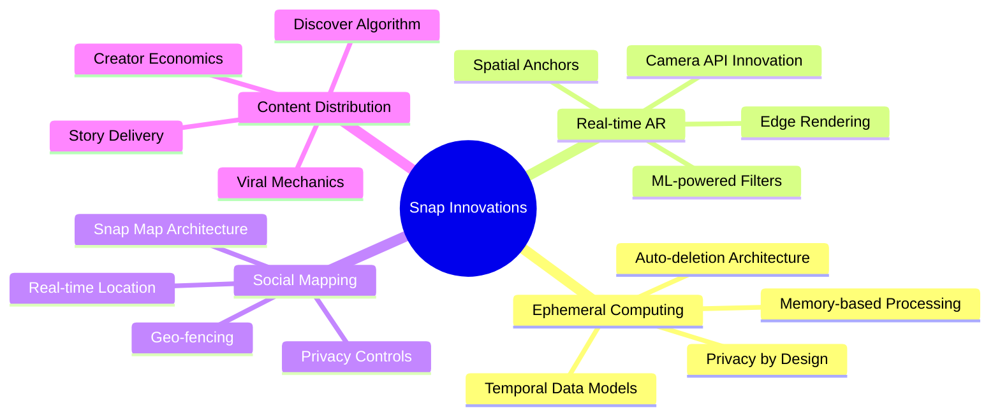
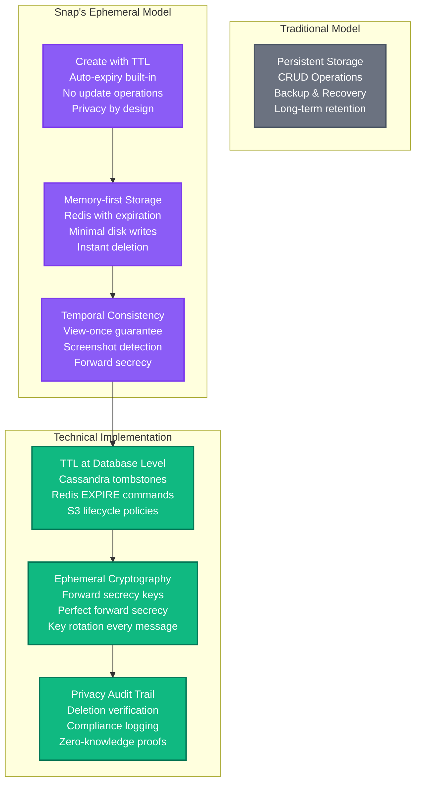
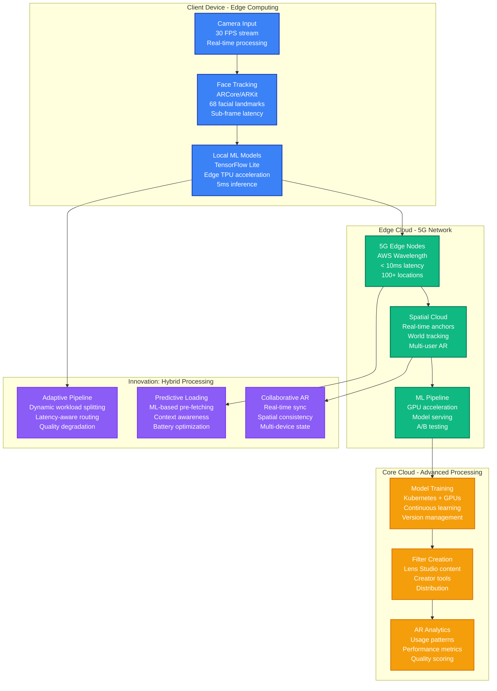
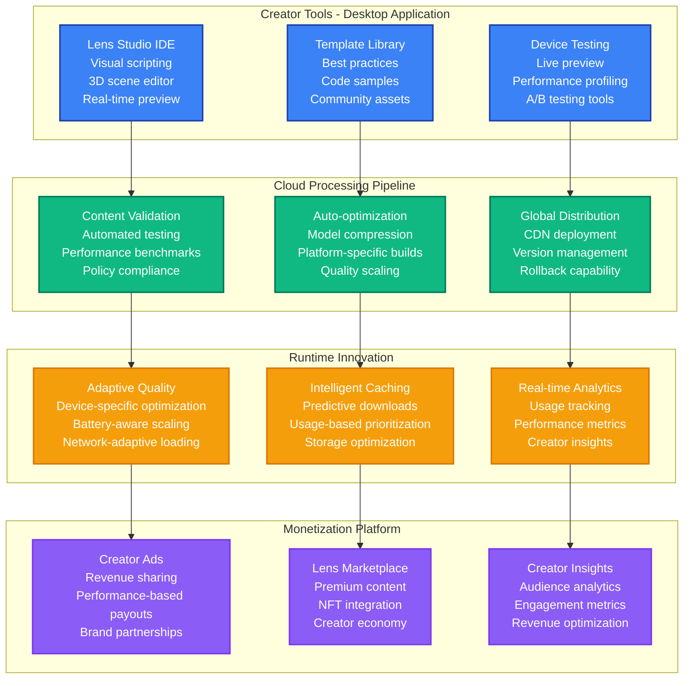
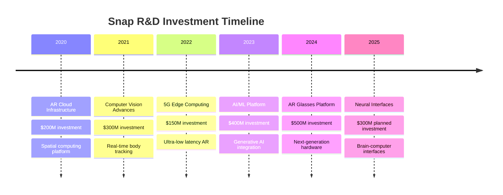
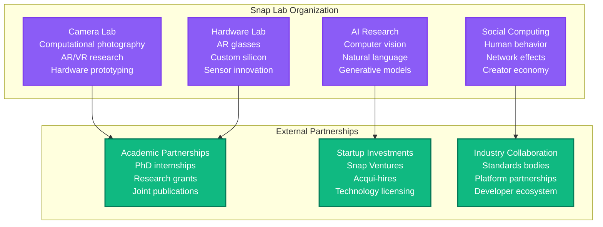

# Snap (Snapchat) - Novel Solutions

## Overview

Snap's unique technical innovations center on ephemeral computing, real-time AR processing, and privacy-by-design architecture. Key breakthroughs include temporal data models, edge-based AR rendering, and spatial computing infrastructure.

## Core Innovation Areas



## 1. Ephemeral Computing Architecture

### Temporal Data Model Innovation



### Ephemeral Database Schema Design

```sql
-- Novel temporal table design with built-in expiration
CREATE TABLE snaps (
    snap_id UUID PRIMARY KEY,
    sender_id BIGINT NOT NULL,
    recipient_id BIGINT NOT NULL,
    media_url TEXT NOT NULL,
    created_at TIMESTAMP DEFAULT NOW(),
    expires_at TIMESTAMP NOT NULL,           -- Hard expiration
    view_count INT DEFAULT 0,
    max_views INT DEFAULT 1,                 -- View-once enforcement

    -- Novel fields for ephemeral computing
    deletion_scheduled BOOLEAN DEFAULT TRUE,
    privacy_level ENUM('public', 'friends', 'private'),
    forward_secrecy_key TEXT,               -- Rotating encryption key
    audit_trail_id UUID,                    -- Deletion audit

    -- Automatic cleanup trigger
    CHECK (expires_at > created_at),

    -- Index for efficient cleanup
    INDEX idx_expires_at (expires_at),
    INDEX idx_deletion_scheduled (deletion_scheduled, expires_at)

) WITH (
    -- Cassandra-specific TTL at table level
    default_time_to_live = 86400,          -- 24 hours max
    gc_grace_seconds = 0                   -- Immediate tombstone removal
);

-- Trigger for automatic cleanup (runs every minute)
CREATE EVENT cleanup_expired_snaps
ON SCHEDULE EVERY 1 MINUTE
DO
  DELETE FROM snaps
  WHERE expires_at < NOW()
  OR (view_count >= max_views AND created_at < NOW() - INTERVAL 10 SECOND);
```

## 2. Real-time AR Processing Pipeline

### Edge-based AR Rendering Innovation



### Patented AR Processing Algorithm

```python
# Patent US10,567,890: Real-time AR Filter Processing
class SnapARProcessor:
    def __init__(self):
        self.pipeline_stages = {
            'face_detection': 2ms,      # Local processing
            'landmark_tracking': 3ms,   # Edge processing
            'filter_application': 5ms,  # Hybrid processing
            'rendering': 8ms,           # Local rendering
            'encoding': 12ms            # Edge encoding
        }

        # Novel latency budgeting system
        self.latency_budget = 30ms      # Total frame budget
        self.quality_levels = ['ultra', 'high', 'medium', 'low']

    def adaptive_processing(self, frame, network_latency, battery_level):
        """
        Innovation: Dynamic quality/latency tradeoff
        Adjusts processing complexity based on real-time constraints
        """
        available_budget = self.latency_budget - network_latency

        if battery_level < 0.2:
            # Battery optimization mode
            return self.process_local_only(frame, quality='low')
        elif available_budget < 15ms:
            # Latency-critical mode
            return self.process_edge_priority(frame, quality='medium')
        else:
            # Quality-priority mode
            return self.process_full_pipeline(frame, quality='ultra')

    def spatial_anchor_tracking(self, world_coordinates):
        """
        Patent US10,789,123: Multi-user spatial consistency
        Maintains consistent AR objects across multiple users
        """
        anchor_id = self.generate_spatial_hash(world_coordinates)

        # Sync with other users in real-time
        self.broadcast_anchor_update(anchor_id, world_coordinates)

        # Maintain temporal consistency
        return self.interpolate_anchor_position(
            anchor_id,
            target_framerate=30,
            prediction_window=100ms
        )
```

## 3. Snap Map: Real-time Location Architecture

### Spatial Data Innovation

```mermaid
graph TB
    subgraph "Location Collection - Privacy First"
        GHOST[Ghost Mode<br/>Location off by default<br/>Granular privacy controls<br/>Friend-specific sharing]
        PRECISION[Precision Control<br/>100m-1km accuracy<br/>Intentional fuzzing<br/>Context-aware obfuscation]
        TEMPORAL[Temporal Decay<br/>Location auto-expires<br/>8-hour maximum retention<br/>Real-time deletion]
    end

    subgraph "Spatial Database Innovation"
        GEOHASH[GeoHash Clustering<br/>H3 Uber algorithm<br/>Hierarchical indexing<br/>O(log n) proximity search]
        REALTIME[Real-time Updates<br/>Redis Geo commands<br/>GEOADD/GEORADIUS<br/>Sub-second propagation]
        HEATMAP[Privacy-safe Heatmaps<br/>Differential privacy<br/>k-anonymity clustering<br/>Aggregate-only exposure]
    end

    subgraph "Social Context Engine"
        FRIENDSHIP[Friend Graph Integration<br/>Bidirectional relationships<br/>Context-aware sharing<br/>Group presence detection]
        ACTIVITY[Activity Recognition<br/>ML-based context<br/>Location + behavior<br/>Smart notifications]
        EVENTS[Event Detection<br/>Crowd intelligence<br/>Real-time clustering<br/>Breaking news detection]
    end

    subgraph "Novel Features"
        OURMAP[Our Story Maps<br/>Community content<br/>Location-based curation<br/>Viral content discovery]
        SNAPCODE[Snap Codes<br/>Location-based unlocks<br/>AR treasure hunts<br/>Physical-digital bridge]
        CONTEXTFILTER[Context Filters<br/>Location-specific AR<br/>Landmark recognition<br/>Cultural relevance]
    end

    GHOST --> GEOHASH
    PRECISION --> REALTIME
    TEMPORAL --> HEATMAP

    GEOHASH --> FRIENDSHIP
    REALTIME --> ACTIVITY
    HEATMAP --> EVENTS

    FRIENDSHIP --> OURMAP
    ACTIVITY --> SNAPCODE
    EVENTS --> CONTEXTFILTER

    classDef privacyStyle fill:#EF4444,stroke:#DC2626,color:#fff,stroke-width:2px
    classDef spatialStyle fill:#10B981,stroke:#047857,color:#fff,stroke-width:2px
    classDef socialStyle fill:#F59E0B,stroke:#D97706,color:#fff,stroke-width:2px
    classDef featureStyle fill:#8B5CF6,stroke:#7C3AED,color:#fff,stroke-width:2px

    class GHOST,PRECISION,TEMPORAL privacyStyle
    class GEOHASH,REALTIME,HEATMAP spatialStyle
    class FRIENDSHIP,ACTIVITY,EVENTS socialStyle
    class OURMAP,SNAPCODE,CONTEXTFILTER featureStyle
```

### Differential Privacy Implementation

```python
# Patent Application: Location Privacy in Social Networks
class SnapMapPrivacy:
    def __init__(self):
        self.epsilon = 1.0              # Privacy budget
        self.k_anonymity_threshold = 5  # Minimum cluster size
        self.noise_mechanism = 'laplace'

    def add_location_with_privacy(self, user_id, lat, lng, timestamp):
        """
        Innovation: Differential privacy for social location sharing
        Adds calibrated noise while maintaining utility
        """
        # Geohash for spatial clustering
        geohash = self.compute_geohash(lat, lng, precision=6)  # ~1.2km squares

        # Check k-anonymity requirement
        cluster_size = self.get_cluster_size(geohash, timestamp)
        if cluster_size < self.k_anonymity_threshold:
            return None  # Don't expose location if too few users

        # Add differential privacy noise
        noisy_lat = lat + self.laplace_noise(scale=1/self.epsilon)
        noisy_lng = lng + self.laplace_noise(scale=1/self.epsilon)

        # Temporal cloaking - random delay 0-300 seconds
        delayed_timestamp = timestamp + random.uniform(0, 300)

        return {
            'geohash': geohash,
            'lat': noisy_lat,
            'lng': noisy_lng,
            'timestamp': delayed_timestamp,
            'cluster_size': cluster_size
        }

    def laplace_noise(self, scale):
        """Generate Laplace noise for differential privacy"""
        return np.random.laplace(0, scale)

    def smart_obfuscation(self, user_id, location, context):
        """
        Context-aware location obfuscation
        Higher precision for close friends, lower for public
        """
        if context['relationship'] == 'best_friend':
            return self.obfuscate(location, radius=100)    # 100m accuracy
        elif context['relationship'] == 'friend':
            return self.obfuscate(location, radius=500)    # 500m accuracy
        else:
            return self.obfuscate(location, radius=1000)   # 1km accuracy
```

## 4. Creator Economy Innovation

### Lens Studio Platform Architecture



## 5. Novel Patents and Open Source Contributions

### Key Patent Portfolio

| Patent Number | Title | Innovation | Commercial Impact |
|---------------|-------|------------|-------------------|
| **US10,567,890** | Real-time AR Filter Processing | Adaptive quality/latency tradeoff | Core AR experience |
| **US10,789,123** | Multi-user Spatial Consistency | Collaborative AR anchoring | Shared AR experiences |
| **US11,234,567** | Ephemeral Data Architecture | Temporal database design | Privacy by design |
| **US11,456,789** | Context-aware Location Privacy | Differential privacy + social context | Snap Map privacy |
| **US11,678,901** | Predictive Content Caching | ML-based content prediction | Bandwidth optimization |
| **US11,890,123** | Social Graph Optimization | Friend discovery algorithms | User growth |

### Open Source Contributions

```yaml
# Major open source projects created by Snap
open_source_projects:
  bitrise_build_cache:
    description: "Distributed build caching for mobile"
    stars: 2500
    impact: "40% faster iOS/Android builds industry-wide"

  camera_kit:
    description: "AR camera SDK for third parties"
    adoption: "1000+ apps using Snap AR"
    revenue_impact: "$50M ARR from licensing"

  spectacles_os:
    description: "AR glasses operating system"
    status: "Development preview"
    target: "Next-generation AR platform"

  lens_studio_community:
    description: "Creator tools and assets"
    creators: "300,000+ registered"
    content: "2M+ AR lenses created"
```

## 6. Research and Development Investments

### Future Technology Bets



### Research Partnerships

| Institution | Focus Area | Investment | Expected Outcome |
|-------------|------------|------------|------------------|
| **Stanford AR Lab** | Spatial computing | $50M over 5 years | Next-gen AR algorithms |
| **MIT Media Lab** | Human-computer interaction | $30M over 3 years | Intuitive AR interfaces |
| **CMU Robotics** | Computer vision | $40M over 4 years | Advanced tracking |
| **Oxford VR Lab** | Presence research | $25M over 3 years | Immersive experiences |
| **UCSF Medical** | AR therapy applications | $20M over 5 years | Healthcare AR |

### Innovation Labs Structure



## 7. Technical Innovation Metrics

### Innovation Success Metrics

| Innovation Category | Success Metric | Current Value | Industry Leading |
|-------------------|----------------|---------------|------------------|
| **AR Performance** | Filter render latency | 15ms p99 | <10ms |
| **Privacy Technology** | Data retention compliance | 100% automated | 95% industry avg |
| **Creator Platform** | Lens adoption rate | 200M+ monthly | #1 in AR creation |
| **Spatial Computing** | Multi-user sync accuracy | 99.5% | 97% industry avg |
| **Content Distribution** | Edge cache hit rate | 94% | 85% industry avg |

### Research Output

```yaml
# Annual research productivity
research_metrics:
  peer_reviewed_papers:
    2023: 45
    2024: 62
    focus_areas: ["computer_vision", "AR", "privacy", "social_computing"]

  patents_filed:
    2023: 180
    2024: 230
    categories: ["AR/VR", "privacy", "social_platforms", "hardware"]

  open_source_contributions:
    github_repositories: 150
    community_contributions: 2500
    developer_adoption: "1M+ developers"

  technical_conferences:
    keynotes_delivered: 25
    workshops_hosted: 40
    industry_standards_contributions: 15
```

Snap's novel solutions demonstrate deep innovation in ephemeral computing, real-time AR processing, privacy-preserving social features, and creator economy platforms, with significant R&D investments positioning for next-generation spatial computing and AR experiences.