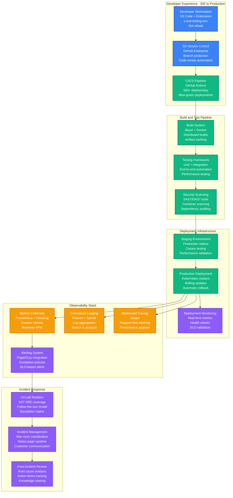
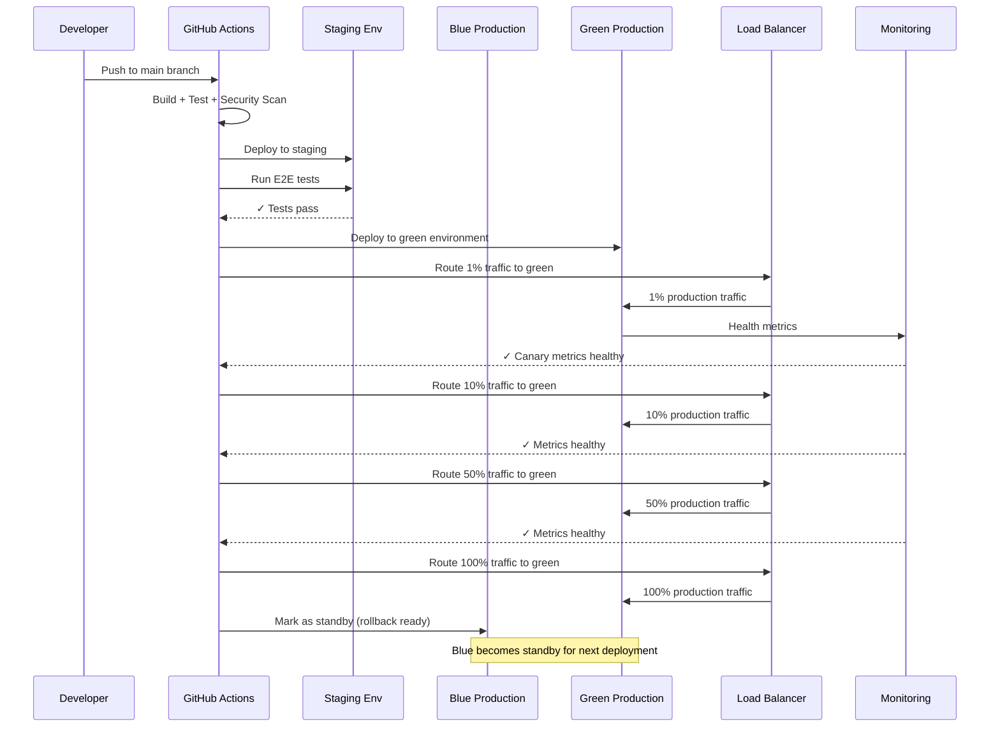

# Snap (Snapchat) - Production Operations

## Overview

Snap operates 375M+ DAU infrastructure with 99.9% uptime across 15 regions, deploying 500+ times daily through automated pipelines, with 24/7 SRE coverage handling 6B+ snap deliveries.

## Production Operations Architecture



## Continuous Integration and Deployment

### GitHub Actions Pipeline Configuration

```yaml
# .github/workflows/deploy-production.yml
name: Production Deployment Pipeline

on:
  push:
    branches: [main]
  pull_request:
    branches: [main]

env:
  REGISTRY: ghcr.io
  IMAGE_NAME: snap/service

jobs:
  build-and-test:
    runs-on: ubuntu-latest
    steps:
      - name: Checkout code
        uses: actions/checkout@v4

      - name: Setup Build Cache
        uses: actions/cache@v3
        with:
          path: |
            ~/.cache/bazel
            ~/.cache/docker
          key: ${{ runner.os }}-build-${{ hashFiles('**/*.bazel', 'Dockerfile') }}

      - name: Build with Bazel
        run: |
          bazel build //...
          bazel test //... --test_output=all

      - name: Security Scan
        uses: securecodewarrior/github-action-add-sarif@v1
        with:
          sarif-file: security-scan-results.sarif

      - name: Container Image Build
        run: |
          docker build -t ${{ env.REGISTRY }}/${{ env.IMAGE_NAME }}:${{ github.sha }} .
          docker push ${{ env.REGISTRY }}/${{ env.IMAGE_NAME }}:${{ github.sha }}

  deploy-staging:
    needs: build-and-test
    if: github.ref == 'refs/heads/main'
    runs-on: ubuntu-latest
    environment: staging
    steps:
      - name: Deploy to Staging
        run: |
          kubectl set image deployment/snap-service \
            snap-service=${{ env.REGISTRY }}/${{ env.IMAGE_NAME }}:${{ github.sha }} \
            -n staging

      - name: Run E2E Tests
        run: |
          ./scripts/e2e-tests.sh --environment=staging
          ./scripts/performance-tests.sh --baseline=production

      - name: Staging Health Check
        run: |
          ./scripts/health-check.sh --environment=staging --timeout=300

  deploy-production:
    needs: deploy-staging
    if: github.ref == 'refs/heads/main'
    runs-on: ubuntu-latest
    environment: production
    steps:
      - name: Canary Deployment
        run: |
          # Deploy to 1% of traffic first
          kubectl patch deployment snap-service \
            -p '{"spec":{"template":{"metadata":{"annotations":{"canary.weight":"1"}}}}}' \
            -n production

          # Monitor canary metrics for 10 minutes
          ./scripts/canary-monitor.sh --duration=600 --success-rate=99.9

      - name: Full Production Deployment
        run: |
          # Gradual rollout: 1% -> 10% -> 50% -> 100%
          for weight in 10 50 100; do
            kubectl patch deployment snap-service \
              -p "{\"spec\":{\"template\":{\"metadata\":{\"annotations\":{\"canary.weight\":\"$weight\"}}}}}" \
              -n production

            ./scripts/canary-monitor.sh --duration=300 --success-rate=99.9
          done

      - name: Post-deployment Validation
        run: |
          ./scripts/health-check.sh --environment=production --comprehensive
          ./scripts/slo-validation.sh --duration=1800  # 30 minutes
```

### Deployment Strategy: Blue-Green with Canary



## Monitoring and Observability

### DataDog Monitoring Configuration

```yaml
# datadog-config.yaml
api_key: ${DATADOG_API_KEY}
site: datadoghq.com

# Core infrastructure metrics
metrics:
  - name: "snap.service.request_rate"
    type: "rate"
    tags: ["service", "environment", "region"]
    alert_threshold: "> 10000 rps"

  - name: "snap.service.error_rate"
    type: "rate"
    tags: ["service", "environment", "error_type"]
    alert_threshold: "> 0.1%"

  - name: "snap.service.latency_p99"
    type: "histogram"
    tags: ["service", "endpoint"]
    alert_threshold: "> 500ms"

  - name: "snap.database.connection_pool"
    type: "gauge"
    tags: ["database", "shard"]
    alert_threshold: "> 80% utilization"

# Business metrics
business_metrics:
  - name: "snap.snaps_sent_per_minute"
    type: "rate"
    target: 4000000  # 6B snaps/day = ~4M/minute
    alert_threshold: "< 3500000"

  - name: "snap.active_users"
    type: "gauge"
    target: 15625000  # 375M DAU / 24 hours
    alert_threshold: "< 14000000"

  - name: "snap.filter_success_rate"
    type: "rate"
    target: 99.5
    alert_threshold: "< 99.0"

# SLO dashboards
slos:
  snap_send_success:
    target: 99.9
    measurement_window: "7d"
    error_budget: 0.1

  chat_delivery_latency:
    target: "p99 < 100ms"
    measurement_window: "1h"
    alert_on_budget_burn: true

  story_upload_success:
    target: 99.5
    measurement_window: "24h"
    error_budget: 0.5
```

### Prometheus Metrics Collection

```python
# Production metrics collection
from prometheus_client import Counter, Histogram, Gauge, start_http_server

# Core service metrics
SNAP_SENDS_TOTAL = Counter(
    'snap_sends_total',
    'Total number of snaps sent',
    ['user_type', 'filter_type', 'region']
)

SNAP_PROCESSING_LATENCY = Histogram(
    'snap_processing_duration_seconds',
    'Time spent processing snap requests',
    ['operation', 'status'],
    buckets=[0.01, 0.05, 0.1, 0.25, 0.5, 1.0, 2.5, 5.0, 10.0]
)

ACTIVE_CONNECTIONS = Gauge(
    'snap_active_connections',
    'Current number of active connections',
    ['service', 'region']
)

# Business metrics
DAILY_ACTIVE_USERS = Gauge(
    'snap_daily_active_users',
    'Current daily active users',
    ['region', 'platform']
)

AR_FILTER_USAGE = Counter(
    'snap_ar_filter_usage_total',
    'Total AR filter applications',
    ['filter_id', 'user_segment']
)

# Infrastructure metrics
DATABASE_QUERY_DURATION = Histogram(
    'snap_database_query_duration_seconds',
    'Database query execution time',
    ['database', 'operation', 'table'],
    buckets=[0.001, 0.005, 0.01, 0.025, 0.05, 0.1, 0.25, 0.5, 1.0]
)

CACHE_HIT_RATE = Gauge(
    'snap_cache_hit_rate',
    'Cache hit rate percentage',
    ['cache_type', 'region']
)

# Custom business logic metrics
class SnapMetrics:
    def __init__(self):
        self.snap_processing_start = {}

    def record_snap_send(self, user_type, filter_type, region):
        SNAP_SENDS_TOTAL.labels(
            user_type=user_type,
            filter_type=filter_type,
            region=region
        ).inc()

    def record_processing_time(self, operation, duration, status):
        SNAP_PROCESSING_LATENCY.labels(
            operation=operation,
            status=status
        ).observe(duration)

    def update_active_users(self, count, region, platform):
        DAILY_ACTIVE_USERS.labels(
            region=region,
            platform=platform
        ).set(count)
```

## Incident Response and On-Call

### PagerDuty Integration and Escalation

```yaml
# pagerduty-config.yaml
escalation_policies:
  critical_service:
    name: "Snap Core Services"
    escalation_rules:
      - delay_minutes: 0
        targets:
          - type: "user"
            id: "primary_oncall_sre"
      - delay_minutes: 15
        targets:
          - type: "user"
            id: "secondary_oncall_sre"
      - delay_minutes: 30
        targets:
          - type: "user"
            id: "engineering_manager"
      - delay_minutes: 45
        targets:
          - type: "user"
            id: "vp_engineering"

services:
  snap_service:
    name: "Snap Core Service"
    escalation_policy: "critical_service"
    auto_resolve_timeout: 14400  # 4 hours
    acknowledgement_timeout: 1800  # 30 minutes

  chat_service:
    name: "Chat Service"
    escalation_policy: "critical_service"
    auto_resolve_timeout: 14400

  filter_engine:
    name: "AR Filter Engine"
    escalation_policy: "high_priority"
    auto_resolve_timeout: 7200  # 2 hours

alert_rules:
  - name: "High Error Rate"
    condition: "error_rate > 1% for 5 minutes"
    severity: "critical"
    service: "snap_service"

  - name: "P99 Latency High"
    condition: "p99_latency > 500ms for 10 minutes"
    severity: "warning"
    service: "snap_service"

  - name: "Database Connection Pool Exhausted"
    condition: "connection_pool_usage > 95% for 2 minutes"
    severity: "critical"
    service: "database_cluster"
```

### On-Call Runbooks

#### Snap Service High Error Rate Runbook

```markdown
# Snap Service High Error Rate Response

## Alert: Snap service error rate > 1% for 5+ minutes

### Immediate Actions (0-5 minutes)
1. **Check service health dashboard**
   - URL: https://snapchat.datadog.com/dashboard/snap-service-health
   - Look for: Error rate spikes, latency increases, throughput drops

2. **Identify blast radius**
   ```bash
   # Check which regions are affected
   kubectl get pods -n production -l app=snap-service --show-labels

   # Check recent deployments
   kubectl rollout history deployment/snap-service -n production
   ```

3. **Check dependencies**
   - Database connection pools
   - Redis cluster health
   - S3 service status
   - External API status

### Investigation (5-15 minutes)
1. **Analyze error patterns**
   ```bash
   # Check recent logs for error patterns
   kubectl logs -n production -l app=snap-service --since=15m | grep ERROR

   # Check specific error types
   curl -H "Authorization: Bearer $DATADOG_TOKEN" \
     "https://api.datadoghq.com/api/v1/logs/events/search" \
     -d '{"query":"service:snap-service status:error","time":{"from":"now-15m"}}'
   ```

2. **Database health check**
   ```bash
   # Check MySQL connection status
   kubectl exec -it mysql-primary-0 -n production -- \
     mysql -e "SHOW PROCESSLIST; SHOW STATUS LIKE 'Threads_connected';"

   # Check Cassandra cluster status
   kubectl exec -it cassandra-0 -n production -- nodetool status
   ```

### Mitigation Options
1. **If recent deployment caused issue:**
   ```bash
   # Rollback to previous version
   kubectl rollout undo deployment/snap-service -n production
   kubectl rollout status deployment/snap-service -n production
   ```

2. **If database connection issues:**
   ```bash
   # Scale up connection pool
   kubectl patch configmap snap-service-config -n production \
     -p '{"data":{"db_max_connections":"200"}}'
   kubectl rollout restart deployment/snap-service -n production
   ```

3. **If specific region issues:**
   ```bash
   # Drain traffic from affected region
   kubectl patch service snap-service -n production \
     -p '{"spec":{"selector":{"region":"us-west-2"}}}'
   ```

### Communication
- Update status page: https://status.snapchat.com
- Notify #incident-response Slack channel
- If customer-facing, notify support team

### Recovery Validation
1. Error rate returns to < 0.1%
2. P99 latency < 200ms
3. Snap send success rate > 99.9%
4. No increase in user complaints
```

## Chaos Engineering and Resilience Testing

### Chaos Monkey Implementation

```python
# chaos_engineering.py
import random
import time
from kubernetes import client, config

class SnapChaosMonkey:
    def __init__(self):
        config.load_incluster_config()  # Running inside K8s
        self.k8s_apps_v1 = client.AppsV1Api()
        self.k8s_core_v1 = client.CoreV1Api()

    def kill_random_pod(self, namespace="production", label_selector="app=snap-service"):
        """
        Randomly kill pods to test resilience
        """
        pods = self.k8s_core_v1.list_namespaced_pod(
            namespace=namespace,
            label_selector=label_selector
        )

        if pods.items:
            target_pod = random.choice(pods.items)
            print(f"Killing pod: {target_pod.metadata.name}")

            self.k8s_core_v1.delete_namespaced_pod(
                name=target_pod.metadata.name,
                namespace=namespace
            )

            return target_pod.metadata.name
        return None

    def introduce_network_latency(self, target_service, latency_ms=500):
        """
        Inject network latency between services
        """
        chaos_config = {
            "apiVersion": "chaos-mesh.org/v1alpha1",
            "kind": "NetworkChaos",
            "metadata": {
                "name": f"latency-{target_service}",
                "namespace": "production"
            },
            "spec": {
                "action": "delay",
                "mode": "one",
                "selector": {
                    "labelSelectors": {
                        "app": target_service
                    }
                },
                "delay": {
                    "latency": f"{latency_ms}ms",
                    "correlation": "100",
                    "jitter": "0ms"
                },
                "duration": "5m"
            }
        }

        # Apply chaos experiment
        return self.apply_chaos_experiment(chaos_config)

    def simulate_database_failure(self, database_type="mysql"):
        """
        Simulate database connection failures
        """
        if database_type == "mysql":
            # Scale down MySQL read replicas
            self.k8s_apps_v1.patch_namespaced_deployment_scale(
                name="mysql-read-replica",
                namespace="production",
                body={"spec": {"replicas": 0}}
            )

        elif database_type == "cassandra":
            # Kill Cassandra nodes one by one
            for i in range(3):  # Kill 3 out of 2000 nodes
                self.kill_random_pod(
                    namespace="production",
                    label_selector="app=cassandra"
                )
                time.sleep(30)  # Wait 30s between kills

# Scheduled chaos experiments
def daily_chaos_schedule():
    """
    Run daily chaos experiments during low-traffic hours
    """
    chaos = SnapChaosMonkey()

    experiments = [
        {
            'name': 'pod_failure',
            'function': chaos.kill_random_pod,
            'args': ['production', 'app=snap-service'],
            'frequency': 'daily'
        },
        {
            'name': 'network_latency',
            'function': chaos.introduce_network_latency,
            'args': ['chat-service', 200],
            'frequency': 'weekly'
        },
        {
            'name': 'database_stress',
            'function': chaos.simulate_database_failure,
            'args': ['mysql'],
            'frequency': 'monthly'
        }
    ]

    return experiments
```

### Game Day Exercises

```yaml
# Monthly game day scenarios
game_day_scenarios:
  scenario_1:
    name: "AWS Region Failure"
    description: "Simulate complete US-East-1 region outage"
    duration: "2 hours"
    participants: ["SRE", "Engineering", "Product", "Support"]
    steps:
      - "Disable all US-East-1 traffic routing"
      - "Verify US-West-2 takes over automatically"
      - "Monitor user experience metrics"
      - "Test database failover procedures"
      - "Validate chat message delivery"

  scenario_2:
    name: "Database Cluster Failure"
    description: "MySQL primary cluster becomes unavailable"
    duration: "1 hour"
    participants: ["SRE", "Backend Engineering"]
    steps:
      - "Simulate MySQL primary failure"
      - "Verify read replica promotion"
      - "Test application failover"
      - "Monitor data consistency"

  scenario_3:
    name: "DDoS Attack Simulation"
    description: "Large-scale traffic surge simulation"
    duration: "90 minutes"
    participants: ["SRE", "Security", "Networking"]
    steps:
      - "Generate 10x normal traffic load"
      - "Test rate limiting effectiveness"
      - "Verify CDN behavior under load"
      - "Monitor service degradation"

success_criteria:
  - "Service availability > 99.9% during exercise"
  - "Data loss = 0"
  - "Recovery time < SLA requirements"
  - "Customer communication within 15 minutes"
  - "All runbooks execute successfully"
```

## Performance Testing and Capacity Planning

### Load Testing Framework

```python
# load_testing.py
import asyncio
import aiohttp
import time
from dataclasses import dataclass
from typing import List

@dataclass
class LoadTestConfig:
    target_url: str
    concurrent_users: int
    test_duration_seconds: int
    ramp_up_seconds: int
    endpoints: List[str]

class SnapLoadTester:
    def __init__(self, config: LoadTestConfig):
        self.config = config
        self.results = {
            'requests_sent': 0,
            'requests_successful': 0,
            'response_times': [],
            'errors': []
        }

    async def send_snap_request(self, session, user_id):
        """Simulate sending a snap"""
        payload = {
            'sender_id': user_id,
            'recipient_id': user_id + 1000000,
            'media_type': 'image',
            'filter_id': 'face_filter_123'
        }

        start_time = time.time()
        try:
            async with session.post(
                f"{self.config.target_url}/api/v1/snaps",
                json=payload,
                headers={'Authorization': f'Bearer user_{user_id}_token'}
            ) as response:
                end_time = time.time()
                response_time = (end_time - start_time) * 1000  # ms

                self.results['requests_sent'] += 1
                self.results['response_times'].append(response_time)

                if response.status == 200:
                    self.results['requests_successful'] += 1
                else:
                    self.results['errors'].append({
                        'status': response.status,
                        'user_id': user_id,
                        'response_time': response_time
                    })

        except Exception as e:
            self.results['errors'].append({
                'error': str(e),
                'user_id': user_id
            })

    async def simulate_user_session(self, session, user_id):
        """Simulate realistic user behavior"""
        # Send snap
        await self.send_snap_request(session, user_id)
        await asyncio.sleep(0.5)  # User thinks time

        # Check stories
        await self.fetch_stories(session, user_id)
        await asyncio.sleep(1.0)

        # Send chat message
        await self.send_chat_message(session, user_id)
        await asyncio.sleep(0.3)

    async def run_load_test(self):
        """Execute load test with gradual ramp-up"""
        connector = aiohttp.TCPConnector(limit=1000)
        timeout = aiohttp.ClientTimeout(total=30)

        async with aiohttp.ClientSession(
            connector=connector,
            timeout=timeout
        ) as session:

            # Gradual ramp-up
            users_per_second = self.config.concurrent_users / self.config.ramp_up_seconds

            tasks = []
            for second in range(self.config.test_duration_seconds):
                if second < self.config.ramp_up_seconds:
                    users_this_second = int(users_per_second * (second + 1))
                else:
                    users_this_second = self.config.concurrent_users

                # Launch user sessions
                for user_id in range(users_this_second):
                    task = asyncio.create_task(
                        self.simulate_user_session(session, user_id + second * 1000)
                    )
                    tasks.append(task)

                await asyncio.sleep(1)

            # Wait for all tasks to complete
            await asyncio.gather(*tasks, return_exceptions=True)

    def generate_report(self):
        """Generate load test performance report"""
        if not self.results['response_times']:
            return "No successful requests"

        response_times = sorted(self.results['response_times'])
        total_requests = self.results['requests_sent']
        successful_requests = self.results['requests_successful']

        p50 = response_times[int(len(response_times) * 0.5)]
        p95 = response_times[int(len(response_times) * 0.95)]
        p99 = response_times[int(len(response_times) * 0.99)]

        success_rate = (successful_requests / total_requests) * 100
        rps = total_requests / self.config.test_duration_seconds

        return {
            'total_requests': total_requests,
            'successful_requests': successful_requests,
            'success_rate': f"{success_rate:.2f}%",
            'requests_per_second': f"{rps:.2f}",
            'latency_p50': f"{p50:.2f}ms",
            'latency_p95': f"{p95:.2f}ms",
            'latency_p99': f"{p99:.2f}ms",
            'error_count': len(self.results['errors']),
            'top_errors': self.results['errors'][:10]
        }

# Production load test configuration
production_load_test = LoadTestConfig(
    target_url="https://api.snapchat.com",
    concurrent_users=50000,      # Simulate 50K concurrent users
    test_duration_seconds=1800,  # 30 minutes
    ramp_up_seconds=300,         # 5 minute ramp-up
    endpoints=[
        "/api/v1/snaps",
        "/api/v1/stories",
        "/api/v1/chat/messages",
        "/api/v1/friends"
    ]
)
```

### Capacity Planning Model

```python
# capacity_planning.py
class SnapCapacityPlanner:
    def __init__(self):
        # Current production baselines
        self.current_metrics = {
            'dau': 375_000_000,
            'snaps_per_day': 6_000_000_000,
            'peak_concurrent_users': 15_625_000,  # Peak hour: 375M / 24
            'compute_instances': 37_300,
            'monthly_cost': 25_000_000
        }

    def predict_capacity_needs(self, target_dau, growth_rate_monthly=0.05):
        """
        Predict infrastructure needs based on user growth
        """
        current_dau = self.current_metrics['dau']
        scaling_factor = target_dau / current_dau

        # Non-linear scaling for different components
        predictions = {
            'compute_instances': int(
                self.current_metrics['compute_instances'] * (scaling_factor ** 0.85)
            ),
            'database_shards': int(500 * scaling_factor),  # Linear scaling
            'cache_memory_gb': int(20_000 * (scaling_factor ** 0.9)),
            'storage_pb': int(110 * scaling_factor),  # Linear for media
            'monthly_cost': int(
                self.current_metrics['monthly_cost'] * (scaling_factor ** 0.8)
            )
        }

        return predictions

    def calculate_peak_capacity(self, target_dau):
        """Calculate peak hour capacity requirements"""
        # Peak traffic assumptions
        peak_factor = 1.8  # 80% above average
        concurrent_ratio = 1/24  # Users spread across 24 hours

        peak_concurrent = int(target_dau * concurrent_ratio * peak_factor)
        peak_rps = int(peak_concurrent * 5)  # 5 requests per second per user

        return {
            'peak_concurrent_users': peak_concurrent,
            'peak_requests_per_second': peak_rps,
            'required_compute_cores': peak_rps // 100,  # 100 RPS per core
            'required_memory_gb': peak_concurrent // 1000,  # 1GB per 1K users
            'required_network_gbps': peak_rps * 0.001  # 1KB average response
        }

# Example: Plan for 500M DAU
capacity_plan_500m = SnapCapacityPlanner().predict_capacity_needs(500_000_000)
```

This production operations framework demonstrates Snap's comprehensive approach to maintaining 99.9% uptime while deploying 500+ times daily, with robust monitoring, incident response, and capacity planning supporting 375M+ daily active users.