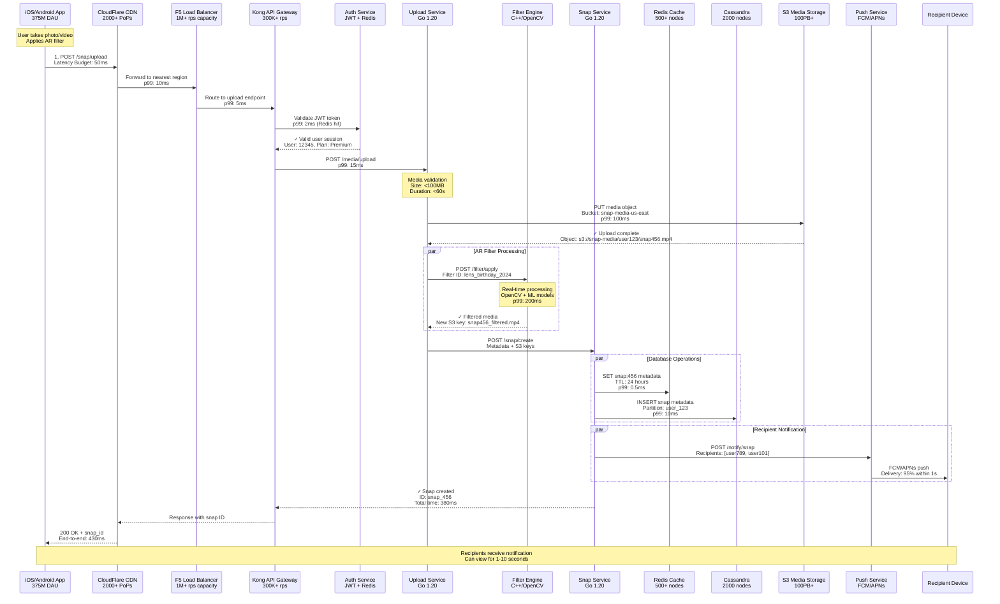
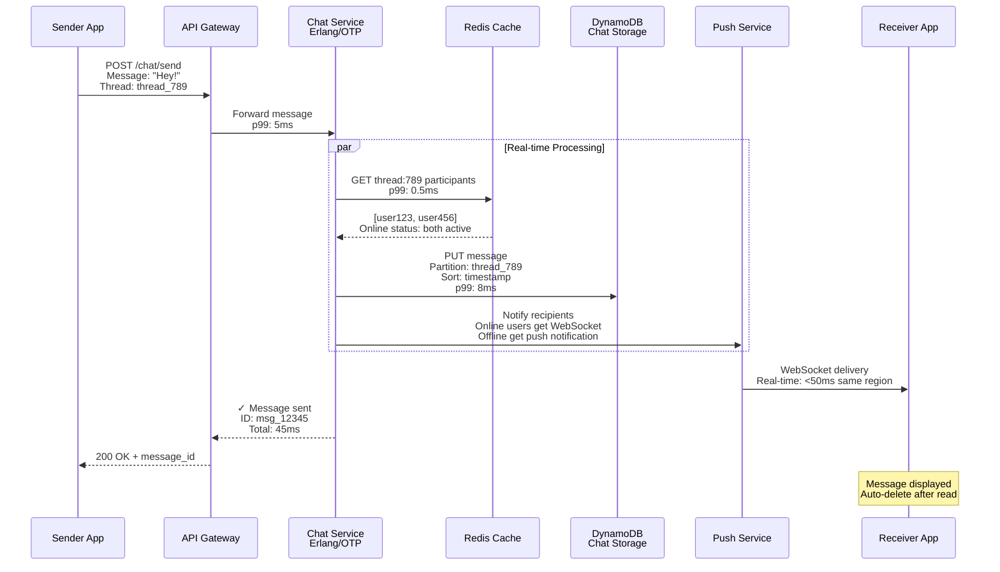
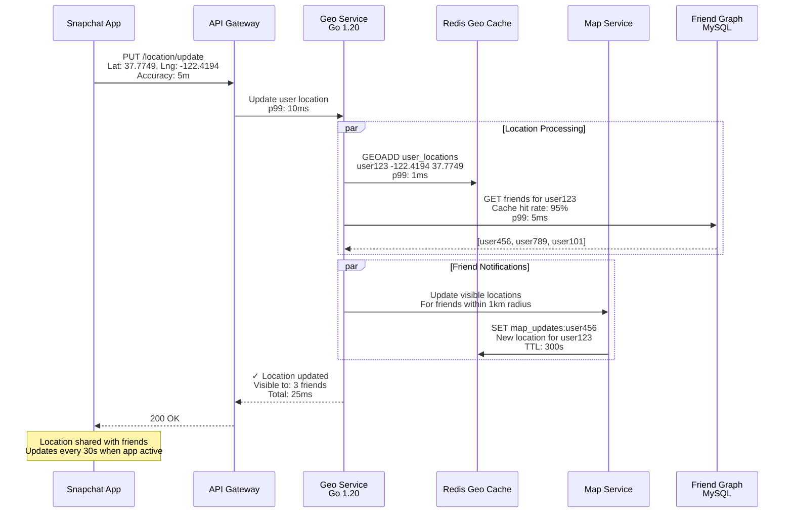
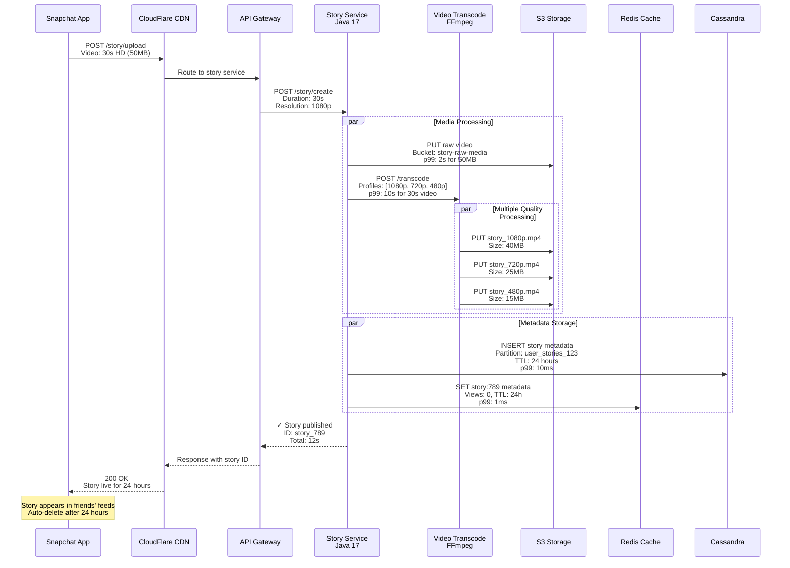
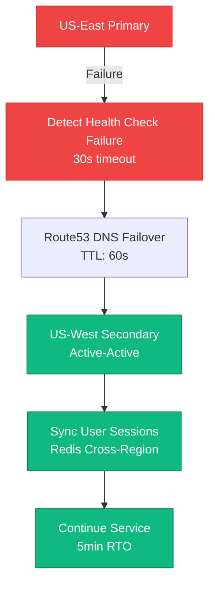

# Snap (Snapchat) - Request Flow

## Overview

The Snap request flow handles 6 billion snaps daily with ephemeral messaging requiring sub-500ms end-to-end delivery and real-time AR filter processing.

## Snap Sending Request Flow - The Golden Path



## Chat Message Request Flow



## Snap Map Location Update Flow



## Story Upload Request Flow



## Performance SLAs and Latency Budgets

### Critical Path Latencies
- **Snap Send Total**: 500ms (p99)
  - Upload: 100ms
  - Filter Processing: 200ms
  - Database Write: 50ms
  - Notification: 100ms
  - Network/API: 50ms

- **Chat Message**: 100ms (p99)
  - Database Write: 20ms
  - Real-time Delivery: 50ms
  - Network/API: 30ms

- **Location Update**: 50ms (p99)
  - Geo Processing: 20ms
  - Friend Lookup: 15ms
  - Cache Update: 10ms
  - Network/API: 5ms

### Fallback Scenarios

#### Filter Service Failure
```
IF Filter Engine unavailable:
  THEN send original media
  AND queue for async filter retry
  AND notify user of processing delay
```

#### Database Write Failure
```
IF Primary DB write fails:
  THEN write to backup Redis
  AND queue for async DB retry
  AND maintain user experience
```

#### Push Notification Failure
```
IF FCM/APNs unavailable:
  THEN store notification in queue
  AND retry with exponential backoff
  AND deliver on next app open
```

## Regional Failover Flow



## Error Handling and Recovery

### Circuit Breaker Pattern
- **Filter Service**: Opens after 50 failures in 1 minute
- **Database**: Opens after 20 failures in 30 seconds
- **Push Service**: Opens after 100 failures in 2 minutes

### Retry Policies
- **Exponential Backoff**: 100ms, 200ms, 400ms, 800ms
- **Max Retries**: 3 for critical path, 5 for async operations
- **Jitter**: ±25% to prevent thundering herd

### Data Consistency
- **Eventual Consistency**: Acceptable for story views, friend counts
- **Strong Consistency**: Required for message delivery, snap viewing
- **Conflict Resolution**: Last-write-wins for location updates