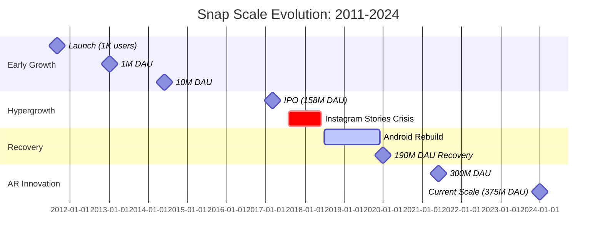
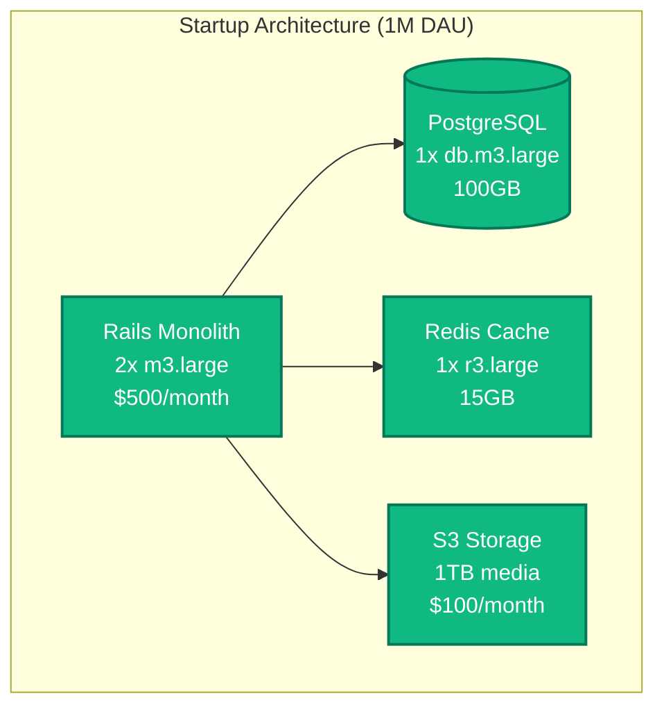
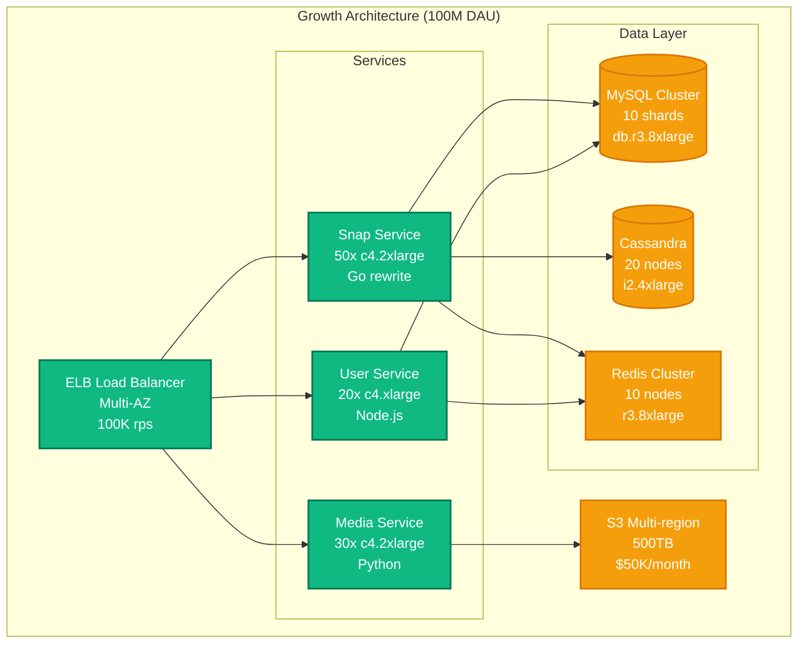
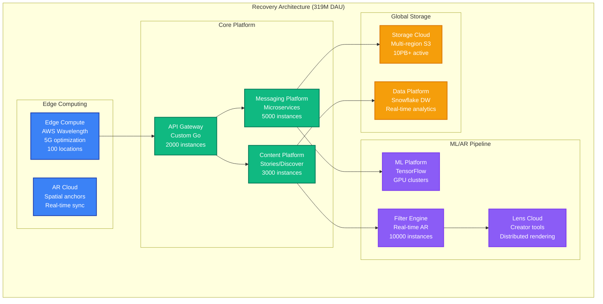
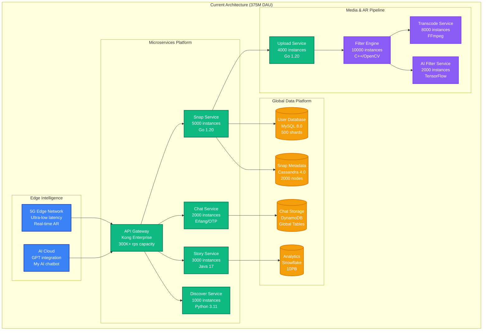
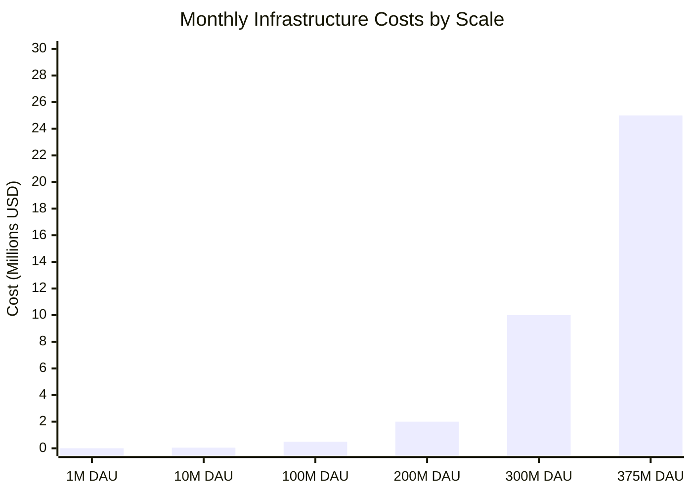
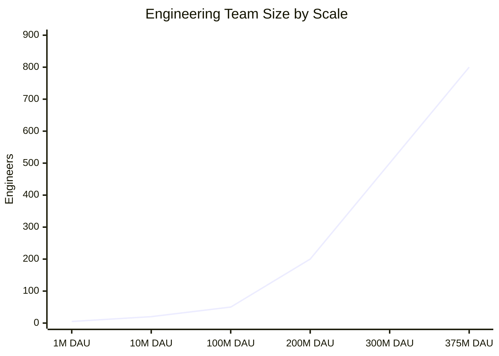

# Snap (Snapchat) - Scale Evolution

## Overview

Snap's journey from 1M to 375M+ daily active users, scaling through hypergrowth, the 2017 redesign crisis (losing 5M users), Instagram competition, and reaching 6B+ snaps sent daily.

## Scale Evolution Timeline



## Architecture Evolution by Scale

### Phase 1: Startup Scale (2011-2013)
**Users**: 1K → 1M DAU
**Infrastructure**: Single AWS region, monolithic app



**Key Metrics**:
- **Snaps/day**: 50K
- **Infrastructure cost**: $2K/month
- **Team size**: 5 engineers
- **Deployment**: Manual, 2x/week

**Major Challenges**:
- Photo storage costs scaling linearly
- Database write contention on single PostgreSQL
- iOS app store approval delays

### Phase 2: Viral Growth (2013-2016)
**Users**: 1M → 100M DAU
**Infrastructure**: Multi-region, microservices migration



**Key Metrics**:
- **Snaps/day**: 1B
- **Infrastructure cost**: $500K/month
- **Team size**: 50 engineers
- **Deployment**: Automated, daily

**Scaling Decisions**:
1. **MySQL Sharding**: User-based sharding across 10 shards
2. **Cassandra Adoption**: Snap metadata storage for scale
3. **Microservices**: Monolith split into domain services
4. **Multi-region**: US-East, US-West for latency

**Breaking Points Hit**:
- PostgreSQL write bottleneck at 10M users
- Single Redis instance memory limit at 50M users
- S3 request rate limits at 100TB storage

### Phase 3: IPO & Instagram Crisis (2017-2018)
**Users**: 158M → 186M DAU (dip to 178M)
**Infrastructure**: Global expansion, performance focus

```mermaid
graph TB
    subgraph "IPO Era Architecture (178M DAU)"
        CDN[CloudFlare CDN<br/>Global PoPs<br/>$2M/month]

        subgraph "US-East Primary"
            APIEAST[API Gateway<br/>Kong<br/>500 instances]
            SNAPEAST[Snap Service<br/>1000 instances<br/>c5.4xlarge]
            FILTEREAST[Filter Engine<br/>C++ rewrite<br/>2000 instances]
        end

        subgraph "US-West Failover"
            APIWEST[API Gateway<br/>Kong<br/>200 instances]
            SNAPWEST[Snap Service<br/>400 instances<br/>Hot standby]
        end

        subgraph "EU Region"
            APIEU[API Gateway<br/>Kong<br/>100 instances]
            SNAPEU[Snap Service<br/>200 instances<br/>GDPR compliance]
        end

        subgraph "Global Data"
            GLOBALDB[(MySQL Global<br/>100 shards<br/>Cross-region sync)]
            GLOBALCASS[(Cassandra Global<br/>200 nodes<br/>Multi-DC)]
            GLOBALREDIS[Redis Global<br/>50 clusters<br/>Cross-region)]
        end
    end

    CDN --> APIEAST
    CDN --> APIWEST
    CDN --> APIEU

    APIEAST --> SNAPEAST
    APIEAST --> FILTEREAST
    SNAPEAST --> GLOBALDB
    SNAPEAST --> GLOBALCASS
    SNAPEAST --> GLOBALREDIS

    classDef edgeStyle fill:#3B82F6,stroke:#1E40AF,color:#fff,stroke-width:2px
    classDef serviceStyle fill:#10B981,stroke:#047857,color:#fff,stroke-width:2px
    classDef dataStyle fill:#F59E0B,stroke:#D97706,color:#fff,stroke-width:2px

    class CDN edgeStyle
    class APIEAST,SNAPEAST,FILTEREAST,APIWEST,SNAPWEST,APIEU,SNAPEU serviceStyle
    class GLOBALDB,GLOBALCASS,GLOBALREDIS dataStyle
```

**Crisis Timeline**:
- **Q2 2017**: Instagram Stories launches (competition)
- **Q4 2017**: Snap redesign backlash (-5M users)
- **Q1 2018**: Android app performance issues
- **Q2 2018**: Recovery initiatives launched

**Key Metrics During Crisis**:
- **DAU drop**: 186M → 178M (-4.3%)
- **Infrastructure cost**: $5M/month
- **Team size**: 200 engineers
- **Recovery time**: 18 months

**Recovery Strategies**:
1. **Android Rebuild**: Complete app rewrite for performance
2. **Algorithm Improvements**: Better friend discovery
3. **Creator Tools**: Lens Studio for AR development
4. **Infrastructure Optimization**: 40% cost reduction

### Phase 4: Recovery & Innovation (2019-2022)
**Users**: 178M → 319M DAU
**Infrastructure**: Edge computing, AR acceleration



**Innovation Investments**:
- **AR Platform**: $500M R&D investment
- **Edge Computing**: 5G integration, <50ms latency
- **Creator Economy**: Lens Studio, Creator Fund
- **Spatial Computing**: AR glasses preparation

**Key Metrics**:
- **Snaps/day**: 5B (10x increase from crisis)
- **AR filter usage**: 200M+ daily sessions
- **Infrastructure cost**: $15M/month
- **Team size**: 500 engineers

### Phase 5: Current Scale (2022-2024)
**Users**: 319M → 375M+ DAU
**Infrastructure**: AI-first, real-time everything



**Current Scale Metrics**:
- **Daily Active Users**: 375M+
- **Snaps sent daily**: 6B+
- **Video hours watched**: 4B+ daily
- **AR sessions**: 250M+ daily
- **Infrastructure cost**: $25M/month
- **Engineering team**: 800+ engineers

## Scale-Specific Challenges and Solutions

### 1M → 10M Users: Database Scaling
**Challenge**: Single PostgreSQL bottleneck
```sql
-- Original monolithic schema
-- Single database handling all operations
-- Write bottleneck at ~5K writes/second

-- Solution: MySQL sharding by user_id
-- Shard calculation: user_id % num_shards
-- Moved to 10 shards initially
```

### 10M → 100M Users: Storage Explosion
**Challenge**: S3 costs growing linearly with users
- **Problem**: $50K/month → $500K/month storage costs
- **Solution**: Ephemeral content strategy
  - Auto-delete after viewing
  - Tiered storage (Standard → IA → Glacier)
  - Compression optimization (50% size reduction)

### 100M → 200M Users: Global Latency
**Challenge**: International users experiencing >500ms latency
- **Problem**: Single US-East region serving global traffic
- **Solution**: Multi-region deployment
  - EU-West for European users
  - AP-Southeast for Asian users
  - Edge caching with CloudFlare

### Instagram Stories Competition (2017)
**Challenge**: Feature parity pressure, rapid development
- **Problem**: Stories feature launched 6 months after Instagram
- **Solution**: Accelerated development
  - 3-month sprint with 100 engineers
  - Microservices architecture for rapid iteration
  - A/B testing framework for feature validation

### Android Performance Crisis (2018)
**Challenge**: Android app crashes, slow performance
- **Problem**: 30% crash rate, 5-second load times
- **Solution**: Complete rebuild
  - Native Android rewrite (from React Native)
  - Performance-first architecture
  - Comprehensive testing automation

## Cost Evolution

### Infrastructure Cost Scaling



### Cost Optimization Milestones

| Scale | Major Optimization | Cost Savings | Strategy |
|-------|-------------------|--------------|----------|
| 10M | MySQL sharding | 60% DB costs | Horizontal scaling |
| 50M | Redis clustering | 40% cache costs | Memory optimization |
| 100M | S3 lifecycle policies | 50% storage costs | Tiered storage |
| 200M | Reserved instances | 30% compute costs | Capacity planning |
| 300M | Spot instances | 20% compute costs | Fault-tolerant design |
| 375M | Custom hardware | 25% overall costs | Vertical integration |

## Team Evolution

### Engineering Team Growth



### Organizational Structure Evolution

#### Early Stage (1M-10M users)
- **Structure**: Single team, full-stack engineers
- **Decision making**: Founder-driven
- **Deployment**: Manual, all-hands

#### Growth Stage (10M-100M users)
- **Structure**: Feature teams (iOS, Android, Backend)
- **Decision making**: Engineering leadership
- **Deployment**: Automated, daily releases

#### Scale Stage (100M+ users)
- **Structure**: Platform teams + Product teams
- **Decision making**: Distributed, data-driven
- **Deployment**: Continuous, multiple times daily

### Key Hiring Milestones

| Scale | Role | Impact | Reason |
|-------|------|--------|--------|
| 5M | Site Reliability Engineer | 99.9% → 99.99% uptime | Scaling operations |
| 20M | Data Engineering Lead | Real-time analytics | Data-driven decisions |
| 50M | Security Architect | Zero breaches maintained | Privacy compliance |
| 100M | ML Engineering Manager | AR filter quality | Competitive differentiation |
| 200M | Platform Engineering VP | 50% dev velocity increase | Developer productivity |

## Future Scale Projections

### 500M DAU Target (2025-2026)
**Projected Infrastructure Requirements**:
- **Compute**: 50,000+ instances
- **Storage**: 500PB+ active data
- **Network**: 100Gbps+ aggregate bandwidth
- **Cost**: $50M+/month operational
- **Team**: 1,200+ engineers

### Key Scaling Investments
1. **Custom Silicon**: AR processing chips
2. **Edge Computing**: 1000+ edge locations
3. **Quantum Networking**: Ultra-low latency
4. **AI Infrastructure**: Real-time personalization
5. **Spatial Computing**: AR glasses platform

### Technology Bets for Next Scale
- **WebAssembly**: Client-side filter processing
- **5G/6G**: Real-time AR collaboration
- **Neural Networks**: Personalized content generation
- **Blockchain**: Creator economy payments
- **Quantum Computing**: Advanced cryptography

This scale evolution demonstrates how Snap navigated hypergrowth, competitive pressure, and technical challenges while maintaining ephemeral messaging as a core differentiator through architectural innovation and strategic technology investments.