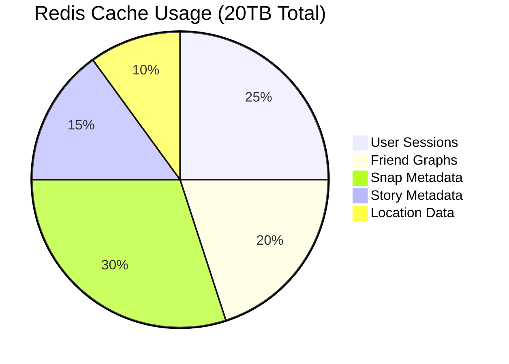
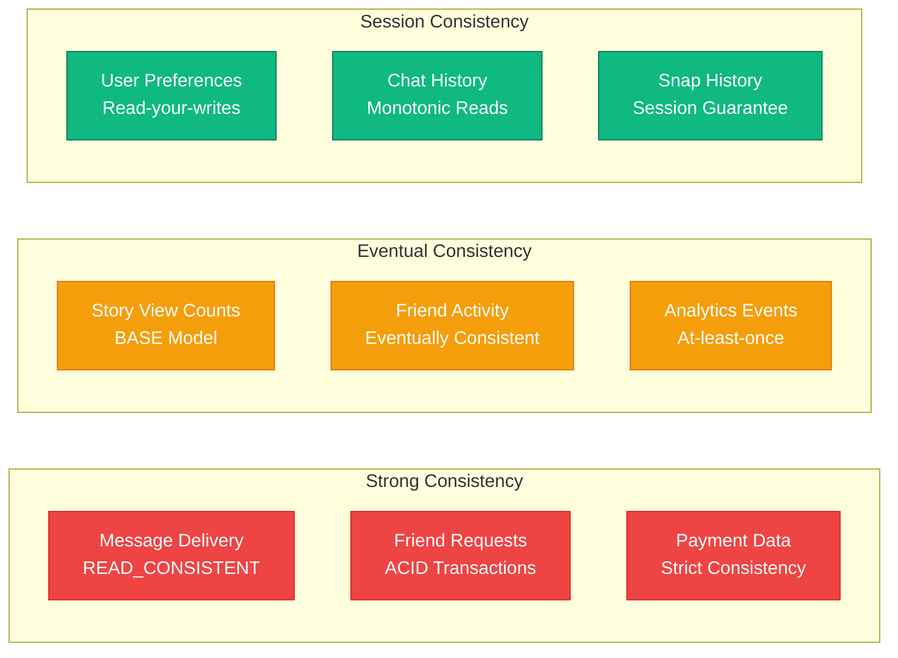

# Snap (Snapchat) - Storage Architecture

## Overview

Snap's storage architecture handles ephemeral media with automatic deletion, serving 6B snaps daily across 100PB+ of media storage with strict privacy controls and global distribution.

## Complete Storage Architecture

```mermaid
graph TB
    subgraph "Edge Storage - CDN Layer"
        EDGE[CloudFlare CDN<br/>2000+ PoPs<br/>50TB cache per region<br/>24hr TTL max]
    end

    subgraph "Service Layer - Data Access"
        API[API Gateway<br/>Kong Enterprise<br/>Request routing]

        subgraph "Data Services"
            USERSERVICE[User Service<br/>Go 1.20<br/>User profiles]
            SNAPSERVICE[Snap Service<br/>Go 1.20<br/>Snap metadata]
            CHATSERVICE[Chat Service<br/>Erlang/OTP<br/>Messages]
            MEDIASERVICE[Media Service<br/>Go 1.20<br/>File operations]
        end
    end

    subgraph "Primary Storage - User Data"
        subgraph "User Database Cluster"
            USERDB[(User Database<br/>MySQL 8.0<br/>100TB across 500 shards<br/>db.r6g.24xlarge)]
            USERREAD[(User Read Replicas<br/>MySQL 8.0<br/>3 replicas per shard<br/>db.r6g.12xlarge)]
        end

        subgraph "Snap Metadata Storage"
            SNAPDB[(Snap Metadata<br/>Cassandra 4.0<br/>2PB across 2000 nodes<br/>i3.8xlarge<br/>RF=3)]
            SNAPINDEX[(Search Index<br/>Elasticsearch 8.0<br/>500 nodes<br/>50TB)]
        end

        subgraph "Chat Storage"
            CHATDB[(Chat Messages<br/>DynamoDB<br/>50TB<br/>40K RCU/WCU<br/>Auto-scaling)]
            CHATARCHIVE[(Chat Archive<br/>S3 Glacier<br/>500TB<br/>$50K/month)]
        end
    end

    subgraph "Media Storage - Tiered Strategy"
        subgraph "Active Media"
            S3HOT[S3 Standard<br/>Active Snaps<br/>10TB<br/>24hr retention<br/>$2K/month]
            S3PROCESSED[S3 Standard-IA<br/>Processed Media<br/>50PB<br/>30 day retention<br/>$800K/month]
        end

        subgraph "Story Media"
            S3STORY[S3 Standard<br/>Story Content<br/>100TB<br/>24hr retention<br/>$20K/month]
            S3STORYIA[S3 Standard-IA<br/>Story Archive<br/>1PB<br/>30 day retention<br/>$20K/month]
        end

        subgraph "Cold Storage"
            S3GLACIER[S3 Glacier<br/>Compliance Archive<br/>50PB<br/>7 year retention<br/>$200K/month]
            S3DEEP[S3 Glacier Deep<br/>Legal Hold<br/>10PB<br/>Indefinite<br/>$30K/month]
        end
    end

    subgraph "Caching Layers - Performance"
        subgraph "Application Cache"
            REDIS[Redis Cluster<br/>500+ nodes<br/>20TB memory<br/>r6g.4xlarge<br/>p99: 0.5ms]
            REDISREPLICA[Redis Read Replicas<br/>200+ nodes<br/>Cross-region<br/>r6g.2xlarge]
        end

        subgraph "CDN Cache"
            MEMCACHED[Memcached<br/>200+ nodes<br/>5TB memory<br/>r6g.2xlarge<br/>Filter cache]
            EDGECACHE[Edge Cache<br/>CloudFlare<br/>50TB distributed<br/>Media thumbnails]
        end
    end

    subgraph "Analytics Storage - Big Data"
        subgraph "Streaming Data"
            KAFKA[Kafka Cluster<br/>200+ brokers<br/>500TB retention<br/>i3.4xlarge<br/>7 day retention]
            KINESIS[Kinesis Streams<br/>1000+ shards<br/>Real-time events<br/>24hr retention]
        end

        subgraph "Data Warehouse"
            SNOWFLAKE[Snowflake DW<br/>10PB analytics<br/>3 year retention<br/>$500K/month]
            S3ANALYTICS[S3 Analytics<br/>Raw event data<br/>100PB<br/>Parquet format]
        end
    end

    %% Data Flow Connections
    API --> USERSERVICE
    API --> SNAPSERVICE
    API --> CHATSERVICE
    API --> MEDIASERVICE

    %% Primary Storage Connections
    USERSERVICE --> USERDB
    USERSERVICE --> USERREAD
    USERSERVICE --> REDIS

    SNAPSERVICE --> SNAPDB
    SNAPSERVICE --> SNAPINDEX
    SNAPSERVICE --> REDIS

    CHATSERVICE --> CHATDB
    CHATSERVICE --> REDIS

    MEDIASERVICE --> S3HOT
    MEDIASERVICE --> S3PROCESSED
    MEDIASERVICE --> S3STORY

    %% Caching Relationships
    USERDB -.-> REDIS
    SNAPDB -.-> REDIS
    CHATDB -.-> REDIS

    %% Media Lifecycle
    S3HOT -.-> S3PROCESSED
    S3PROCESSED -.-> S3GLACIER
    S3STORY -.-> S3STORYIA
    S3STORYIA -.-> S3GLACIER

    CHATDB -.-> CHATARCHIVE

    %% Analytics Pipeline
    USERSERVICE --> KAFKA
    SNAPSERVICE --> KAFKA
    CHATSERVICE --> KAFKA
    MEDIASERVICE --> KINESIS

    KAFKA --> SNOWFLAKE
    KINESIS --> S3ANALYTICS
    S3ANALYTICS --> SNOWFLAKE

    %% CDN Edge
    EDGE -.-> S3PROCESSED
    EDGE -.-> S3STORY

    %% Apply 4-plane colors
    classDef edgeStyle fill:#3B82F6,stroke:#1E40AF,color:#fff,stroke-width:2px
    classDef serviceStyle fill:#10B981,stroke:#047857,color:#fff,stroke-width:2px
    classDef stateStyle fill:#F59E0B,stroke:#D97706,color:#fff,stroke-width:2px
    classDef controlStyle fill:#8B5CF6,stroke:#7C3AED,color:#fff,stroke-width:2px

    class EDGE edgeStyle
    class API,USERSERVICE,SNAPSERVICE,CHATSERVICE,MEDIASERVICE serviceStyle
    class USERDB,USERREAD,SNAPDB,SNAPINDEX,CHATDB,CHATARCHIVE,S3HOT,S3PROCESSED,S3STORY,S3STORYIA,S3GLACIER,S3DEEP,REDIS,REDISREPLICA,MEMCACHED,EDGECACHE,KAFKA,KINESIS,SNOWFLAKE,S3ANALYTICS stateStyle
```



## Data Models and Partitioning

### User Database Schema (MySQL)

```sql
-- Sharded by user_id % 500
-- Each shard: db.r6g.24xlarge (768GB RAM, 96 vCPU)

CREATE TABLE users (
    user_id BIGINT PRIMARY KEY,
    username VARCHAR(15) UNIQUE NOT NULL,
    email VARCHAR(255),
    phone_number VARCHAR(20),
    created_at TIMESTAMP,
    last_active TIMESTAMP,
    friend_count INT DEFAULT 0,
    snap_score BIGINT DEFAULT 0,

    INDEX idx_username (username),
    INDEX idx_last_active (last_active)
) ENGINE=InnoDB
  ROW_FORMAT=COMPRESSED
  PARTITION BY HASH(user_id) PARTITIONS 10;

-- 200M active users × 1KB average = 200GB per shard
-- Total: 100TB across 500 shards
```

### Snap Metadata (Cassandra)

```cql
-- Keyspace: snap_metadata
-- Replication Factor: 3 across regions
-- Consistency Level: LOCAL_QUORUM for writes

CREATE TABLE snaps (
    user_id BIGINT,
    snap_id UUID,
    recipient_user_id BIGINT,
    media_key TEXT,           -- S3 object key
    media_type TEXT,          -- image/video
    filter_id TEXT,
    duration_seconds INT,
    created_at TIMESTAMP,
    expires_at TIMESTAMP,     -- Auto-delete trigger
    view_count INT DEFAULT 0,
    screenshot_count INT DEFAULT 0,

    PRIMARY KEY (user_id, snap_id)
) WITH CLUSTERING ORDER BY (snap_id DESC)
  AND gc_grace_seconds = 86400        -- 24 hours
  AND default_time_to_live = 2592000; -- 30 days max

-- Partition by user_id for hot data locality
-- 6B snaps/day × 1KB metadata = 6TB/day ingestion
-- 30 day retention = 180TB working set
```

### Chat Messages (DynamoDB)

```json
{
  "TableName": "chat_messages",
  "KeySchema": [
    { "AttributeName": "thread_id", "KeyType": "HASH" },
    { "AttributeName": "timestamp", "KeyType": "RANGE" }
  ],
  "AttributeDefinitions": [
    { "AttributeName": "thread_id", "AttributeType": "S" },
    { "AttributeName": "timestamp", "AttributeType": "N" },
    { "AttributeName": "sender_id", "AttributeType": "N" }
  ],
  "BillingMode": "ON_DEMAND",
  "StreamSpecification": {
    "StreamEnabled": true,
    "StreamViewType": "NEW_AND_OLD_IMAGES"
  },
  "TimeToLiveSpecification": {
    "AttributeName": "ttl",
    "Enabled": true
  },
  "GlobalSecondaryIndexes": [
    {
      "IndexName": "sender-index",
      "KeySchema": [
        { "AttributeName": "sender_id", "KeyType": "HASH" },
        { "AttributeName": "timestamp", "KeyType": "RANGE" }
      ]
    }
  ]
}

-- Auto-scaling: 5K-40K RCU/WCU based on load
-- Chat retention: 30 days with TTL
-- 100M messages/day × 2KB average = 200GB/day
```

## Media Storage Lifecycle

### S3 Storage Classes and Lifecycle

```yaml
# S3 Lifecycle Policy for Snap Media
LifecycleConfiguration:
  Rules:
    - Id: "SnapMediaLifecycle"
      Status: Enabled
      Filter:
        Prefix: "snaps/"
      Transitions:
        - Days: 1
          StorageClass: STANDARD_IA    # After first day
        - Days: 30
          StorageClass: GLACIER        # Long-term compliance
        - Days: 2555                   # 7 years
          StorageClass: DEEP_ARCHIVE   # Legal requirements

      Expiration:
        Days: 2555  # 7 years for legal compliance

    - Id: "StoryMediaLifecycle"
      Status: Enabled
      Filter:
        Prefix: "stories/"
      Expiration:
        Days: 1     # Stories auto-delete after 24 hours

    - Id: "ProcessedMediaLifecycle"
      Status: Enabled
      Filter:
        Prefix: "processed/"
      Transitions:
        - Days: 30
          StorageClass: GLACIER
      Expiration:
        Days: 90    # Processed variants deleted after 90 days
```

### Media Storage Costs

| Storage Class | Data Volume | Monthly Cost | Use Case |
|---------------|-------------|--------------|----------|
| S3 Standard | 10TB | $2,000 | Active snaps (24hrs) |
| S3 Standard-IA | 50PB | $800,000 | Recent media (30 days) |
| S3 Glacier | 50PB | $200,000 | Compliance archive |
| S3 Glacier Deep | 10PB | $30,000 | Legal hold |
| **Total** | **110PB** | **$1,032,000** | **All media storage** |

## Caching Strategy

### Redis Cluster Configuration

```yaml
# Redis Cluster: 500 nodes across 3 AZs
# Node type: r6g.4xlarge (128GB RAM, 16 vCPU)
# Total capacity: 64TB memory, 8000 vCPU

cluster:
  nodes: 500
  shards: 250      # 2 nodes per shard (primary + replica)
  replicas: 1

  memory_policy: allkeys-lru
  maxmemory: 120GB  # Per node, 10GB reserved for overhead

  persistence:
    rdb_enabled: true
    rdb_save_seconds: 3600    # Hourly snapshots
    aof_enabled: false        # Performance over durability

  network:
    timeout: 5000ms
    keepalive: 300s

  cluster_config:
    cluster_node_timeout: 15000
    cluster_migration_barrier: 1
```

### Cache Distribution



### Cache Hit Rates and Performance

| Data Type | Cache Hit Rate | p99 Latency | TTL |
|-----------|----------------|-------------|-----|
| User sessions | 98% | 0.3ms | 24 hours |
| Friend lists | 95% | 0.5ms | 1 hour |
| Snap metadata | 85% | 0.8ms | 30 minutes |
| Story views | 80% | 1.0ms | 24 hours |
| Location data | 90% | 0.4ms | 5 minutes |

## Data Consistency Models

### Consistency Requirements



## Backup and Disaster Recovery

### Cross-Region Replication

```yaml
# Primary: us-east-1, Secondary: us-west-2, eu-west-1

mysql_replication:
  topology: master-master
  regions:
    - us-east-1:   # Primary
        role: active
        lag_tolerance: 0ms
    - us-west-2:   # Hot standby
        role: standby
        lag_tolerance: 100ms
    - eu-west-1:   # EU data residency
        role: active
        lag_tolerance: 200ms

cassandra_replication:
  strategy: NetworkTopologyStrategy
  replication_factor:
    us-east: 3
    us-west: 3
    eu-west: 3
  consistency_level:
    write: LOCAL_QUORUM
    read: LOCAL_ONE

s3_replication:
  cross_region:
    - source: us-east-1
      destination: us-west-2
      storage_class: STANDARD_IA
    - source: us-east-1
      destination: eu-west-1
      storage_class: STANDARD_IA
```

### Recovery Time Objectives

| System Component | RTO | RPO | Recovery Method |
|------------------|-----|-----|-----------------|
| MySQL User DB | 4 hours | 15 minutes | Cross-region replica |
| Cassandra Metadata | 2 hours | 5 minutes | Multi-region cluster |
| Redis Cache | 30 minutes | 0 (cache rebuild) | Cluster failover |
| S3 Media Storage | 1 hour | 0 (replicated) | Cross-region copy |
| DynamoDB Chat | 15 minutes | 1 minute | Global tables |

## Monitoring and Alerting

### Storage Health Metrics

```yaml
critical_alerts:
  - metric: "s3_put_errors"
    threshold: "> 100 errors/min"
    action: "Page on-call immediately"

  - metric: "cassandra_write_latency_p99"
    threshold: "> 50ms"
    action: "Auto-scale cluster"

  - metric: "redis_memory_usage"
    threshold: "> 85%"
    action: "Trigger cache eviction"

  - metric: "mysql_replication_lag"
    threshold: "> 1 second"
    action: "Failover to replica"

capacity_alerts:
  - metric: "s3_storage_growth_rate"
    threshold: "> 10TB/day increase"
    action: "Review retention policies"

  - metric: "database_disk_usage"
    threshold: "> 80% capacity"
    action: "Scale storage automatically"
```

## Privacy and Compliance

### Data Deletion Policies

```python
# Automated deletion service
class EphemeralDataCleanup:
    def __init__(self):
        self.deletion_jobs = {
            'snaps': '24_hours',        # Core feature
            'stories': '24_hours',      # Stories disappear
            'chat_media': '30_days',    # Chat attachments
            'location_data': '8_hours', # Location privacy
            'view_metadata': '30_days'  # Analytics data
        }

    def run_cleanup(self):
        # Runs every hour via Lambda
        for data_type, retention in self.deletion_jobs.items():
            self.delete_expired_data(data_type, retention)

    def delete_expired_data(self, data_type, retention):
        # Hard delete from all storage layers
        # S3, Cassandra, Redis, DynamoDB
        # No recovery possible - privacy by design
```

### GDPR Compliance

- **Right to deletion**: Complete user data purge within 30 days
- **Data portability**: User data export in JSON format
- **Consent management**: Granular privacy controls
- **Data minimization**: Automatic expiration built into schema
- **Privacy by design**: No data retention beyond business necessity