# Spotify - Complete Architecture

## The Music Streaming Giant: 600M+ Users, $13B Revenue

Spotify operates one of the world's largest music streaming platforms, serving 600M+ users across 180+ markets with instant access to 100M+ songs and 5M+ podcasts.

```mermaid
graph TB
    subgraph EdgePlane[Edge Plane - CDN & Load Balancing]
        CDN[Fastly CDN<br/>200+ Global PoPs<br/>Audio: 50TB/day]
        ALB[AWS ALB<br/>Global Traffic Director<br/>99.99% SLA]
        CloudFlare[Cloudflare<br/>DDoS Protection<br/>WAF Rules: 500+]
    end

    subgraph ServicePlane[Service Plane - Microservices]
        Gateway[API Gateway<br/>Kong Enterprise<br/>Rate Limit: 10K req/min]

        subgraph Core[Core Services]
            UserSvc[User Service<br/>Java 17, Spring Boot<br/>100K req/s peak]
            PlaylistSvc[Playlist Service<br/>Scala, Akka<br/>4B+ playlists]
            StreamSvc[Stream Service<br/>Go, 500M streams/day<br/>p99: 100ms]
            SearchSvc[Search Service<br/>ElasticSearch 8.x<br/>100M searches/day]
        end

        subgraph ML[ML Platform]
            RecoEngine[Recommendation Engine<br/>TensorFlow, Python<br/>3B predictions/day]
            AdTargeting[Ad Targeting<br/>Spark, Kafka<br/>$1B ad revenue]
            DiscoveryEngine[Discovery Weekly<br/>Collaborative Filtering<br/>40M playlists/week]
        end

        subgraph Content[Content Management]
            MetadataSvc[Metadata Service<br/>Postgres + Redis<br/>100M+ songs]
            LicensingSvc[Licensing Service<br/>Rights Management<br/>Real-time tracking]
            PodcastSvc[Podcast Service<br/>Anchor Integration<br/>5M+ podcasts]
        end
    end

    subgraph StatePlane[State Plane - Data Storage]
        subgraph Databases[Primary Storage]
            Cassandra[(Cassandra Cluster<br/>1000+ nodes<br/>User data: 600M profiles)]
            Postgres[(PostgreSQL<br/>Metadata DB<br/>Songs, Artists, Albums)]
            Redis[(Redis Cluster<br/>Session cache<br/>100M active sessions)]
        end

        subgraph Storage[Content Storage]
            GCS[Google Cloud Storage<br/>Audio Files: 100M+ songs<br/>Multiple bitrates: 96k-320k]
            S3[AWS S3<br/>Podcast Storage<br/>5M+ episodes]
            Memcached[Memcached<br/>Hot content cache<br/>95% hit rate]
        end

        subgraph Analytics[Analytics Stack]
            BigQuery[BigQuery<br/>Event Analytics<br/>100TB+ daily events]
            HDFS[Hadoop HDFS<br/>Historical Data<br/>10PB+ storage]
            Kafka[Kafka Cluster<br/>Event Streaming<br/>50M events/second]
        end
    end

    subgraph ControlPlane[Control Plane - Operations]
        Backstage[Backstage Portal<br/>Developer Platform<br/>2000+ services]
        DataDog[DataDog<br/>Infrastructure Monitoring<br/>50K+ metrics]
        Sentry[Sentry<br/>Error Tracking<br/>1M+ errors/day]
        CICD[CI/CD Pipeline<br/>Jenkins + Spinnaker<br/>1000+ deploys/day]
    end

    %% User Flow
    Users[600M Active Users<br/>Premium: 236M<br/>Free: 364M] --> CloudFlare
    CloudFlare --> CDN
    CDN --> ALB
    ALB --> Gateway

    %% API Routes
    Gateway --> UserSvc
    Gateway --> PlaylistSvc
    Gateway --> StreamSvc
    Gateway --> SearchSvc

    %% ML Integration
    StreamSvc --> RecoEngine
    SearchSvc --> DiscoveryEngine
    UserSvc --> AdTargeting

    %% Content Flow
    PlaylistSvc --> MetadataSvc
    StreamSvc --> LicensingSvc
    SearchSvc --> PodcastSvc

    %% Data Connections
    UserSvc --> Cassandra
    MetadataSvc --> Postgres
    StreamSvc --> Redis

    %% Content Delivery
    StreamSvc --> GCS
    PodcastSvc --> S3
    SearchSvc --> Memcached

    %% Analytics Pipeline
    UserSvc --> Kafka
    StreamSvc --> Kafka
    Kafka --> BigQuery
    Kafka --> HDFS

    %% Monitoring
    UserSvc --> DataDog
    StreamSvc --> Sentry
    Gateway --> Backstage
    CICD --> Backstage

    %% Apply four-plane colors
    classDef edgeStyle fill:#0066CC,stroke:#004499,color:#fff
    classDef serviceStyle fill:#00AA00,stroke:#007700,color:#fff
    classDef stateStyle fill:#FF8800,stroke:#CC6600,color:#fff
    classDef controlStyle fill:#CC0000,stroke:#990000,color:#fff

    class CDN,ALB,CloudFlare edgeStyle
    class Gateway,UserSvc,PlaylistSvc,StreamSvc,SearchSvc,RecoEngine,AdTargeting,DiscoveryEngine,MetadataSvc,LicensingSvc,PodcastSvc serviceStyle
    class Cassandra,Postgres,Redis,GCS,S3,Memcached,BigQuery,HDFS,Kafka stateStyle
    class Backstage,DataDog,Sentry,CICD controlStyle
```

## Key Architecture Metrics

### Scale & Performance
- **600M+ Monthly Active Users** (236M Premium, 364M Free)
- **500M+ Daily Streams** across all content types
- **100M+ Songs** available globally
- **4B+ User-Created Playlists** managed
- **p99 Stream Start Time**: <200ms globally
- **Peak Concurrent Users**: 100M+ during major releases

### Infrastructure Specifications

#### Microservices Architecture
- **100+ Independent Services** (Java, Scala, Go, Python)
- **2000+ Service Instances** across multiple regions
- **Container Orchestration**: Kubernetes on Google Cloud
- **Service Mesh**: Envoy proxy with Istio
- **API Gateway**: Kong Enterprise with rate limiting

#### Storage Systems
- **Cassandra**: 1000+ node cluster, 100TB+ user data
- **PostgreSQL**: Metadata for 100M+ songs and artists
- **Google Cloud Storage**: Audio files in multiple bitrates
- **Redis**: 100M+ active session cache
- **BigQuery**: 100TB+ daily event analytics

#### Content Delivery
- **Fastly CDN**: 200+ global points of presence
- **Audio Delivery**: 50TB+ daily, adaptive bitrate streaming
- **Geographic Distribution**: 180+ markets served
- **Cache Hit Rate**: 95%+ for popular content

### Financial Metrics
- **Annual Revenue**: $13B+ (2023)
- **Infrastructure Costs**: ~$500M annually
- **CDN & Bandwidth**: 45% of infrastructure costs
- **Cost per Stream**: ~$0.004 average
- **ML Training Costs**: $50M+ annually

## Critical Production Requirements

### High Availability
- **99.99% Uptime SLA** for premium users
- **Multi-Region Deployment** (US, EU, APAC)
- **Graceful Degradation** for recommendation failures
- **Circuit Breakers** on all external service calls

### Content Licensing Compliance
- **Real-time Royalty Tracking** per stream
- **Geographic Restrictions** enforcement
- **DMCA Compliance** with takedown procedures
- **Artist Payout Calculations** updated daily

### Security & Privacy
- **GDPR Compliance** for EU users
- **End-to-End Encryption** for premium content
- **DRM Protection** via Widevine/FairPlay
- **Data Residency** requirements by region

This architecture serves as the foundation for Spotify's position as the world's leading music streaming platform, handling massive scale while maintaining sub-200ms response times and 99.99% availability.