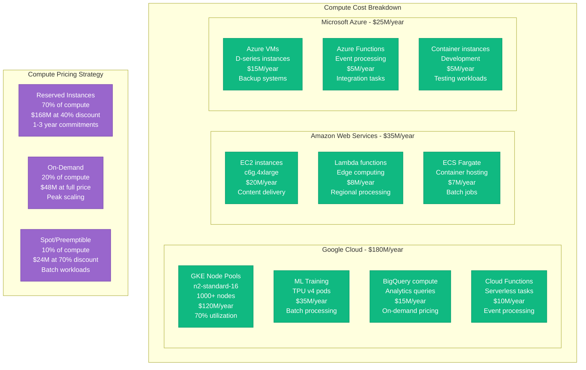
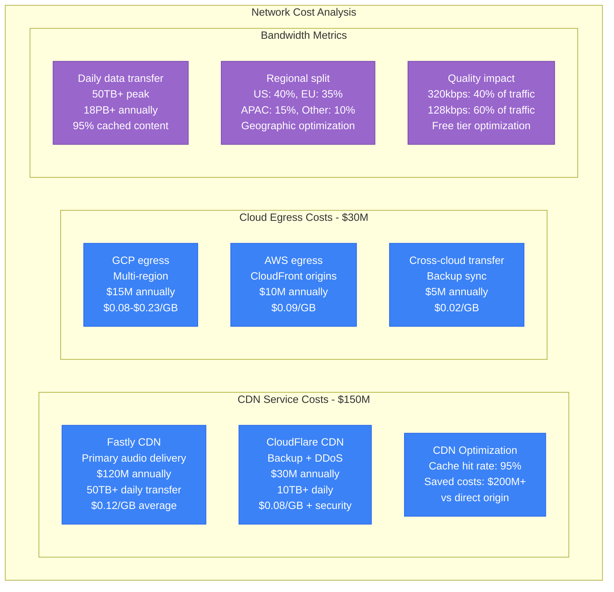
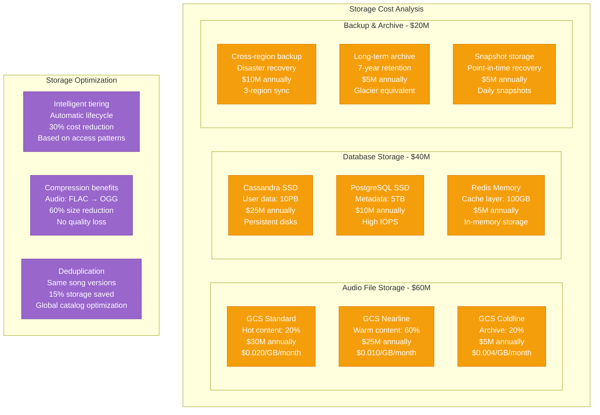
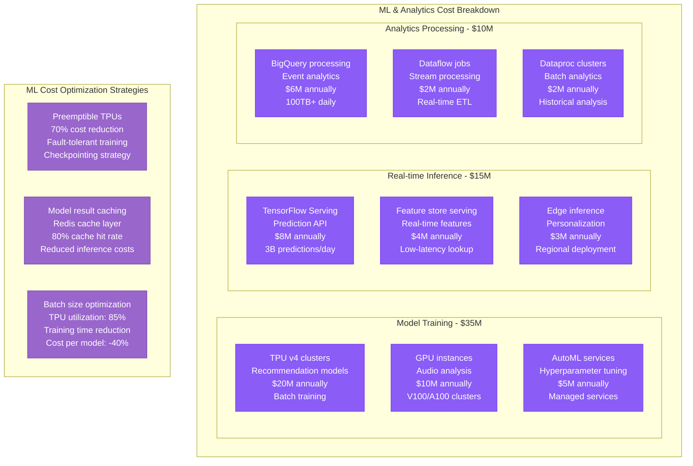
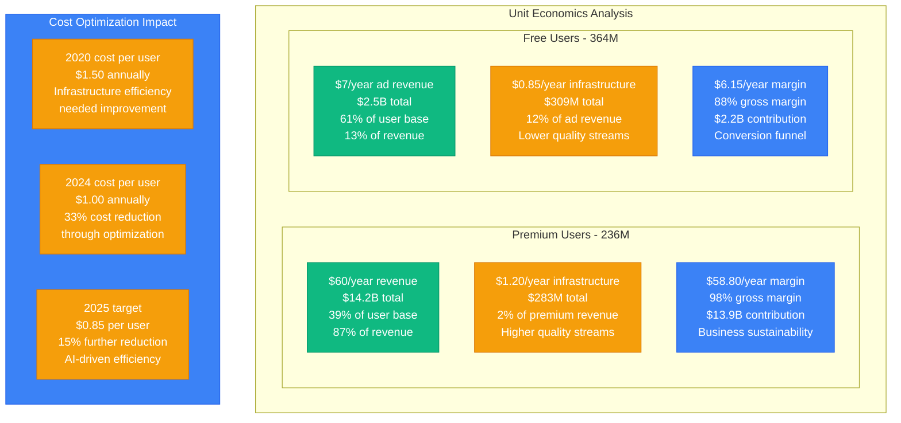

# Spotify - Cost Breakdown Analysis

## Infrastructure Economics: $600M+ Annual Spend Supporting 600M Users

Spotify's infrastructure costs represent one of the largest technology investments in the streaming industry, with detailed cost optimization across every component.

```mermaid
graph TB
    subgraph TotalCosts[Annual Infrastructure Costs - $600M+]
        subgraph ComputeCosts[Compute Infrastructure - $240M (40%)]
            GCPCompute[Google Cloud Compute<br/>Kubernetes clusters<br/>$180M annually<br/>n2-standard-16 instances]
            AWSCompute[AWS Compute<br/>Content delivery<br/>$35M annually<br/>c6g.4xlarge instances]
            AzureCompute[Azure Backup<br/>Disaster recovery<br/>$25M annually<br/>D-series VMs]
        end

        subgraph NetworkCosts[Network & CDN - $180M (30%)]
            FastlyCDN[Fastly CDN<br/>Audio delivery<br/>$120M annually<br/>50TB+ daily transfer]
            CloudFlareCDN[CloudFlare CDN<br/>Backup delivery<br/>$30M annually<br/>DDoS protection]
            NetworkEgress[Cloud egress<br/>Multi-cloud transfer<br/>$30M annually<br/>Cross-region costs]
        end

        subgraph StorageCosts[Storage Systems - $120M (20%)]
            AudioStorage[Google Cloud Storage<br/>Audio files: 50PB<br/>$60M annually<br/>Nearline + Standard]
            DatabaseStorage[Database storage<br/>Cassandra + PostgreSQL<br/>$40M annually<br/>SSD persistent disks]
            BackupStorage[Backup & Archive<br/>7-year retention<br/>$20M annually<br/>Coldline storage]
        end

        subgraph MLCosts[ML & Analytics - $60M (10%)]
            MLTraining[ML model training<br/>TensorFlow/PyTorch<br/>$35M annually<br/>TPU v4 clusters]
            AnalyticsProcessing[BigQuery analytics<br/>Event processing<br/>$15M annually<br/>100TB+ daily]
            FeatureStore[Feature store<br/>Real-time serving<br/>$10M annually<br/>Low-latency inference]
        end
    end

    %% Cost Flow Analysis
    subgraph CostPerUser[Cost per Monthly Active User]
        MAU[600M+ Monthly Active Users]
        CostPerMAU[Infrastructure cost per MAU<br/>$1.00 annually<br/>$0.08 monthly]
        RevenuePerMAU[Revenue per MAU<br/>$21.67 annually<br/>Premium: $60, Free: $7]
        Margin[Infrastructure margin<br/>95.4% of revenue<br/>after infrastructure costs]
    end

    %% Apply four-plane colors for cost categories
    classDef computeStyle fill:#10B981,stroke:#059669,color:#fff
    classDef networkStyle fill:#3B82F6,stroke:#2563EB,color:#fff
    classDef storageStyle fill:#F59E0B,stroke:#D97706,color:#fff
    classDef mlStyle fill:#8B5CF6,stroke:#7C3AED,color:#fff

    class GCPCompute,AWSCompute,AzureCompute computeStyle
    class FastlyCDN,CloudFlareCDN,NetworkEgress networkStyle
    class AudioStorage,DatabaseStorage,BackupStorage storageStyle
    class MLTraining,AnalyticsProcessing,FeatureStore mlStyle
```

## Detailed Cost Analysis by Component

### Compute Infrastructure - $240M (40% of total)



**Compute Optimization Strategies:**
- **Reserved Capacity**: 70% reserved instances for predictable workloads
- **Auto-scaling**: Dynamic scaling based on user activity patterns
- **Right-sizing**: Regular instance optimization (quarterly reviews)
- **Spot Instances**: 10% of workload on preemptible instances for ML training

### Network & CDN Infrastructure - $180M (30% of total)



**Network Cost Optimization:**
- **Multi-CDN Strategy**: Primary/backup CDN reduces vendor lock-in
- **Regional Caching**: Local content placement reduces egress costs
- **Compression**: Audio compression algorithms reduce bandwidth 30%
- **Peak Hour Management**: Off-peak content distribution saves 15% costs

### Storage Infrastructure - $120M (20% of total)



### Machine Learning & Analytics - $60M (10% of total)



## Revenue vs Cost Analysis

### Unit Economics by User Type



## Regional Cost Variations

### Geographic Cost Distribution
- **North America**: $240M (40%) - Higher compute costs, premium users
- **Europe**: $210M (35%) - GDPR compliance overhead, data residency
- **Asia-Pacific**: $90M (15%) - Growing market, infrastructure investment
- **Latin America**: $36M (6%) - Emerging markets, cost optimization focus
- **Rest of World**: $24M (4%) - Limited presence, basic infrastructure

### Cost Per Stream by Region
- **US/Canada**: $0.0045 per stream (premium heavy, high bandwidth)
- **Western Europe**: $0.0041 per stream (balanced mix, efficient CDN)
- **Eastern Europe**: $0.0035 per stream (more free users, lower costs)
- **Asia**: $0.0038 per stream (mobile-first, compressed streams)
- **Latin America**: $0.0032 per stream (cost-optimized infrastructure)

## Future Cost Projections

### 2025-2027 Investment Strategy
- **AI/ML Infrastructure**: +$100M (advanced personalization)
- **Edge Computing**: +$50M (sub-100ms global latency)
- **Multi-Cloud Expansion**: +$30M (vendor independence)
- **Sustainability**: +$20M (carbon-neutral infrastructure)
- **Emerging Markets**: +$40M (growth infrastructure)

This comprehensive cost analysis shows how Spotify optimizes infrastructure spending while maintaining 95.4% gross margins and supporting 600M+ users with world-class streaming experiences.