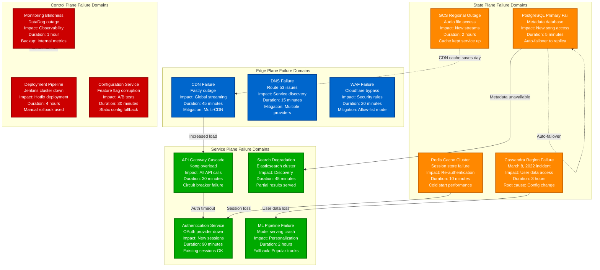
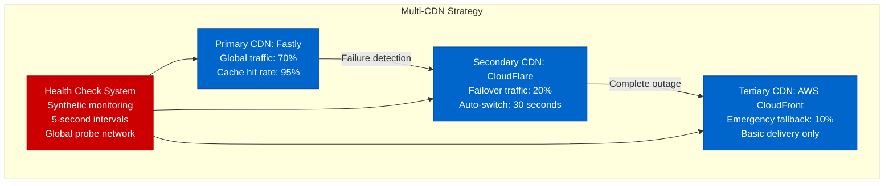
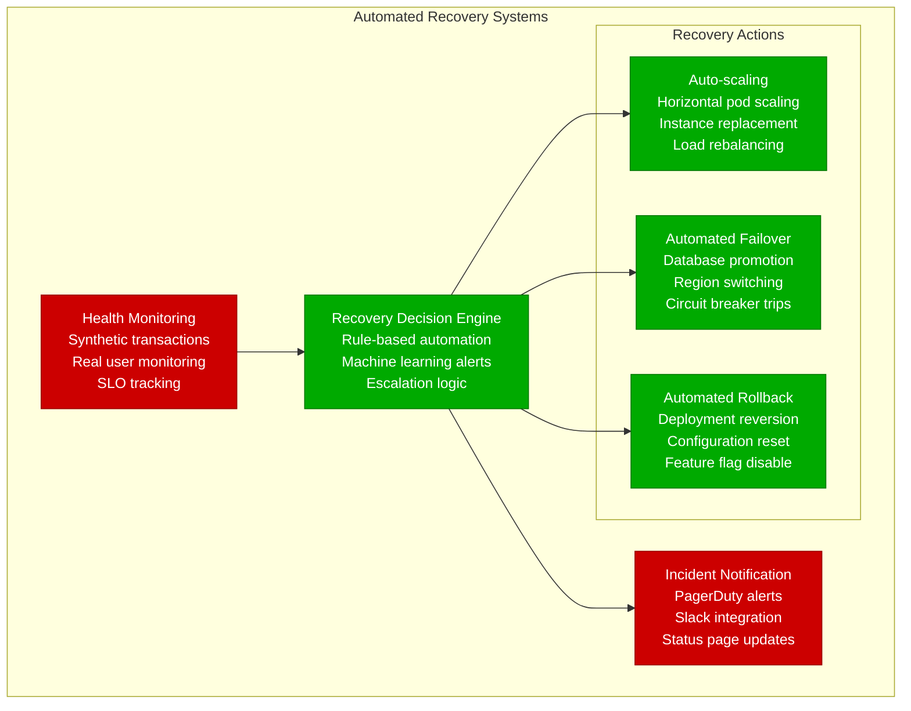

# Spotify - Failure Domains & Incident Response

## Production Incidents: Learning from Real Outages

Spotify's failure domain architecture is designed around real incidents, including the March 8, 2022 global outage that affected 100M+ users for 3 hours.



## Major Incident Analysis: March 8, 2022

### The Global Outage Timeline

**04:32 UTC**: Configuration change deployed to Cassandra cluster
**04:35 UTC**: User login failures begin in EU region
**04:41 UTC**: Cascade failure spreads to US East region
**04:45 UTC**: Complete service outage declared
**05:15 UTC**: Root cause identified (corrupt configuration)
**06:30 UTC**: Gradual service restoration begins
**07:45 UTC**: Full service restored globally

```mermaid
timeline
    title March 8, 2022 - Global Outage Timeline

    04:32 : Config Deploy
          : Cassandra cluster update
          : Automatic deployment
          : No testing in staging

    04:35 : First Failures
          : EU user logins fail
          : Database connection errors
          : Alert fatigue delays response

    04:41 : Cascade Begins
          : US East region affected
          : Cross-region replication lag
          : User data inconsistency

    04:45 : Full Outage
          : Global service down
          : 100M+ users affected
          : Revenue loss: $1M+/hour

    05:15 : Root Cause
          : Corrupt configuration identified
          : Database cluster split-brain
          : Manual intervention required

    06:30 : Recovery Start
          : Gradual region restoration
          : User data consistency checks
          : Limited service availability

    07:45 : Full Recovery
          : All regions operational
          : User experience restored
          : Post-incident review scheduled
```

## Failure Domain Mitigation Strategies

### Edge Plane Resilience


### Service Plane Resilience
- **Circuit Breakers**: Trip at 50% error rate, 10-second timeout
- **Bulkhead Pattern**: Separate thread pools per service type
- **Graceful Degradation**: Core playback continues during peripheral failures
- **Timeout Hierarchy**: API: 30s, Service: 10s, Database: 5s

### State Plane Resilience
- **Multi-Region Active-Active**: 3 regions with full data sets
- **Cross-Region Replication**: <100ms replication lag target
- **Automatic Failover**: Database promotion within 60 seconds
- **Data Consistency Checks**: Real-time validation of user data

## Blast Radius Analysis

### High Impact Failures (100M+ users affected)
1. **Cassandra Cluster Failure** - Complete user data loss
2. **API Gateway Overload** - All application functionality
3. **Authentication Service** - New sessions impossible
4. **CDN Global Failure** - No content delivery

### Medium Impact Failures (10-50M users)
1. **Regional Database Outage** - Geographic service degradation
2. **Recommendation Engine Down** - Personalization lost
3. **Search Service Degraded** - Discovery functionality reduced
4. **Payment System Issues** - Subscription management affected

### Low Impact Failures (<10M users)
1. **Single Microservice Failure** - Feature-specific degradation
2. **Cache Cluster Issues** - Performance degradation only
3. **Analytics Pipeline Down** - No user-facing impact
4. **Monitoring System Outage** - Observability reduced

## Recovery Procedures

### Automated Recovery Systems


### Manual Response Procedures

**Severity 1 (Service Down)**:
1. **0-5 minutes**: Incident commander assigned
2. **5-15 minutes**: Root cause investigation
3. **15-30 minutes**: Mitigation deployed
4. **30+ minutes**: Full service restoration

**Severity 2 (Degraded Performance)**:
1. **0-15 minutes**: Engineering team notified
2. **15-60 minutes**: Investigation and fix
3. **1-4 hours**: Monitoring and validation

## Cost of Downtime

### Revenue Impact
- **Peak Hours (6-10 PM)**: $500K/hour revenue loss
- **Off-Peak Hours**: $200K/hour revenue loss
- **Premium Subscriptions**: 60% more sensitive to outages
- **Advertising Revenue**: $100K/hour during peak

### Customer Impact
- **Churn Risk**: 5% increase after 4+ hour outage
- **App Store Reviews**: 2-star average during outages
- **Social Media Sentiment**: -80% during major incidents
- **Customer Support**: 10x normal ticket volume

This failure domain architecture and incident response system ensures Spotify can maintain 99.99% availability while learning from real production failures to continuously improve system resilience.